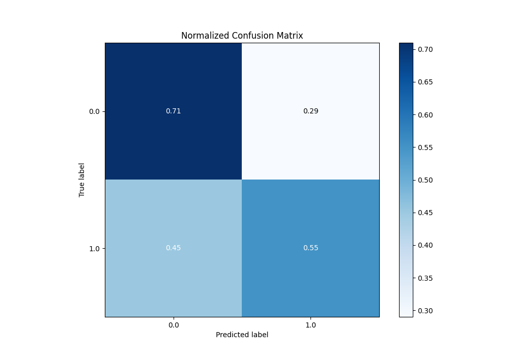
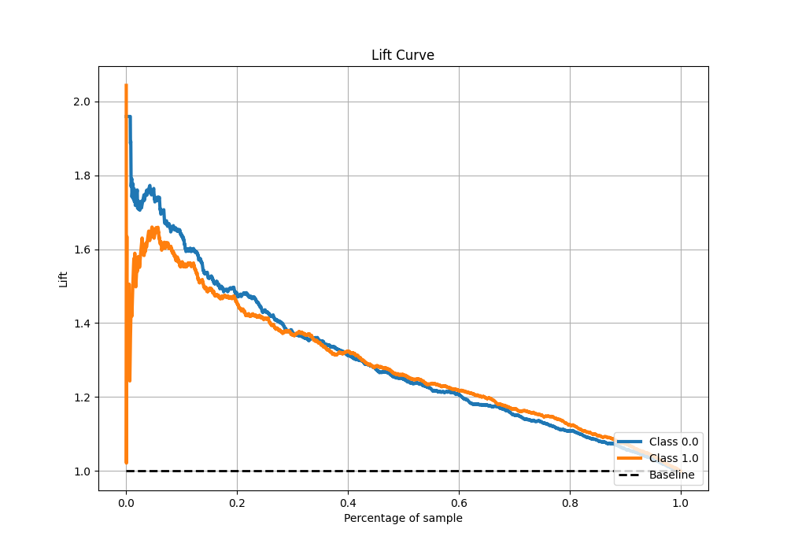

# Summary of 5_Default_RandomForest

[<< Go back](../README.md)

## Random Forest

- **n_jobs**: -1
- **criterion**: gini
- **max_features**: 0.9
- **min_samples_split**: 30
- **max_depth**: 4
- **eval_metric_name**: auc
- **explain_level**: 2

## Validation

- **validation_type**: split
- **train_ratio**: 0.75
- **shuffle**: True
- **stratify**: True

## Optimized metric

auc

## Training time

5.2 seconds

## Metric details

|           |    score |   threshold |
|:----------|---------:|------------:|
| logloss   | 0.643492 |  nan        |
| auc       | 0.679492 |  nan        |
| f1        | 0.681461 |    0.381365 |
| accuracy  | 0.636976 |    0.475589 |
| precision | 0.752988 |    0.730522 |
| recall    | 1        |    0.139491 |
| mcc       | 0.277119 |    0.475589 |

## Metric details with threshold from accuracy metric

|           |    score |   threshold |
|:----------|---------:|------------:|
| logloss   | 0.643492 |  nan        |
| auc       | 0.679492 |  nan        |
| f1        | 0.648909 |    0.475589 |
| accuracy  | 0.636976 |    0.475589 |
| precision | 0.615591 |    0.475589 |
| recall    | 0.68604  |    0.475589 |
| mcc       | 0.277119 |    0.475589 |

## Confusion matrix (at threshold=0.475589)

|              |   Predicted as 0 |   Predicted as 1 |
|:-------------|-----------------:|-----------------:|
| Labeled as 0 |             1029 |              715 |
| Labeled as 1 |              524 |             1145 |

## Learning curves

## Permutation-based Importance

## Confusion Matrix

## Normalized Confusion Matrix

## ROC Curve

## Kolmogorov-Smirnov Statistic

## Precision-Recall Curve

## Calibration Curve

## Cumulative Gains Curve

## Lift Curve

## SHAP Importance

## SHAP Dependence plots

### Dependence (Fold 1)

## SHAP Decision plots

[<< Go back](../README.md)
