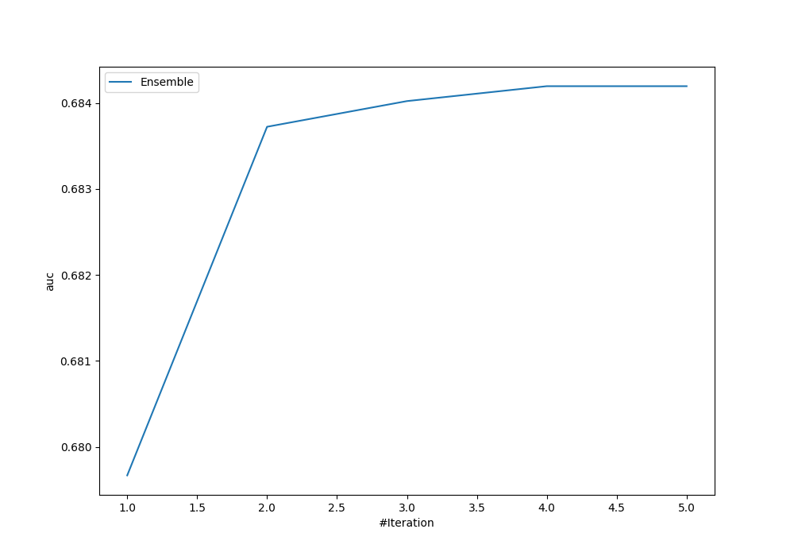
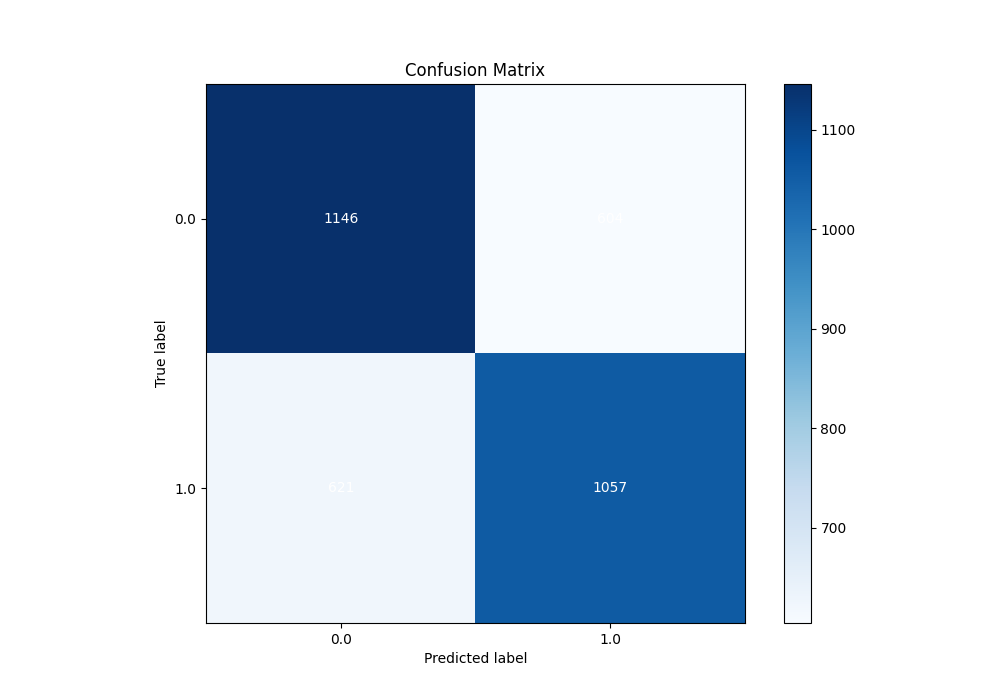
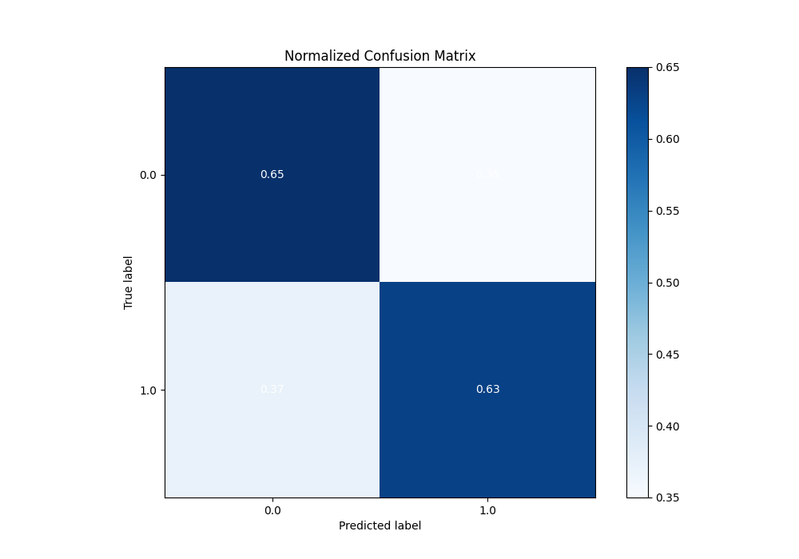
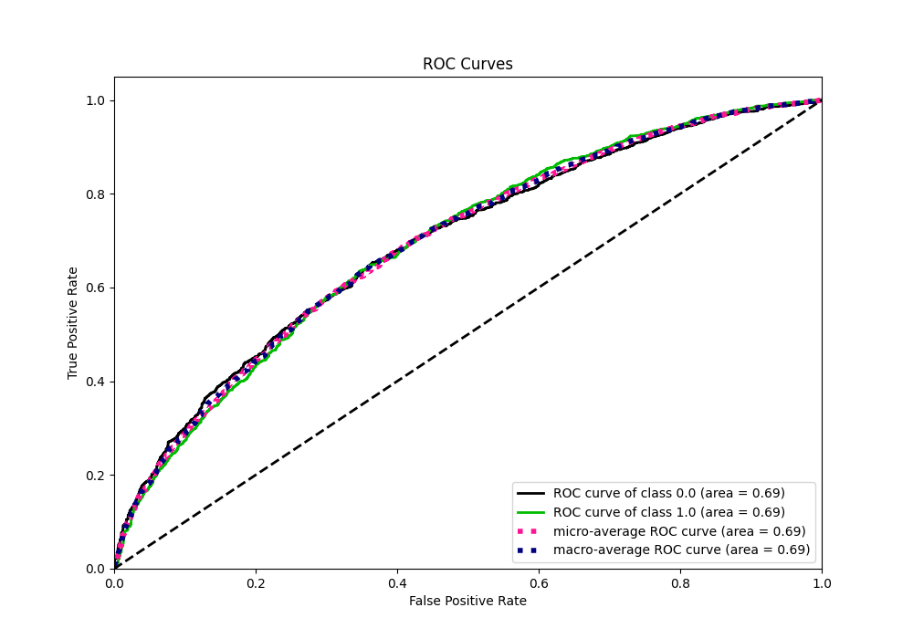
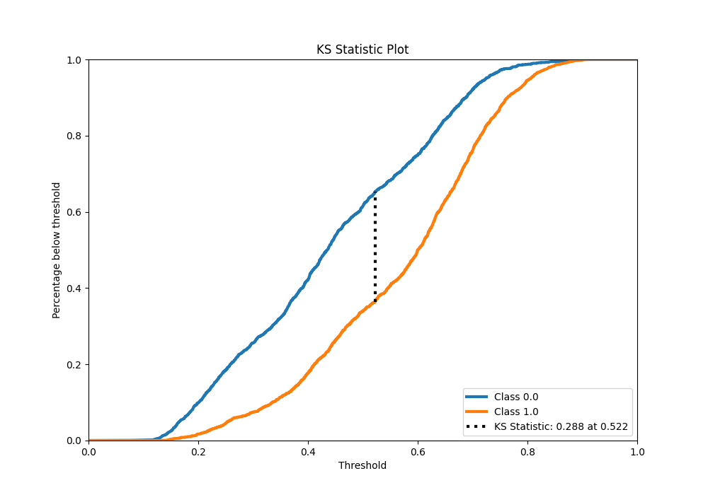
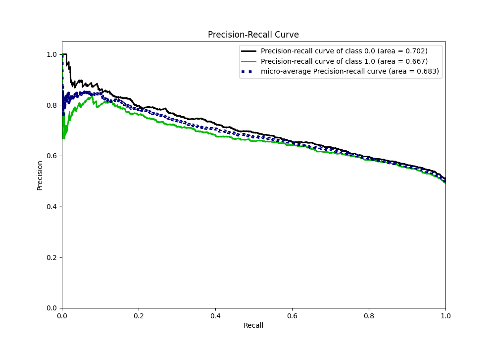
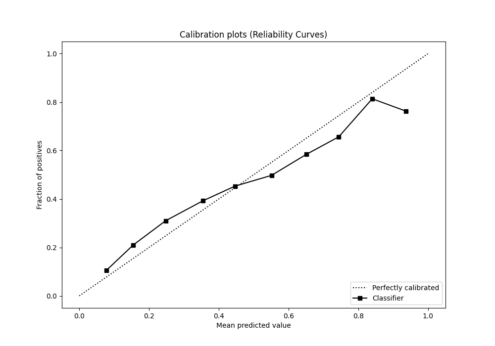
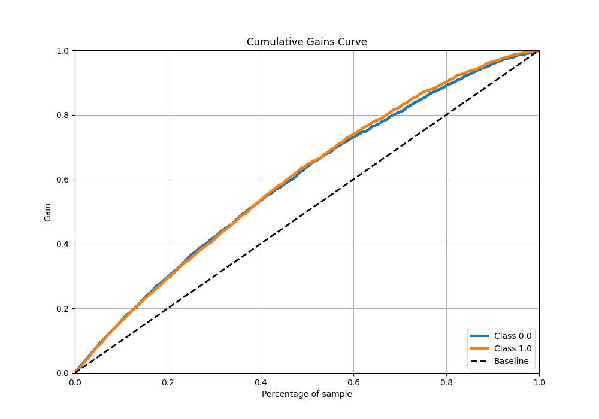

# Summary of Ensemble

[<< Go back](../README.md)

## Ensemble structure

| Model                   |   Weight |
|:------------------------|---------:|
| 3_Default_Xgboost       |        1 |
| 4_Default_NeuralNetwork |        3 |

## Metric details

|           |    score |   threshold |
|:----------|---------:|------------:|
| logloss   | 0.633114 | nan         |
| auc       | 0.694195 | nan         |
| f1        | 0.687339 |   0.368143  |
| accuracy  | 0.642649 |   0.524282  |
| precision | 0.811024 |   0.751737  |
| recall    | 1        |   0.0732669 |
| mcc       | 0.284847 |   0.524282  |

## Metric details with threshold from accuracy metric

|           |    score |   threshold |
|:----------|---------:|------------:|
| logloss   | 0.633114 |  nan        |
| auc       | 0.694195 |  nan        |
| f1        | 0.633124 |    0.524282 |
| accuracy  | 0.642649 |    0.524282 |
| precision | 0.636364 |    0.524282 |
| recall    | 0.629917 |    0.524282 |
| mcc       | 0.284847 |    0.524282 |

## Confusion matrix (at threshold=0.524282)

|              |   Predicted as 0 |   Predicted as 1 |
|:-------------|-----------------:|-----------------:|
| Labeled as 0 |             1146 |              604 |
| Labeled as 1 |              621 |             1057 |

## Learning curves

## Confusion Matrix

## Normalized Confusion Matrix

## ROC Curve

## Kolmogorov-Smirnov Statistic

## Precision-Recall Curve

## Calibration Curve

## Cumulative Gains Curve

## Lift Curve

[<< Go back](../README.md)
