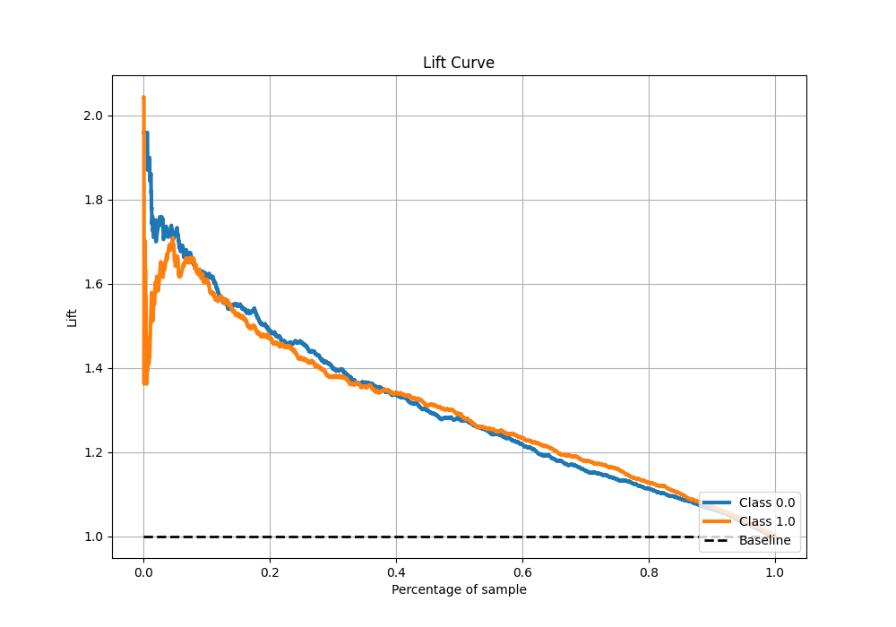

# Summary of Ensemble

[<< Go back](../README.md)

## Ensemble structure

| Model                   |   Weight |
|:------------------------|---------:|
| 3_Default_Xgboost       |        1 |
| 4_Default_NeuralNetwork |        2 |
| 5_Default_RandomForest  |        1 |

## Metric details

|           |    score |   threshold |
|:----------|---------:|------------:|
| logloss   | 0.640116 |  nan        |
| auc       | 0.684196 |  nan        |
| f1        | 0.680813 |    0.343899 |
| accuracy  | 0.636683 |    0.463869 |
| precision | 0.763975 |    0.707291 |
| recall    | 1        |    0.108317 |
| mcc       | 0.281881 |    0.449139 |

## Metric details with threshold from accuracy metric

|           |    score |   threshold |
|:----------|---------:|------------:|
| logloss   | 0.640116 |  nan        |
| auc       | 0.684196 |  nan        |
| f1        | 0.661941 |    0.463869 |
| accuracy  | 0.636683 |    0.463869 |
| precision | 0.607304 |    0.463869 |
| recall    | 0.727382 |    0.463869 |
| mcc       | 0.281364 |    0.463869 |

## Confusion matrix (at threshold=0.463869)

|              |   Predicted as 0 |   Predicted as 1 |
|:-------------|-----------------:|-----------------:|
| Labeled as 0 |              959 |              785 |
| Labeled as 1 |              455 |             1214 |

## Learning curves

## Confusion Matrix

## Normalized Confusion Matrix

## ROC Curve

## Kolmogorov-Smirnov Statistic

## Precision-Recall Curve

## Calibration Curve

## Cumulative Gains Curve

## Lift Curve

[<< Go back](../README.md)
