# Summary of 2_DecisionTree

[<< Go back](../README.md)

## Decision Tree

- **n_jobs**: -1
- **criterion**: gini
- **max_depth**: 3
- **explain_level**: 2

## Validation

- **validation_type**: split
- **train_ratio**: 0.75
- **shuffle**: True
- **stratify**: True

## Optimized metric

auc

## Training time

5.7 seconds

## Metric details

|           |     score |   threshold |
|:----------|----------:|------------:|
| logloss   | 0.703887  |  nan        |
| auc       | 0.502156  |  nan        |
| f1        | 0.651382  |    0.331967 |
| accuracy  | 0.519     |    0.59996  |
| precision | 0.522727  |    0.59996  |
| recall    | 1         |    0.331967 |
| mcc       | 0.0349949 |    0.368852 |

## Metric details with threshold from accuracy metric

|           |     score |   threshold |
|:----------|----------:|------------:|
| logloss   | 0.703887  |   nan       |
| auc       | 0.502156  |   nan       |
| f1        | 0.0872865 |     0.59996 |
| accuracy  | 0.519     |     0.59996 |
| precision | 0.522727  |     0.59996 |
| recall    | 0.047619  |     0.59996 |
| mcc       | 0.0170556 |     0.59996 |

## Confusion matrix (at threshold=0.59996)

|              |   Predicted as 0 |   Predicted as 1 |
|:-------------|-----------------:|-----------------:|
| Labeled as 0 |              496 |               21 |
| Labeled as 1 |              460 |               23 |

## Learning curves

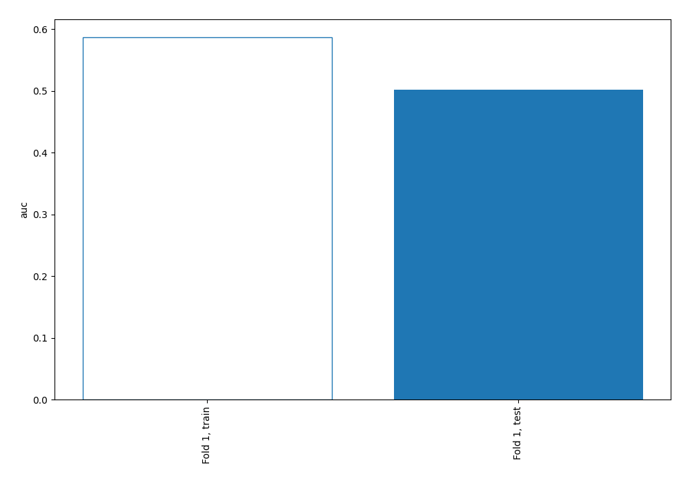

## Permutation-based Importance

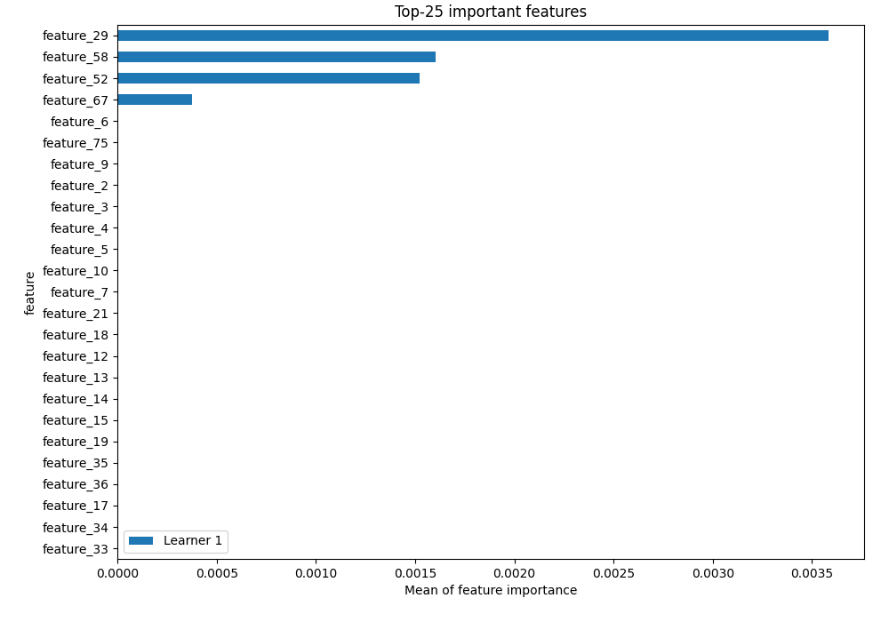

## Confusion Matrix

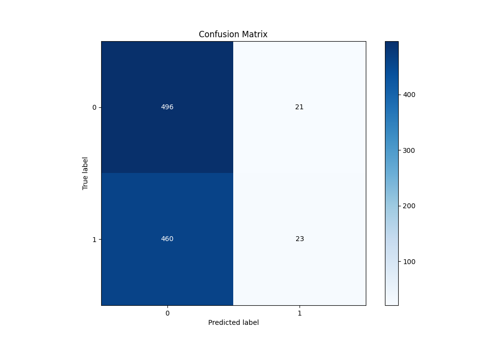

## Normalized Confusion Matrix

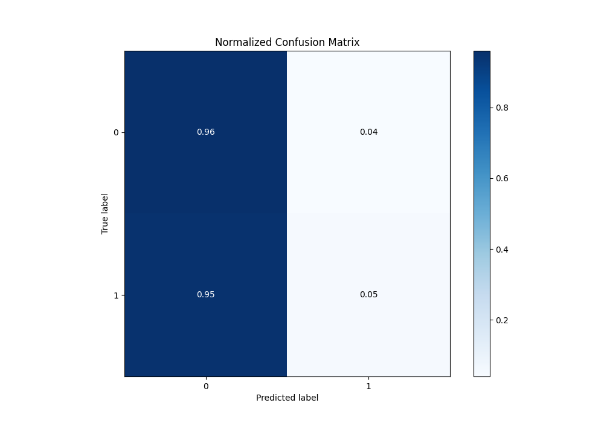

## ROC Curve

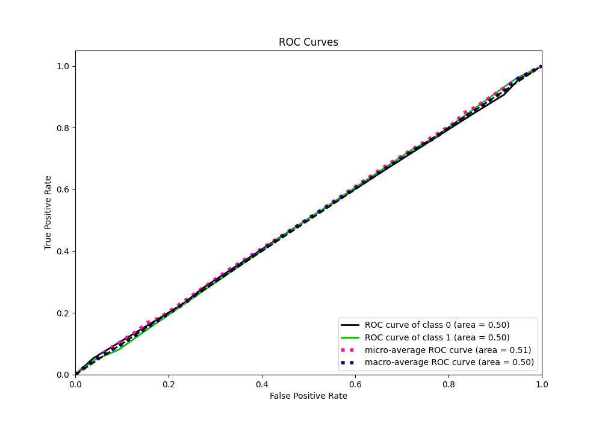

## Kolmogorov-Smirnov Statistic

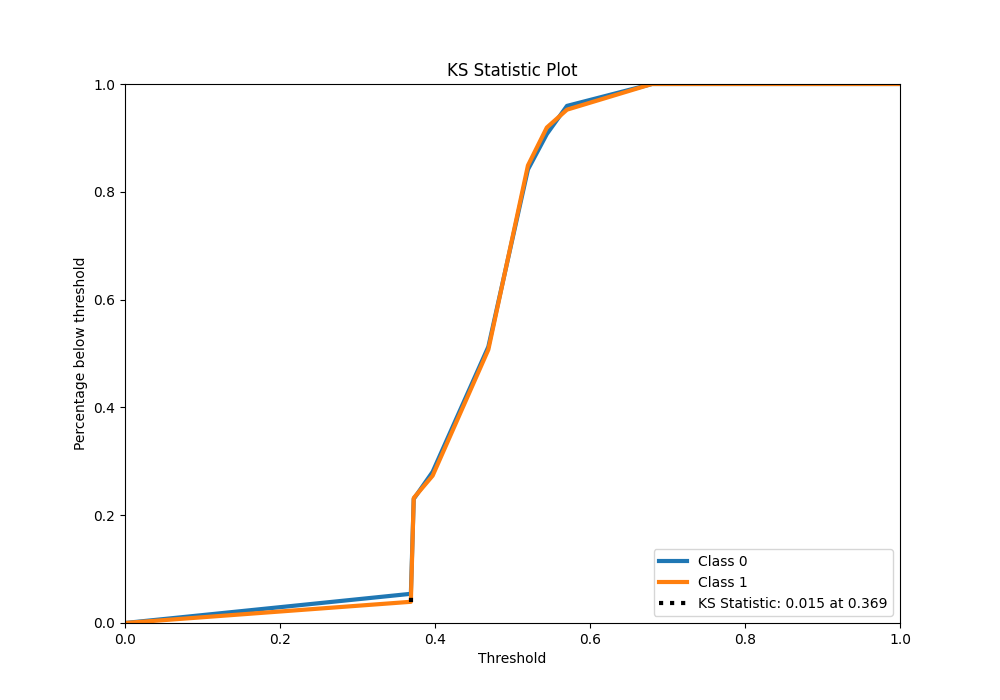

## Precision-Recall Curve

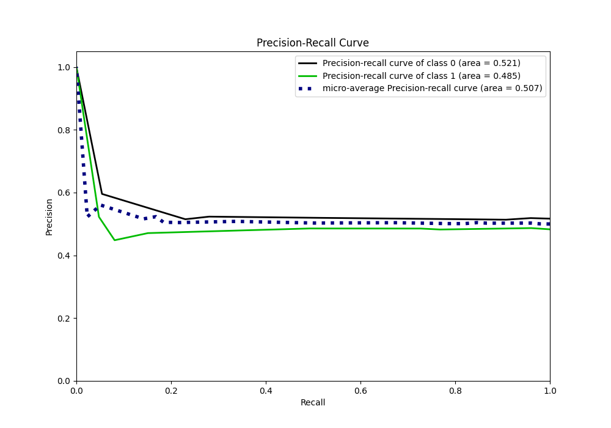

## Calibration Curve

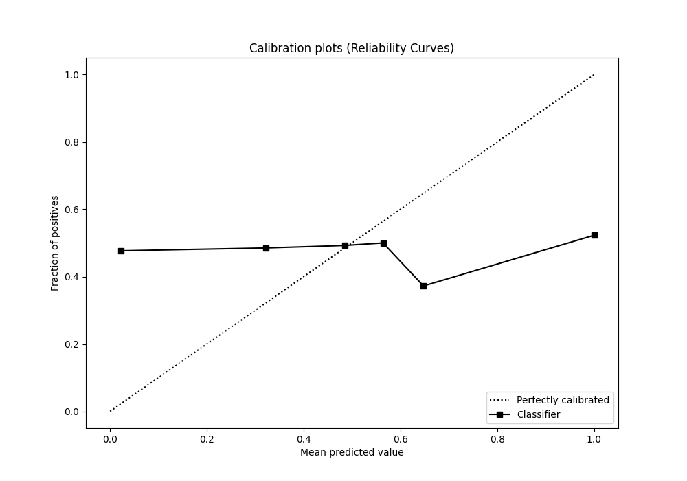

## Cumulative Gains Curve

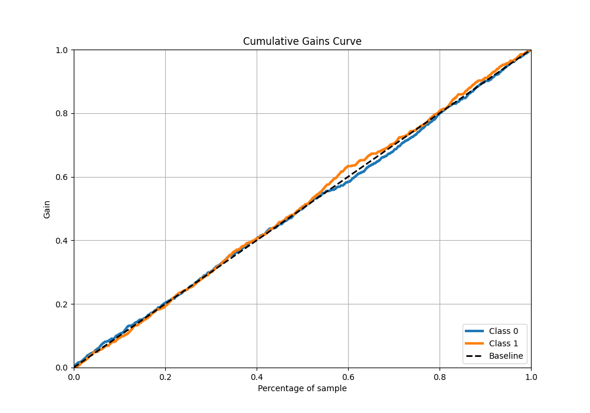

## Lift Curve

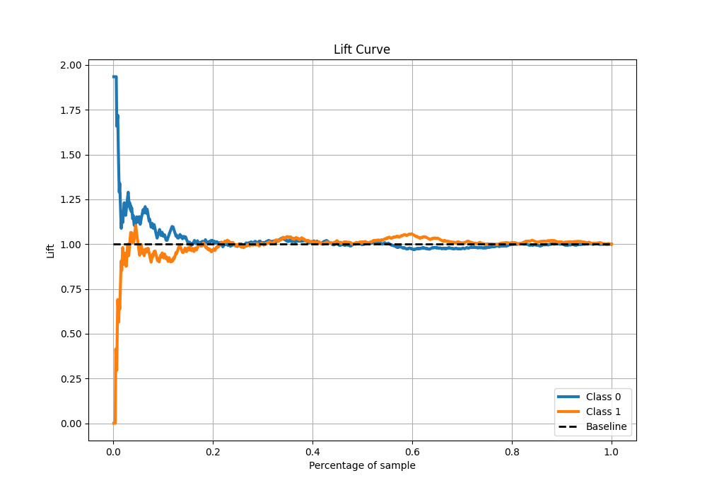

## SHAP Importance

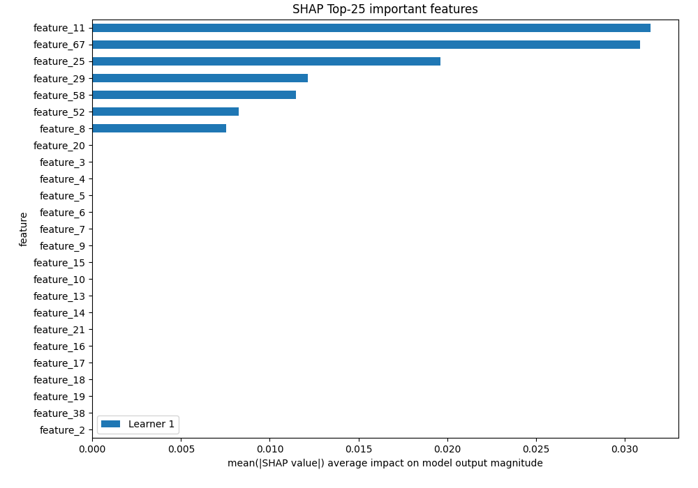

[<< Go back](../README.md)
