# Summary of 3_Linear

[<< Go back](../README.md)

## Logistic Regression (Linear)

- **n_jobs**: -1
- **explain_level**: 2

## Validation

- **validation_type**: split
- **train_ratio**: 0.75
- **shuffle**: True
- **stratify**: True

## Optimized metric

auc

## Training time

4.1 seconds

## Metric details

|           |    score |   threshold |
|:----------|---------:|------------:|
| logloss   | 0.669239 | nan         |
| auc       | 0.631282 | nan         |
| f1        | 0.657728 |   0.246618  |
| accuracy  | 0.6      |   0.534127  |
| precision | 0.8      |   0.800797  |
| recall    | 1        |   0.0914683 |
| mcc       | 0.19974  |   0.390411  |

## Metric details with threshold from accuracy metric

|           |    score |   threshold |
|:----------|---------:|------------:|
| logloss   | 0.669239 |  nan        |
| auc       | 0.631282 |  nan        |
| f1        | 0.531616 |    0.534127 |
| accuracy  | 0.6      |    0.534127 |
| precision | 0.61186  |    0.534127 |
| recall    | 0.469979 |    0.534127 |
| mcc       | 0.198043 |    0.534127 |

## Confusion matrix (at threshold=0.534127)

|              |   Predicted as 0 |   Predicted as 1 |
|:-------------|-----------------:|-----------------:|
| Labeled as 0 |              373 |              144 |
| Labeled as 1 |              256 |              227 |

## Learning curves

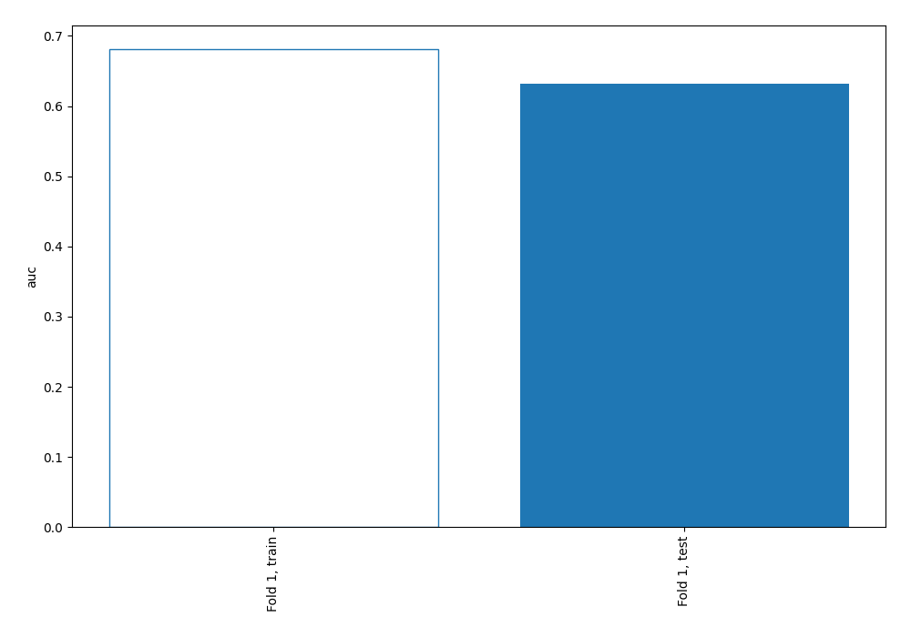

## Coefficients

| feature    |   Learner_1 |
|:-----------|------------:|
| feature_35 |  0.200405   |
| feature_20 |  0.192239   |
| feature_15 |  0.191565   |
| intercept  |  0.146226   |
| feature_40 |  0.138789   |
| feature_33 |  0.135812   |
| feature_43 |  0.134685   |
| feature_66 |  0.130875   |
| feature_4  |  0.130841   |
| feature_12 |  0.126476   |
| feature_10 |  0.119604   |
| feature_49 |  0.118894   |
| feature_14 |  0.107123   |
| feature_19 |  0.104659   |
| feature_46 |  0.0949958  |
| feature_58 |  0.0940737  |
| feature_71 |  0.0897494  |
| feature_53 |  0.0893205  |
| feature_68 |  0.0839031  |
| feature_42 |  0.0813232  |
| feature_25 |  0.0804899  |
| feature_69 |  0.0795484  |
| feature_2  |  0.0768902  |
| feature_73 |  0.0739344  |
| feature_22 |  0.0732772  |
| feature_21 |  0.0710029  |
| feature_39 |  0.0676263  |
| feature_54 |  0.0670369  |
| feature_36 |  0.0655498  |
| feature_16 |  0.0655498  |
| feature_63 |  0.0621283  |
| feature_32 |  0.0602608  |
| feature_44 |  0.0571233  |
| feature_41 |  0.0553329  |
| feature_24 |  0.0404095  |
| feature_56 |  0.0297897  |
| feature_17 |  0.0272678  |
| feature_23 |  0.0191304  |
| feature_3  | -0.00117303 |
| feature_27 | -0.0141339  |
| feature_18 | -0.0175461  |
| feature_38 | -0.0220414  |
| feature_8  | -0.028008   |
| feature_62 | -0.0331552  |
| feature_76 | -0.0389717  |
| feature_51 | -0.0448625  |
| feature_13 | -0.047958   |
| feature_50 | -0.0490565  |
| feature_75 | -0.0547078  |
| feature_74 | -0.0570883  |
| feature_31 | -0.059011   |
| feature_52 | -0.0665689  |
| feature_61 | -0.0693664  |
| feature_47 | -0.0745467  |
| feature_7  | -0.0761572  |
| feature_72 | -0.0790566  |
| feature_1  | -0.0802046  |
| feature_26 | -0.0817932  |
| feature_65 | -0.0830271  |
| feature_59 | -0.0879831  |
| feature_48 | -0.0910561  |
| feature_34 | -0.0992595  |
| feature_28 | -0.102777   |
| feature_30 | -0.103224   |
| feature_45 | -0.116688   |
| feature_64 | -0.117451   |
| feature_37 | -0.118839   |
| feature_67 | -0.123572   |
| feature_11 | -0.13637    |
| feature_55 | -0.138853   |
| feature_57 | -0.172999   |
| feature_9  | -0.203542   |
| feature_29 | -0.206588   |
| feature_5  | -0.21696    |
| feature_70 | -0.22905    |
| feature_6  | -0.234133   |
| feature_60 | -0.241553   |

## Permutation-based Importance

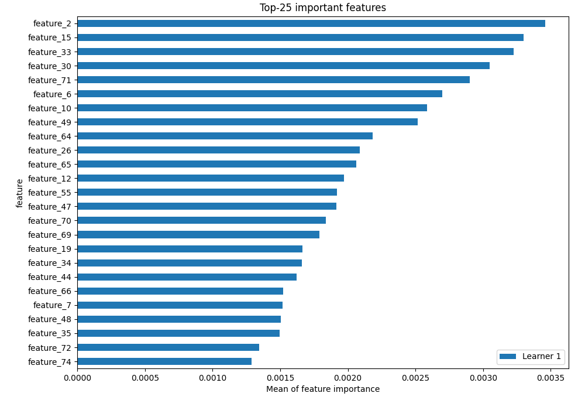

## Confusion Matrix

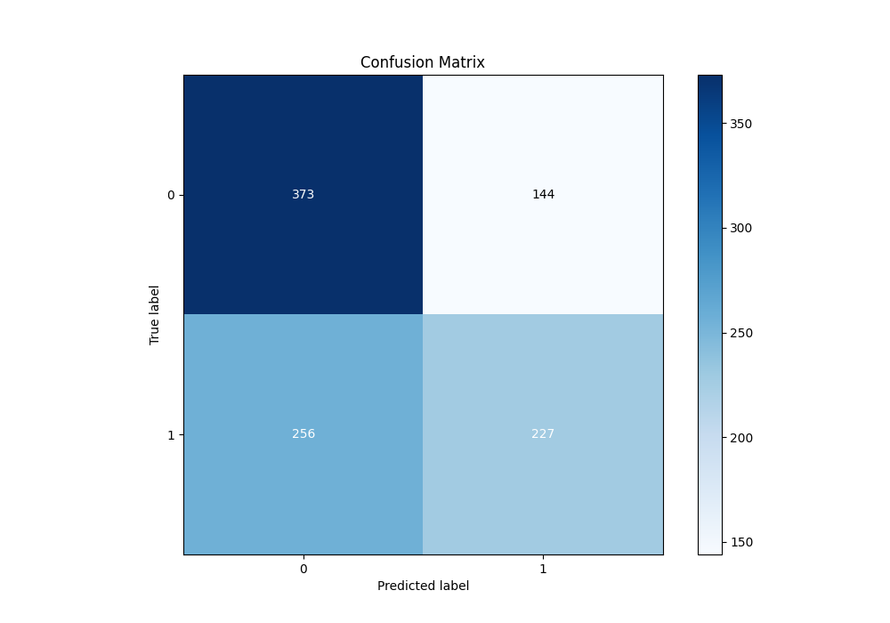

## Normalized Confusion Matrix

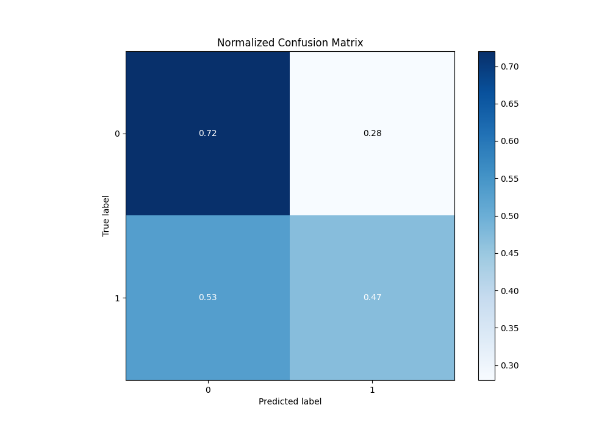

## ROC Curve

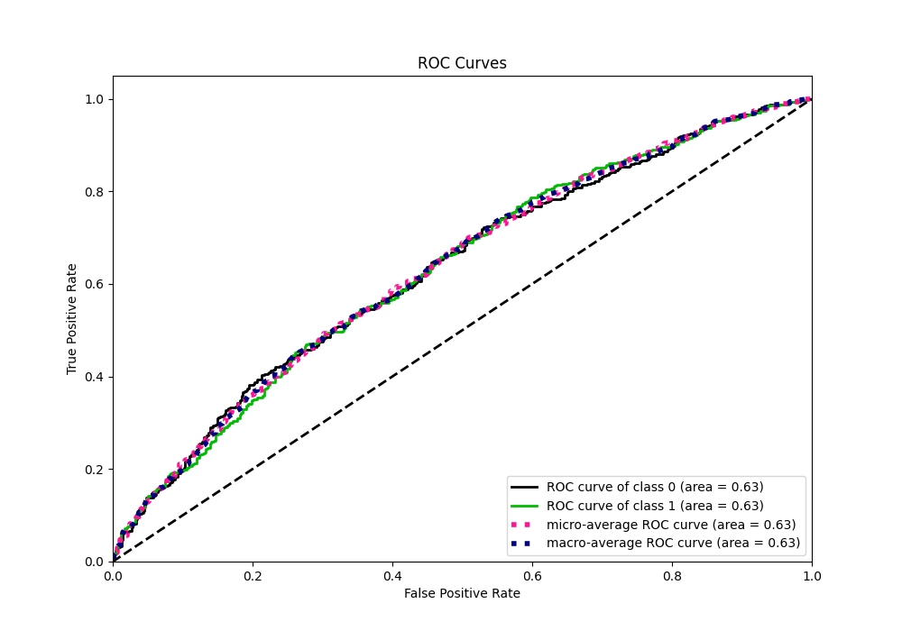

## Kolmogorov-Smirnov Statistic

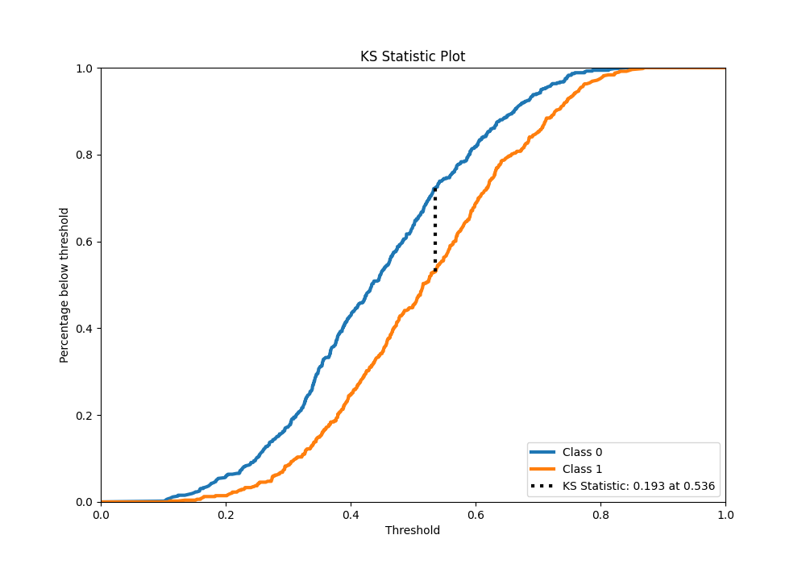

## Precision-Recall Curve

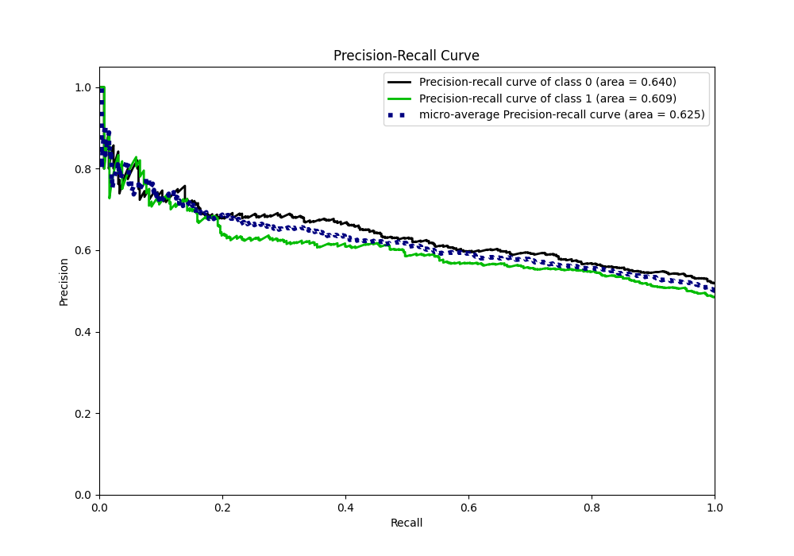

## Calibration Curve

## Cumulative Gains Curve

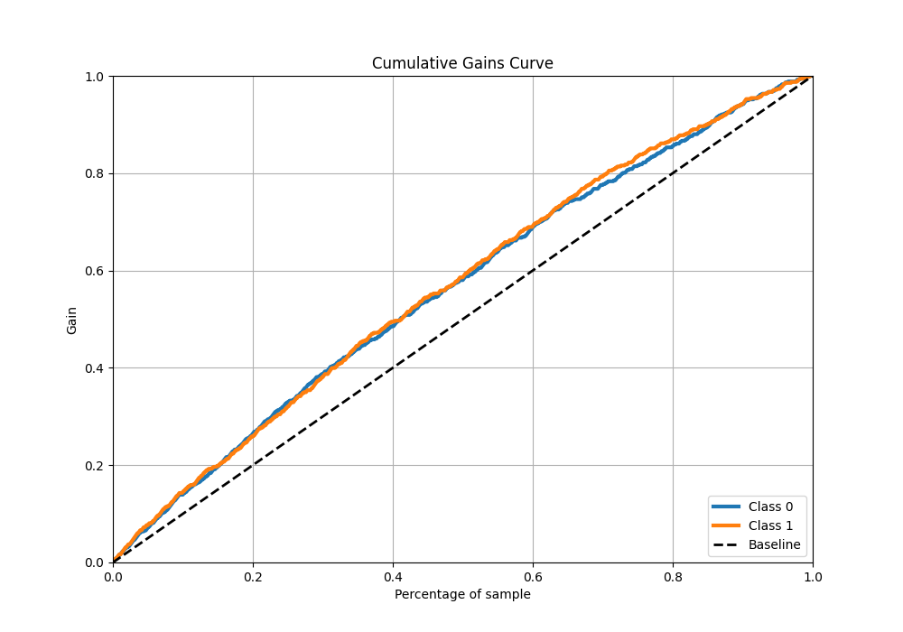

## Lift Curve

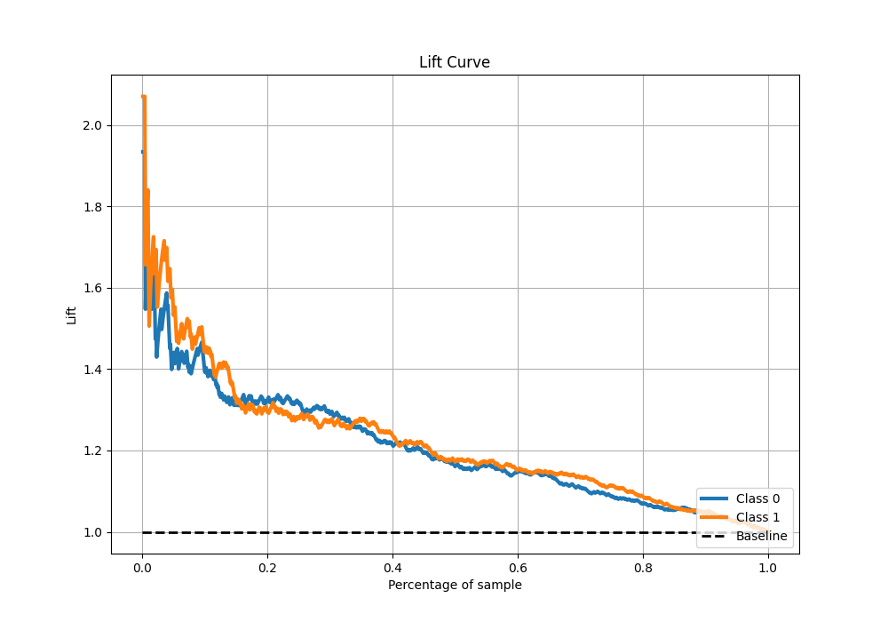

## SHAP Importance

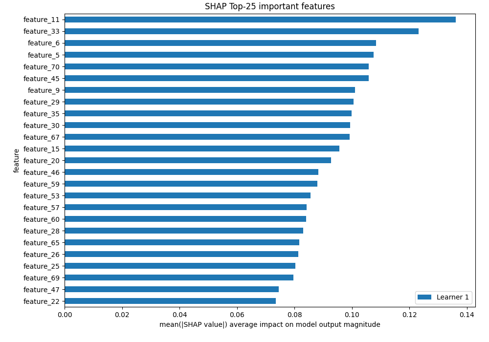

## SHAP Dependence plots

### Dependence (Fold 1)

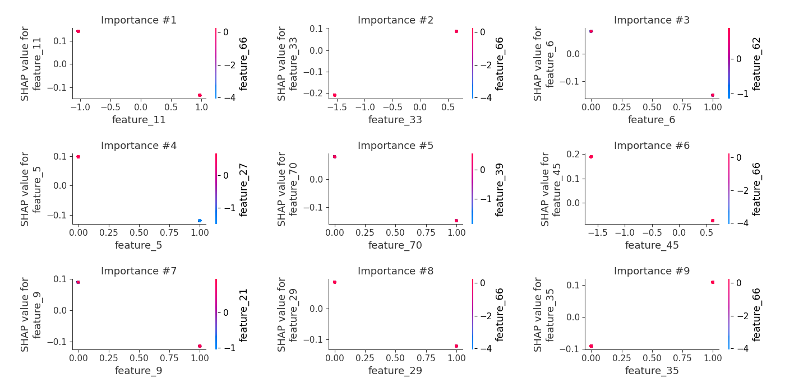

## SHAP Decision plots

### Top-10 Worst decisions for class 0 (Fold 1)

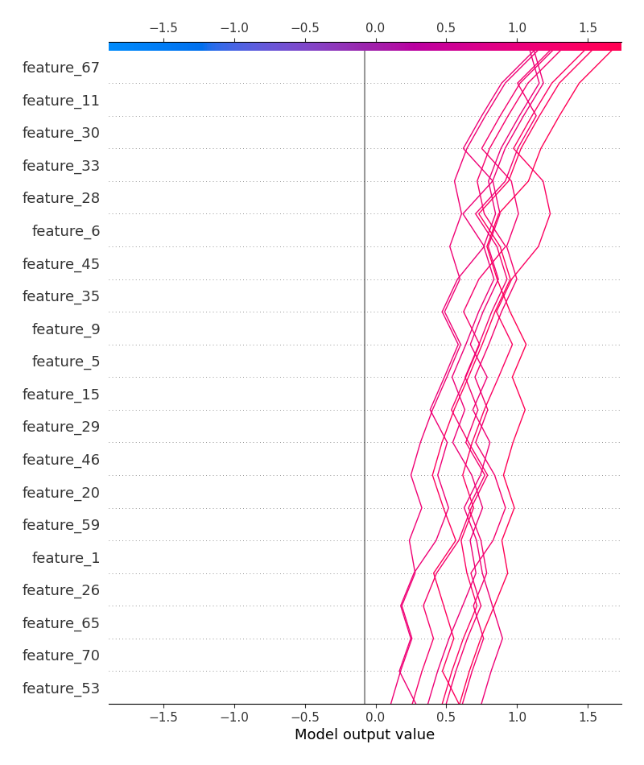

### Top-10 Best decisions for class 0 (Fold 1)

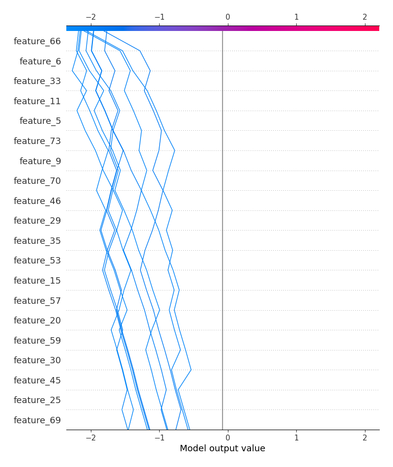

### Top-10 Worst decisions for class 1 (Fold 1)

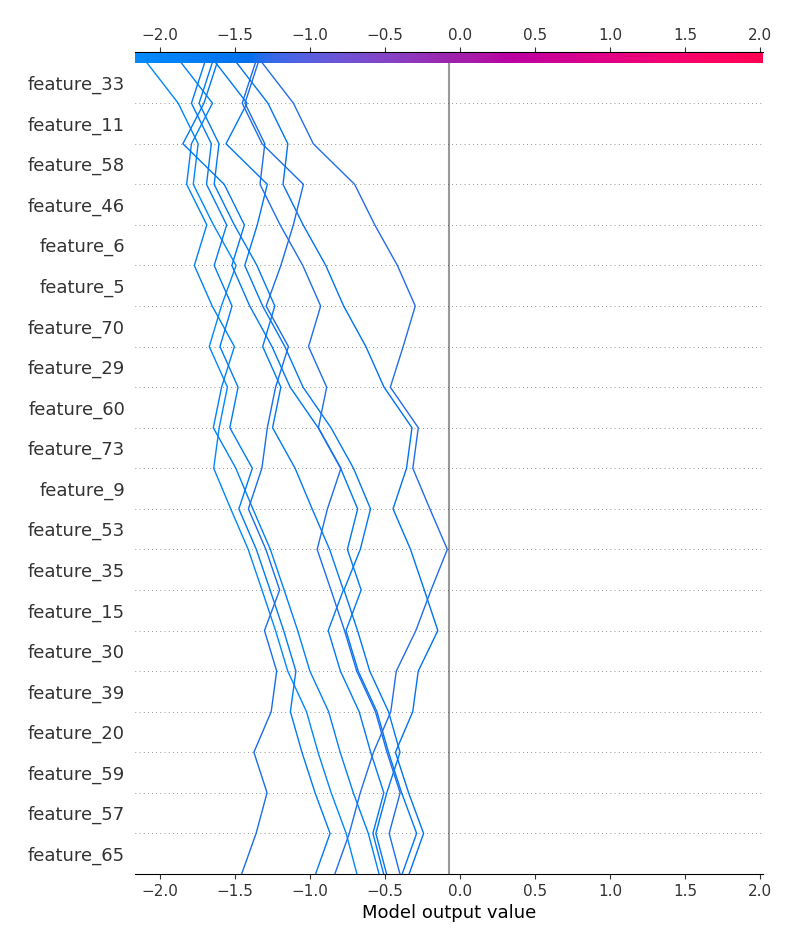

### Top-10 Best decisions for class 1 (Fold 1)

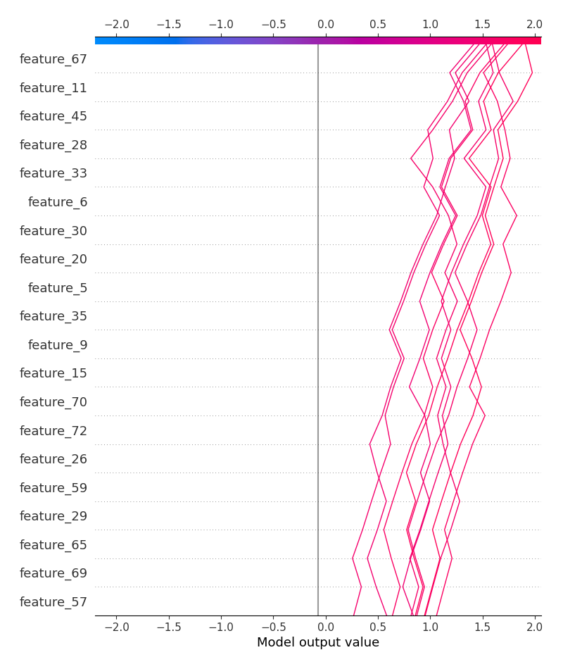

[<< Go back](../README.md)
