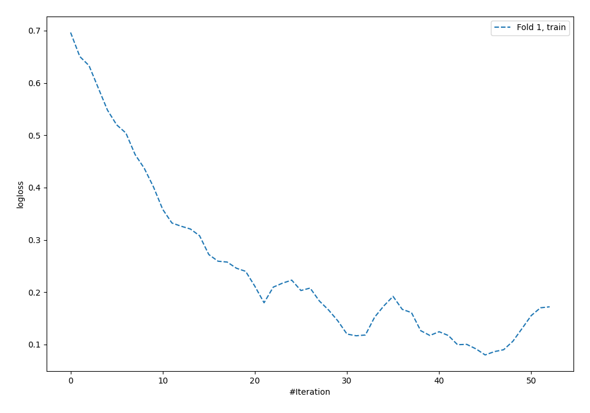
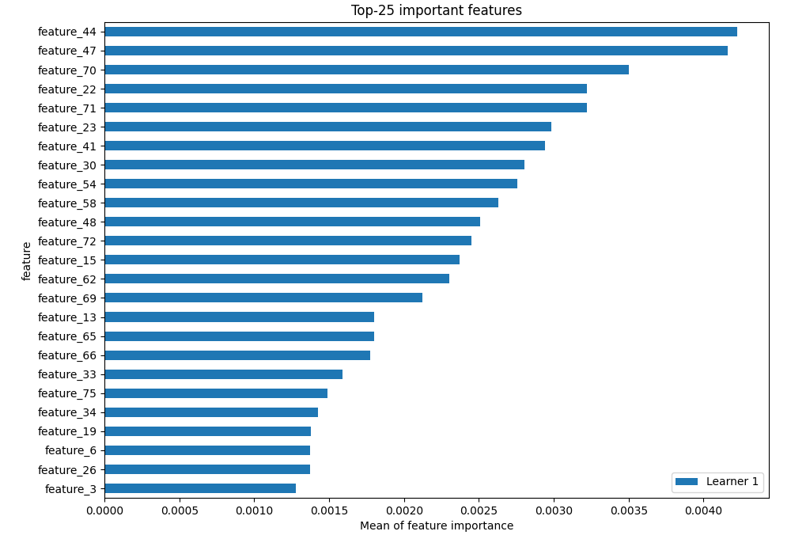
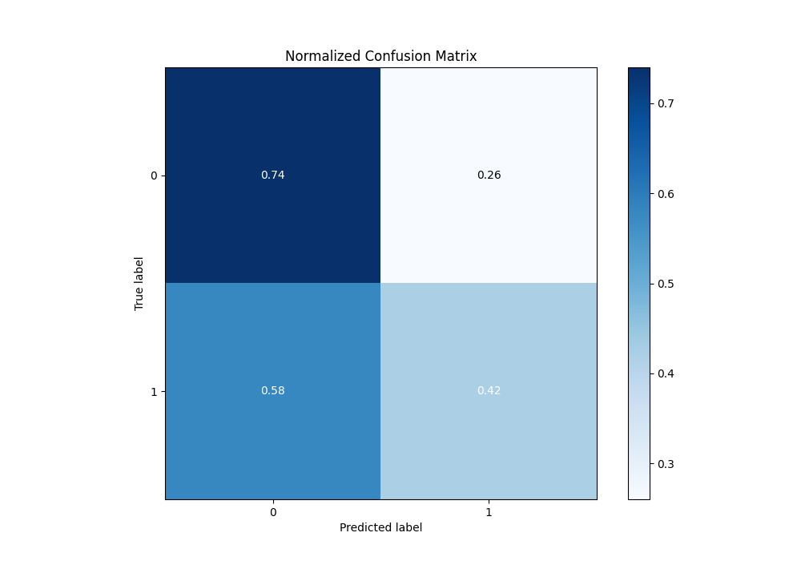
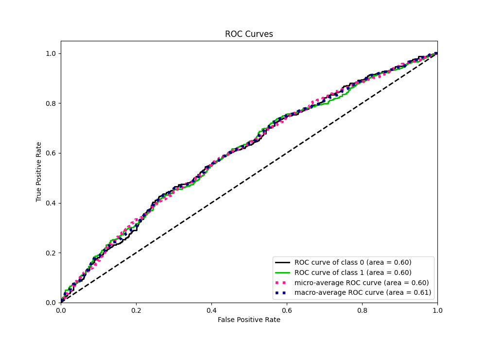
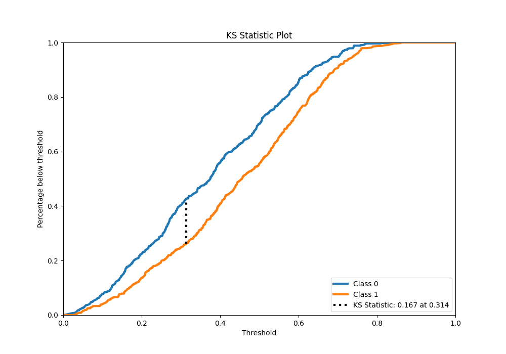
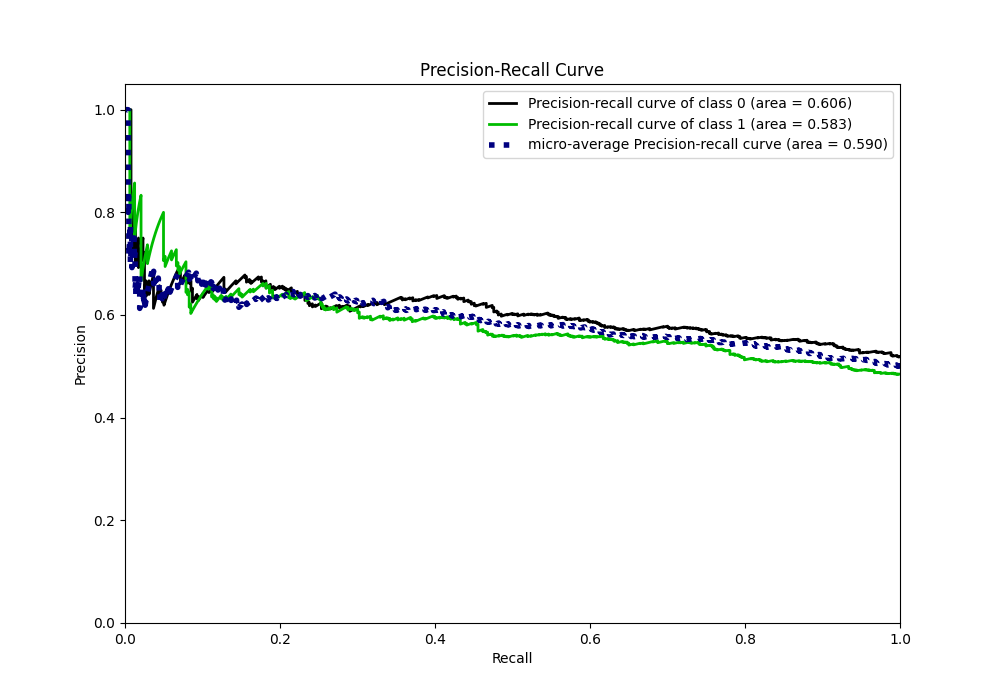
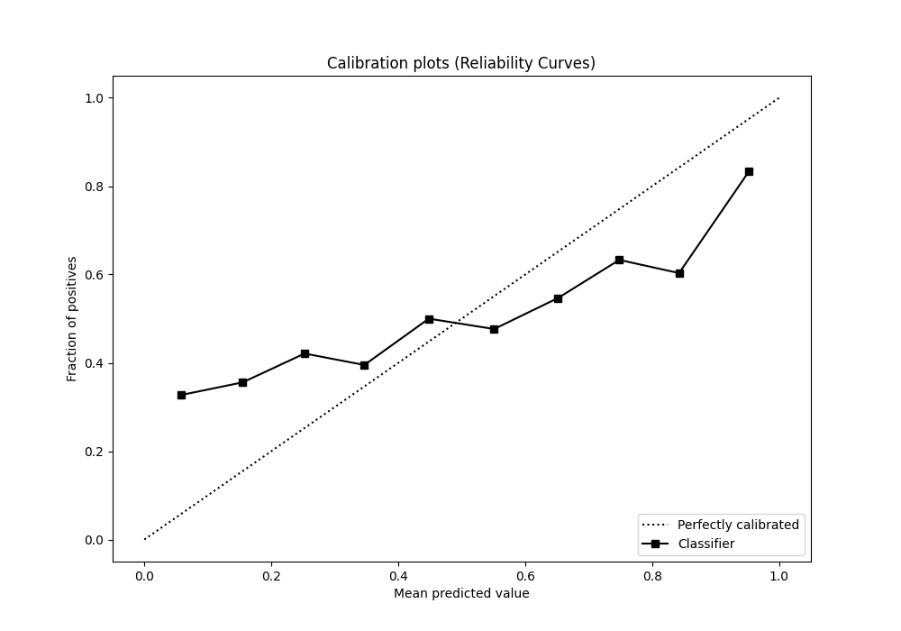
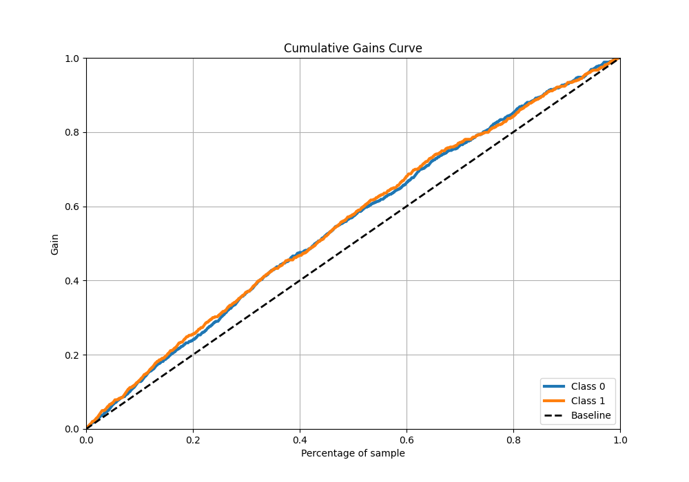
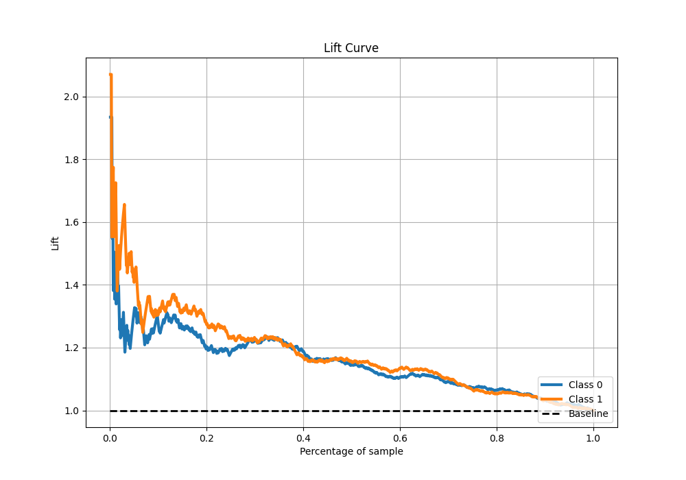

# Summary of 5_Default_NeuralNetwork

[<< Go back](../README.md)

## Neural Network

- **n_jobs**: -1
- **dense_1_size**: 32
- **dense_2_size**: 16
- **learning_rate**: 0.05
- **explain_level**: 2

## Validation

- **validation_type**: split
- **train_ratio**: 0.75
- **shuffle**: True
- **stratify**: True

## Optimized metric

auc

## Training time

1.5 seconds

## Metric details

|           |    score |   threshold |
|:----------|---------:|------------:|
| logloss   | 0.728984 | nan         |
| auc       | 0.604687 | nan         |
| f1        | 0.651748 |   0.0937592 |
| accuracy  | 0.582    |   0.517806  |
| precision | 0.693878 |   0.716811  |
| recall    | 1        |   0.0071289 |
| mcc       | 0.172976 |   0.313494  |

## Metric details with threshold from accuracy metric

|           |    score |   threshold |
|:----------|---------:|------------:|
| logloss   | 0.728984 |  nan        |
| auc       | 0.604687 |  nan        |
| f1        | 0.490244 |    0.517806 |
| accuracy  | 0.582    |    0.517806 |
| precision | 0.596439 |    0.517806 |
| recall    | 0.416149 |    0.517806 |
| mcc       | 0.161846 |    0.517806 |

## Confusion matrix (at threshold=0.517806)

|              |   Predicted as 0 |   Predicted as 1 |
|:-------------|-----------------:|-----------------:|
| Labeled as 0 |              381 |              136 |
| Labeled as 1 |              282 |              201 |

## Learning curves

## Permutation-based Importance

## Confusion Matrix

## Normalized Confusion Matrix

## ROC Curve

## Kolmogorov-Smirnov Statistic

## Precision-Recall Curve

## Calibration Curve

## Cumulative Gains Curve

## Lift Curve

[<< Go back](../README.md)
