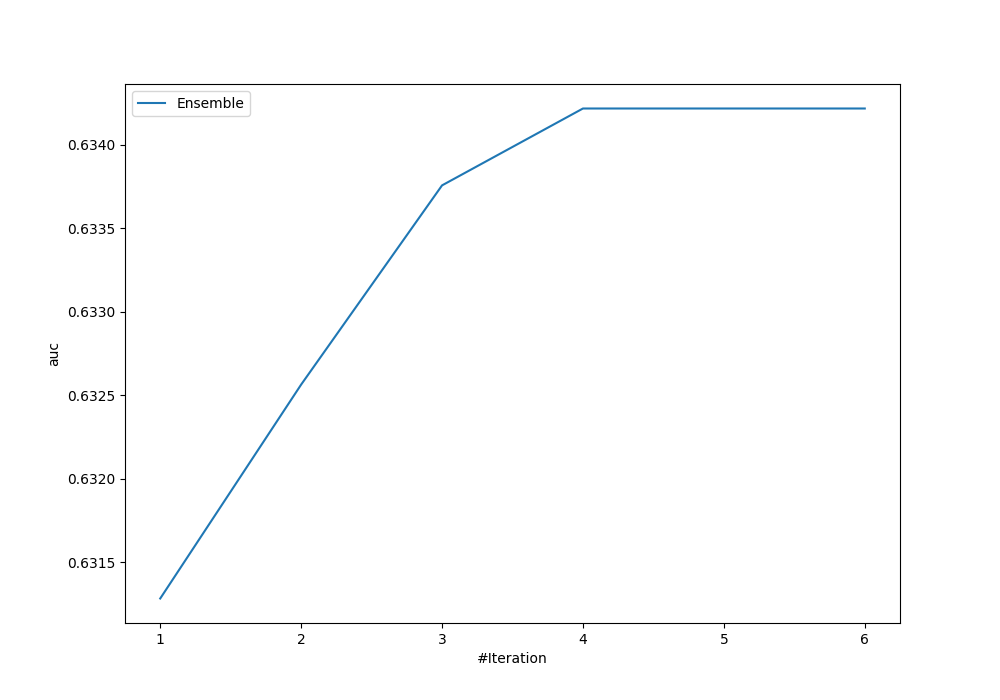
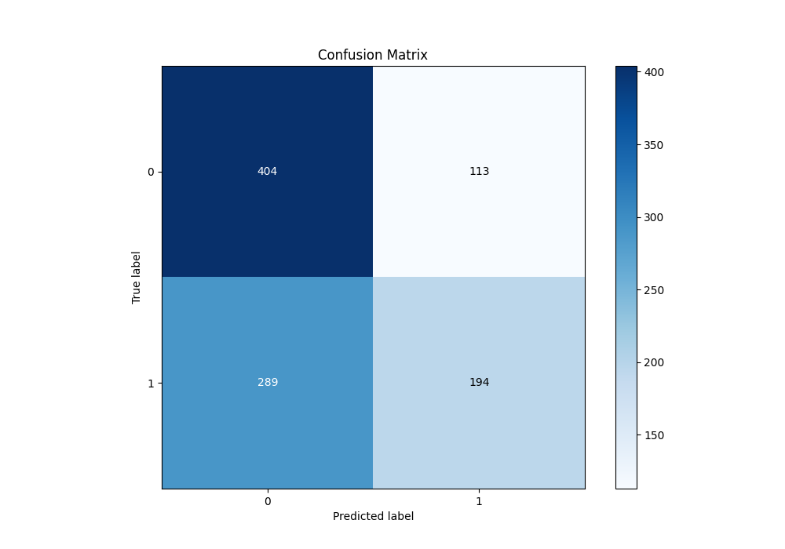
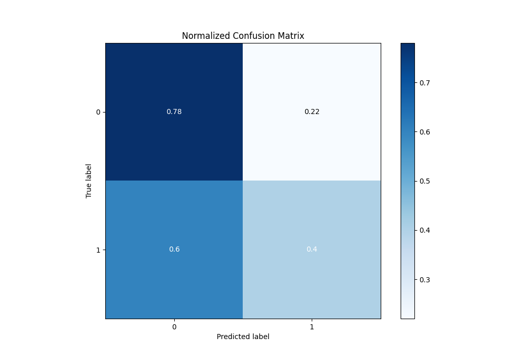
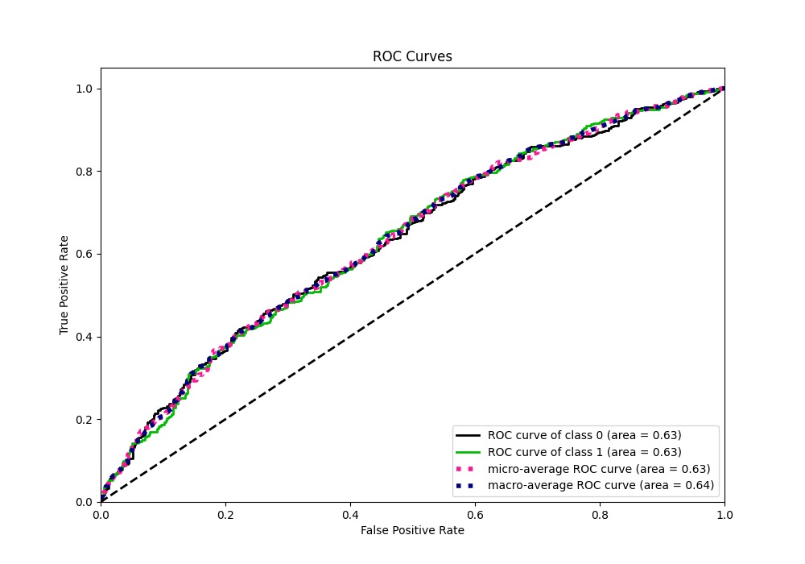
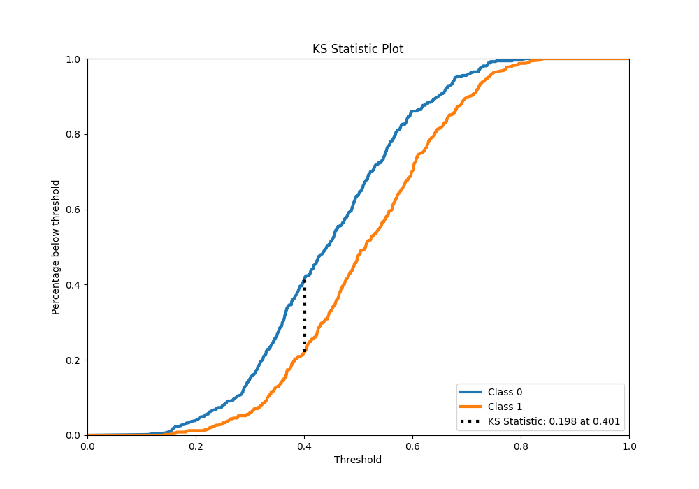
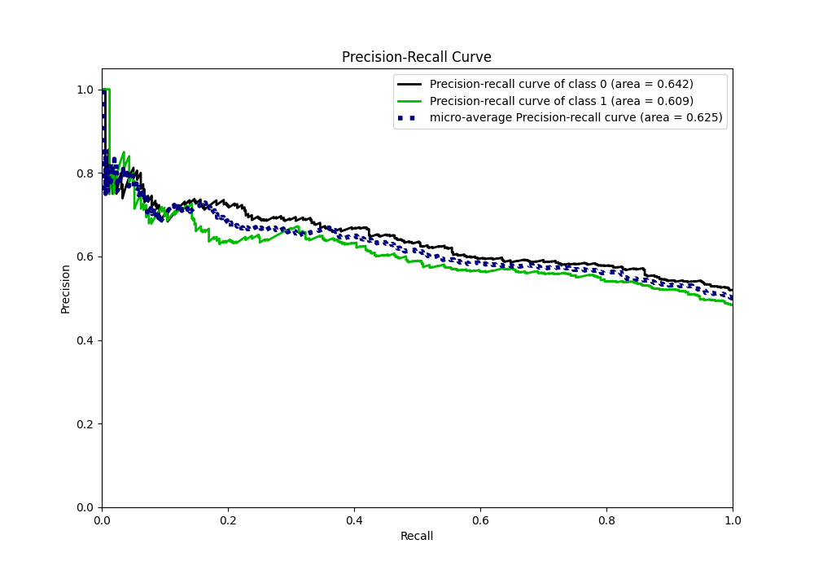
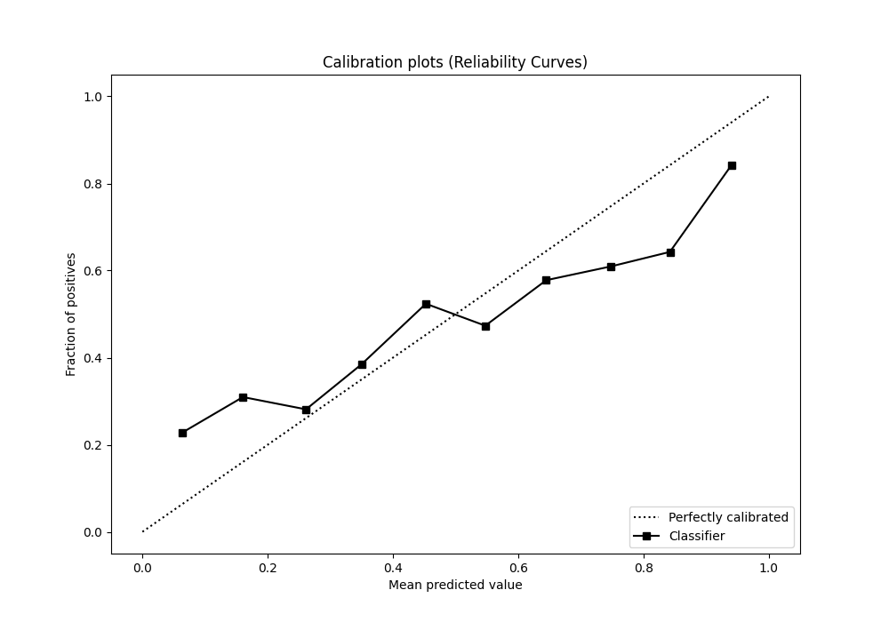
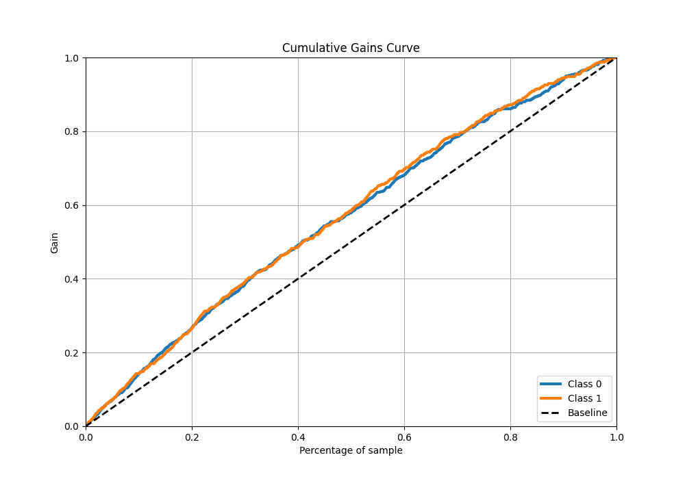
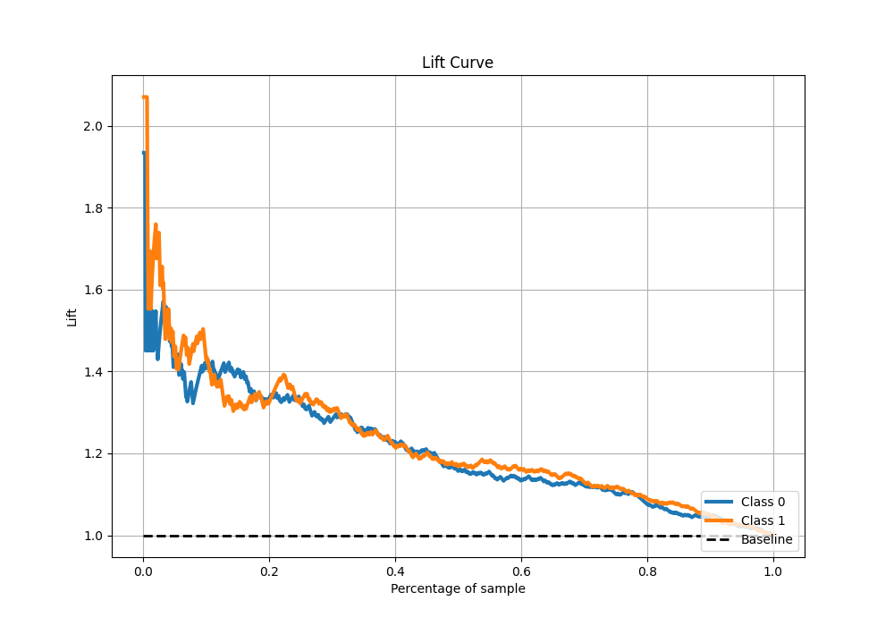

# Summary of Ensemble

[<< Go back](../README.md)

## Ensemble structure

| Model             |   Weight |
|:------------------|---------:|
| 3_Linear          |        3 |
| 4_Default_Xgboost |        1 |

## Metric details

|           |    score |   threshold |
|:----------|---------:|------------:|
| logloss   | 0.665976 |  nan        |
| auc       | 0.634217 |  nan        |
| f1        | 0.663205 |    0.318661 |
| accuracy  | 0.598    |    0.562257 |
| precision | 0.85     |    0.759777 |
| recall    | 1        |    0.100798 |
| mcc       | 0.202265 |    0.423461 |

## Metric details with threshold from accuracy metric

|           |    score |   threshold |
|:----------|---------:|------------:|
| logloss   | 0.665976 |  nan        |
| auc       | 0.634217 |  nan        |
| f1        | 0.491139 |    0.562257 |
| accuracy  | 0.598    |    0.562257 |
| precision | 0.631922 |    0.562257 |
| recall    | 0.401656 |    0.562257 |
| mcc       | 0.198355 |    0.562257 |

## Confusion matrix (at threshold=0.562257)

|              |   Predicted as 0 |   Predicted as 1 |
|:-------------|-----------------:|-----------------:|
| Labeled as 0 |              404 |              113 |
| Labeled as 1 |              289 |              194 |

## Learning curves

## Confusion Matrix

## Normalized Confusion Matrix

## ROC Curve

## Kolmogorov-Smirnov Statistic

## Precision-Recall Curve

## Calibration Curve

## Cumulative Gains Curve

## Lift Curve

[<< Go back](../README.md)
