# Summary of 4_Default_Xgboost

[<< Go back](../README.md)

## Extreme Gradient Boosting (Xgboost)

- **n_jobs**: -1
- **objective**: binary:logistic
- **eta**: 0.075
- **max_depth**: 6
- **min_child_weight**: 1
- **subsample**: 1.0
- **colsample_bytree**: 1.0
- **eval_metric**: auc
- **explain_level**: 2

## Validation

- **validation_type**: split
- **train_ratio**: 0.75
- **shuffle**: True
- **stratify**: True

## Optimized metric

auc

## Training time

33.0 seconds

## Metric details

|           |    score |   threshold |
|:----------|---------:|------------:|
| logloss   | 0.691952 | nan         |
| auc       | 0.583604 | nan         |
| f1        | 0.660714 |   0.0736868 |
| accuracy  | 0.577333 |   0.510962  |
| precision | 0.65     |   0.764196  |
| recall    | 1        |   0.0736868 |
| mcc       | 0.154109 |   0.510962  |

## Metric details with threshold from accuracy metric

|           |    score |   threshold |
|:----------|---------:|------------:|
| logloss   | 0.691952 |  nan        |
| auc       | 0.583604 |  nan        |
| f1        | 0.553521 |    0.510962 |
| accuracy  | 0.577333 |    0.510962 |
| precision | 0.577941 |    0.510962 |
| recall    | 0.531081 |    0.510962 |
| mcc       | 0.154109 |    0.510962 |

## Confusion matrix (at threshold=0.510962)

|              |   Predicted as 0 |   Predicted as 1 |
|:-------------|-----------------:|-----------------:|
| Labeled as 0 |              473 |              287 |
| Labeled as 1 |              347 |              393 |

## Learning curves

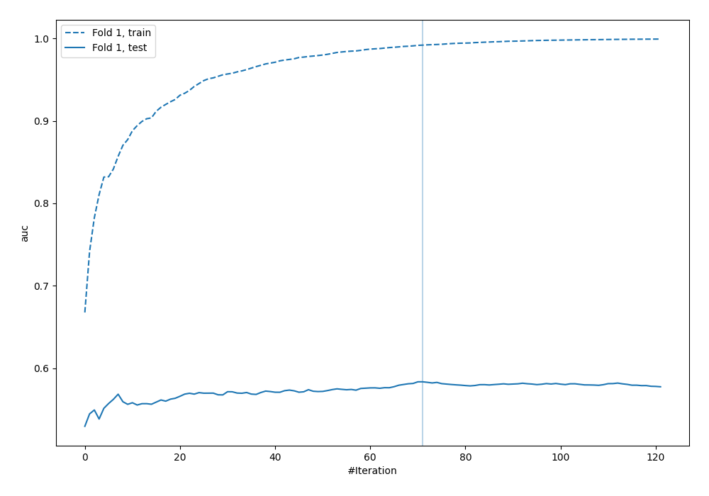

## Permutation-based Importance

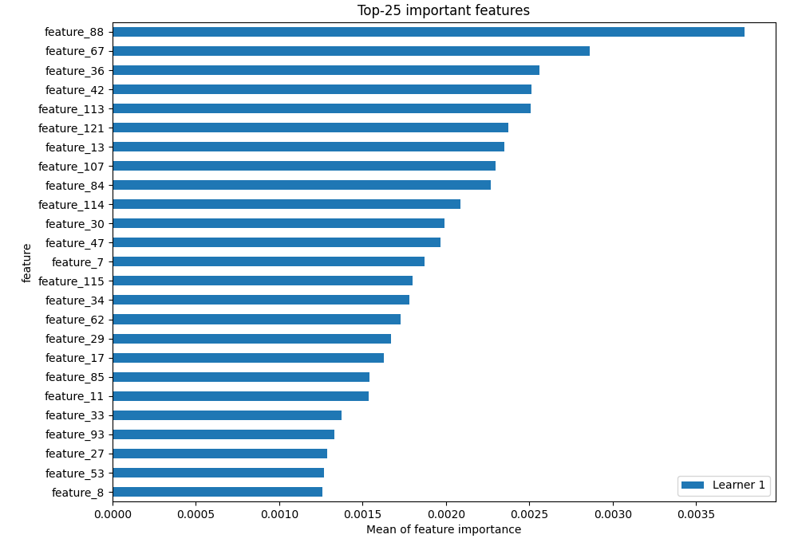

## Confusion Matrix

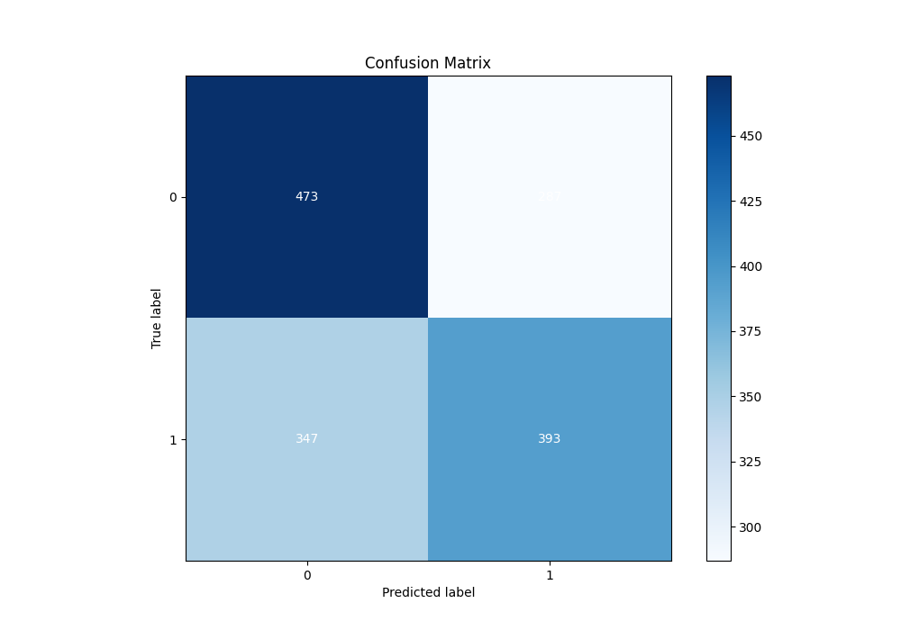

## Normalized Confusion Matrix

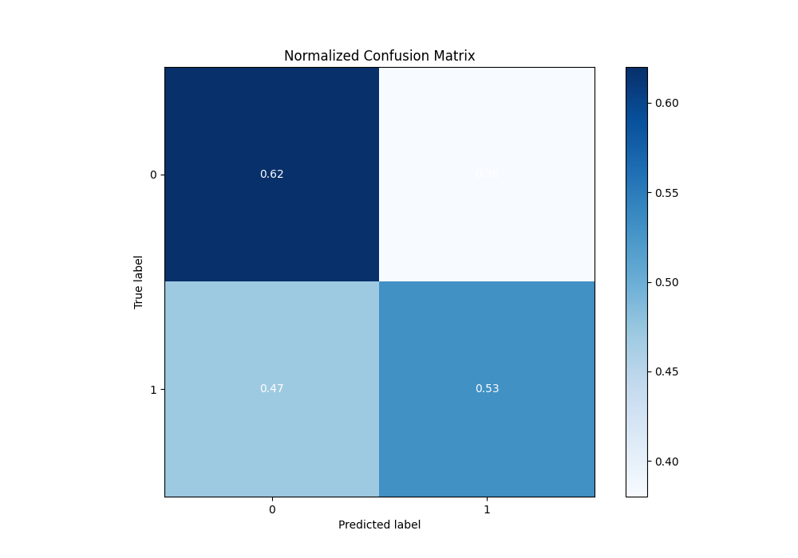

## ROC Curve

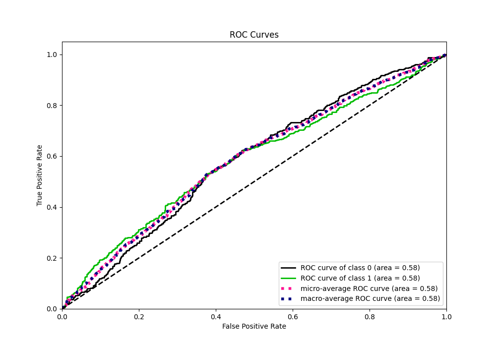

## Kolmogorov-Smirnov Statistic

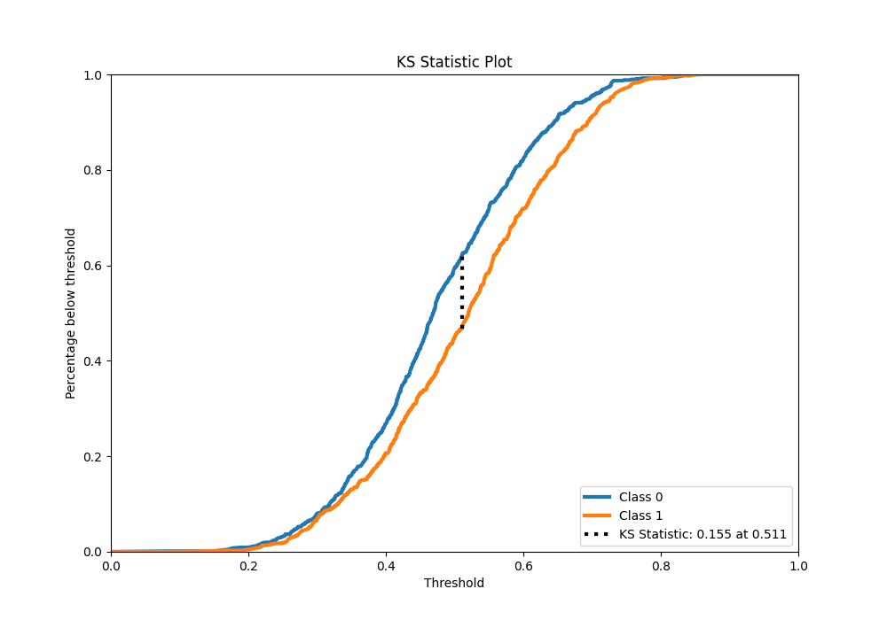

## Precision-Recall Curve

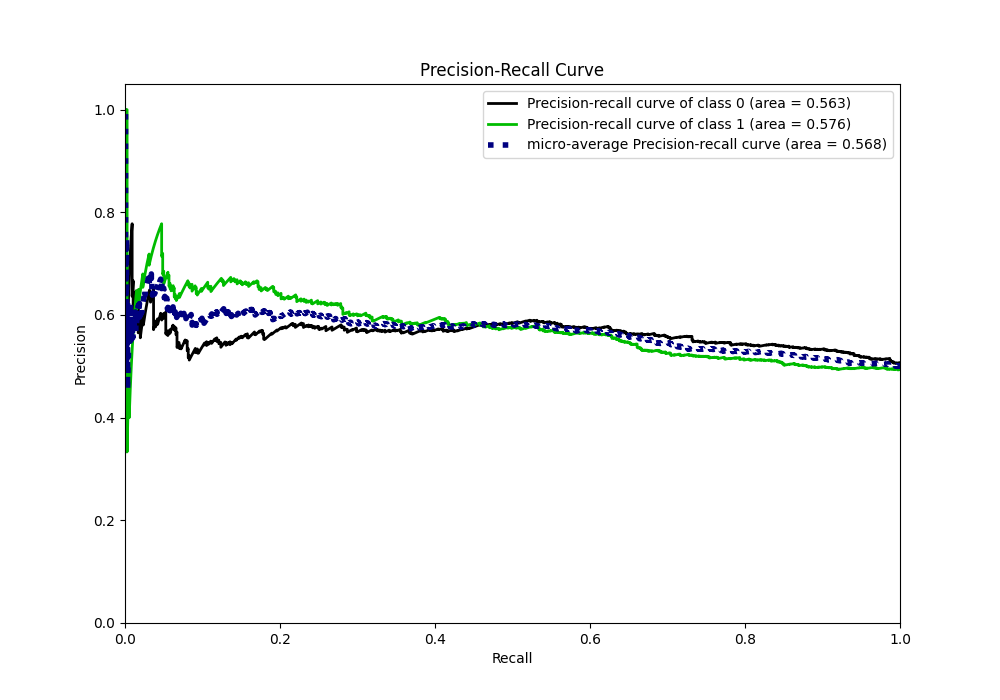

## Calibration Curve

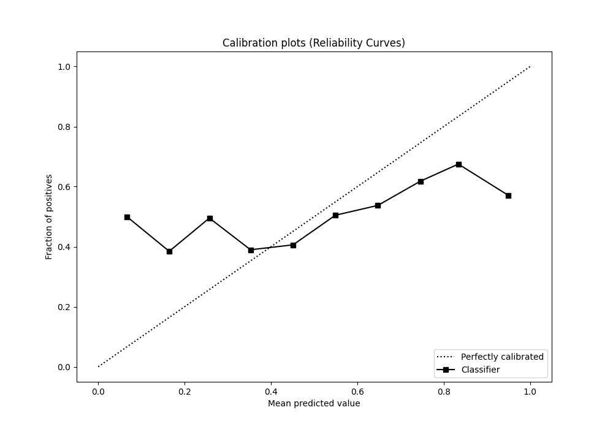

## Cumulative Gains Curve

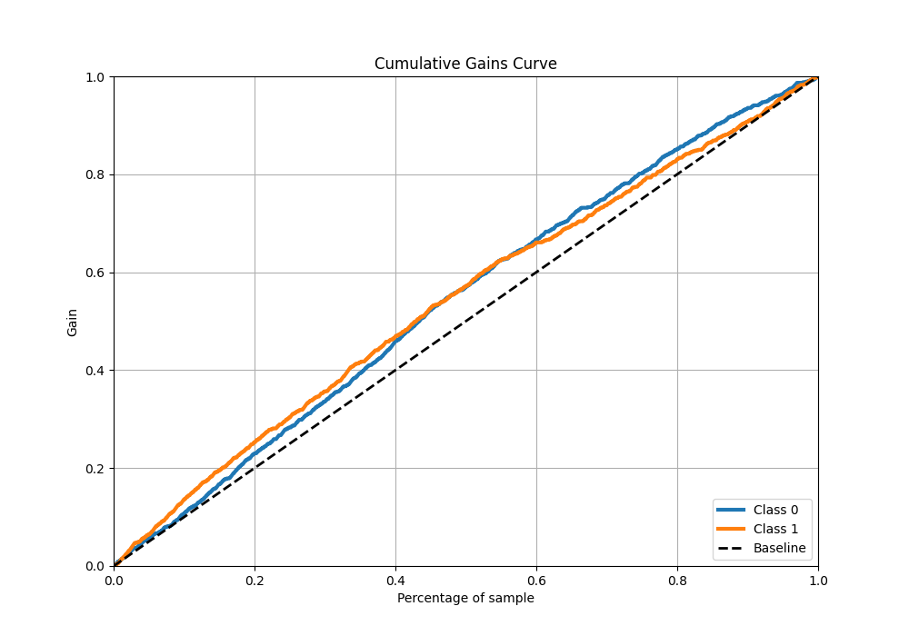

## Lift Curve

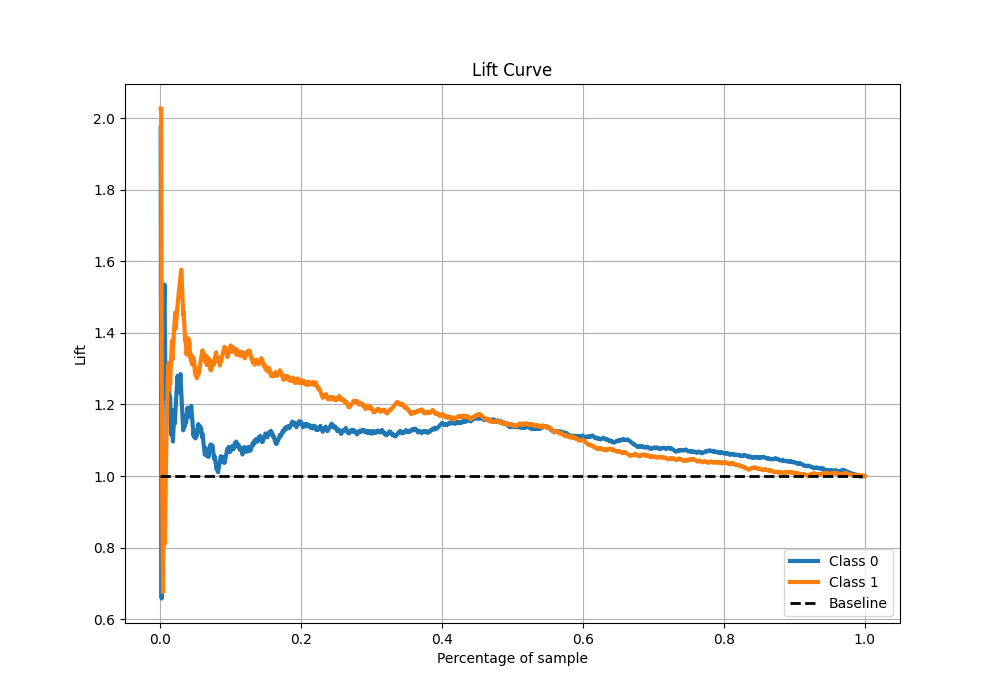

## SHAP Importance

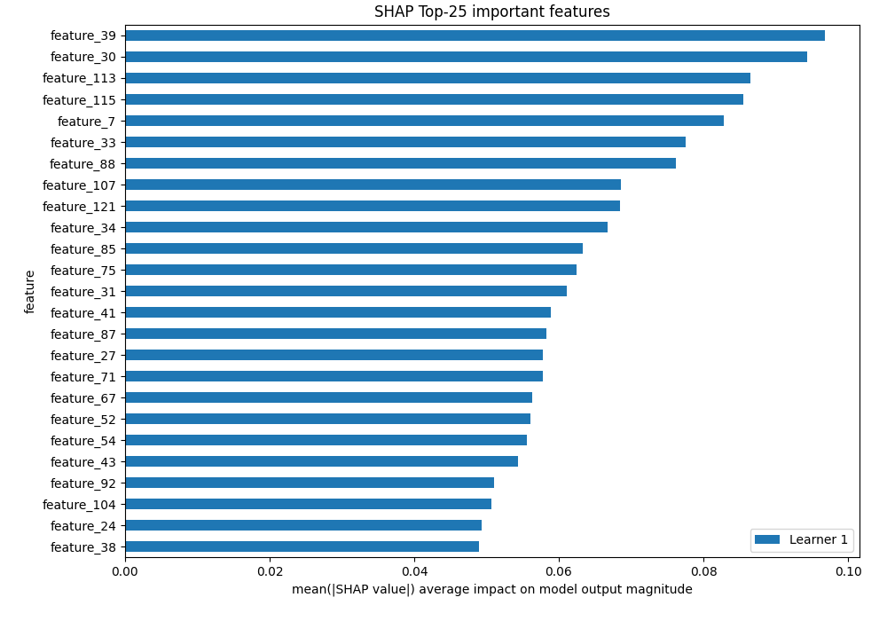

[<< Go back](../README.md)
