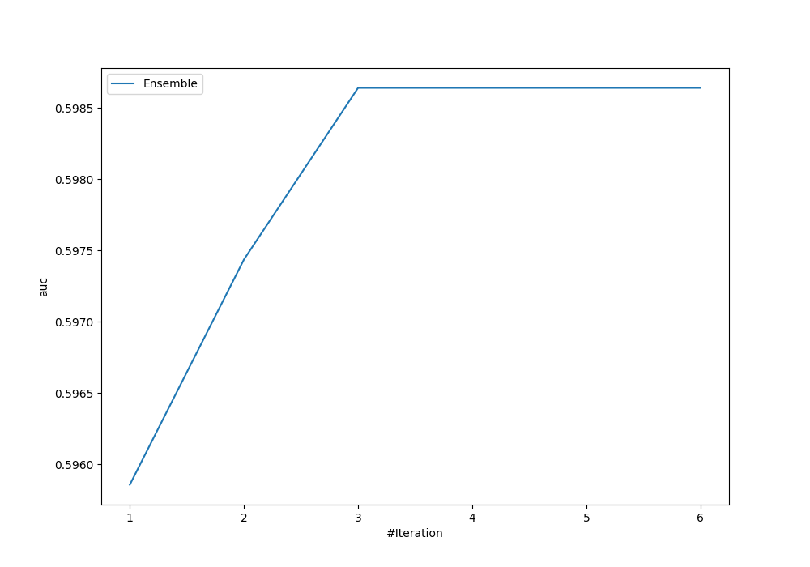
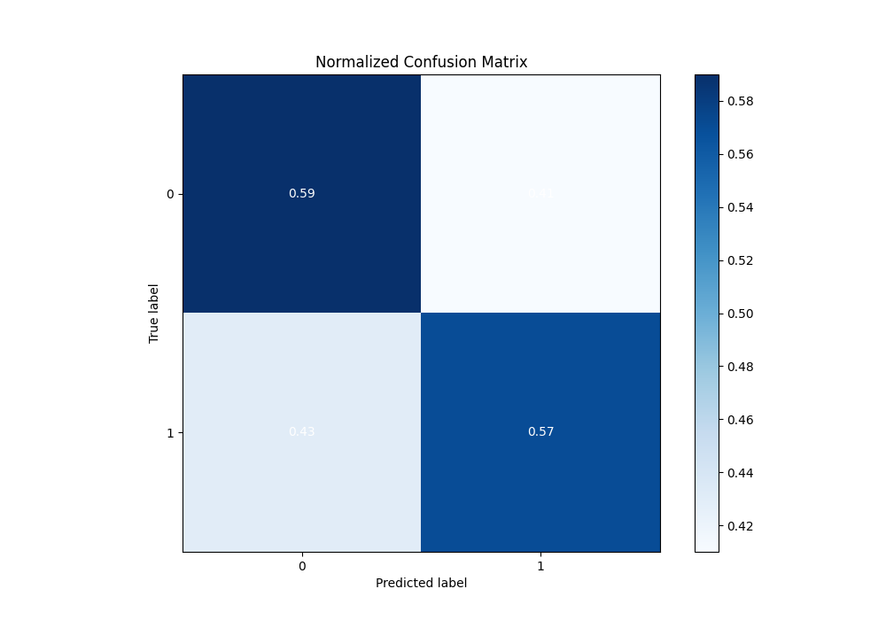
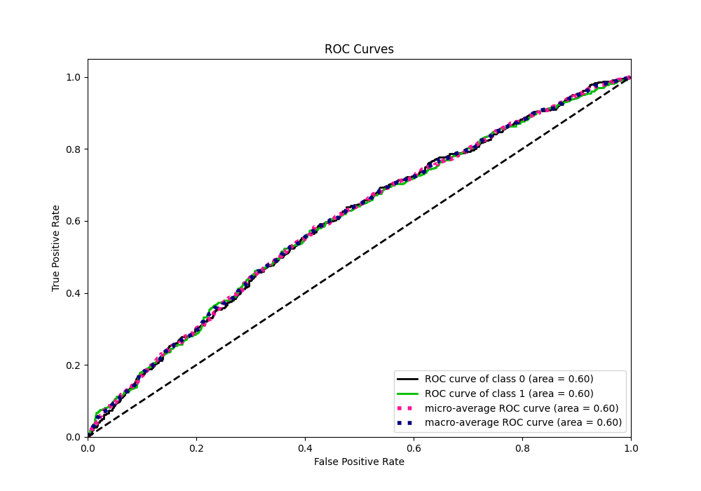
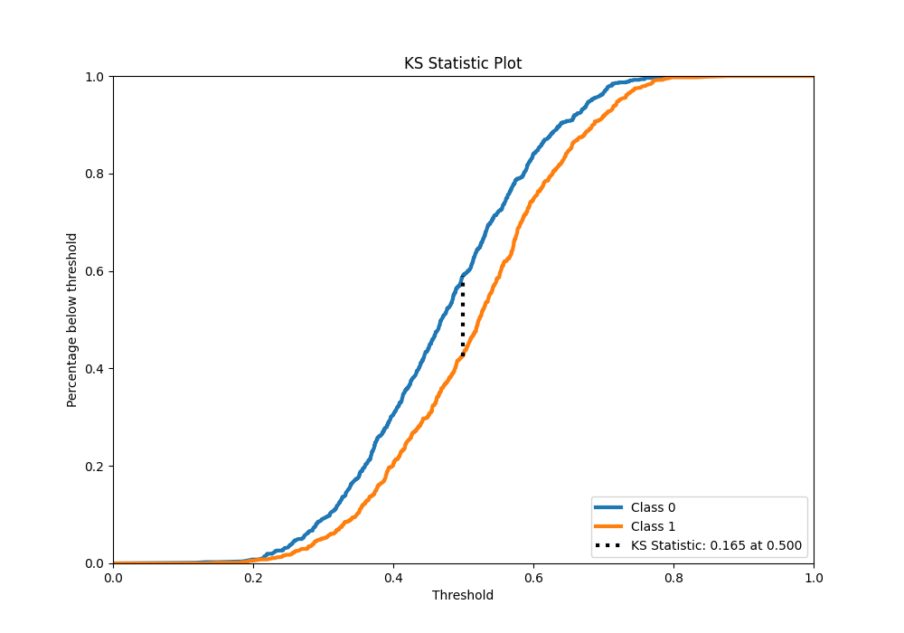
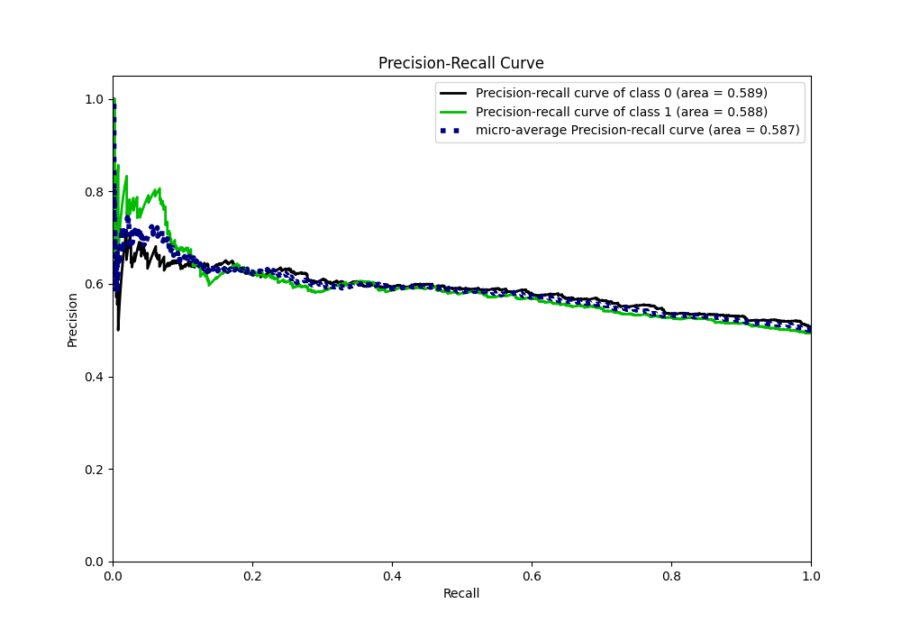
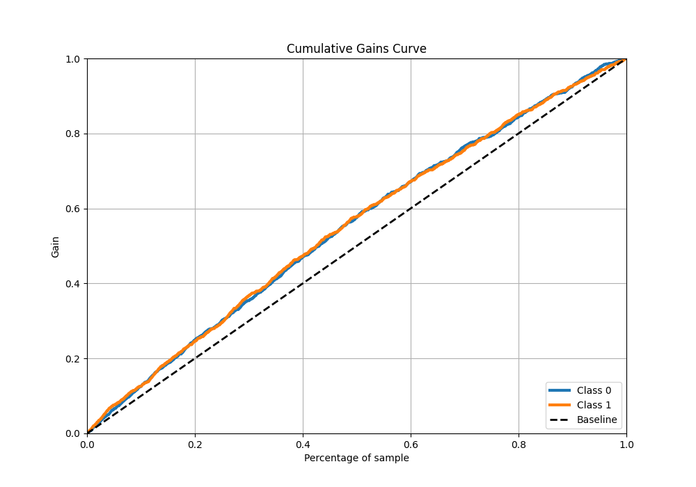
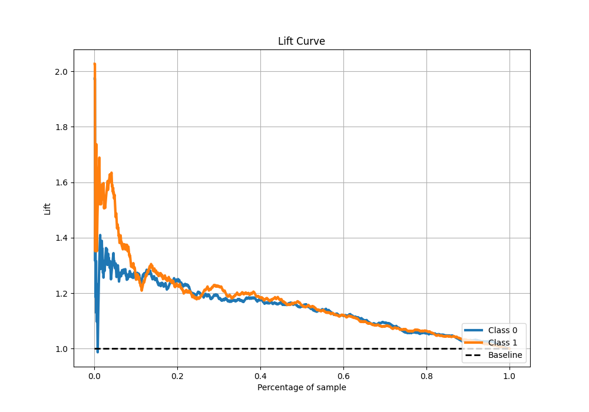

# Summary of Ensemble

[<< Go back](../README.md)

## Ensemble structure

| Model             |   Weight |
|:------------------|---------:|
| 3_Linear          |        2 |
| 4_Default_Xgboost |        1 |

## Metric details

|           |    score |   threshold |
|:----------|---------:|------------:|
| logloss   | 0.682195 |  nan        |
| auc       | 0.59864  |  nan        |
| f1        | 0.661239 |    0.239071 |
| accuracy  | 0.582667 |    0.499564 |
| precision | 0.763158 |    0.733148 |
| recall    | 1        |    0.106754 |
| mcc       | 0.165128 |    0.499564 |

## Metric details with threshold from accuracy metric

|           |    score |   threshold |
|:----------|---------:|------------:|
| logloss   | 0.682195 |  nan        |
| auc       | 0.59864  |  nan        |
| f1        | 0.575881 |    0.499564 |
| accuracy  | 0.582667 |    0.499564 |
| precision | 0.577446 |    0.499564 |
| recall    | 0.574324 |    0.499564 |
| mcc       | 0.165128 |    0.499564 |

## Confusion matrix (at threshold=0.499564)

|              |   Predicted as 0 |   Predicted as 1 |
|:-------------|-----------------:|-----------------:|
| Labeled as 0 |              449 |              311 |
| Labeled as 1 |              315 |              425 |

## Learning curves

## Confusion Matrix

## Normalized Confusion Matrix

## ROC Curve

## Kolmogorov-Smirnov Statistic

## Precision-Recall Curve

## Calibration Curve

## Cumulative Gains Curve

## Lift Curve

[<< Go back](../README.md)
