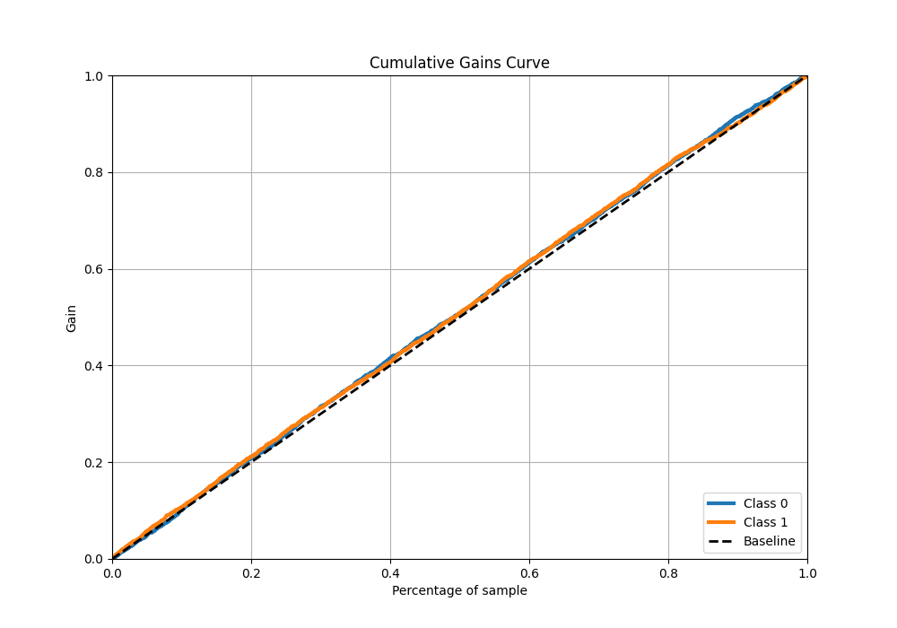

# Summary of 2_DecisionTree

[<< Go back](../README.md)

## Decision Tree
- **n_jobs**: -1
- **criterion**: gini
- **max_depth**: 3
- **explain_level**: 2

## Validation

- **validation_type**: split
- **train_ratio**: 0.75
- **shuffle**: True
- **stratify**: True

## Optimized metric

auc

## Training time

7.0 seconds

## Metric details

|           |     score |   threshold |
|:----------|----------:|------------:|
| logloss   | 0.694754  |  nan        |
| auc       | 0.51616   |  nan        |
| f1        | 0.657266  |    0.31903  |
| accuracy  | 0.517211  |    0.529372 |
| precision | 0.621622  |    0.535765 |
| recall    | 1         |    0.31903  |
| mcc       | 0.0281982 |    0.465613 |

## Metric details with threshold from accuracy metric

|           |     score |   threshold |
|:----------|----------:|------------:|
| logloss   | 0.694754  |  nan        |
| auc       | 0.51616   |  nan        |
| f1        | 0.378053  |    0.529372 |
| accuracy  | 0.517211  |    0.529372 |
| precision | 0.511699  |    0.529372 |
| recall    | 0.299762  |    0.529372 |
| mcc       | 0.0281597 |    0.529372 |

## Confusion matrix (at threshold=0.529372)

|              |   Predicted as 0 |   Predicted as 1 |
|:-------------|-----------------:|-----------------:|
| Labeled as 0 |             1270 |              480 |
| Labeled as 1 |             1175 |              503 |

## Learning curves

## Permutation-based Importance

## Confusion Matrix

## Normalized Confusion Matrix

## ROC Curve

## Kolmogorov-Smirnov Statistic

## Precision-Recall Curve

## Calibration Curve

## Cumulative Gains Curve

## Lift Curve

## SHAP Importance

[<< Go back](../README.md)
