# Summary of 3_Default_LightGBM

[<< Go back](../README.md)

## LightGBM

- **n_jobs**: -1
- **objective**: binary
- **num_leaves**: 63
- **learning_rate**: 0.05
- **feature_fraction**: 0.9
- **bagging_fraction**: 0.9
- **min_data_in_leaf**: 10
- **metric**: auc
- **custom_eval_metric_name**: None
- **explain_level**: 2

## Validation

- **validation_type**: split
- **train_ratio**: 0.75
- **shuffle**: True
- **stratify**: True

## Optimized metric

auc

## Training time

2.3 seconds

## Metric details

|           |     score |   threshold |
|:----------|----------:|------------:|
| logloss   | 0.690965  |  nan        |
| auc       | 0.5369    |  nan        |
| f1        | 0.657266  |    0.344372 |
| accuracy  | 0.541132  |    0.501621 |
| precision | 0.614907  |    0.533716 |
| recall    | 1         |    0.344372 |
| mcc       | 0.0801263 |    0.501621 |

## Metric details with threshold from accuracy metric

|           |     score |   threshold |
|:----------|----------:|------------:|
| logloss   | 0.690965  |  nan        |
| auc       | 0.5369    |  nan        |
| f1        | 0.431925  |    0.501621 |
| accuracy  | 0.541132  |    0.501621 |
| precision | 0.548121  |    0.501621 |
| recall    | 0.356377  |    0.501621 |
| mcc       | 0.0801263 |    0.501621 |

## Confusion matrix (at threshold=0.501621)

|              |   Predicted as 0 |   Predicted as 1 |
|:-------------|-----------------:|-----------------:|
| Labeled as 0 |             1257 |              493 |
| Labeled as 1 |             1080 |              598 |

## Learning curves

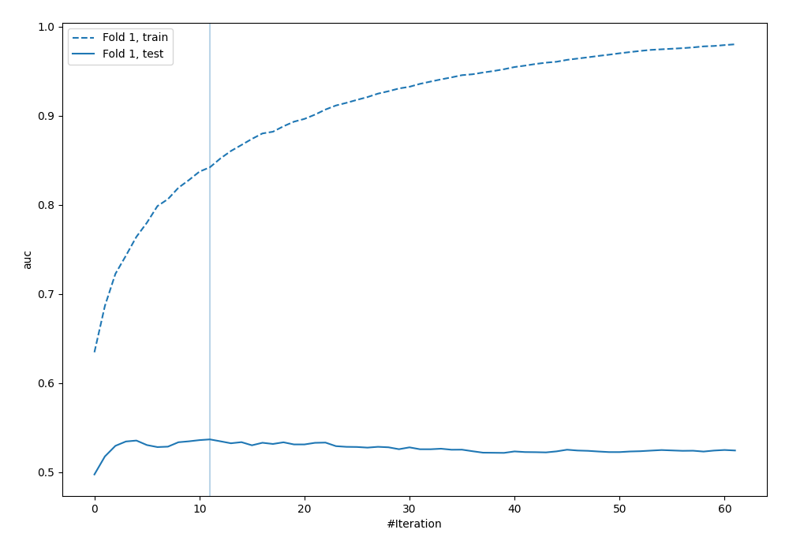

## Permutation-based Importance

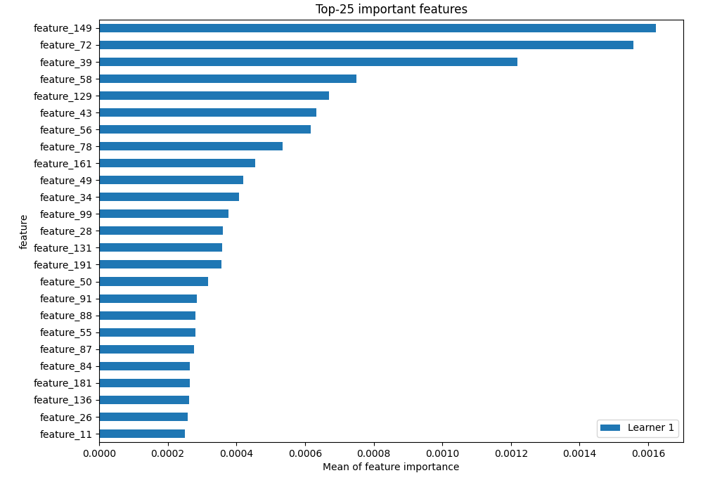

## Confusion Matrix

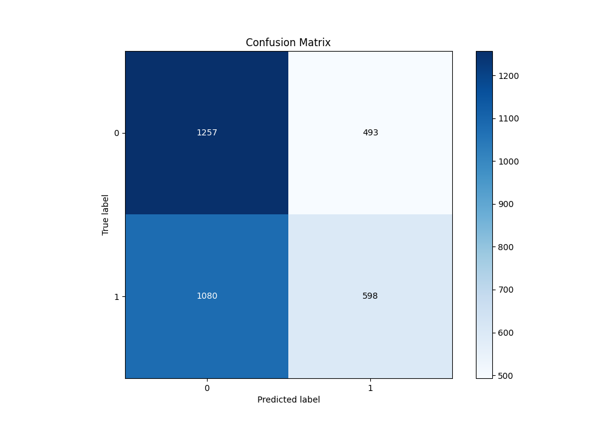

## Normalized Confusion Matrix

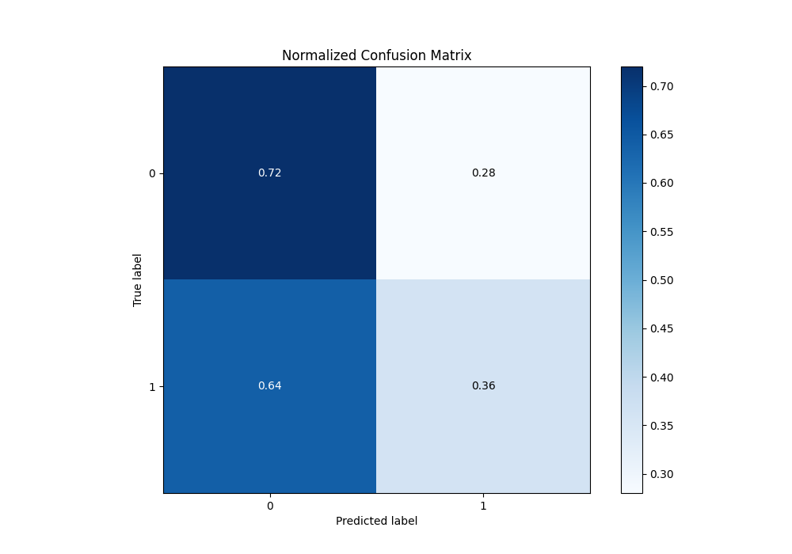

## ROC Curve

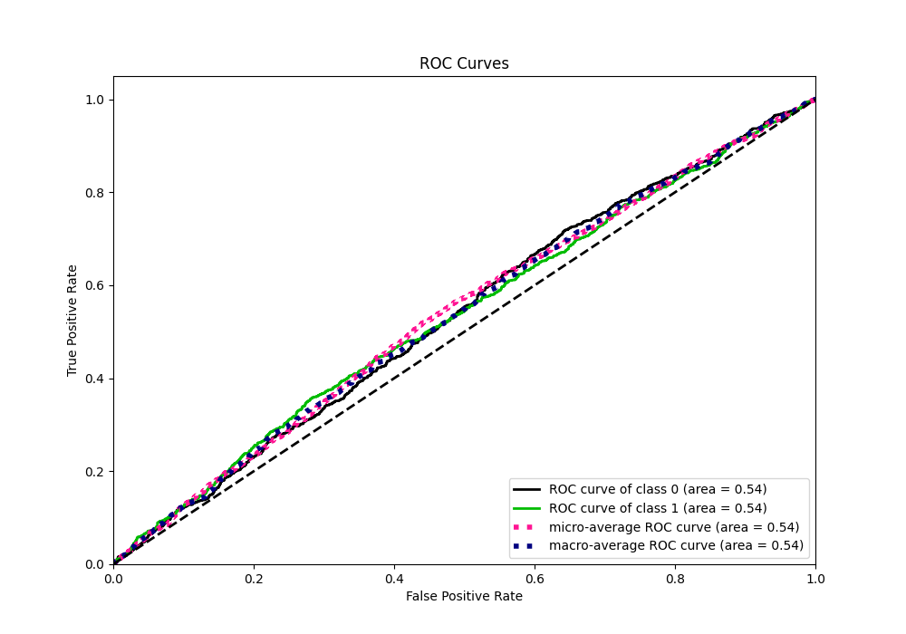

## Kolmogorov-Smirnov Statistic

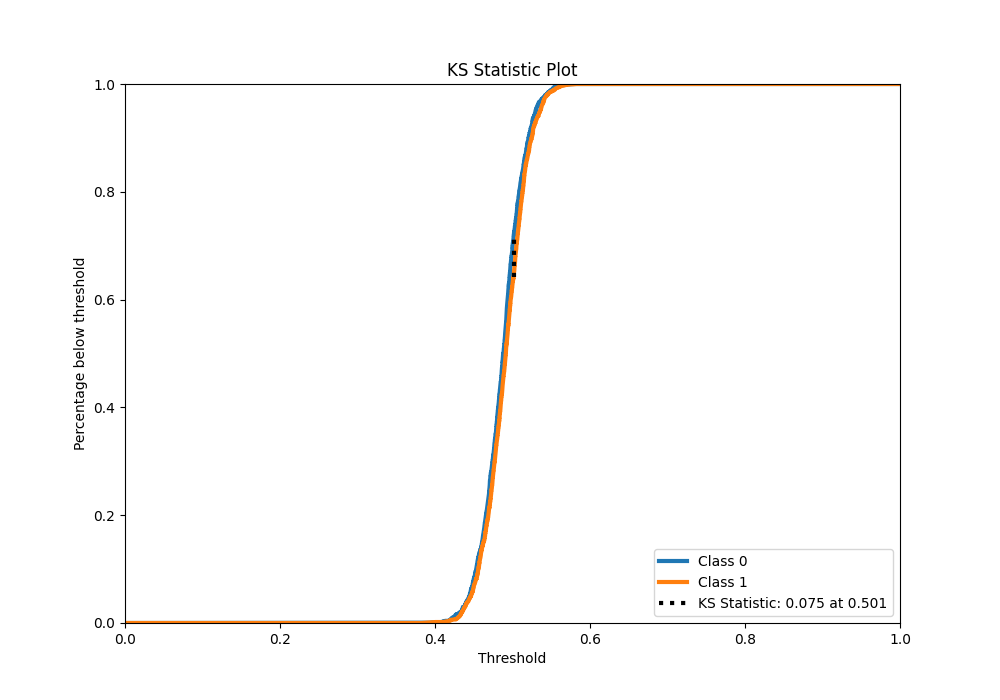

## Precision-Recall Curve

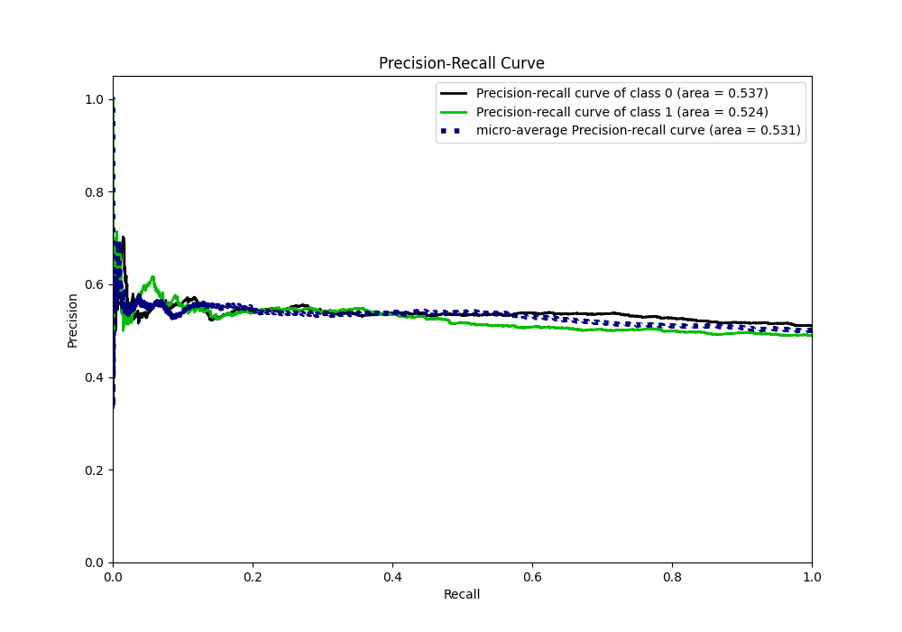

## Calibration Curve

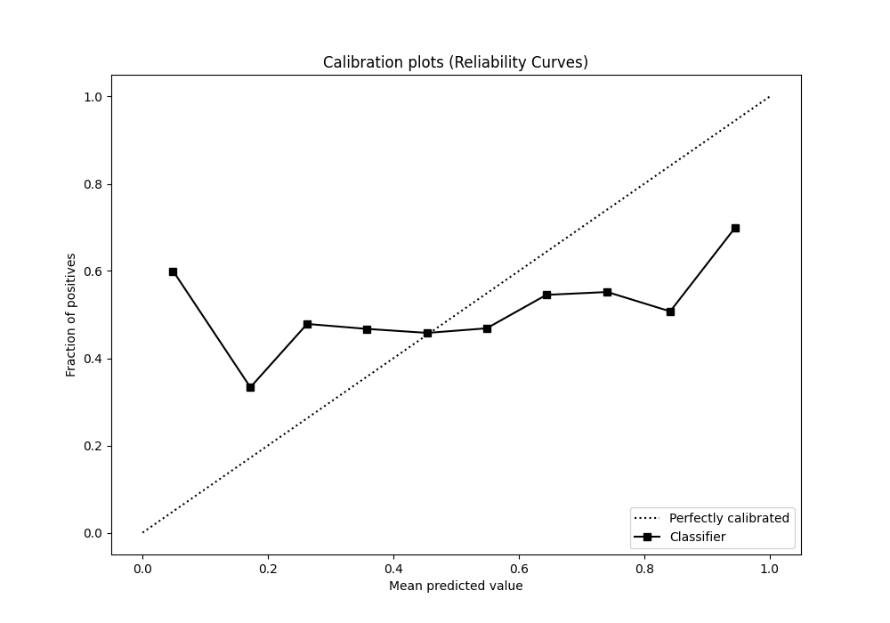

## Cumulative Gains Curve

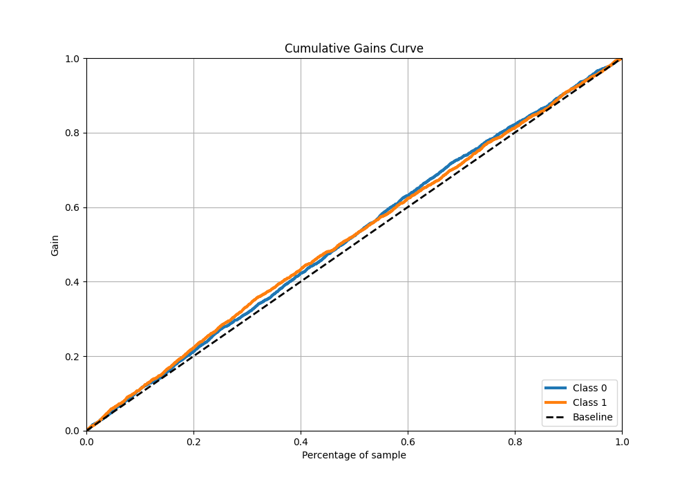

## Lift Curve

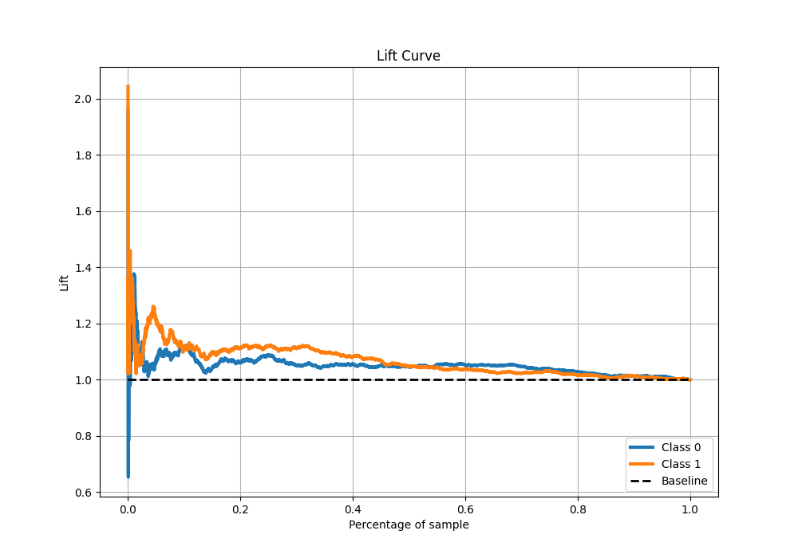

## SHAP Importance

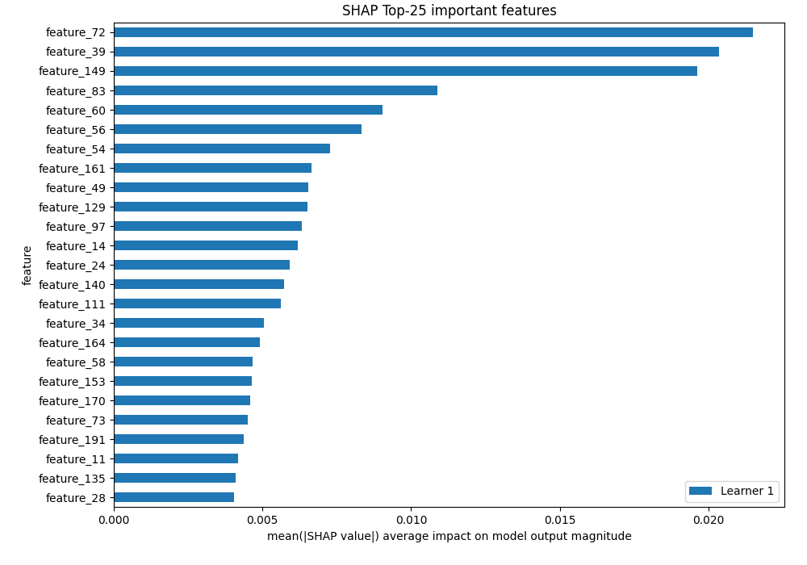

[<< Go back](../README.md)
