# Summary of 3_Default_Xgboost

[<< Go back](../README.md)

## Extreme Gradient Boosting (Xgboost)

- **n_jobs**: -1
- **objective**: binary:logistic
- **eta**: 0.075
- **max_depth**: 6
- **min_child_weight**: 1
- **subsample**: 1.0
- **colsample_bytree**: 1.0
- **eval_metric**: auc
- **explain_level**: 2

## Validation

- **validation_type**: split
- **train_ratio**: 0.75
- **shuffle**: True
- **stratify**: True

## Optimized metric

auc

## Training time

117.6 seconds

## Metric details

|           |    score |   threshold |
|:----------|---------:|------------:|
| logloss   | 0.618321 | nan         |
| auc       | 0.714733 | nan         |
| f1        | 0.677241 |   0.357906  |
| accuracy  | 0.671237 |   0.589947  |
| precision | 0.825806 |   0.793823  |
| recall    | 1        |   0.0822012 |
| mcc       | 0.362819 |   0.589947  |

## Metric details with threshold from accuracy metric

|           |    score |   threshold |
|:----------|---------:|------------:|
| logloss   | 0.618321 |  nan        |
| auc       | 0.714733 |  nan        |
| f1        | 0.586725 |    0.589947 |
| accuracy  | 0.671237 |    0.589947 |
| precision | 0.762631 |    0.589947 |
| recall    | 0.476758 |    0.589947 |
| mcc       | 0.362819 |    0.589947 |

## Confusion matrix (at threshold=0.589947)

|              |   Predicted as 0 |   Predicted as 1 |
|:-------------|-----------------:|-----------------:|
| Labeled as 0 |             1501 |              249 |
| Labeled as 1 |              878 |              800 |

## Learning curves

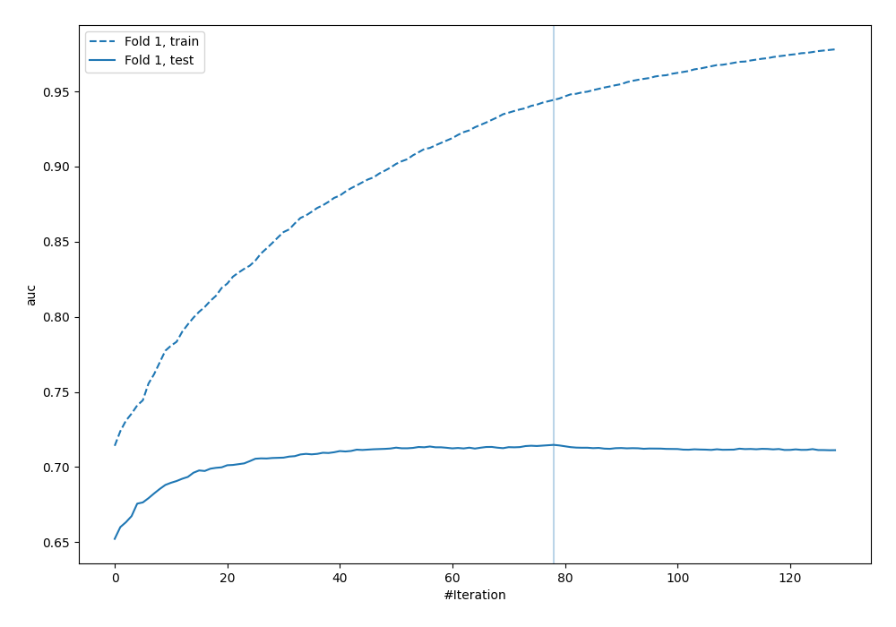

## Permutation-based Importance

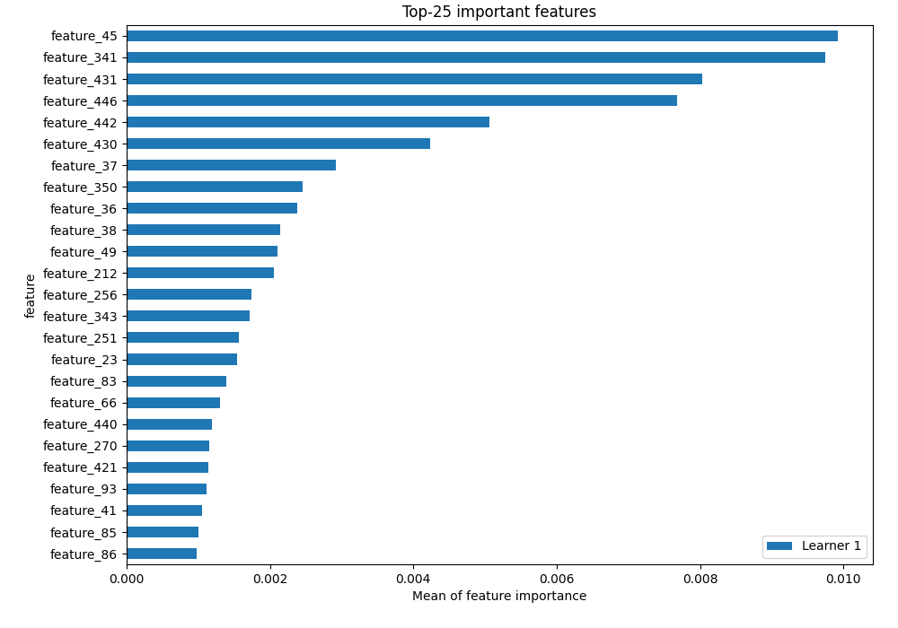

## Confusion Matrix

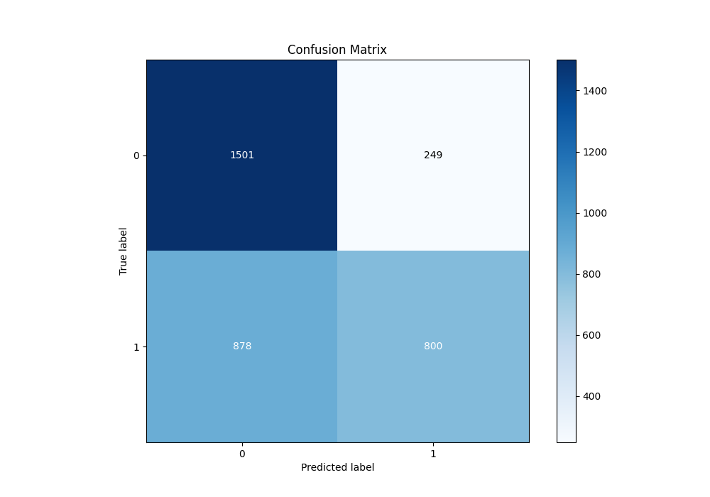

## Normalized Confusion Matrix

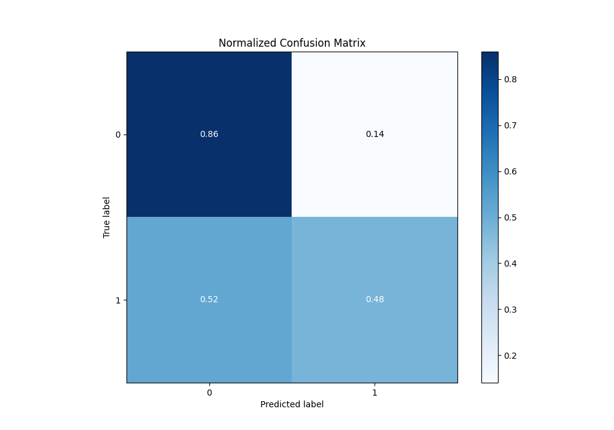

## ROC Curve

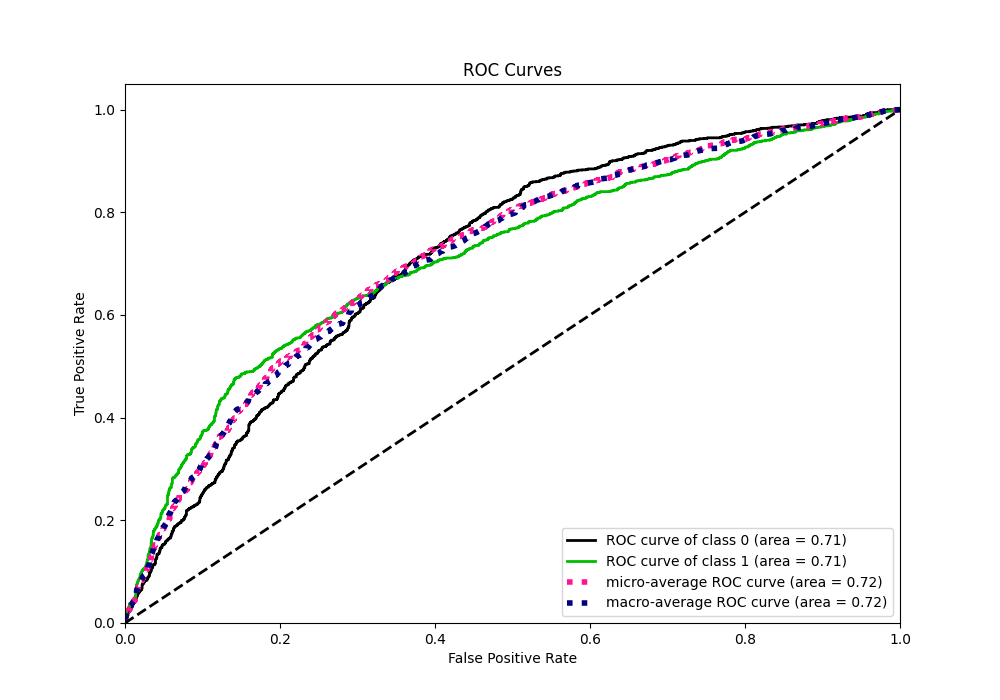

## Kolmogorov-Smirnov Statistic

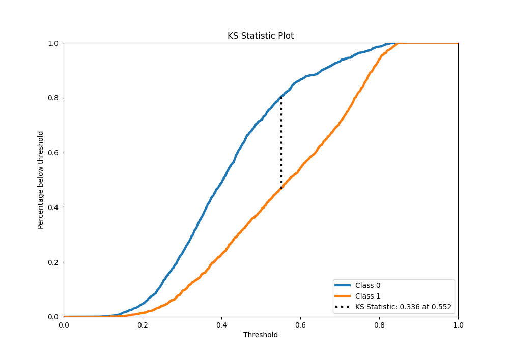

## Precision-Recall Curve

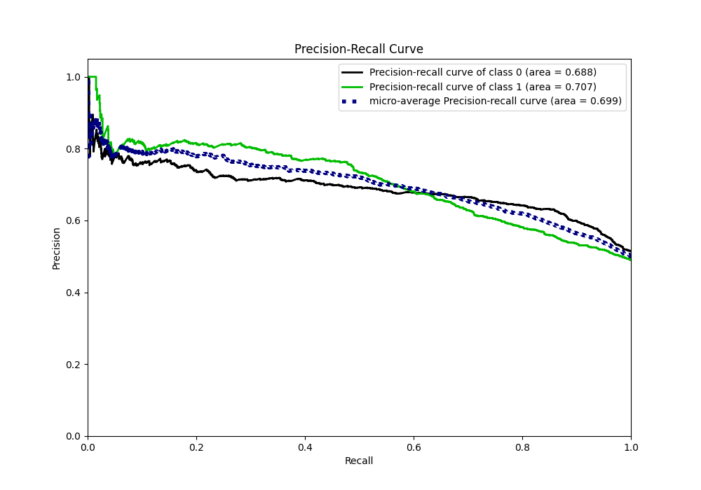

## Calibration Curve

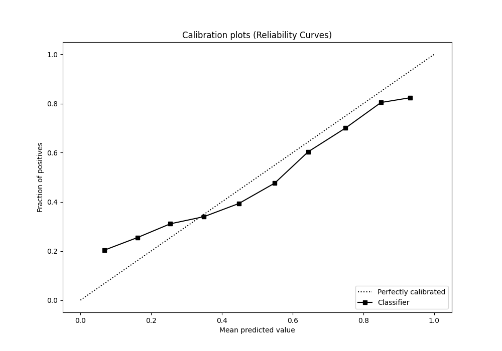

## Cumulative Gains Curve

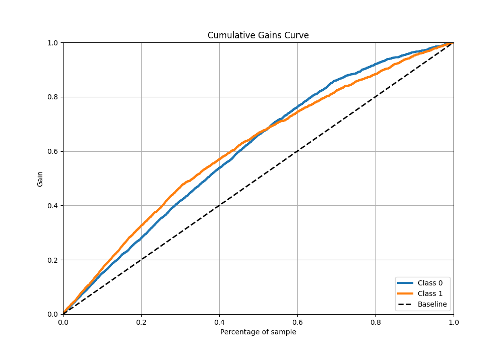

## Lift Curve

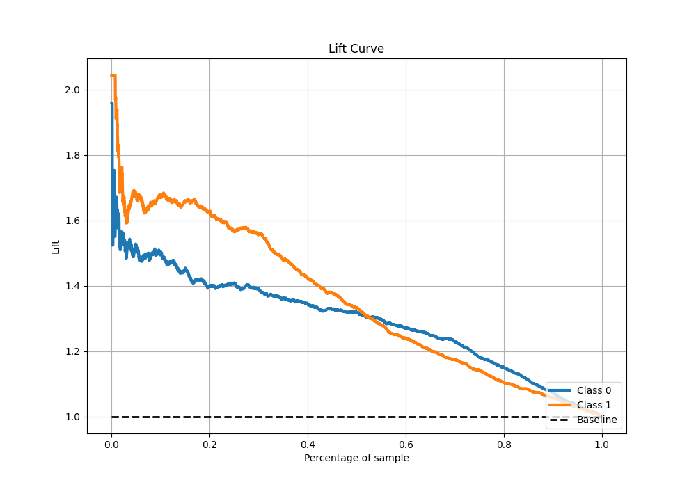

## SHAP Importance

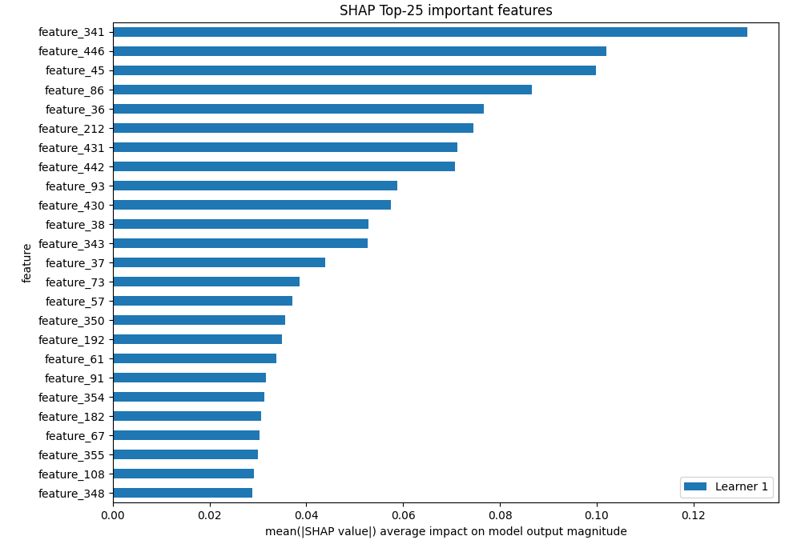

[<< Go back](../README.md)
