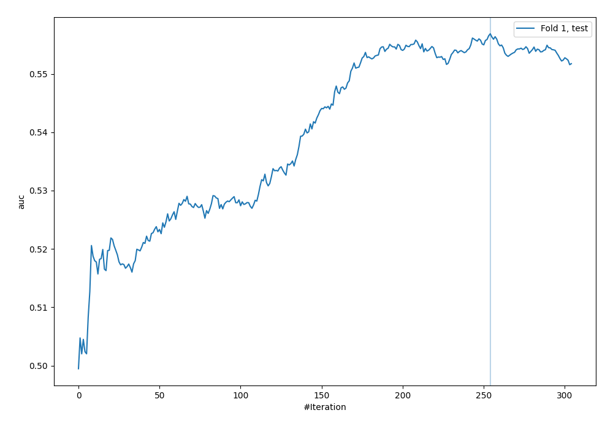

# Summary of 5_Default_CatBoost

[<< Go back](../README.md)

## CatBoost

- **n_jobs**: -1
- **learning_rate**: 0.1
- **depth**: 6
- **rsm**: 1
- **loss_function**: Logloss
- **eval_metric**: AUC
- **explain_level**: 2

## Validation

- **validation_type**: split
- **train_ratio**: 0.75
- **shuffle**: True
- **stratify**: True

## Optimized metric

auc

## Training time

7.7 seconds

## Metric details

|           |     score |   threshold |
|:----------|----------:|------------:|
| logloss   | 0.69495   |  nan        |
| auc       | 0.55687   |  nan        |
| f1        | 0.657266  |    0.120183 |
| accuracy  | 0.548716  |    0.502599 |
| precision | 0.578947  |    0.681924 |
| recall    | 1         |    0.120183 |
| mcc       | 0.0962618 |    0.460723 |

## Metric details with threshold from accuracy metric

|           |     score |   threshold |
|:----------|----------:|------------:|
| logloss   | 0.69495   |  nan        |
| auc       | 0.55687   |  nan        |
| f1        | 0.520012  |    0.502599 |
| accuracy  | 0.548716  |    0.502599 |
| precision | 0.542395  |    0.502599 |
| recall    | 0.499404  |    0.502599 |
| mcc       | 0.0958501 |    0.502599 |

## Confusion matrix (at threshold=0.502599)

|              |   Predicted as 0 |   Predicted as 1 |
|:-------------|-----------------:|-----------------:|
| Labeled as 0 |             1043 |              707 |
| Labeled as 1 |              840 |              838 |

## Learning curves

## Permutation-based Importance

## Confusion Matrix

## Normalized Confusion Matrix

## ROC Curve

## Kolmogorov-Smirnov Statistic

## Precision-Recall Curve

## Calibration Curve

## Cumulative Gains Curve

## Lift Curve

[<< Go back](../README.md)
