# Summary of 7_Default_RandomForest

[<< Go back](../README.md)

## Random Forest

- **n_jobs**: -1
- **criterion**: gini
- **max_features**: 0.9
- **min_samples_split**: 30
- **max_depth**: 4
- **eval_metric_name**: auc
- **explain_level**: 2

## Validation

- **validation_type**: split
- **train_ratio**: 0.75
- **shuffle**: True
- **stratify**: True

## Optimized metric

auc

## Training time

13.8 seconds

## Metric details

|           |     score |   threshold |
|:----------|----------:|------------:|
| logloss   | 0.691282  |  nan        |
| auc       | 0.533887  |  nan        |
| f1        | 0.657266  |    0.379034 |
| accuracy  | 0.53063   |    0.496192 |
| precision | 0.545156  |    0.509073 |
| recall    | 1         |    0.379034 |
| mcc       | 0.0579182 |    0.496192 |

## Metric details with threshold from accuracy metric

|           |     score |   threshold |
|:----------|----------:|------------:|
| logloss   | 0.691282  |  nan        |
| auc       | 0.533887  |  nan        |
| f1        | 0.459886  |    0.496192 |
| accuracy  | 0.53063   |    0.496192 |
| precision | 0.526518  |    0.496192 |
| recall    | 0.408224  |    0.496192 |
| mcc       | 0.0579182 |    0.496192 |

## Confusion matrix (at threshold=0.496192)

|              |   Predicted as 0 |   Predicted as 1 |
|:-------------|-----------------:|-----------------:|
| Labeled as 0 |             1134 |              616 |
| Labeled as 1 |              993 |              685 |

## Learning curves

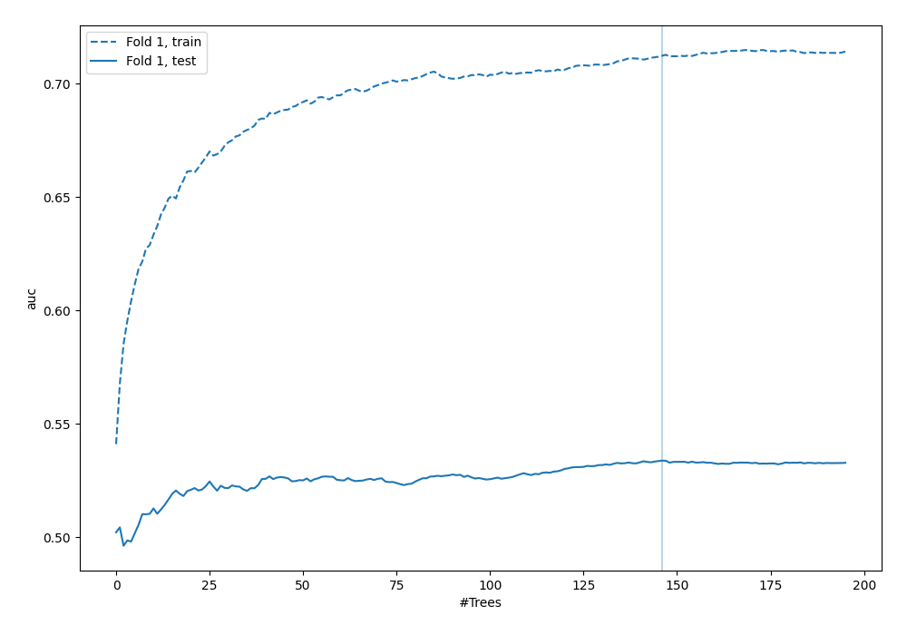

## Permutation-based Importance

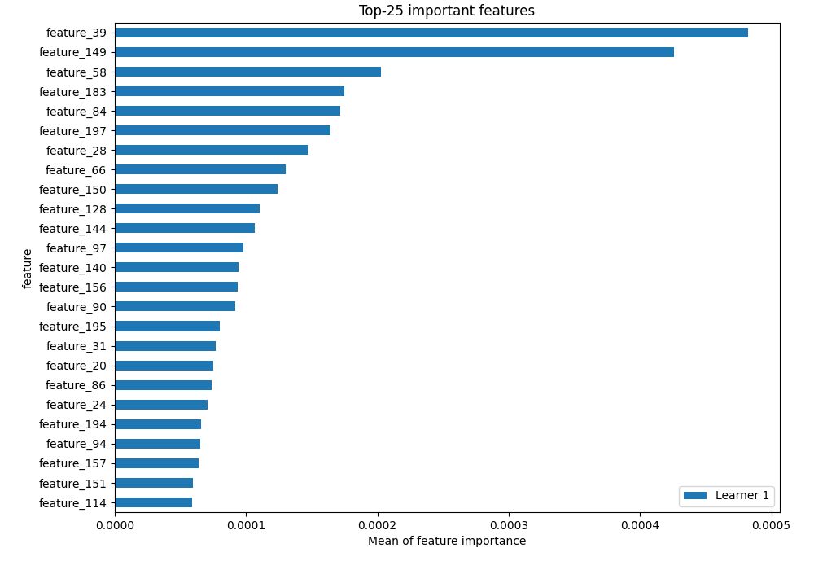

## Confusion Matrix

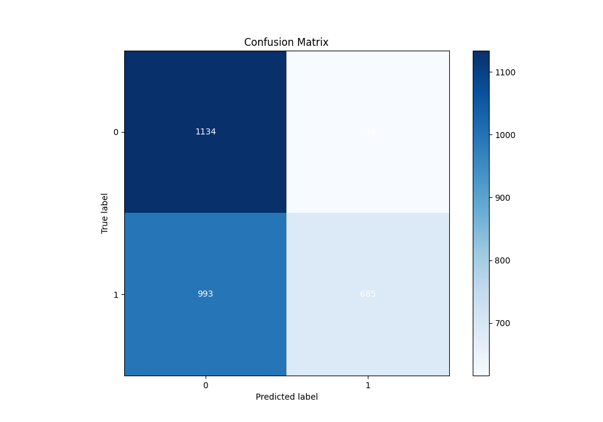

## Normalized Confusion Matrix

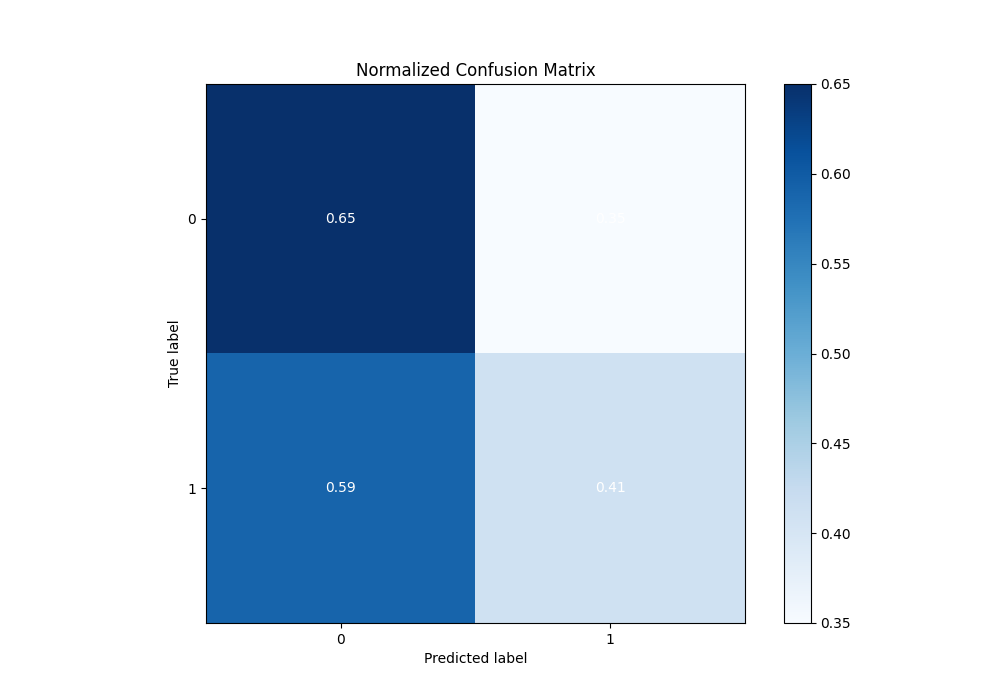

## ROC Curve

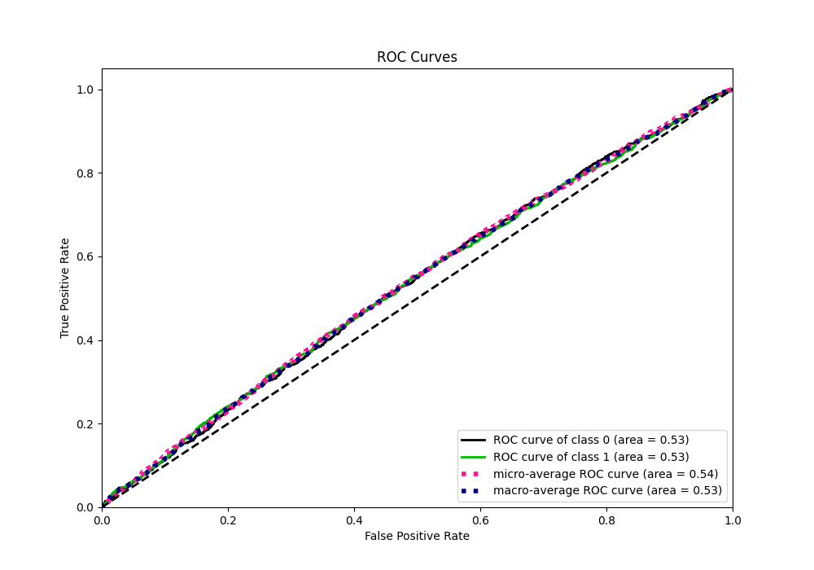

## Kolmogorov-Smirnov Statistic

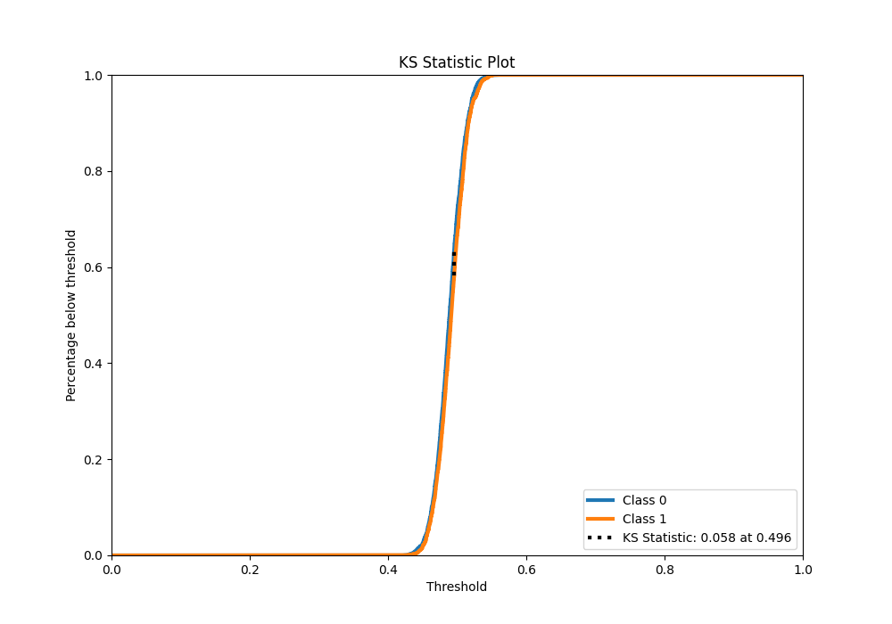

## Precision-Recall Curve

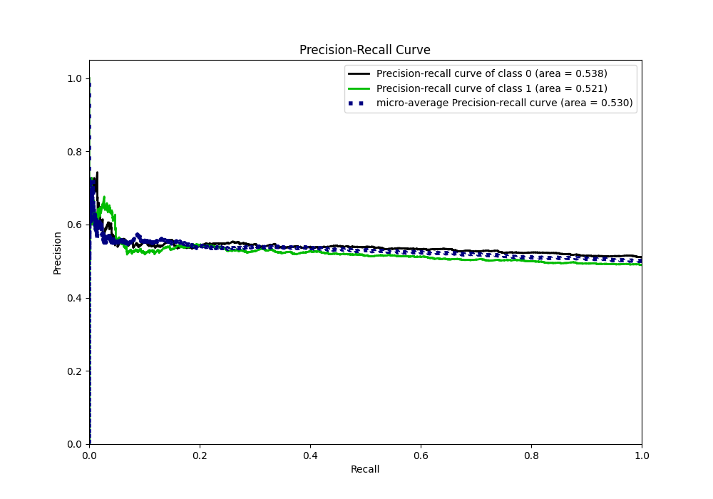

## Calibration Curve

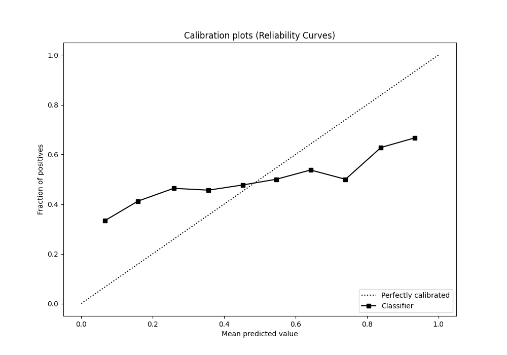

## Cumulative Gains Curve

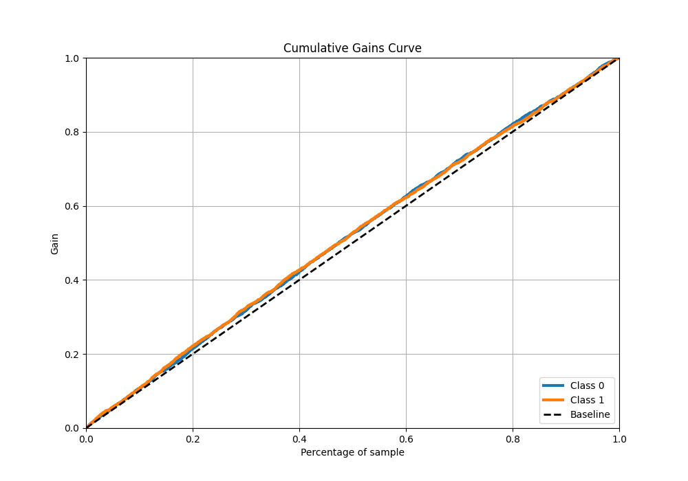

## Lift Curve

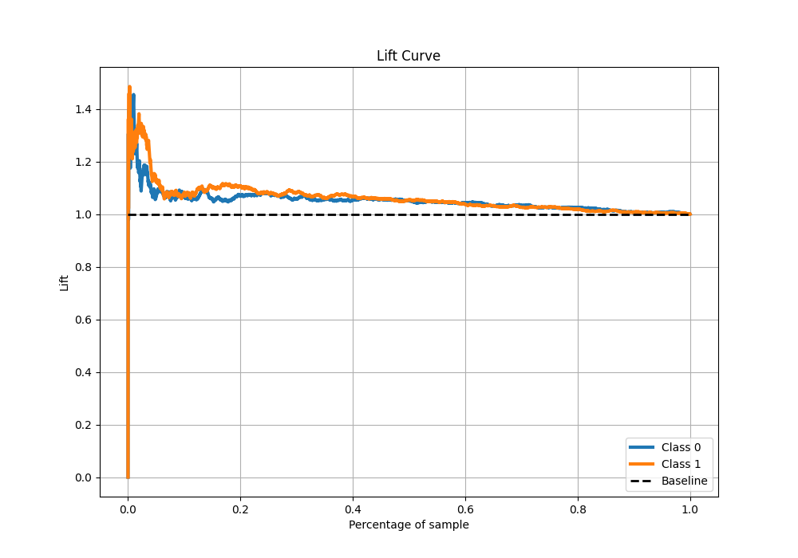

## SHAP Importance

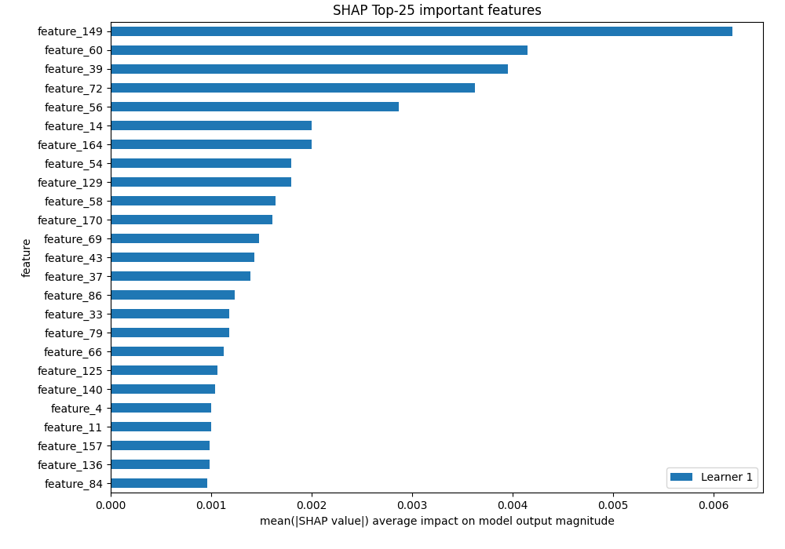

[<< Go back](../README.md)
