# Summary of 8_Default_ExtraTrees

[<< Go back](../README.md)

## Extra Trees Classifier (Extra Trees)

- **n_jobs**: -1
- **criterion**: gini
- **max_features**: 0.9
- **min_samples_split**: 30
- **max_depth**: 4
- **eval_metric_name**: auc
- **explain_level**: 2

## Validation

- **validation_type**: split
- **train_ratio**: 0.75
- **shuffle**: True
- **stratify**: True

## Optimized metric

auc

## Training time

9.7 seconds

## Metric details

|           |     score |   threshold |
|:----------|----------:|------------:|
| logloss   | 0.691503  |  nan        |
| auc       | 0.531959  |  nan        |
| f1        | 0.657266  |    0.339889 |
| accuracy  | 0.526838  |    0.513933 |
| precision | 0.54902   |    0.524412 |
| recall    | 1         |    0.339889 |
| mcc       | 0.0563493 |    0.485714 |

## Metric details with threshold from accuracy metric

|           |     score |   threshold |
|:----------|----------:|------------:|
| logloss   | 0.691503  |  nan        |
| auc       | 0.531959  |  nan        |
| f1        | 0.323603  |    0.513933 |
| accuracy  | 0.526838  |    0.513933 |
| precision | 0.538889  |    0.513933 |
| recall    | 0.231228  |    0.513933 |
| mcc       | 0.0509463 |    0.513933 |

## Confusion matrix (at threshold=0.513933)

|              |   Predicted as 0 |   Predicted as 1 |
|:-------------|-----------------:|-----------------:|
| Labeled as 0 |             1418 |              332 |
| Labeled as 1 |             1290 |              388 |

## Learning curves

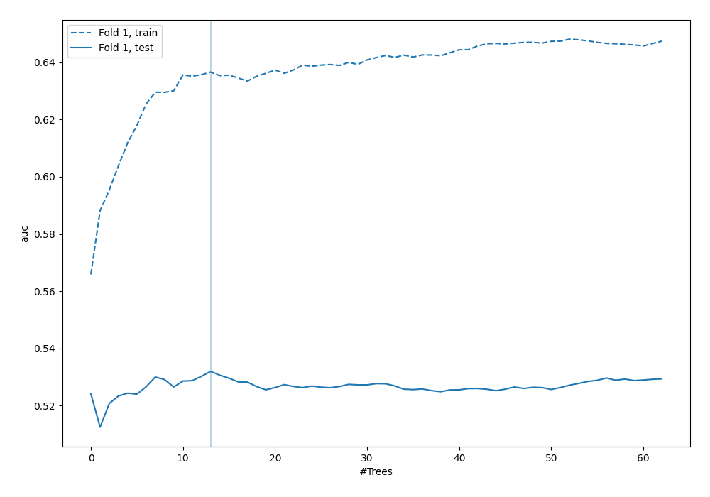

## Permutation-based Importance

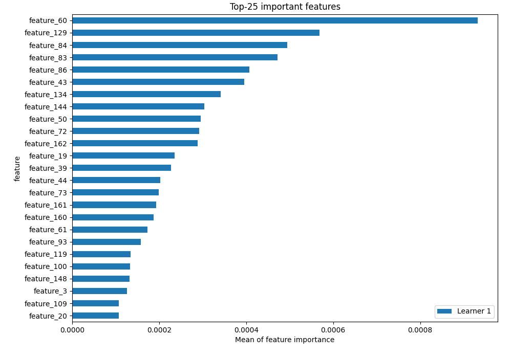

## Confusion Matrix

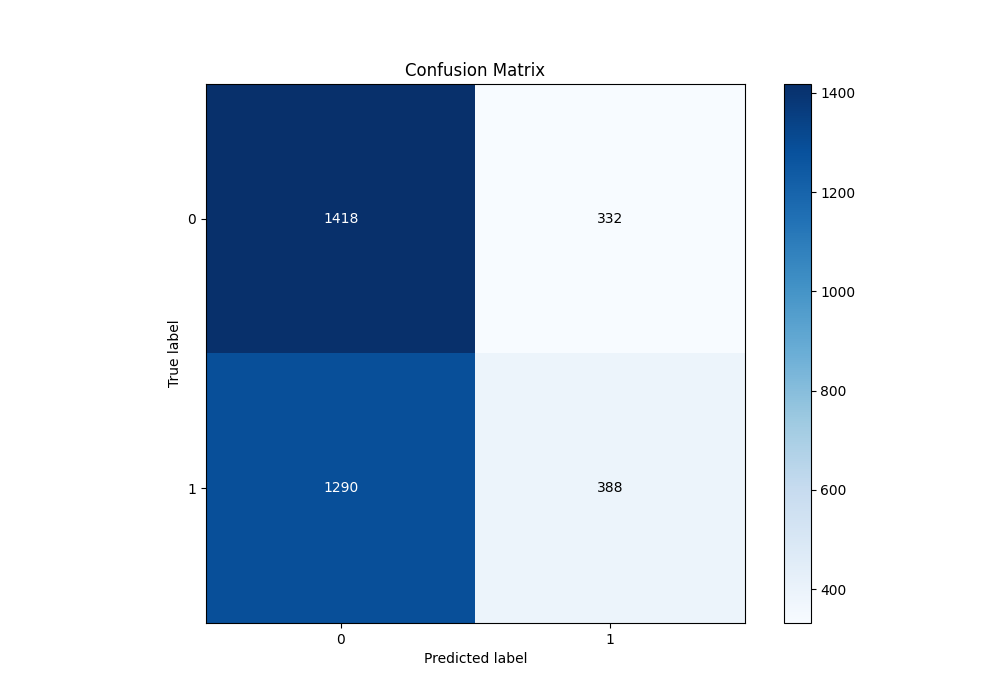

## Normalized Confusion Matrix

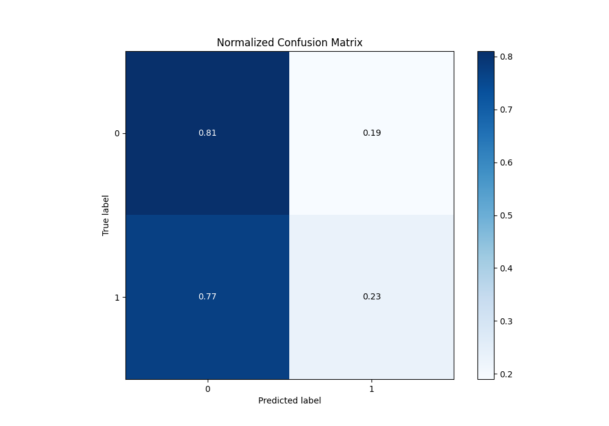

## ROC Curve

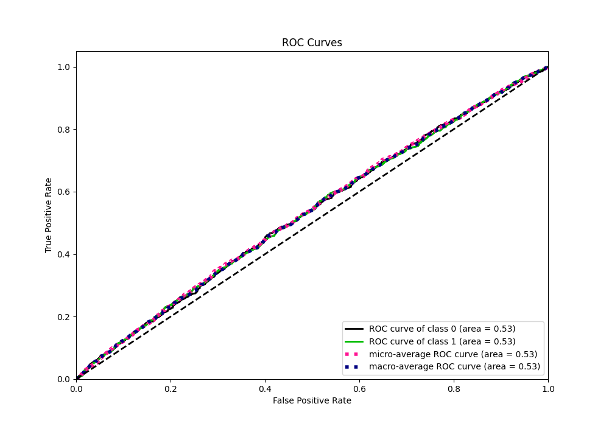

## Kolmogorov-Smirnov Statistic

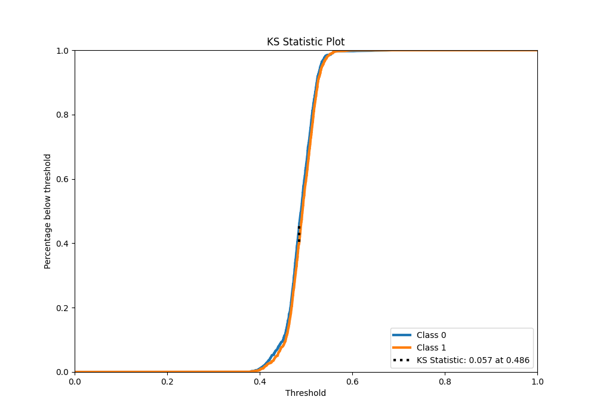

## Precision-Recall Curve

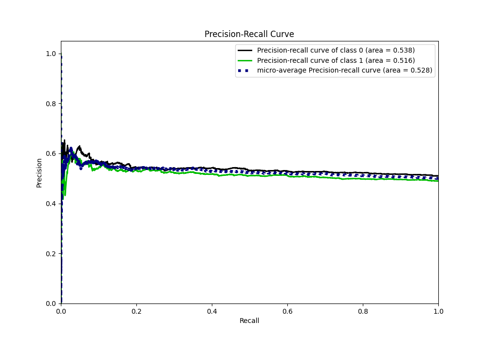

## Calibration Curve

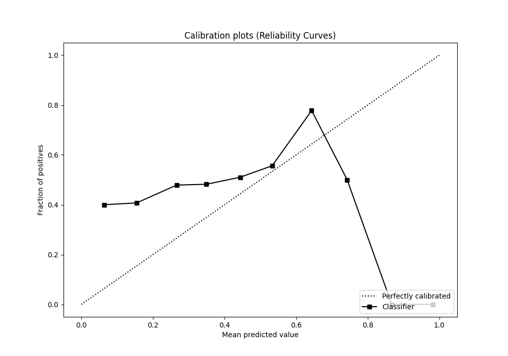

## Cumulative Gains Curve

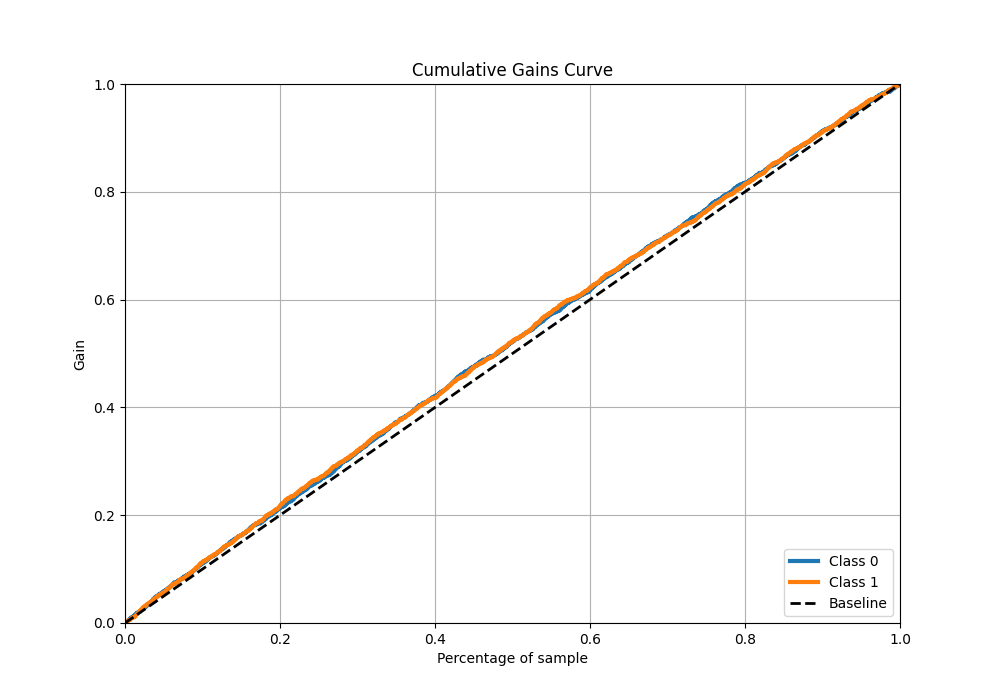

## Lift Curve

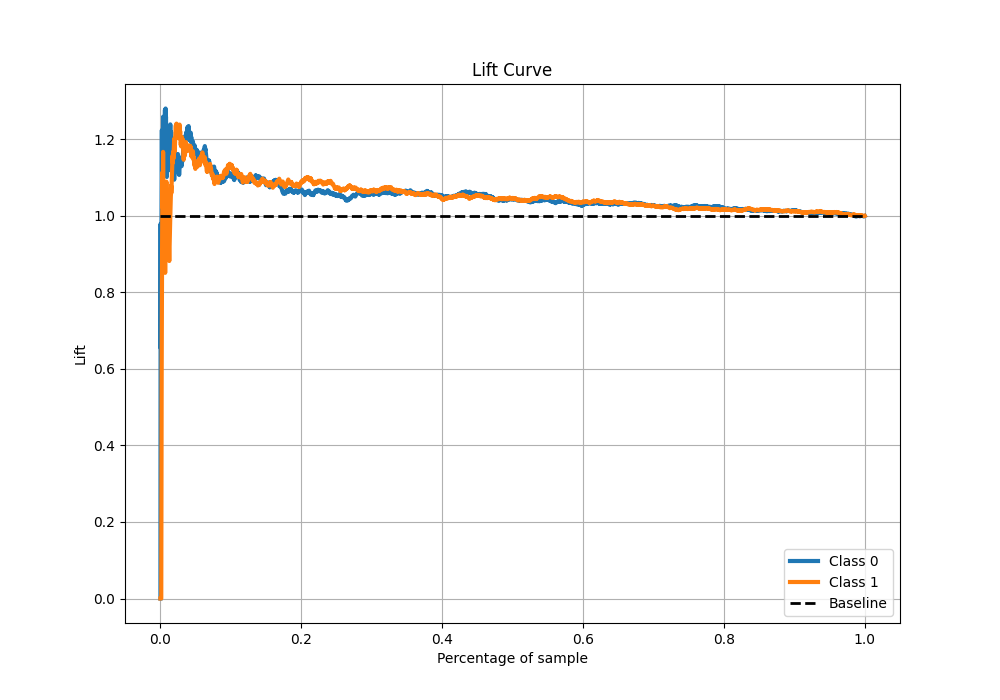

## SHAP Importance

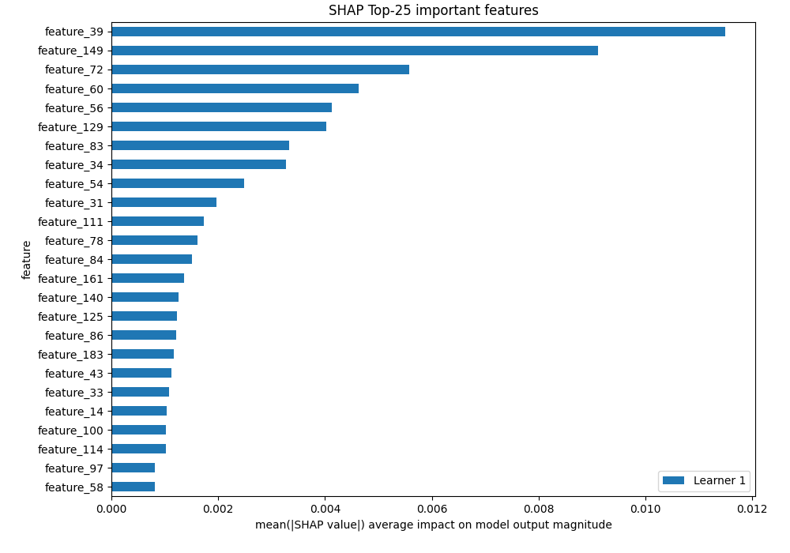

[<< Go back](../README.md)
