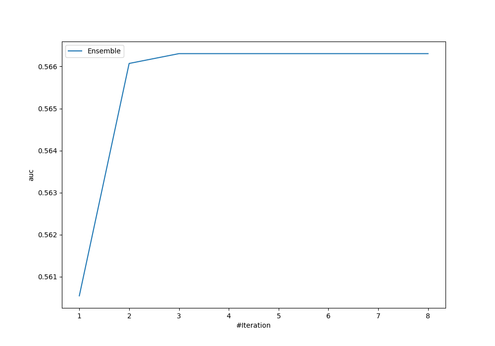
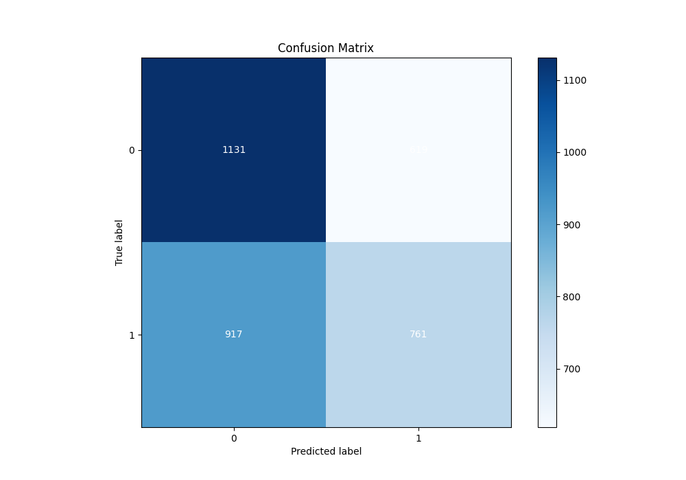
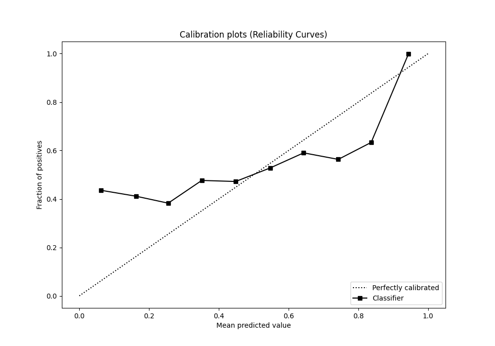
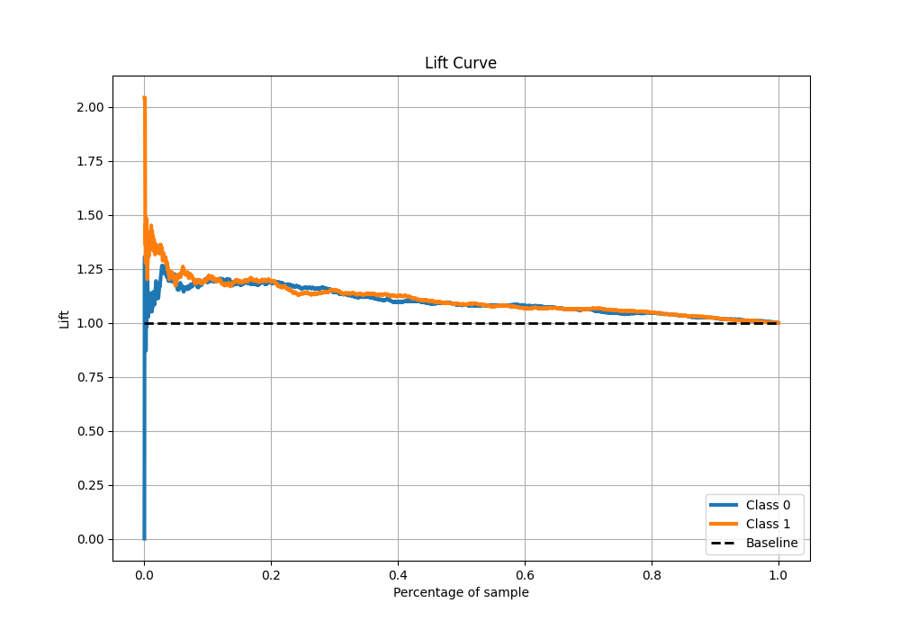

# Summary of Ensemble

[<< Go back](../README.md)

## Ensemble structure

| Model              |   Weight |
|:-------------------|---------:|
| 3_Default_LightGBM |        1 |
| 4_Default_Xgboost  |        1 |
| 5_Default_CatBoost |        1 |

## Metric details

|           |    score |   threshold |
|:----------|---------:|------------:|
| logloss   | 0.68698  |  nan        |
| auc       | 0.566304 |  nan        |
| f1        | 0.657266 |    0.244451 |
| accuracy  | 0.551925 |    0.511812 |
| precision | 0.646341 |    0.639755 |
| recall    | 1        |    0.244451 |
| mcc       | 0.104373 |    0.443417 |

## Metric details with threshold from accuracy metric

|           |    score |   threshold |
|:----------|---------:|------------:|
| logloss   | 0.68698  |  nan        |
| auc       | 0.566304 |  nan        |
| f1        | 0.497711 |    0.511812 |
| accuracy  | 0.551925 |    0.511812 |
| precision | 0.551449 |    0.511812 |
| recall    | 0.453516 |    0.511812 |
| mcc       | 0.10173  |    0.511812 |

## Confusion matrix (at threshold=0.511812)

|              |   Predicted as 0 |   Predicted as 1 |
|:-------------|-----------------:|-----------------:|
| Labeled as 0 |             1131 |              619 |
| Labeled as 1 |              917 |              761 |

## Learning curves

## Confusion Matrix

## Normalized Confusion Matrix

## ROC Curve

## Kolmogorov-Smirnov Statistic

## Precision-Recall Curve

## Calibration Curve

## Cumulative Gains Curve

## Lift Curve

[<< Go back](../README.md)
