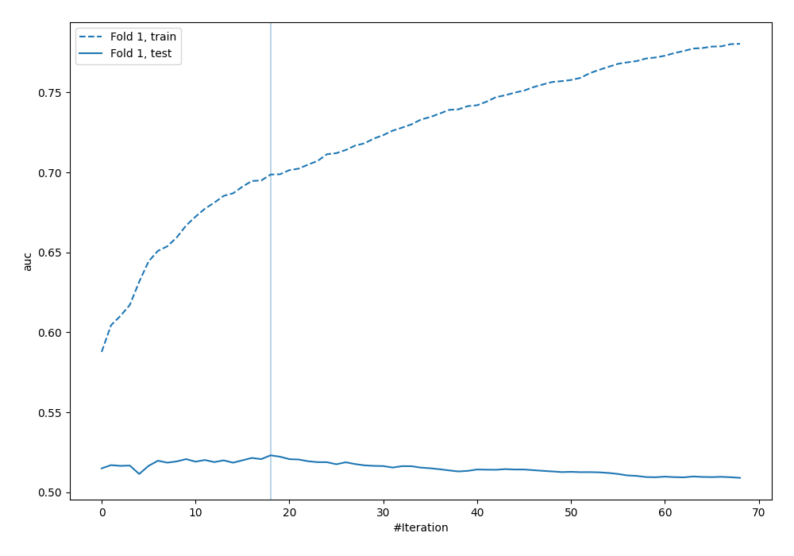
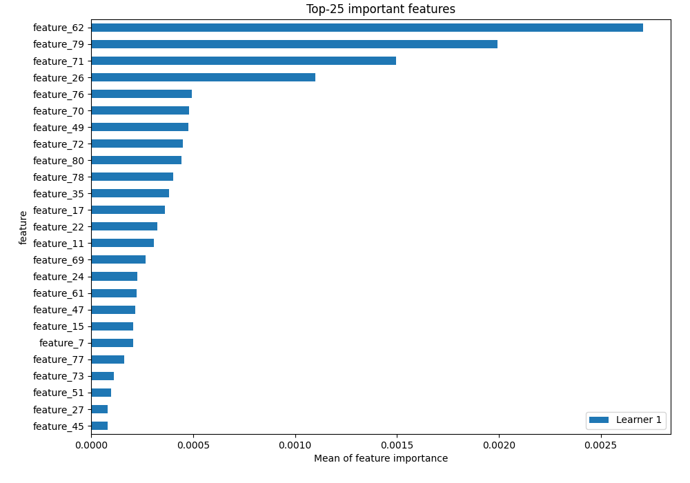
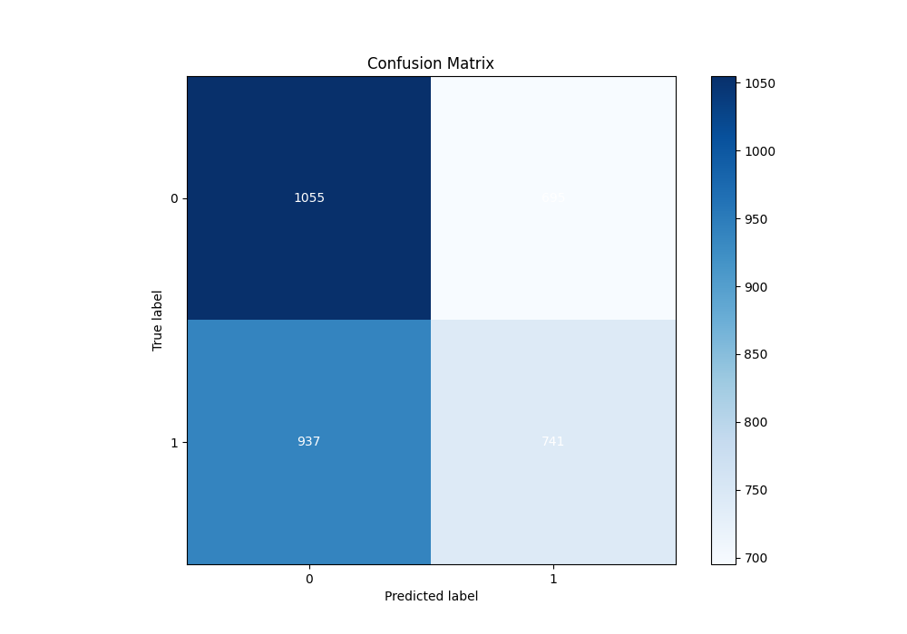
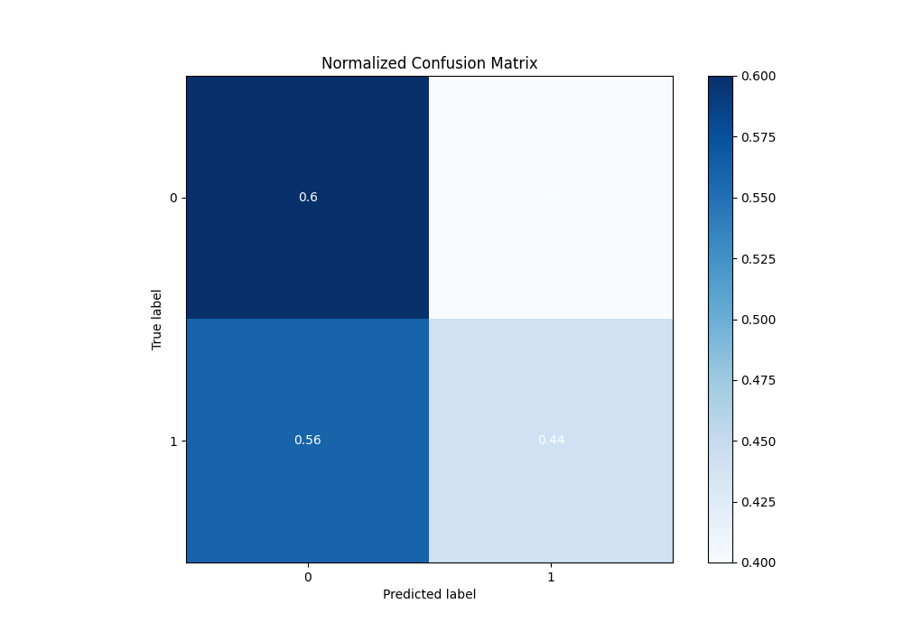
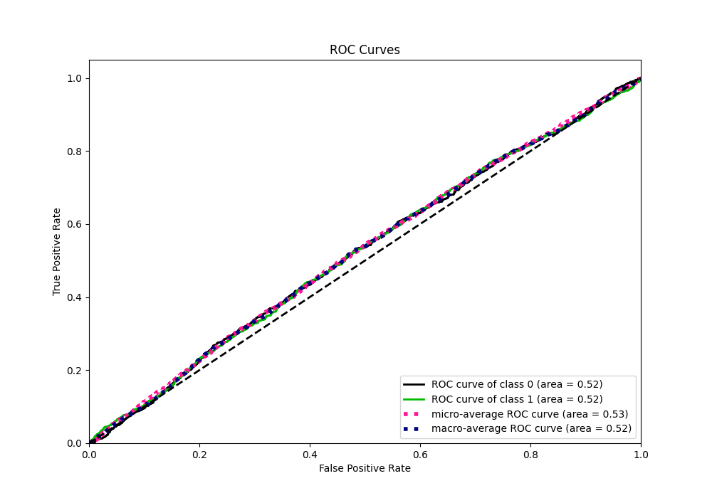
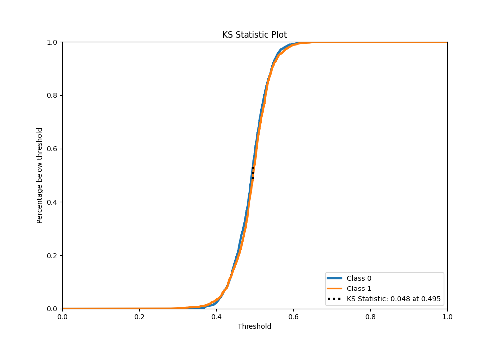
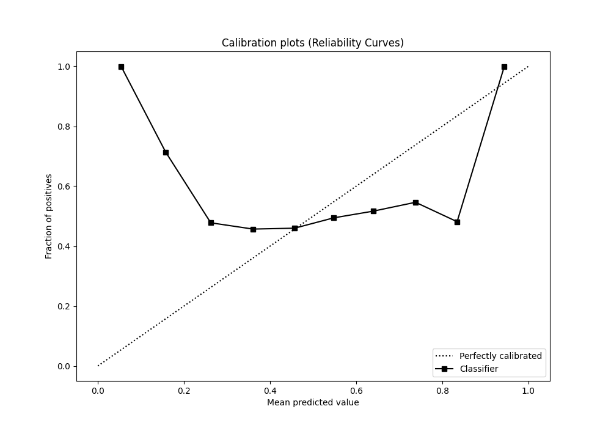
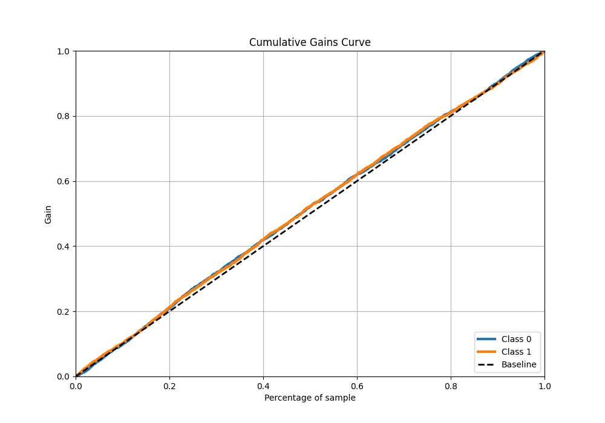
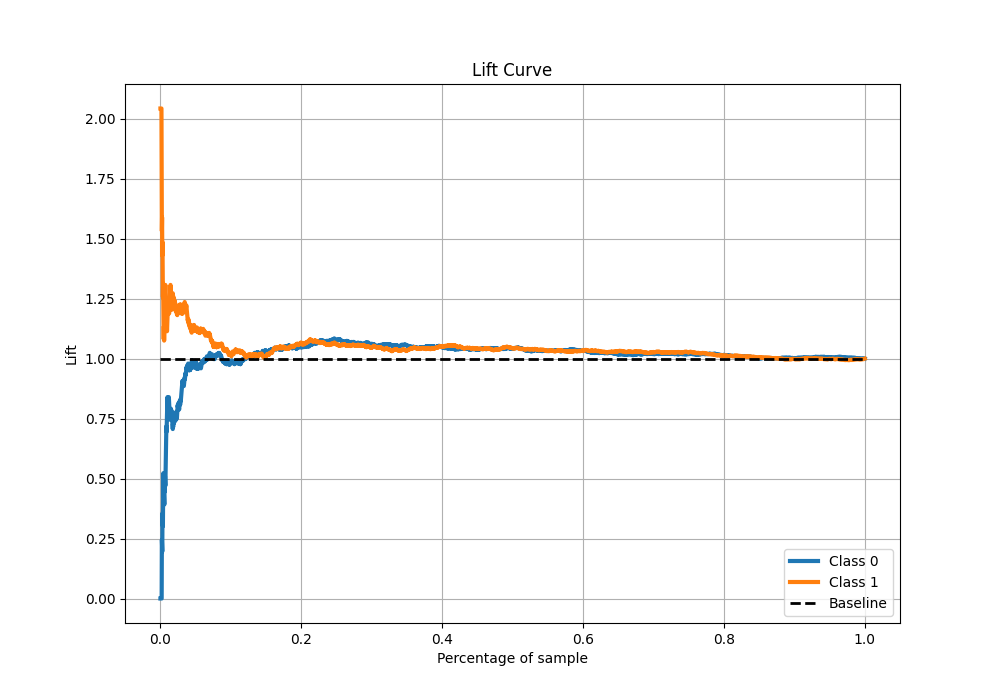
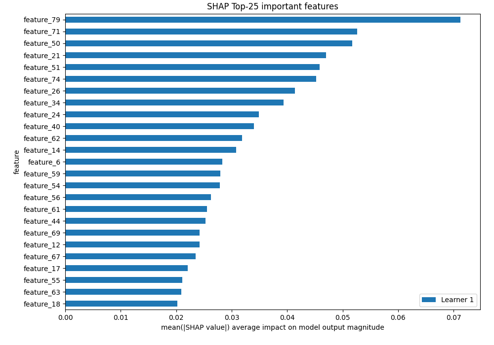

# Summary of 3_Default_Xgboost

[<< Go back](../README.md)

## Extreme Gradient Boosting (Xgboost)

- **n_jobs**: -1
- **objective**: binary:logistic
- **eta**: 0.075
- **max_depth**: 6
- **min_child_weight**: 1
- **subsample**: 1.0
- **colsample_bytree**: 1.0
- **eval_metric**: auc
- **explain_level**: 2

## Validation

- **validation_type**: split
- **train_ratio**: 0.75
- **shuffle**: True
- **stratify**: True

## Optimized metric

auc

## Training time

19.1 seconds

## Metric details

|           |     score |   threshold |
|:----------|----------:|------------:|
| logloss   | 0.694271  |  nan        |
| auc       | 0.523197  |  nan        |
| f1        | 0.657266  |    0.254781 |
| accuracy  | 0.523921  |    0.501918 |
| precision | 0.527397  |    0.525802 |
| recall    | 1         |    0.254781 |
| mcc       | 0.0488157 |    0.46364  |

## Metric details with threshold from accuracy metric

|           |     score |   threshold |
|:----------|----------:|------------:|
| logloss   | 0.694271  |  nan        |
| auc       | 0.523197  |  nan        |
| f1        | 0.475915  |    0.501918 |
| accuracy  | 0.523921  |    0.501918 |
| precision | 0.516017  |    0.501918 |
| recall    | 0.441597  |    0.501918 |
| mcc       | 0.0450409 |    0.501918 |

## Confusion matrix (at threshold=0.501918)

|              |   Predicted as 0 |   Predicted as 1 |
|:-------------|-----------------:|-----------------:|
| Labeled as 0 |             1055 |              695 |
| Labeled as 1 |              937 |              741 |

## Learning curves

## Permutation-based Importance

## Confusion Matrix

## Normalized Confusion Matrix

## ROC Curve

## Kolmogorov-Smirnov Statistic

## Precision-Recall Curve

## Calibration Curve

## Cumulative Gains Curve

## Lift Curve

## SHAP Importance

[<< Go back](../README.md)
