# Summary of 3_Linear

[<< Go back](../README.md)

## Logistic Regression (Linear)

- **n_jobs**: -1
- **explain_level**: 2

## Validation

- **validation_type**: split
- **train_ratio**: 0.75
- **shuffle**: True
- **stratify**: True

## Optimized metric

auc

## Training time

18.1 seconds

## Metric details

|           |    score |   threshold |
|:----------|---------:|------------:|
| logloss   | 0.713543 | nan         |
| auc       | 0.563638 | nan         |
| f1        | 0.659517 |   0.0869947 |
| accuracy  | 0.558    |   0.521119  |
| precision | 0.652542 |   0.733536  |
| recall    | 1        |   0.0869947 |
| mcc       | 0.114922 |   0.521119  |

## Metric details with threshold from accuracy metric

|           |    score |   threshold |
|:----------|---------:|------------:|
| logloss   | 0.713543 |  nan        |
| auc       | 0.563638 |  nan        |
| f1        | 0.525412 |    0.521119 |
| accuracy  | 0.558    |    0.521119 |
| precision | 0.556904 |    0.521119 |
| recall    | 0.49729  |    0.521119 |
| mcc       | 0.114922 |    0.521119 |

## Confusion matrix (at threshold=0.521119)

|              |   Predicted as 0 |   Predicted as 1 |
|:-------------|-----------------:|-----------------:|
| Labeled as 0 |              470 |              292 |
| Labeled as 1 |              371 |              367 |

## Learning curves

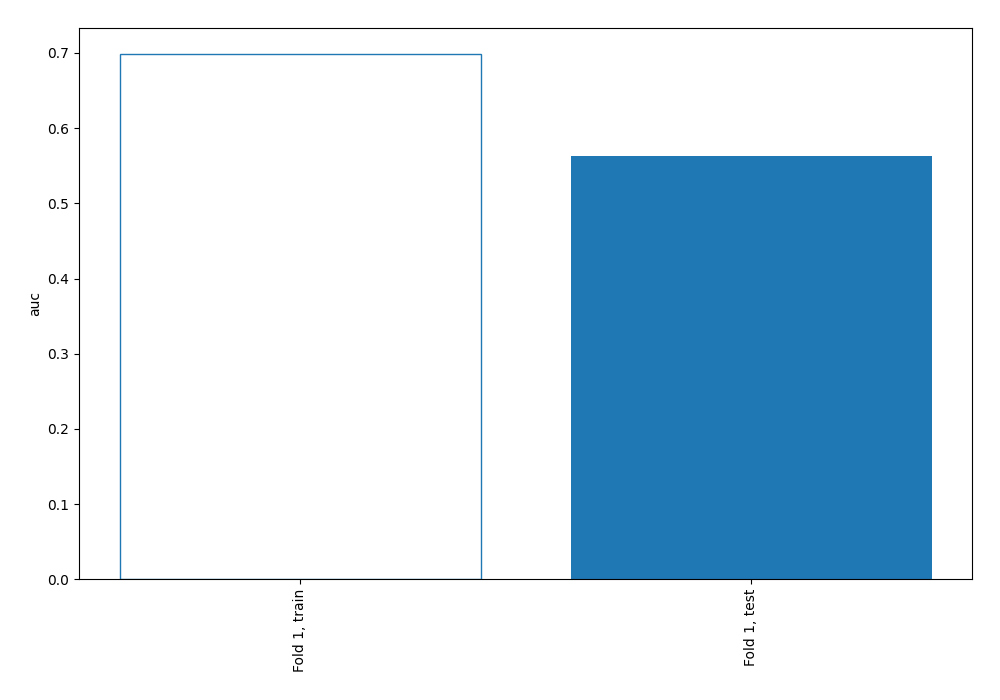

## Permutation-based Importance

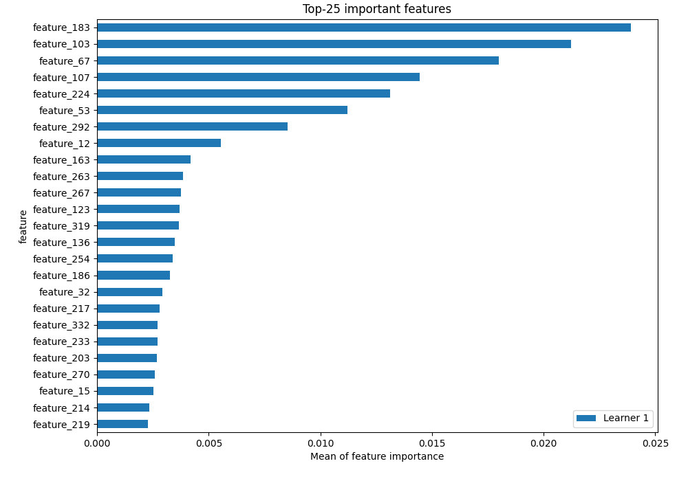

## Confusion Matrix

## Normalized Confusion Matrix

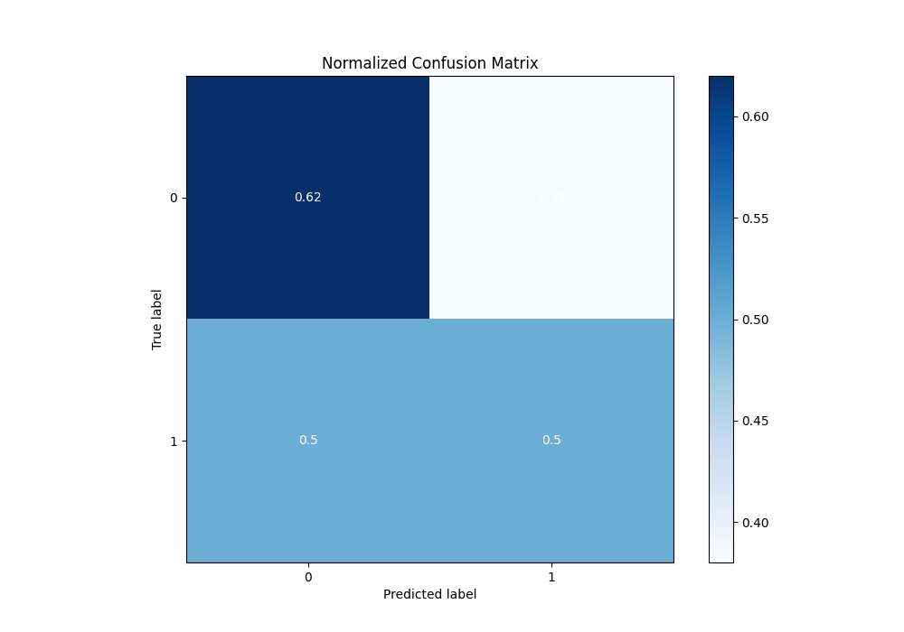

## ROC Curve

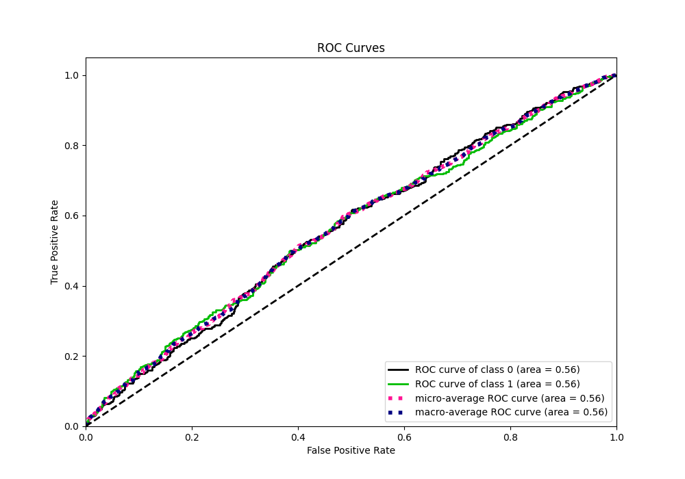

## Kolmogorov-Smirnov Statistic

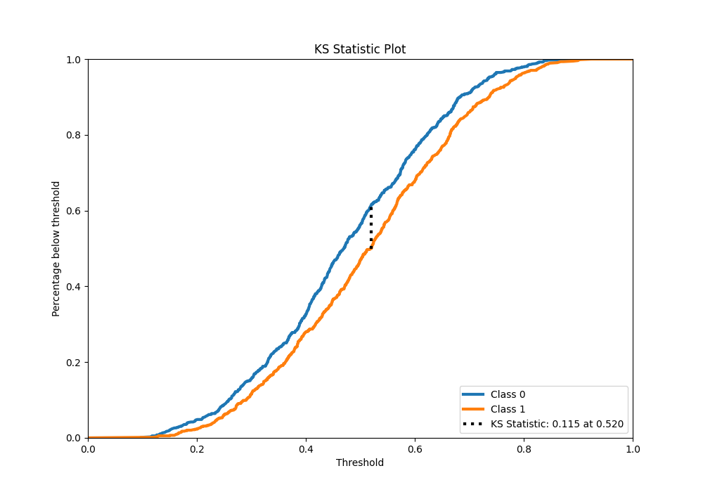

## Precision-Recall Curve

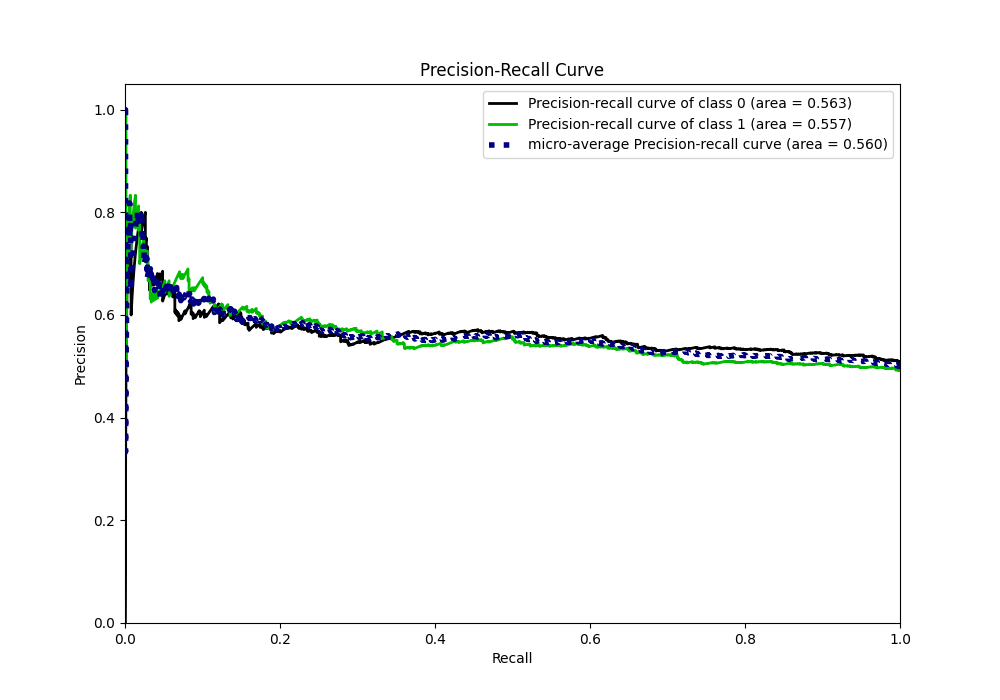

## Calibration Curve

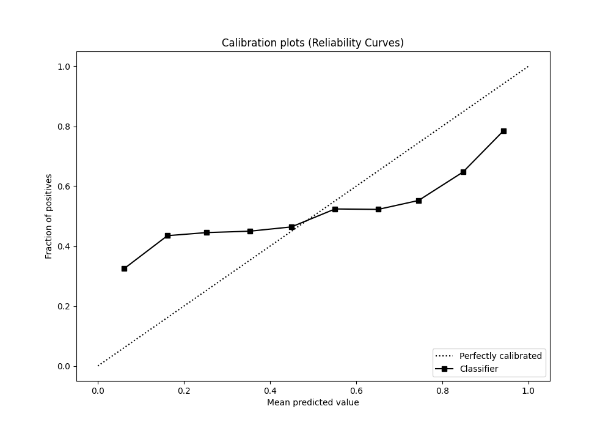

## Cumulative Gains Curve

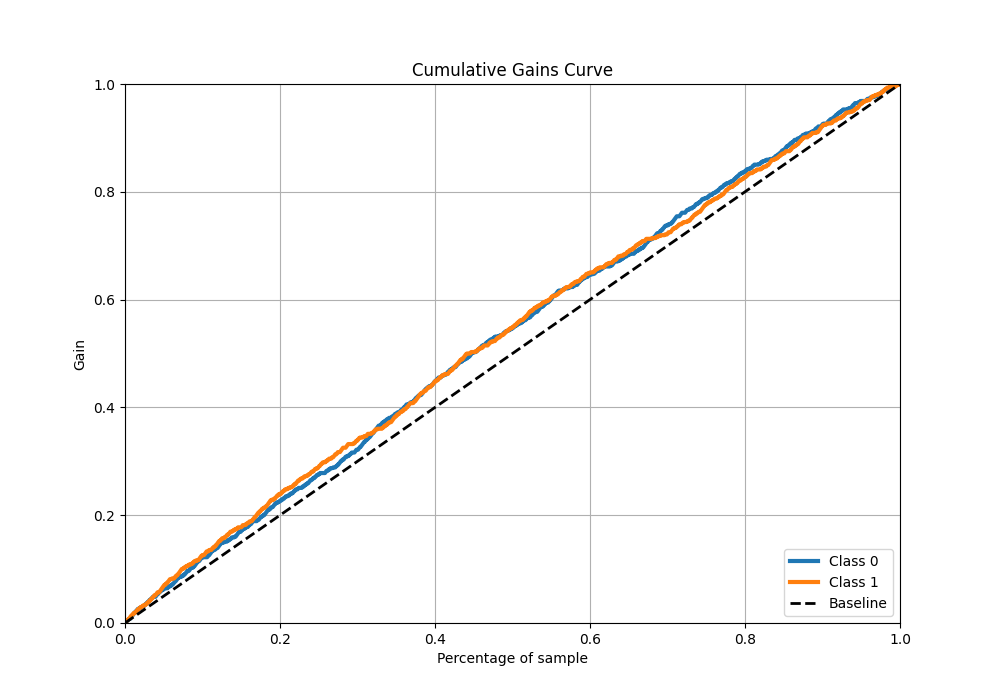

## Lift Curve

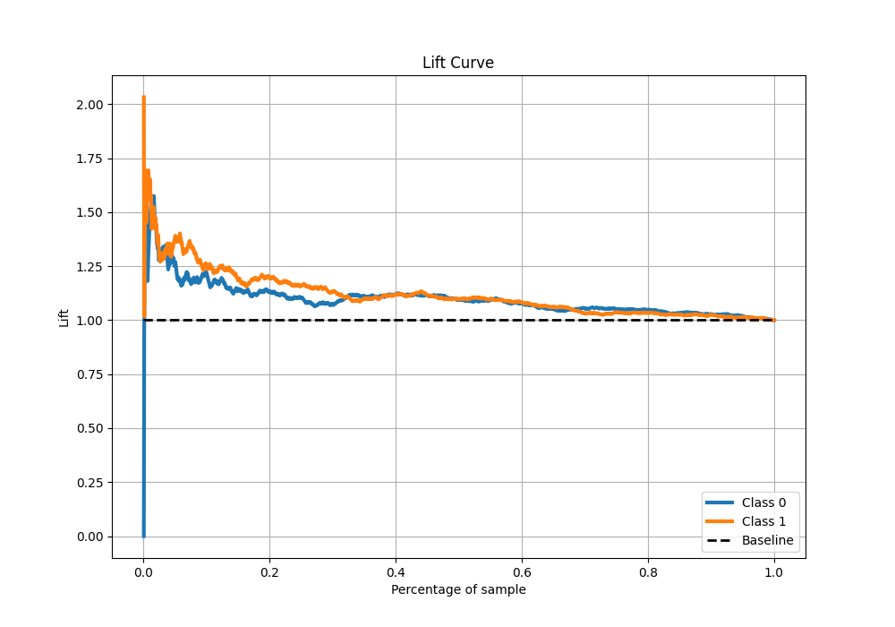

## SHAP Importance

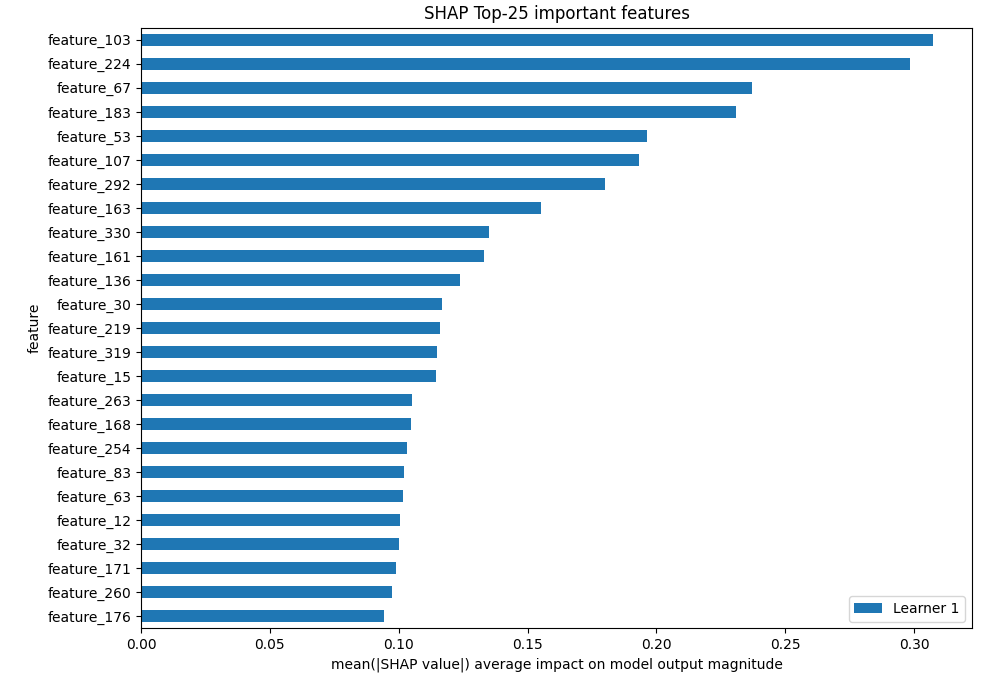

## SHAP Dependence plots

### Dependence (Fold 1)

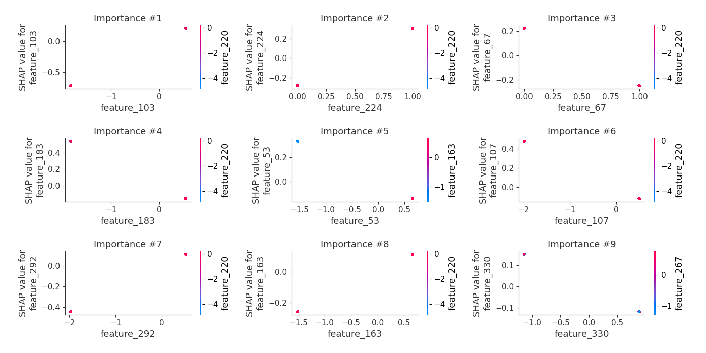

## SHAP Decision plots

### Top-10 Worst decisions for class 0 (Fold 1)

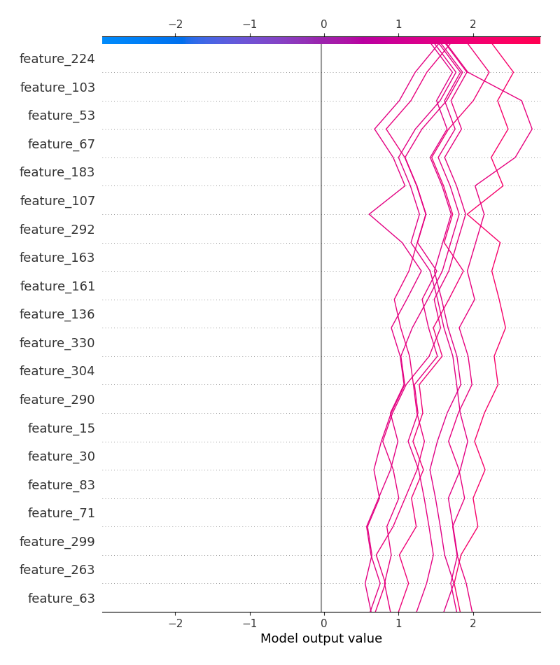

### Top-10 Best decisions for class 0 (Fold 1)

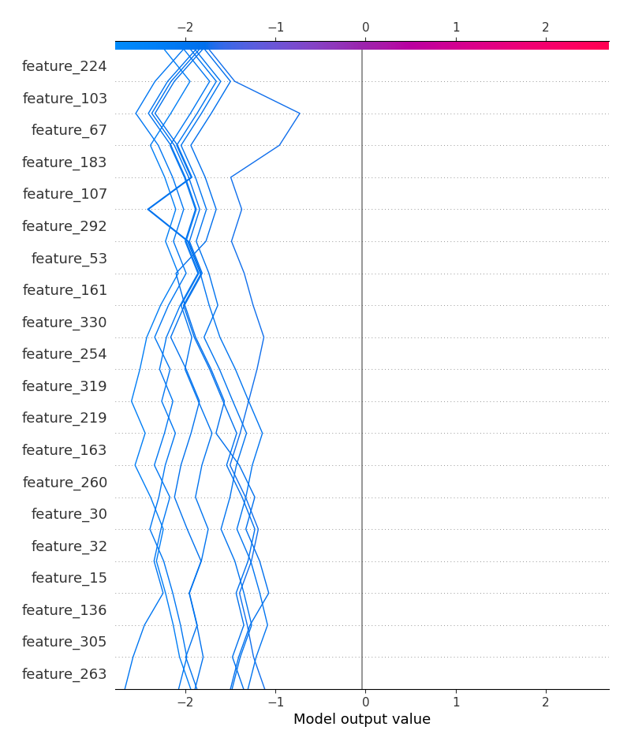

### Top-10 Worst decisions for class 1 (Fold 1)

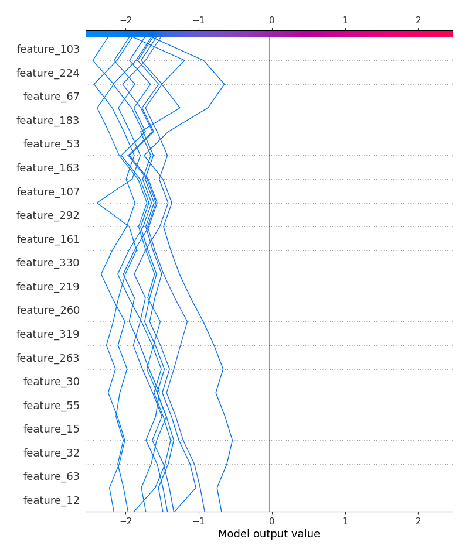

### Top-10 Best decisions for class 1 (Fold 1)

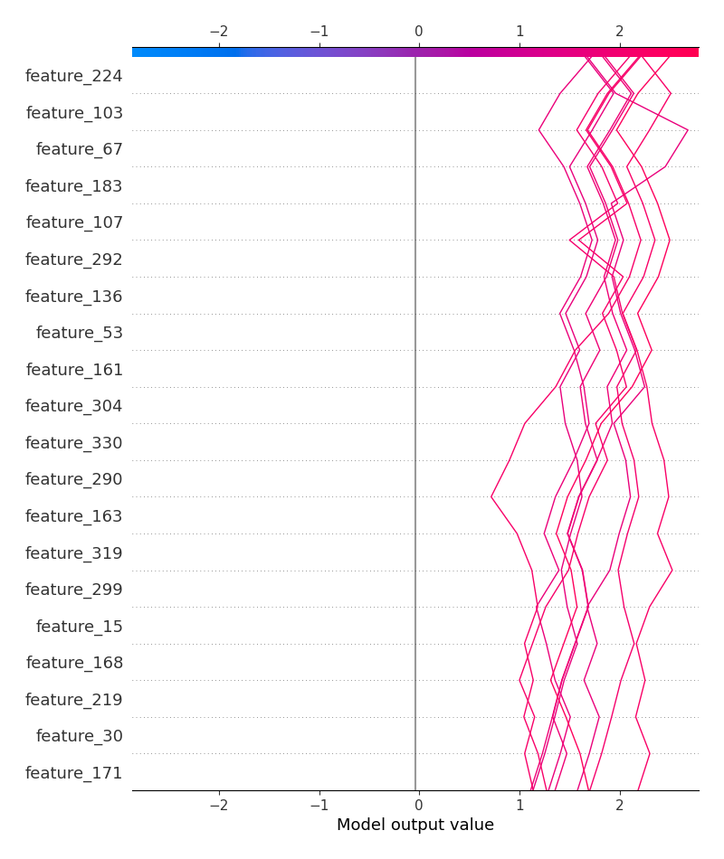

[<< Go back](../README.md)
