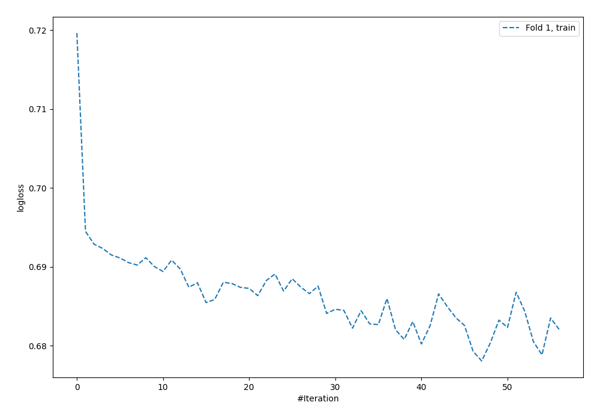
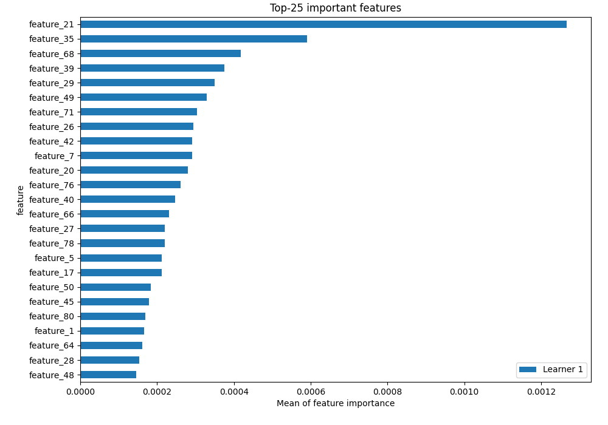
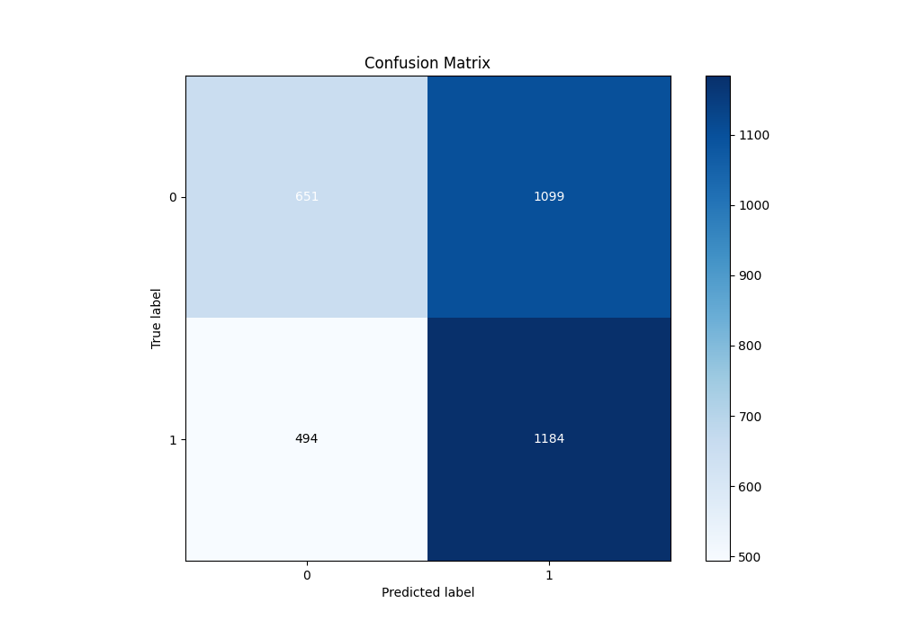
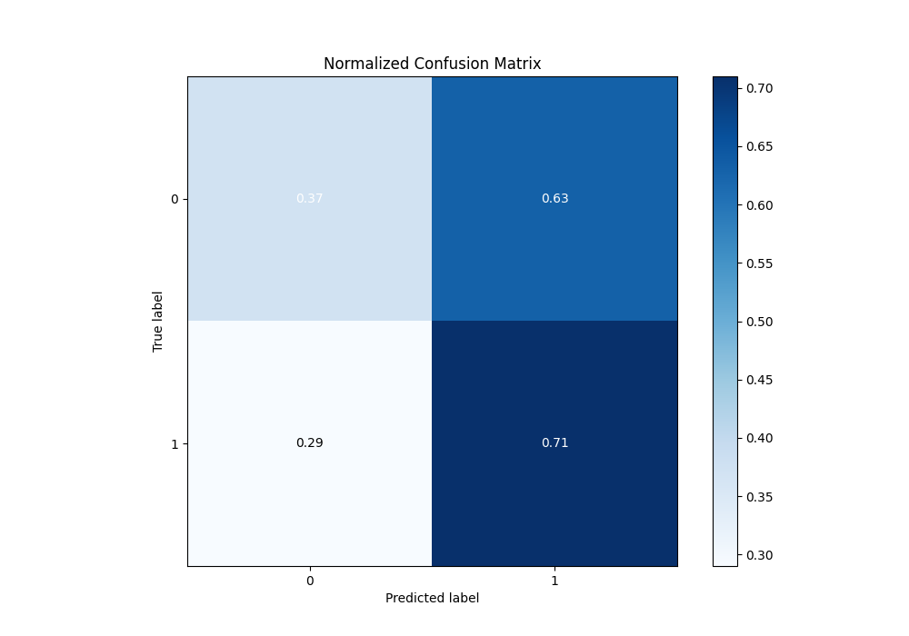
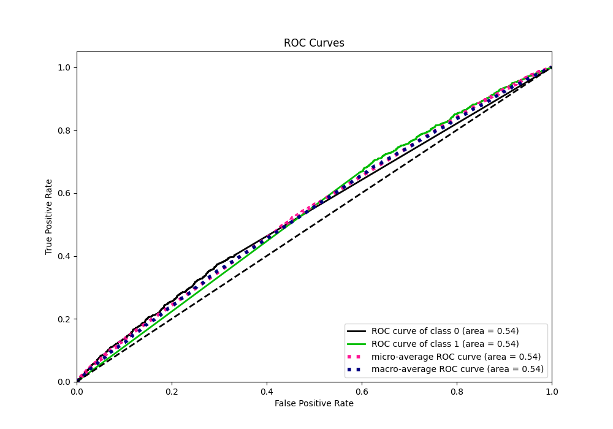
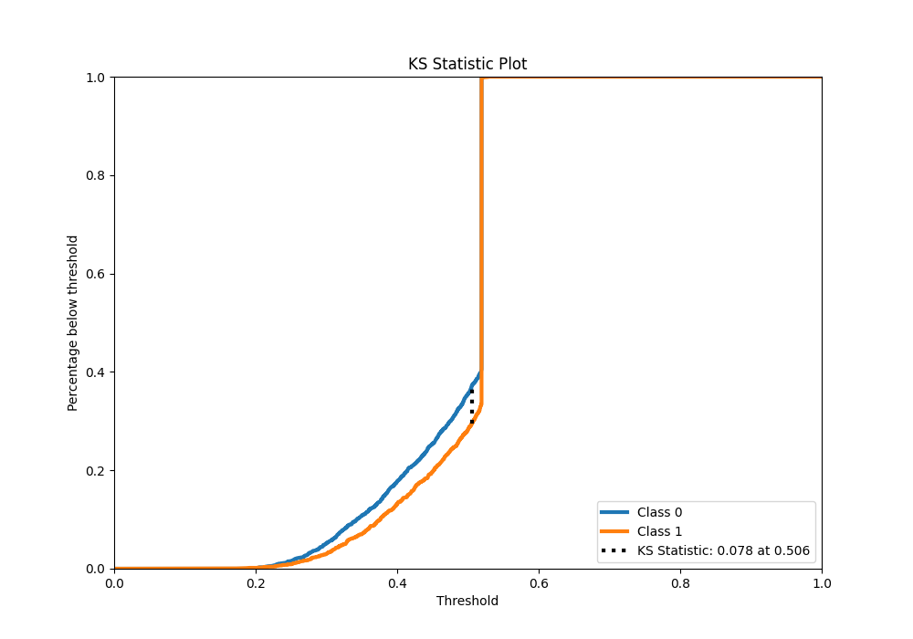
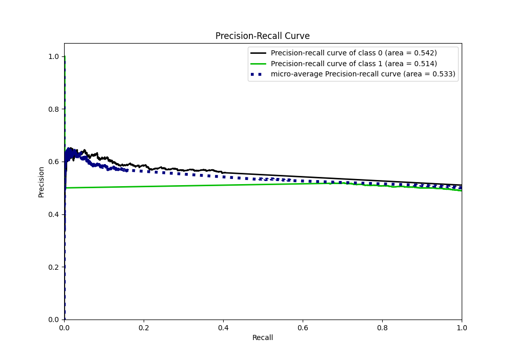
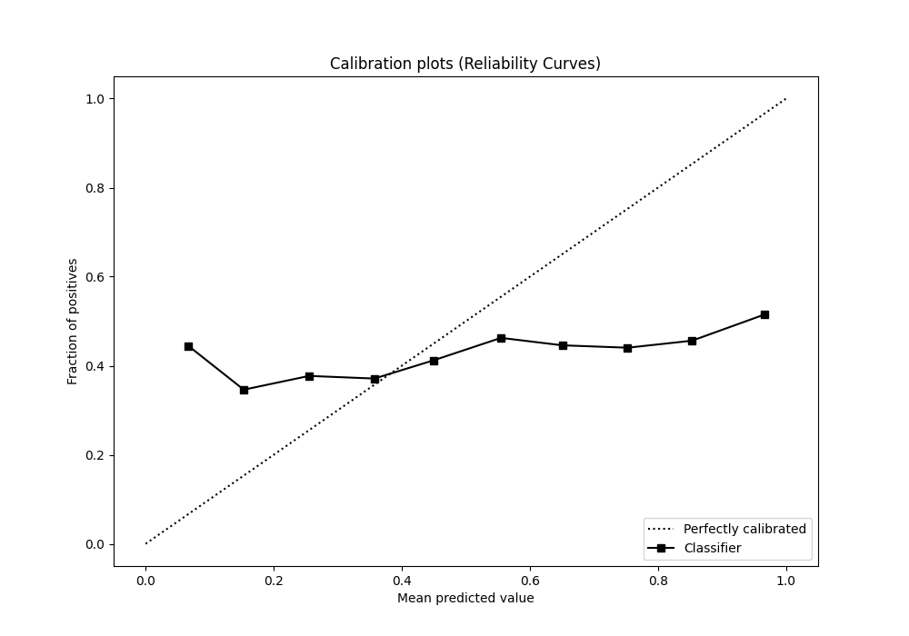
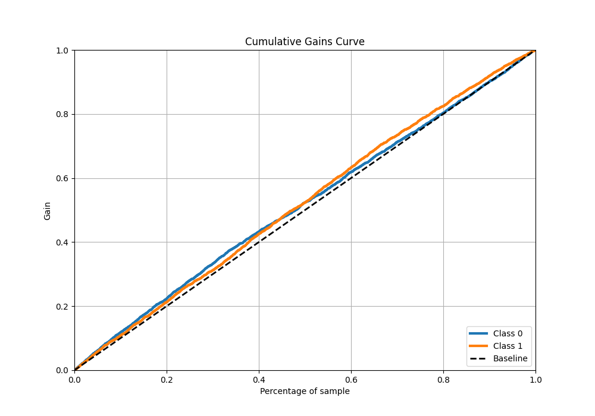
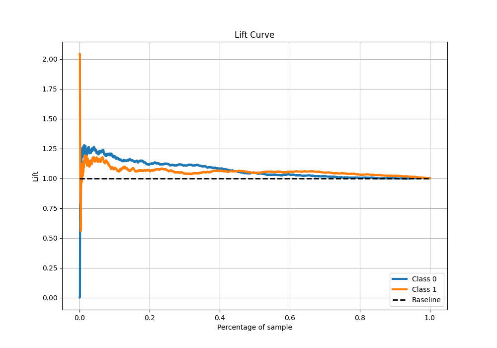

# Summary of 4_Default_NeuralNetwork

[<< Go back](../README.md)

## Neural Network

- **n_jobs**: -1
- **dense_1_size**: 32
- **dense_2_size**: 16
- **learning_rate**: 0.05
- **explain_level**: 2

## Validation

- **validation_type**: split
- **train_ratio**: 0.75
- **shuffle**: True
- **stratify**: True

## Optimized metric

auc

## Training time

3.3 seconds

## Metric details

|           |     score |   threshold |
|:----------|----------:|------------:|
| logloss   | 0.69267   |  nan        |
| auc       | 0.539476  |  nan        |
| f1        | 0.657266  |    0.155225 |
| accuracy  | 0.535298  |    0.505698 |
| precision | 0.518616  |    0.505698 |
| recall    | 1         |    0.155225 |
| mcc       | 0.0822492 |    0.505698 |

## Metric details with threshold from accuracy metric

|           |     score |   threshold |
|:----------|----------:|------------:|
| logloss   | 0.69267   |  nan        |
| auc       | 0.539476  |  nan        |
| f1        | 0.597829  |    0.505698 |
| accuracy  | 0.535298  |    0.505698 |
| precision | 0.518616  |    0.505698 |
| recall    | 0.705602  |    0.505698 |
| mcc       | 0.0822492 |    0.505698 |

## Confusion matrix (at threshold=0.505698)

|              |   Predicted as 0 |   Predicted as 1 |
|:-------------|-----------------:|-----------------:|
| Labeled as 0 |              651 |             1099 |
| Labeled as 1 |              494 |             1184 |

## Learning curves

## Permutation-based Importance

## Confusion Matrix

## Normalized Confusion Matrix

## ROC Curve

## Kolmogorov-Smirnov Statistic

## Precision-Recall Curve

## Calibration Curve

## Cumulative Gains Curve

## Lift Curve

[<< Go back](../README.md)
