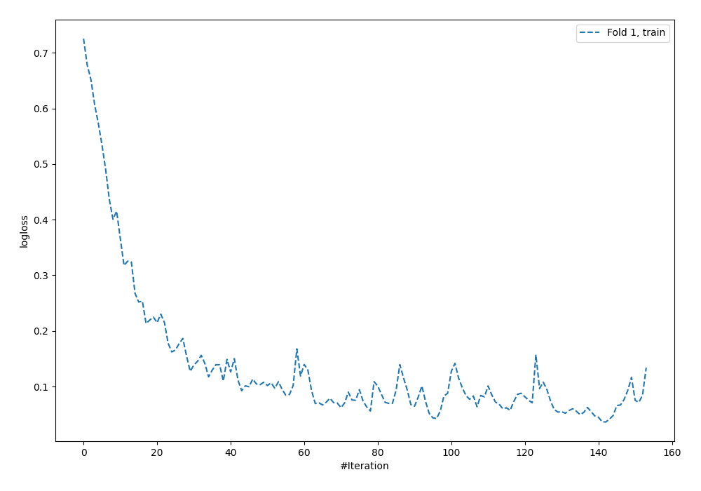
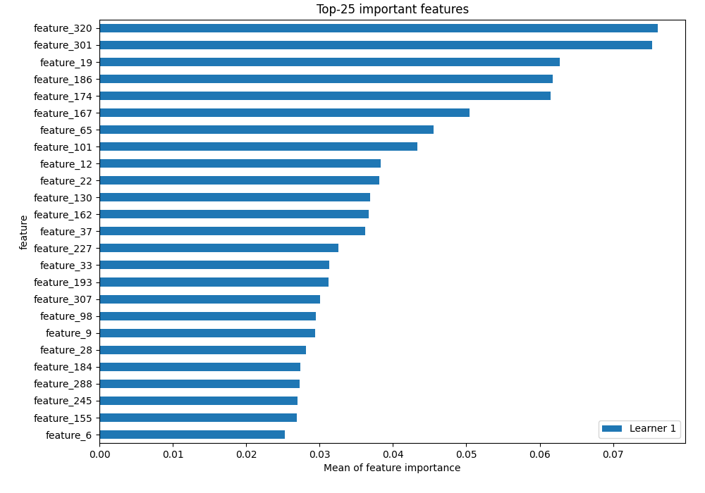
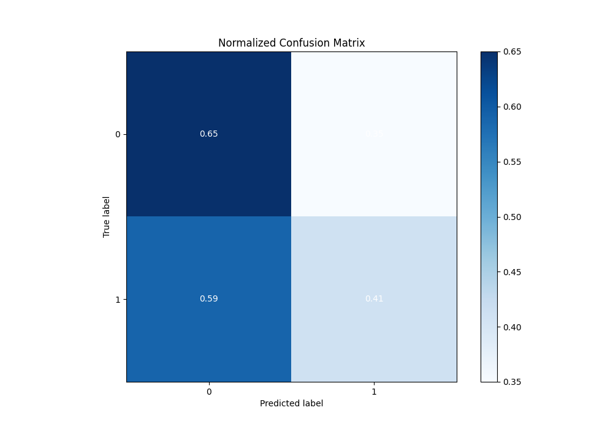
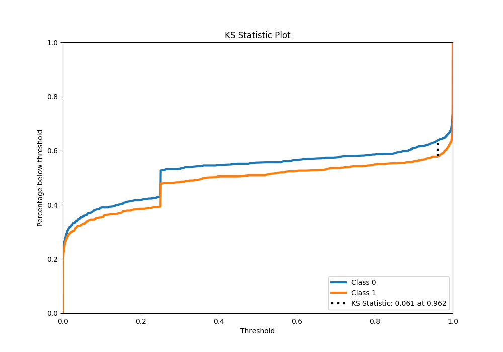
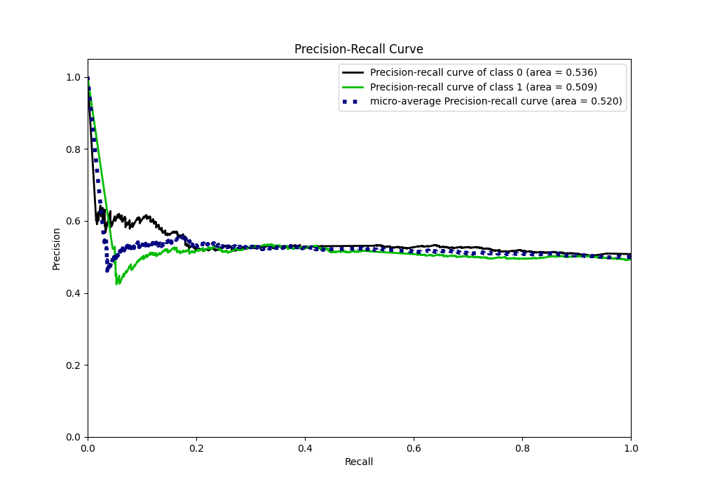
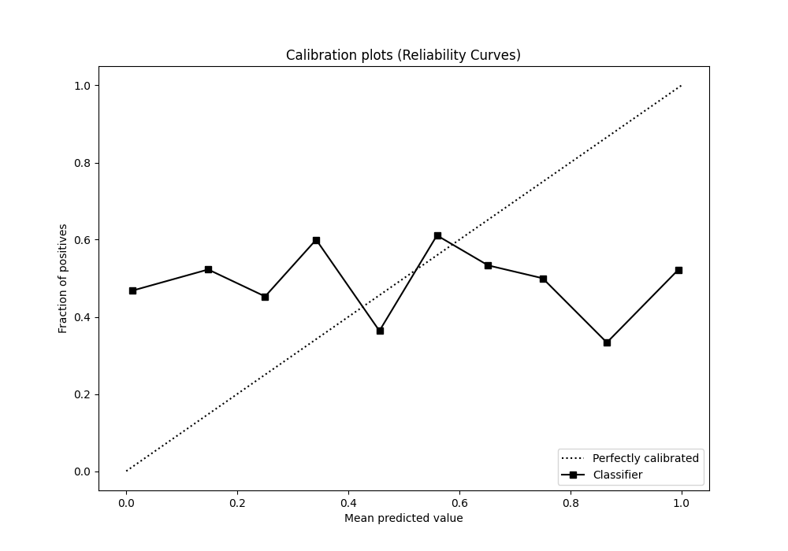
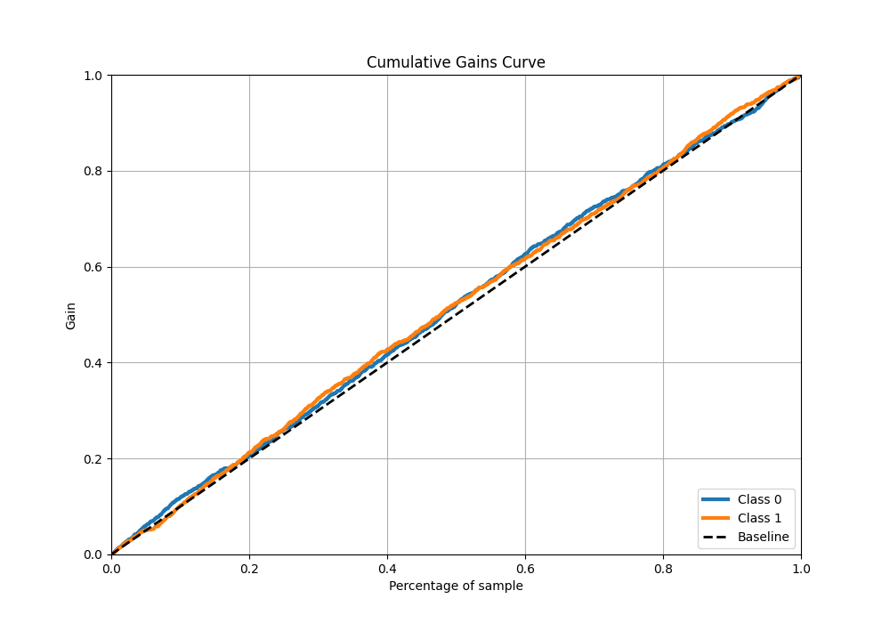
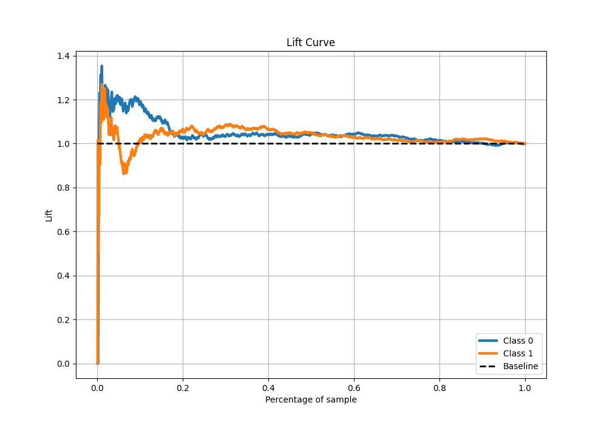

# Summary of 5_Default_NeuralNetwork

[<< Go back](../README.md)

## Neural Network

- **n_jobs**: -1
- **dense_1_size**: 32
- **dense_2_size**: 16
- **learning_rate**: 0.05
- **explain_level**: 2

## Validation

- **validation_type**: split
- **train_ratio**: 0.75
- **shuffle**: True
- **stratify**: True

## Optimized metric

auc

## Training time

10.6 seconds

## Metric details

|           |     score |     threshold |
|:----------|----------:|--------------:|
| logloss   | 3.65163   | nan           |
| auc       | 0.526683  | nan           |
| f1        | 0.659517  |   7.30509e-96 |
| accuracy  | 0.529333  |   0.976911    |
| precision | 0.533333  |   0.999331    |
| recall    | 1         |   7.30509e-96 |
| mcc       | 0.0564846 |   0.976911    |

## Metric details with threshold from accuracy metric

|           |     score |   threshold |
|:----------|----------:|------------:|
| logloss   | 3.65163   |  nan        |
| auc       | 0.526683  |  nan        |
| f1        | 0.460245  |    0.976911 |
| accuracy  | 0.529333  |    0.976911 |
| precision | 0.52807   |    0.976911 |
| recall    | 0.407859  |    0.976911 |
| mcc       | 0.0564846 |    0.976911 |

## Confusion matrix (at threshold=0.976911)

|              |   Predicted as 0 |   Predicted as 1 |
|:-------------|-----------------:|-----------------:|
| Labeled as 0 |              493 |              269 |
| Labeled as 1 |              437 |              301 |

## Learning curves

## Permutation-based Importance

## Confusion Matrix

## Normalized Confusion Matrix

## ROC Curve

## Kolmogorov-Smirnov Statistic

## Precision-Recall Curve

## Calibration Curve

## Cumulative Gains Curve

## Lift Curve

[<< Go back](../README.md)
