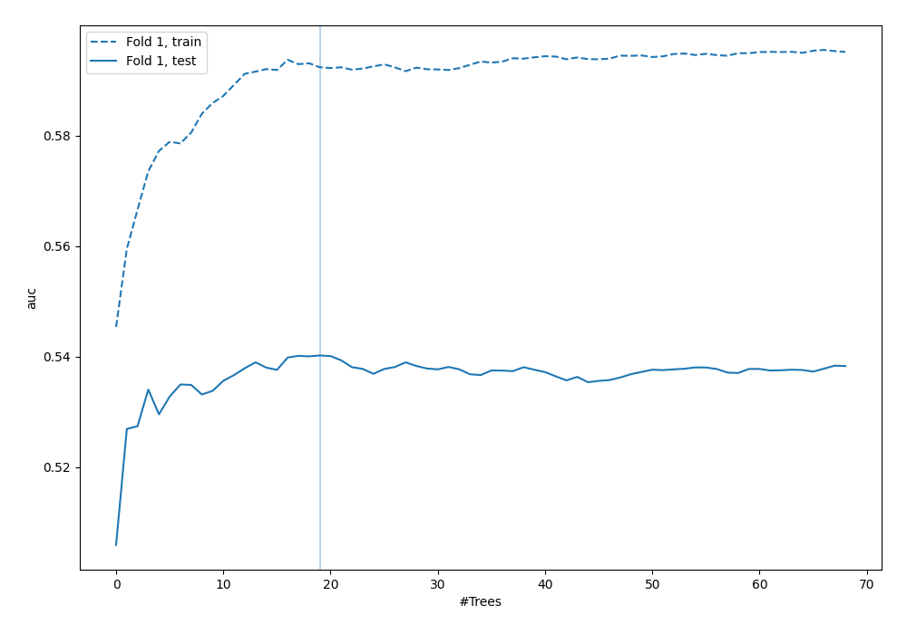
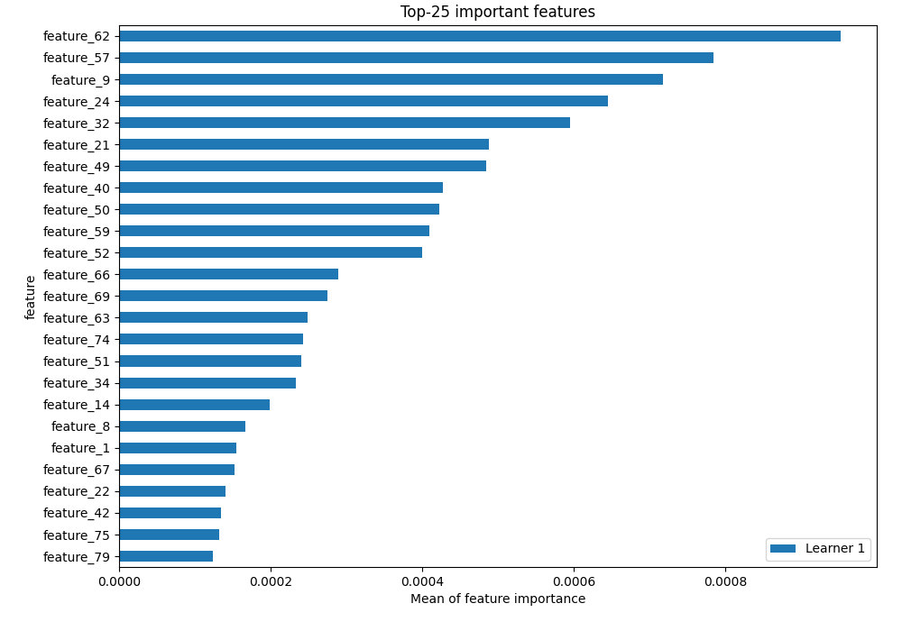
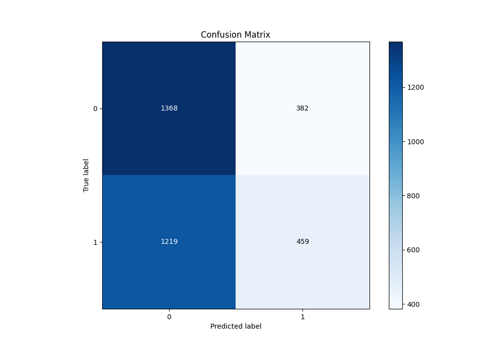
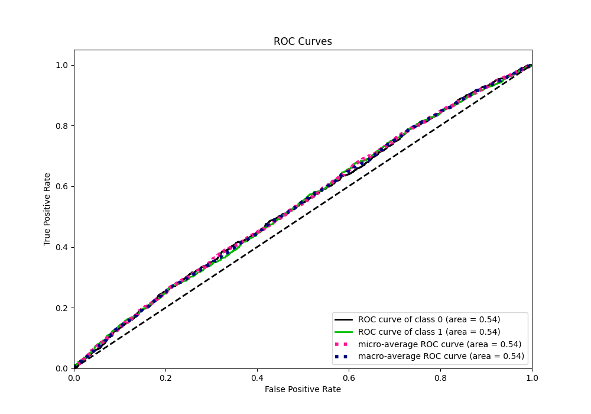
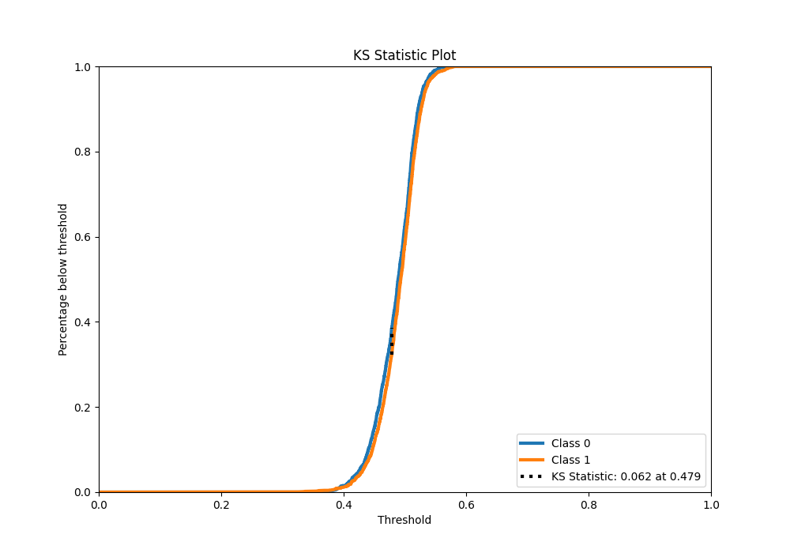
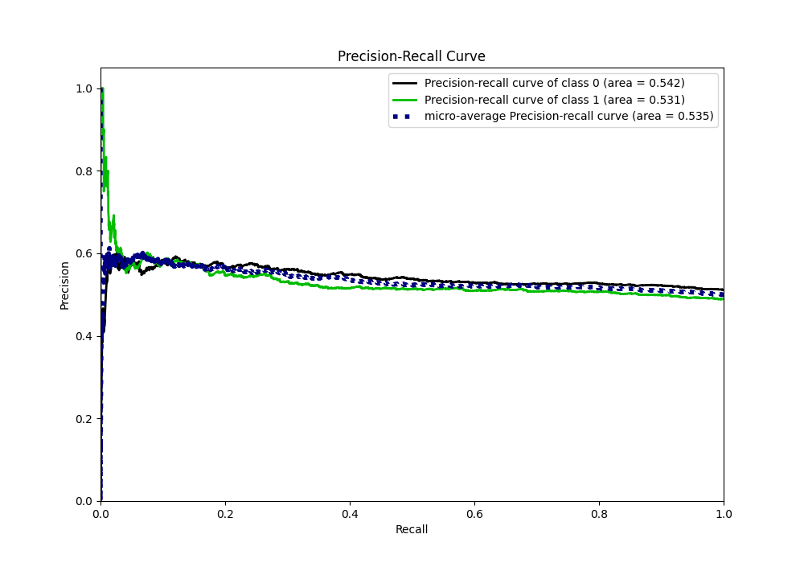
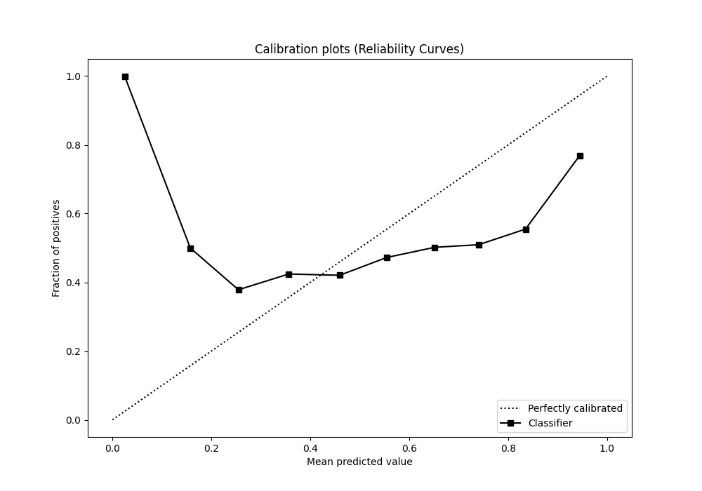
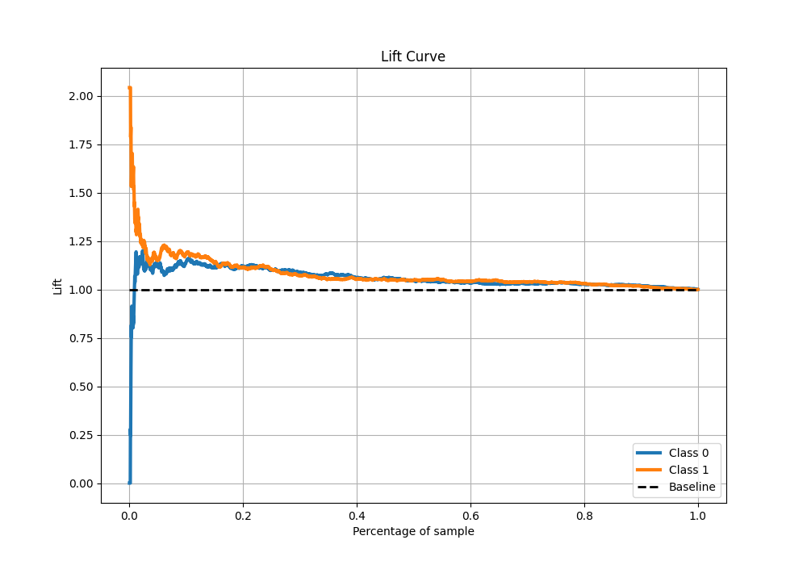
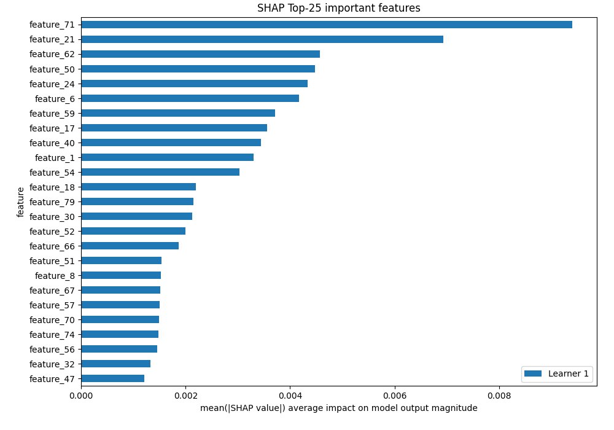

# Summary of 5_Default_RandomForest

[<< Go back](../README.md)

## Random Forest

- **n_jobs**: -1
- **criterion**: gini
- **max_features**: 0.9
- **min_samples_split**: 30
- **max_depth**: 4
- **eval_metric_name**: auc
- **explain_level**: 2

## Validation

- **validation_type**: split
- **train_ratio**: 0.75
- **shuffle**: True
- **stratify**: True

## Optimized metric

auc

## Training time

5.3 seconds

## Metric details

|           |     score |   threshold |
|:----------|----------:|------------:|
| logloss   | 0.690458  |  nan        |
| auc       | 0.540216  |  nan        |
| f1        | 0.657266  |    0.293404 |
| accuracy  | 0.532964  |    0.51064  |
| precision | 0.577836  |    0.522987 |
| recall    | 1         |    0.293404 |
| mcc       | 0.0679393 |    0.462099 |

## Metric details with threshold from accuracy metric

|           |     score |   threshold |
|:----------|----------:|------------:|
| logloss   | 0.690458  |   nan       |
| auc       | 0.540216  |   nan       |
| f1        | 0.36443   |     0.51064 |
| accuracy  | 0.532964  |     0.51064 |
| precision | 0.545779  |     0.51064 |
| recall    | 0.27354   |     0.51064 |
| mcc       | 0.0641925 |     0.51064 |

## Confusion matrix (at threshold=0.51064)

|              |   Predicted as 0 |   Predicted as 1 |
|:-------------|-----------------:|-----------------:|
| Labeled as 0 |             1368 |              382 |
| Labeled as 1 |             1219 |              459 |

## Learning curves

## Permutation-based Importance

## Confusion Matrix

## Normalized Confusion Matrix

## ROC Curve

## Kolmogorov-Smirnov Statistic

## Precision-Recall Curve

## Calibration Curve

## Cumulative Gains Curve

## Lift Curve

## SHAP Importance

[<< Go back](../README.md)
