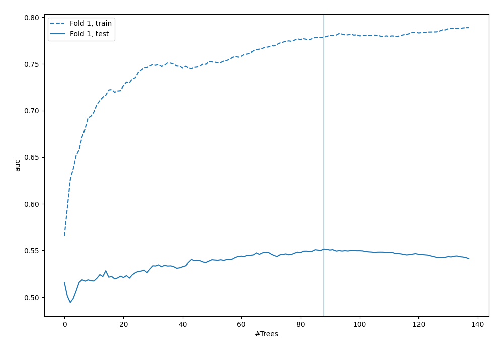
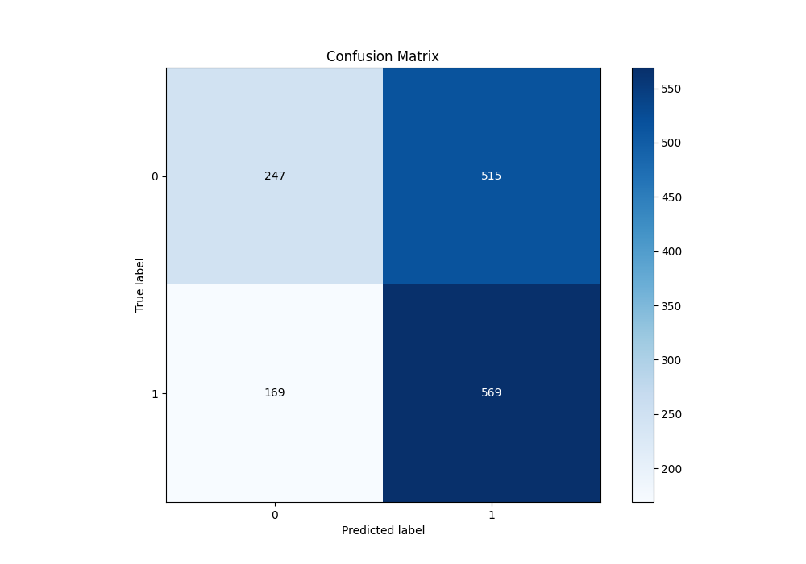
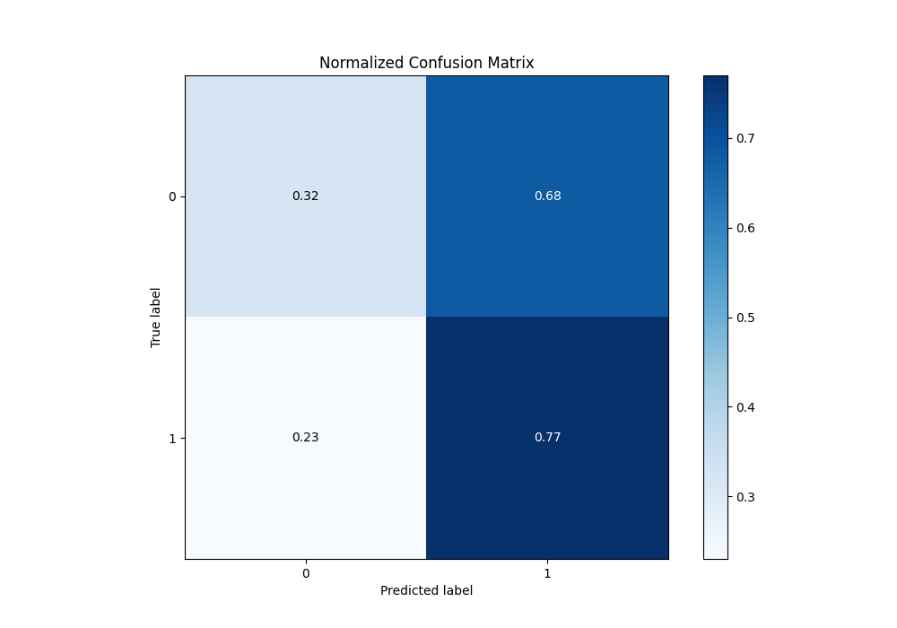
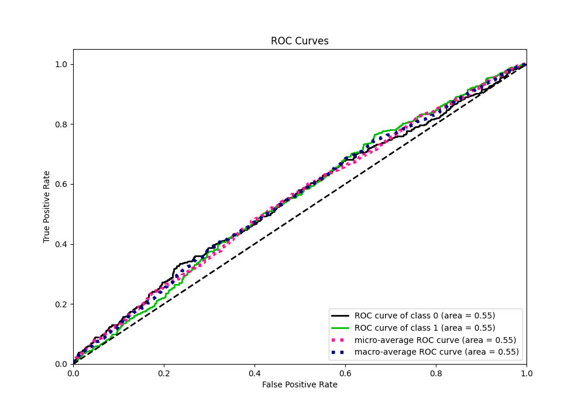
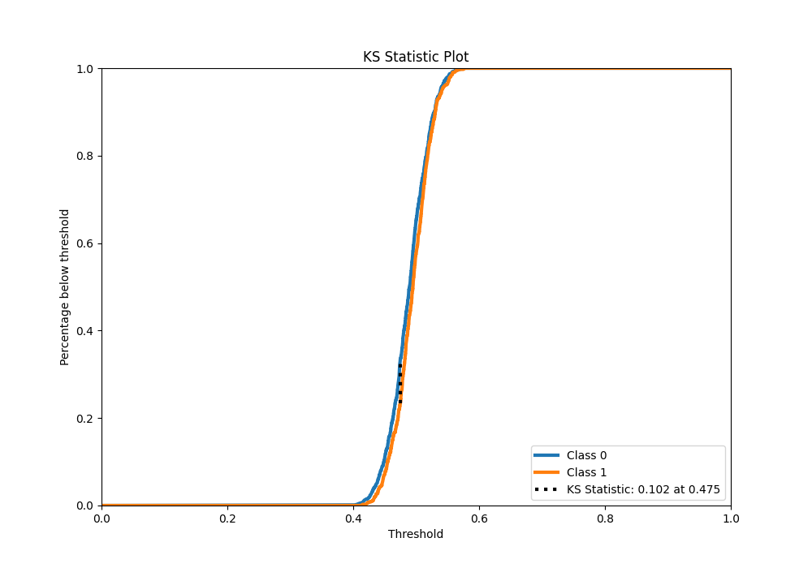
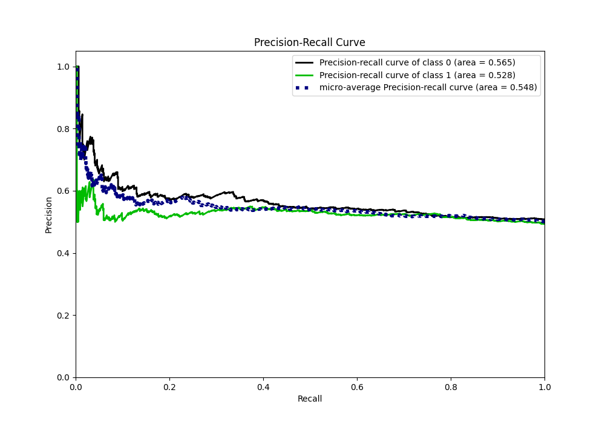
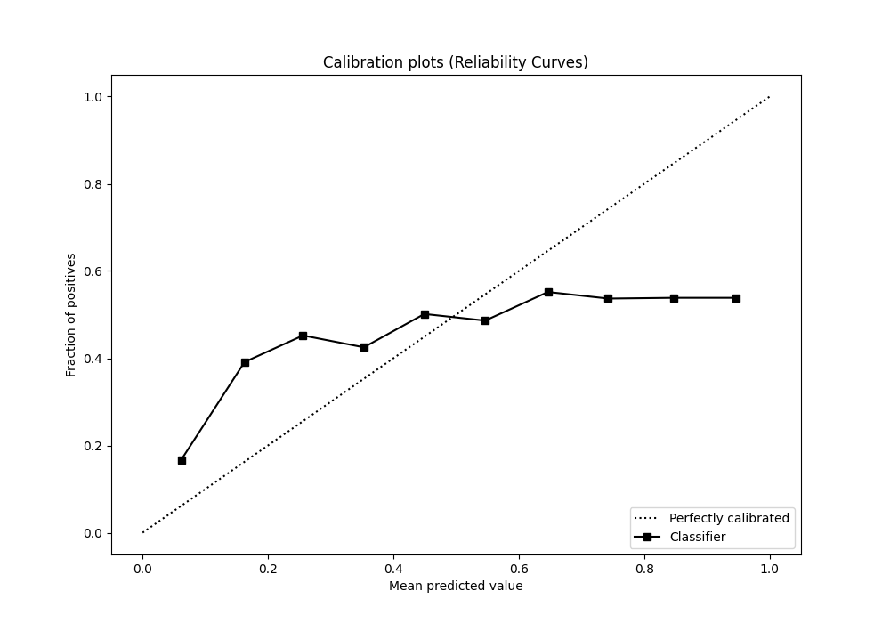
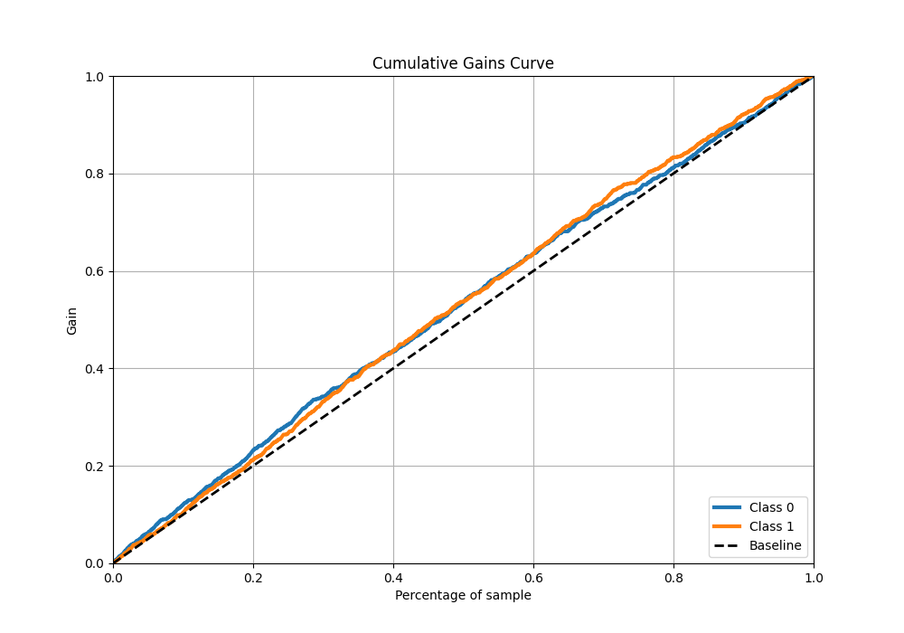
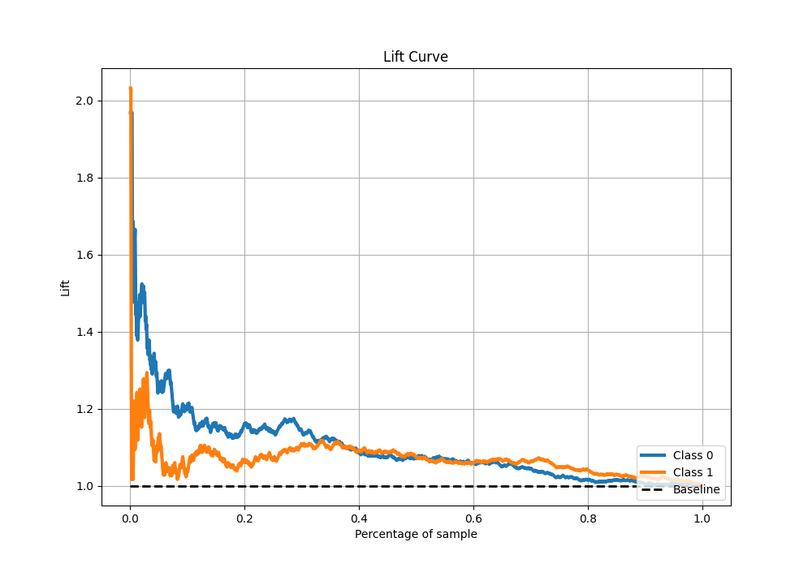
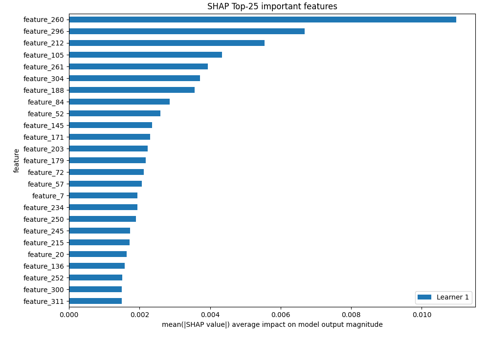

# Summary of 6_Default_RandomForest

[<< Go back](../README.md)

## Random Forest

- **n_jobs**: -1
- **criterion**: gini
- **max_features**: 0.9
- **min_samples_split**: 30
- **max_depth**: 4
- **eval_metric_name**: auc
- **explain_level**: 2

## Validation

- **validation_type**: split
- **train_ratio**: 0.75
- **shuffle**: True
- **stratify**: True

## Optimized metric

auc

## Training time

29.6 seconds

## Metric details

|           |    score |   threshold |
|:----------|---------:|------------:|
| logloss   | 0.689307 |  nan        |
| auc       | 0.551346 |  nan        |
| f1        | 0.659517 |    0.361855 |
| accuracy  | 0.544    |    0.474122 |
| precision | 0.571429 |    0.556599 |
| recall    | 1        |    0.361855 |
| mcc       | 0.106256 |    0.474122 |

## Metric details with threshold from accuracy metric

|           |    score |   threshold |
|:----------|---------:|------------:|
| logloss   | 0.689307 |  nan        |
| auc       | 0.551346 |  nan        |
| f1        | 0.624588 |    0.474122 |
| accuracy  | 0.544    |    0.474122 |
| precision | 0.524908 |    0.474122 |
| recall    | 0.771003 |    0.474122 |
| mcc       | 0.106256 |    0.474122 |

## Confusion matrix (at threshold=0.474122)

|              |   Predicted as 0 |   Predicted as 1 |
|:-------------|-----------------:|-----------------:|
| Labeled as 0 |              247 |              515 |
| Labeled as 1 |              169 |              569 |

## Learning curves

## Permutation-based Importance

## Confusion Matrix

## Normalized Confusion Matrix

## ROC Curve

## Kolmogorov-Smirnov Statistic

## Precision-Recall Curve

## Calibration Curve

## Cumulative Gains Curve

## Lift Curve

## SHAP Importance

[<< Go back](../README.md)
