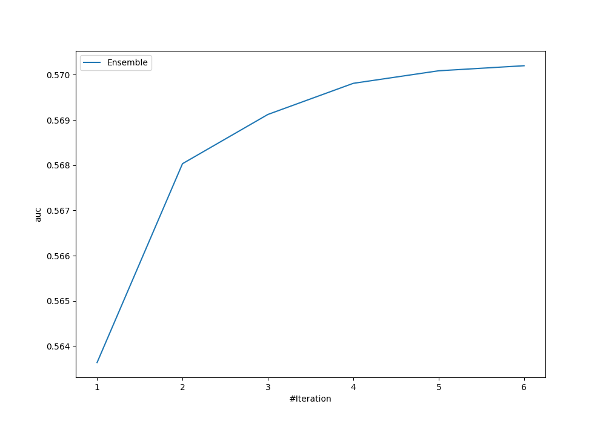
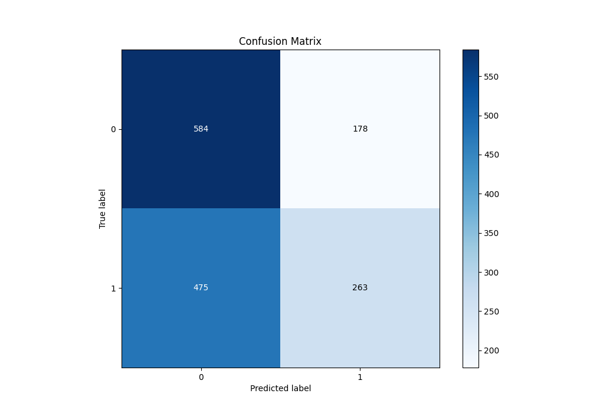
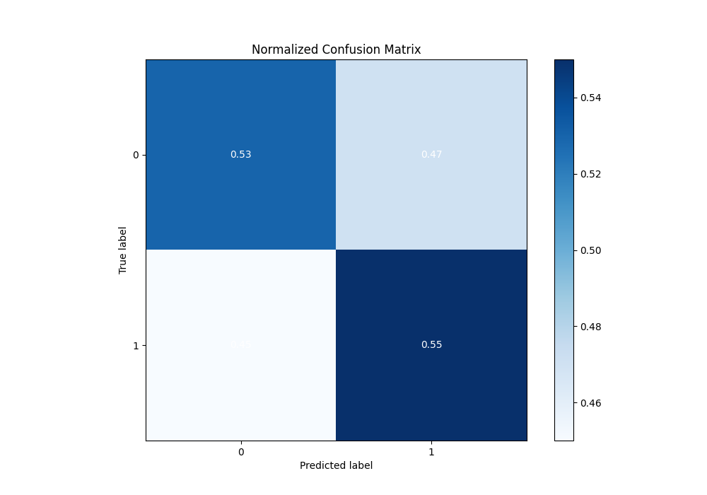
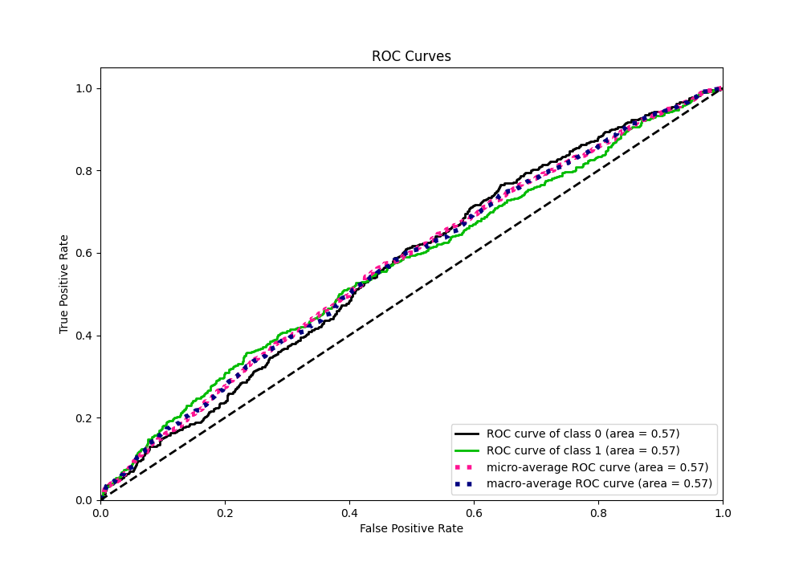
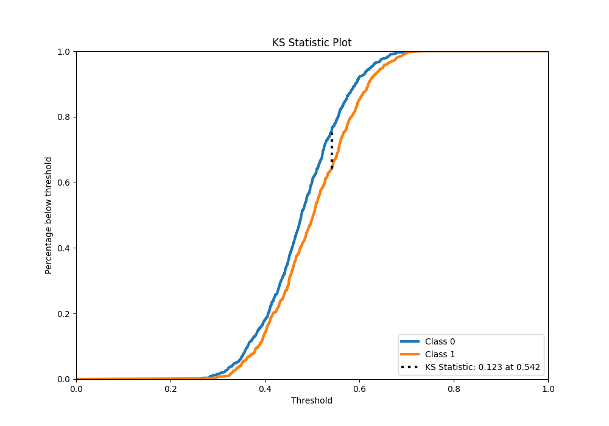
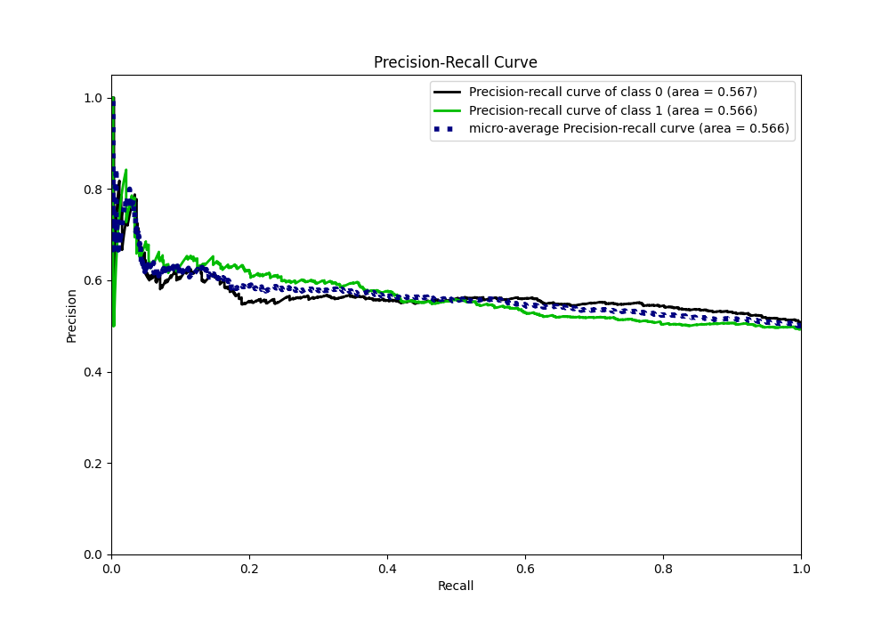
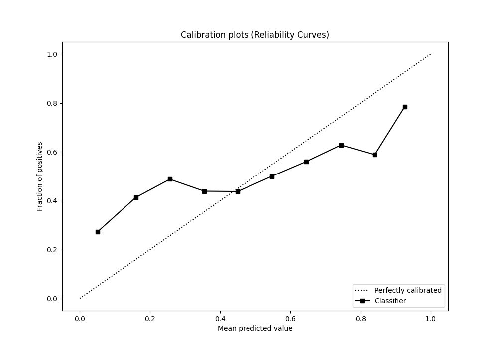
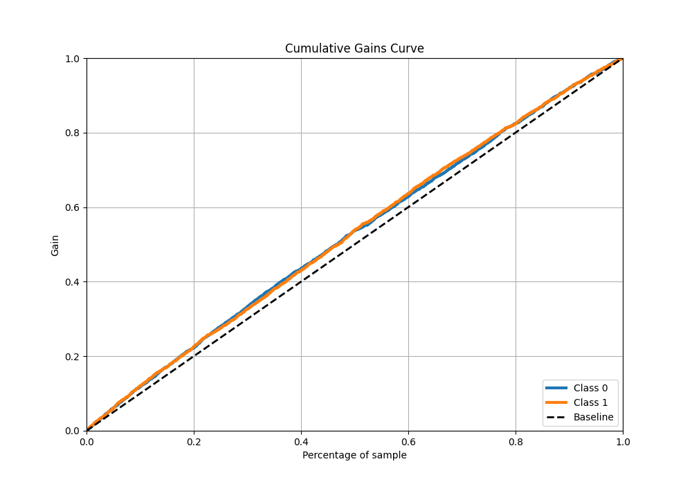
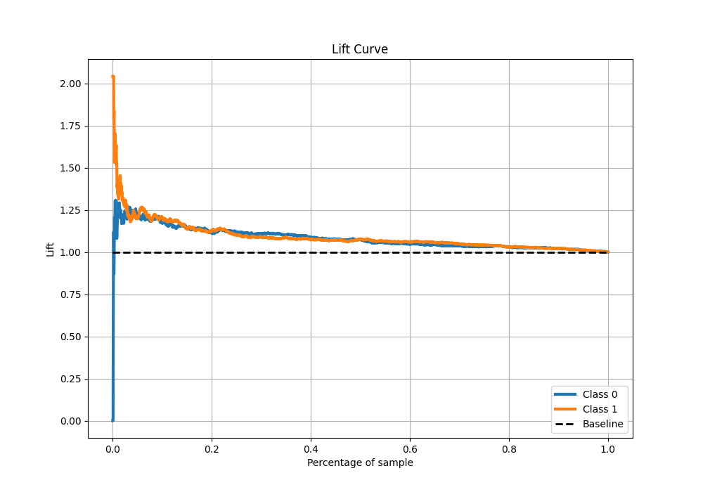

# Summary of Ensemble

[<< Go back](../README.md)

## Ensemble structure

| Model                  |   Weight |
|:-----------------------|---------:|
| 2_DecisionTree         |        1 |
| 3_Linear               |        2 |
| 4_Default_Xgboost      |        1 |
| 6_Default_RandomForest |        2 |

## Metric details

|           |    score |   threshold |
|:----------|---------:|------------:|
| logloss   | 0.685886 |  nan        |
| auc       | 0.570199 |  nan        |
| f1        | 0.659517 |    0.239359 |
| accuracy  | 0.564667 |    0.542542 |
| precision | 0.63522  |    0.605214 |
| recall    | 1        |    0.239359 |
| mcc       | 0.134723 |    0.542542 |

## Metric details with threshold from accuracy metric

|           |    score |   threshold |
|:----------|---------:|------------:|
| logloss   | 0.685886 |  nan        |
| auc       | 0.570199 |  nan        |
| f1        | 0.446141 |    0.542542 |
| accuracy  | 0.564667 |    0.542542 |
| precision | 0.596372 |    0.542542 |
| recall    | 0.356369 |    0.542542 |
| mcc       | 0.134723 |    0.542542 |

## Confusion matrix (at threshold=0.542542)

|              |   Predicted as 0 |   Predicted as 1 |
|:-------------|-----------------:|-----------------:|
| Labeled as 0 |              584 |              178 |
| Labeled as 1 |              475 |              263 |

## Learning curves

## Confusion Matrix

## Normalized Confusion Matrix

## ROC Curve

## Kolmogorov-Smirnov Statistic

## Precision-Recall Curve

## Calibration Curve

## Cumulative Gains Curve

## Lift Curve

[<< Go back](../README.md)
