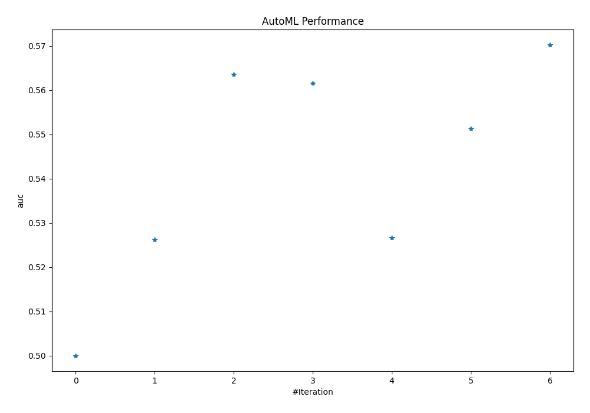
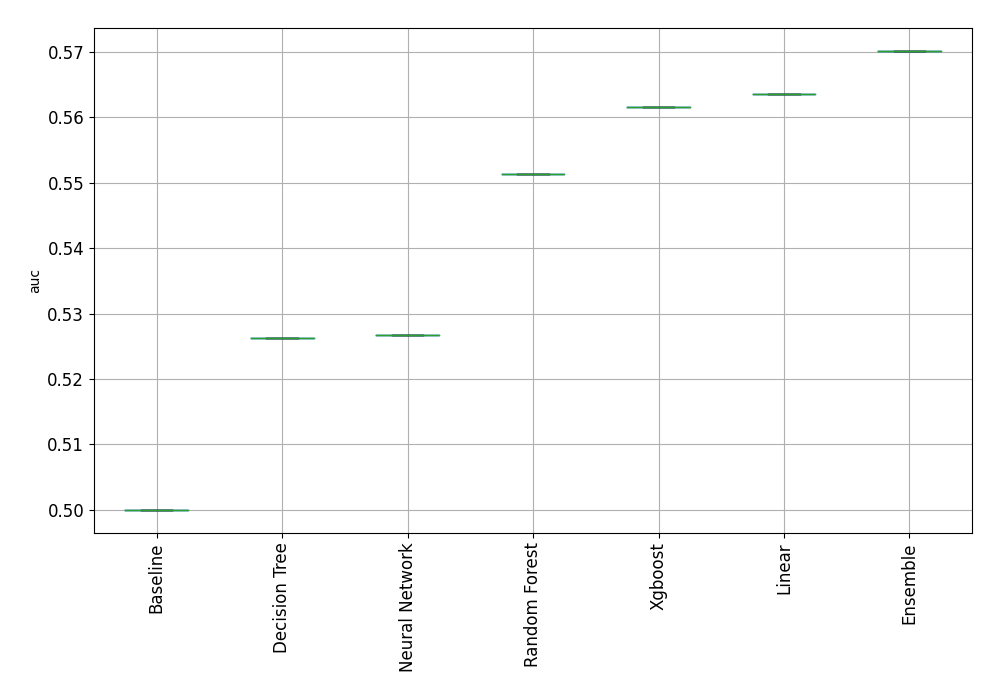
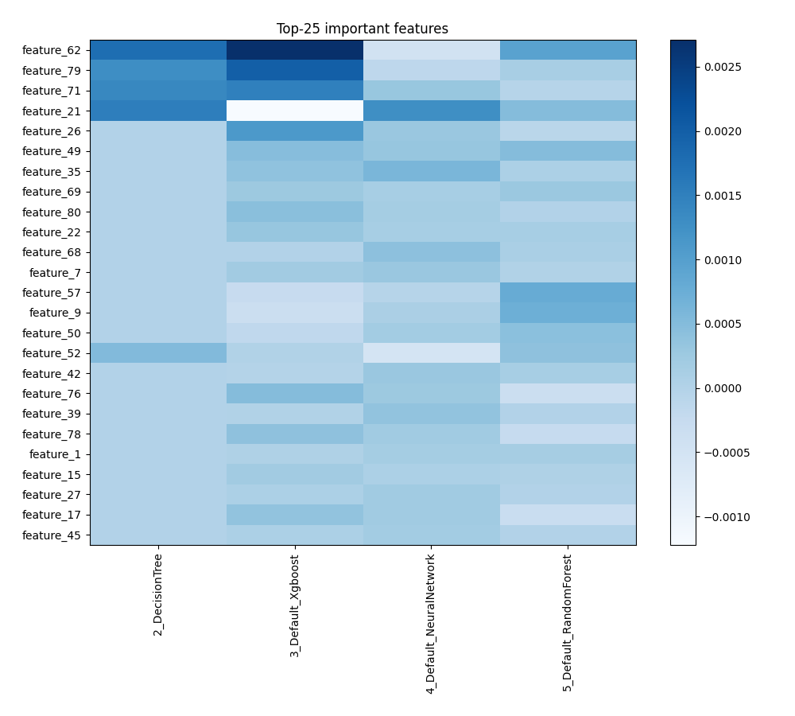

# AutoML Leaderboard

| Best model   | name                                                         | model_type     | metric_type   |   metric_value |   train_time |
|:-------------|:-------------------------------------------------------------|:---------------|:--------------|---------------:|-------------:|
|              | [1_Baseline](1_Baseline/README.md)                           | Baseline       | auc           |       0.5      |         0.95 |
|              | [2_DecisionTree](2_DecisionTree/README.md)                   | Decision Tree  | auc           |       0.51992  |         7.01 |
|              | [3_Default_Xgboost](3_Default_Xgboost/README.md)             | Xgboost        | auc           |       0.523197 |        20.05 |
|              | [4_Default_NeuralNetwork](4_Default_NeuralNetwork/README.md) | Neural Network | auc           |       0.539476 |         4.1  |
|              | [5_Default_RandomForest](5_Default_RandomForest/README.md)   | Random Forest  | auc           |       0.540216 |         6.3  |
| **the
best** | [Ensemble](Ensemble/README.md)                               | Ensemble       | auc           |       0.550526 |         0.65 |

### AutoML Performance

### AutoML Performance Boxplot

### Features Importance

### Spearman Correlation of Models

