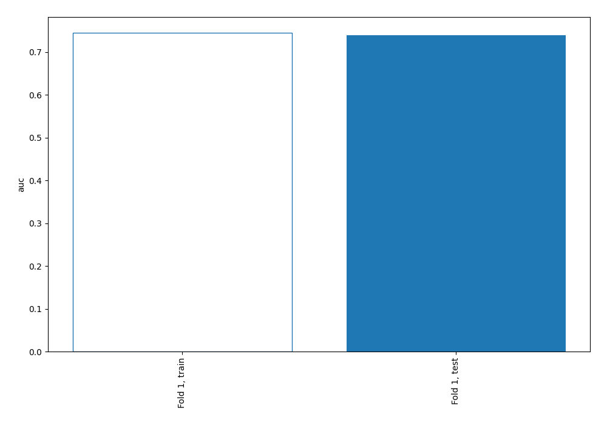
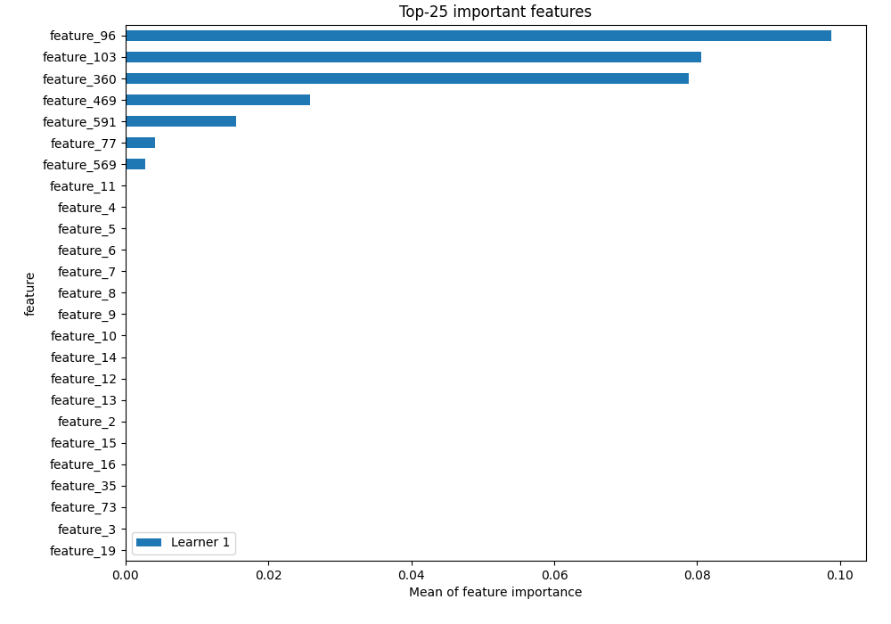
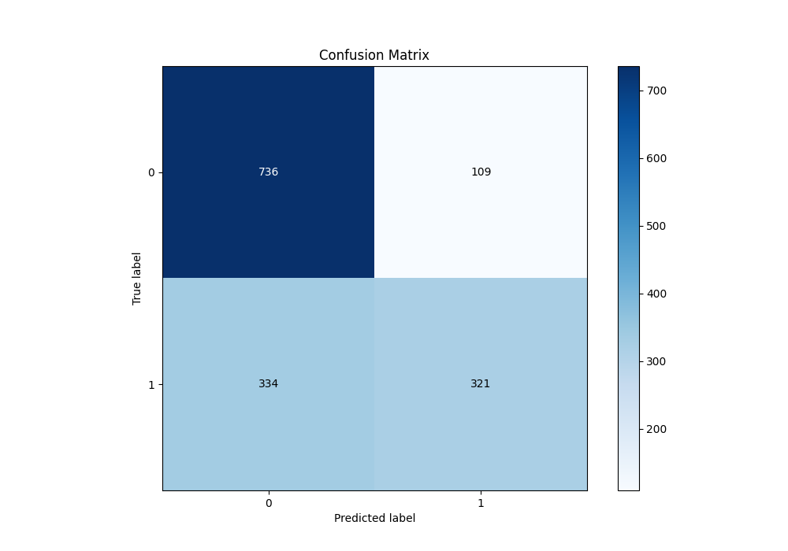
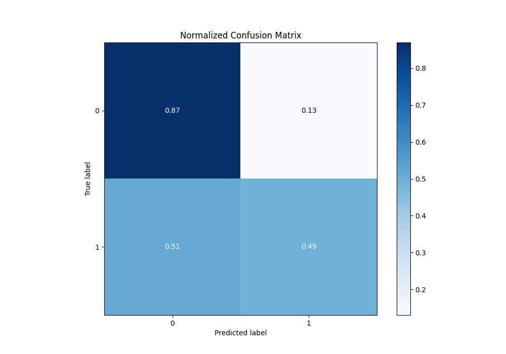
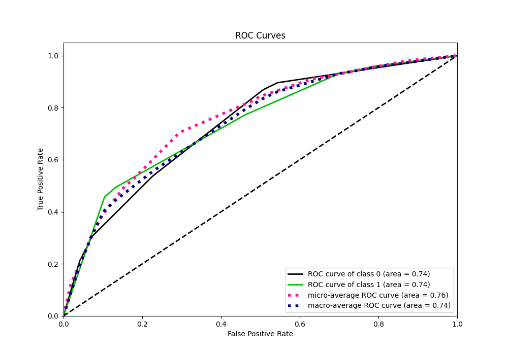
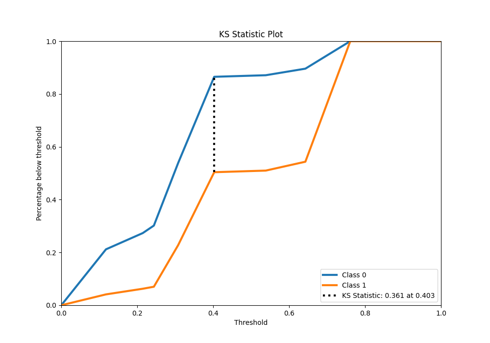
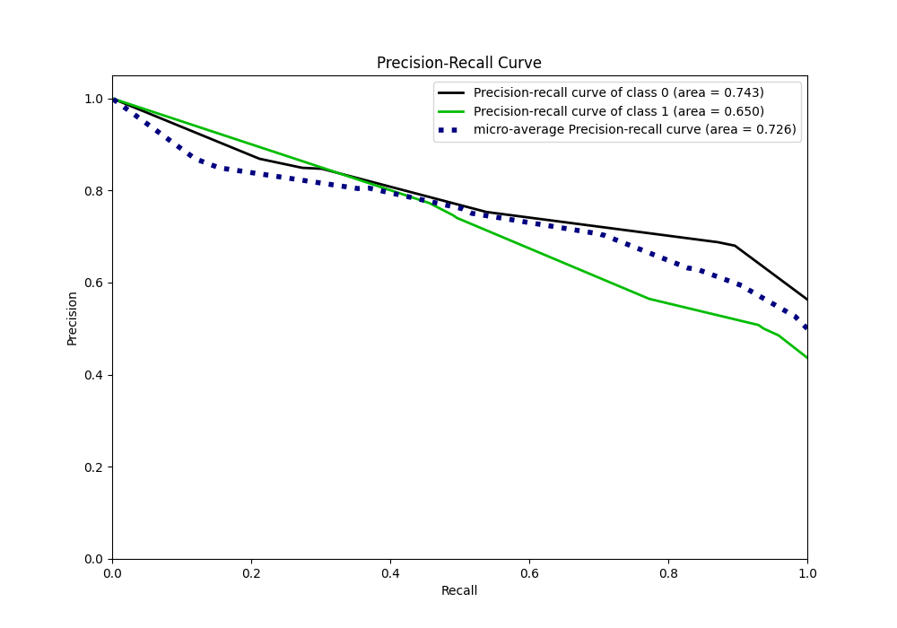
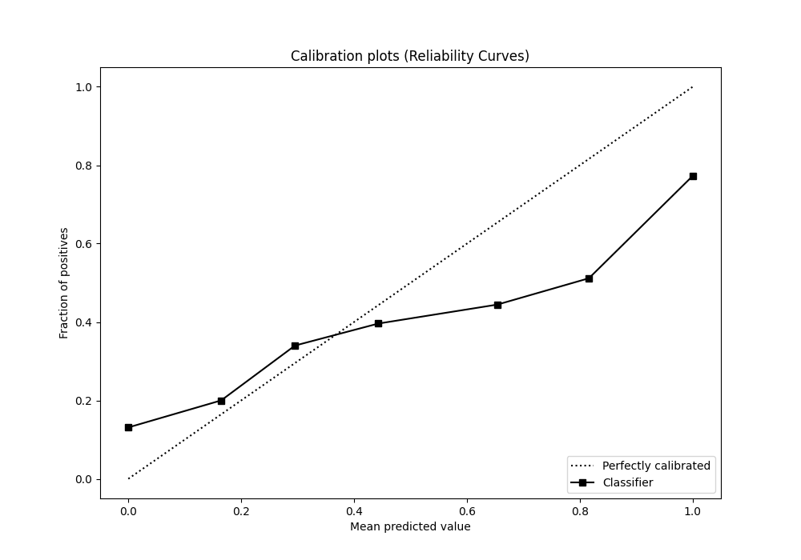
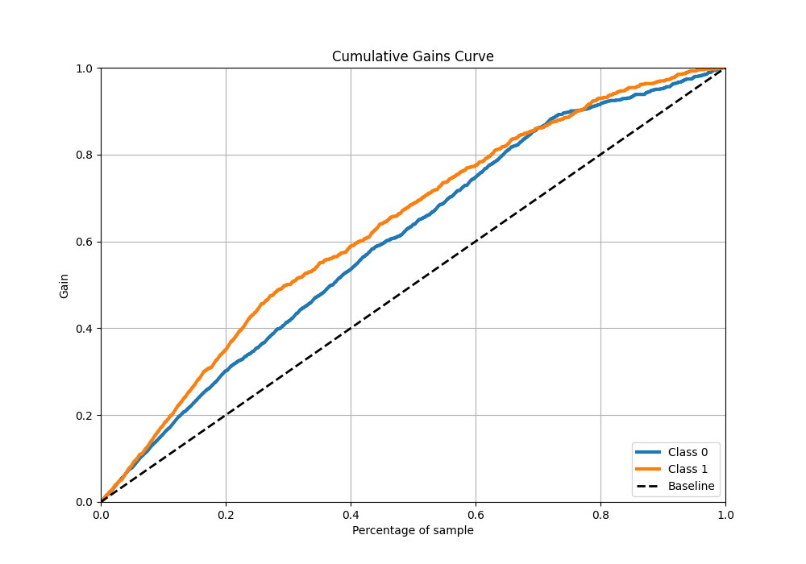
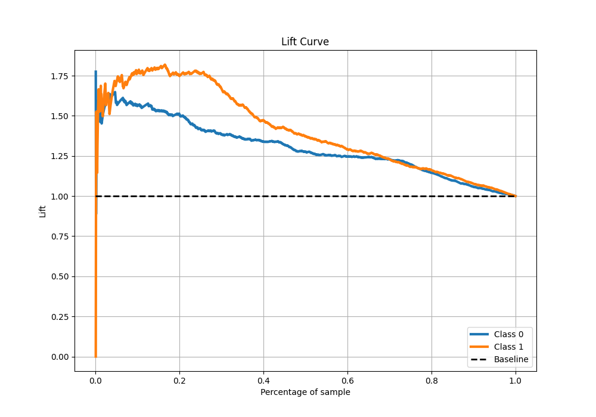

# Summary of 2_DecisionTree

[<< Go back](../README.md)

## Decision Tree

- **n_jobs**: -1
- **criterion**: gini
- **max_depth**: 3
- **explain_level**: 2

## Validation

- **validation_type**: split
- **train_ratio**: 0.75
- **shuffle**: True
- **stratify**: True

## Optimized metric

auc

## Training time

8.6 seconds

## Metric details

|           |    score |   threshold |
|:----------|---------:|------------:|
| logloss   | 0.583441 |  nan        |
| auc       | 0.739429 |  nan        |
| f1        | 0.656958 |    0.260268 |
| accuracy  | 0.704667 |    0.581966 |
| precision | 0.746512 |    0.581966 |
| recall    | 1        |    0.105973 |
| mcc       | 0.396031 |    0.581966 |

## Metric details with threshold from accuracy metric

|           |    score |   threshold |
|:----------|---------:|------------:|
| logloss   | 0.583441 |  nan        |
| auc       | 0.739429 |  nan        |
| f1        | 0.591705 |    0.581966 |
| accuracy  | 0.704667 |    0.581966 |
| precision | 0.746512 |    0.581966 |
| recall    | 0.490076 |    0.581966 |
| mcc       | 0.396031 |    0.581966 |

## Confusion matrix (at threshold=0.581966)

|              |   Predicted as 0 |   Predicted as 1 |
|:-------------|-----------------:|-----------------:|
| Labeled as 0 |              736 |              109 |
| Labeled as 1 |              334 |              321 |

## Learning curves

## Permutation-based Importance

## Confusion Matrix

## Normalized Confusion Matrix

## ROC Curve

## Kolmogorov-Smirnov Statistic

## Precision-Recall Curve

## Calibration Curve

## Cumulative Gains Curve

## Lift Curve

[<< Go back](../README.md)
