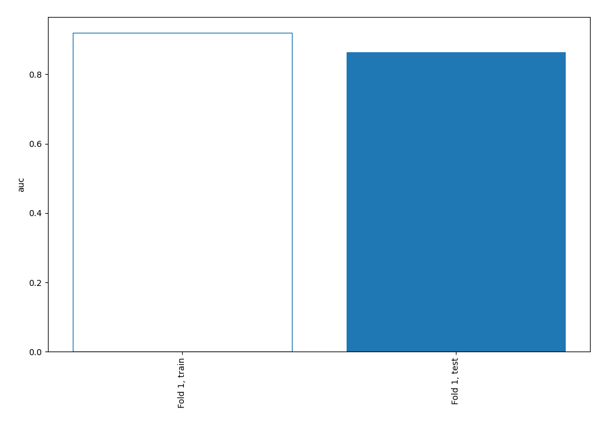
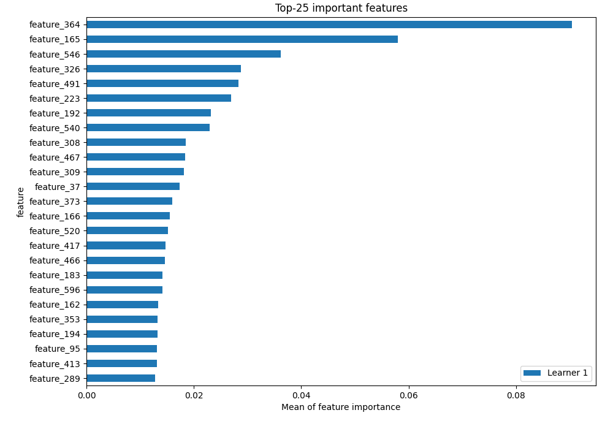
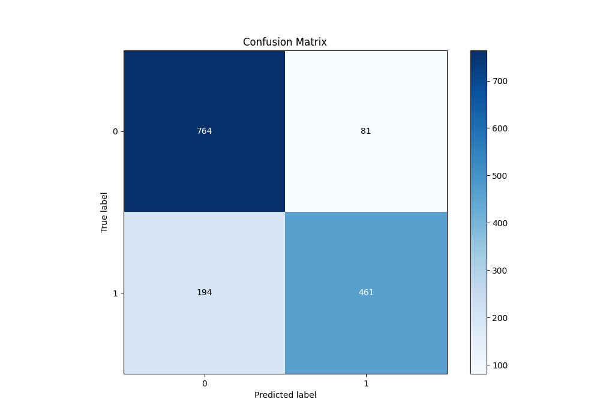
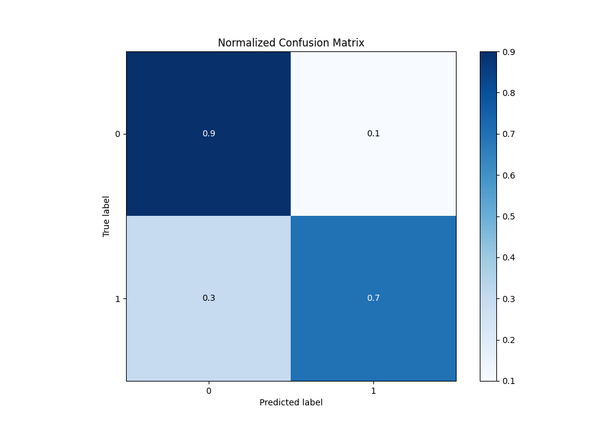
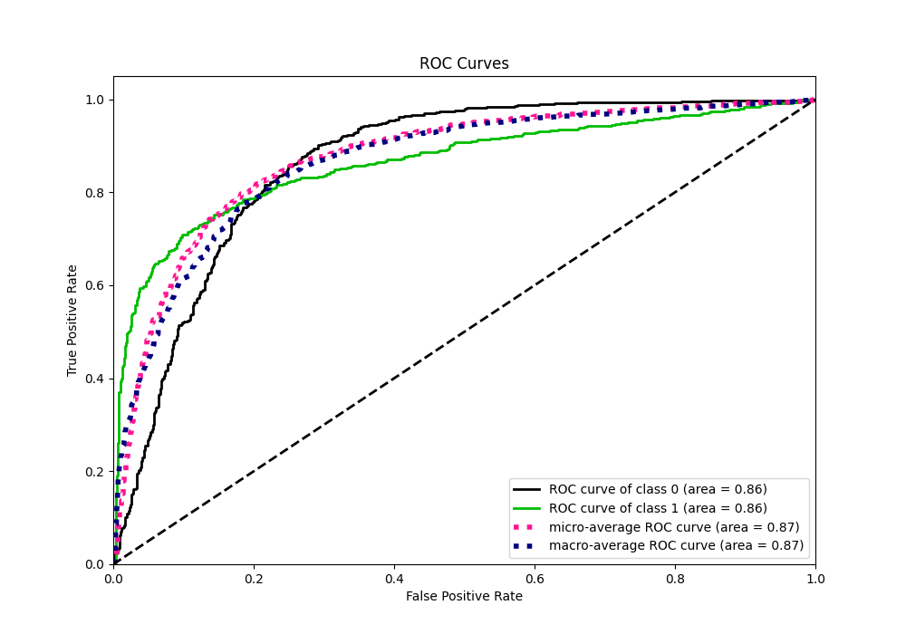
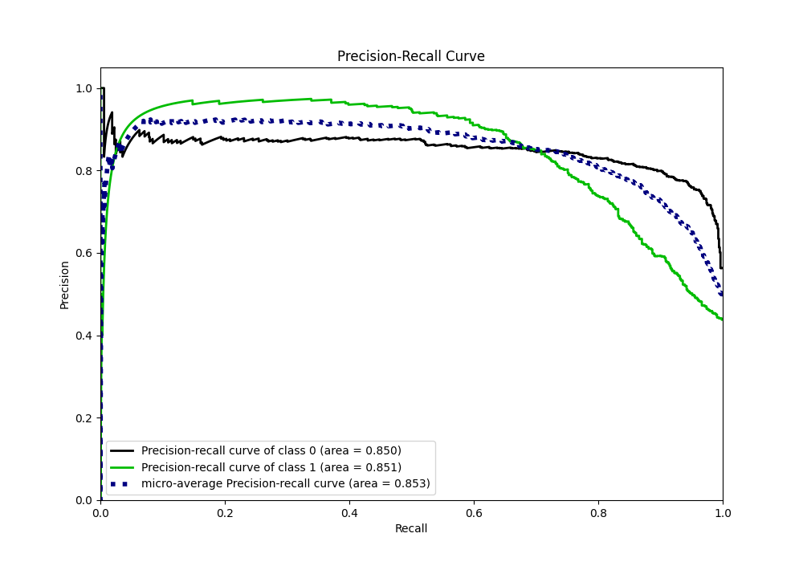
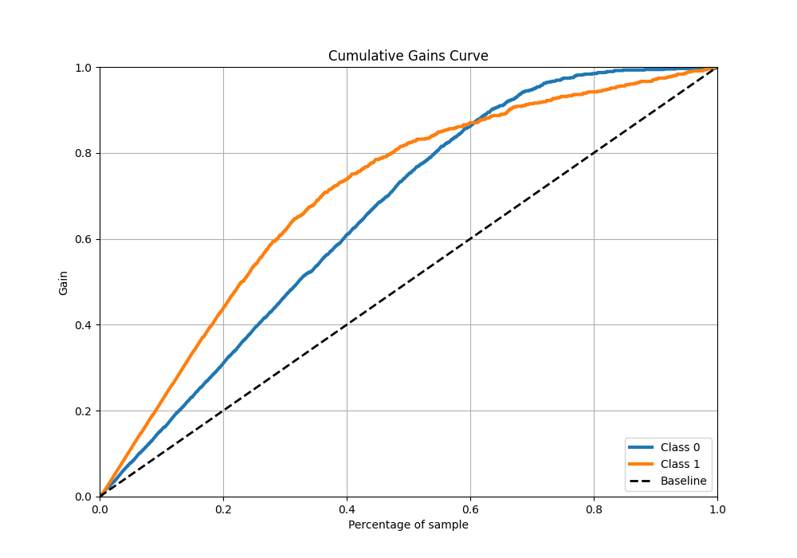
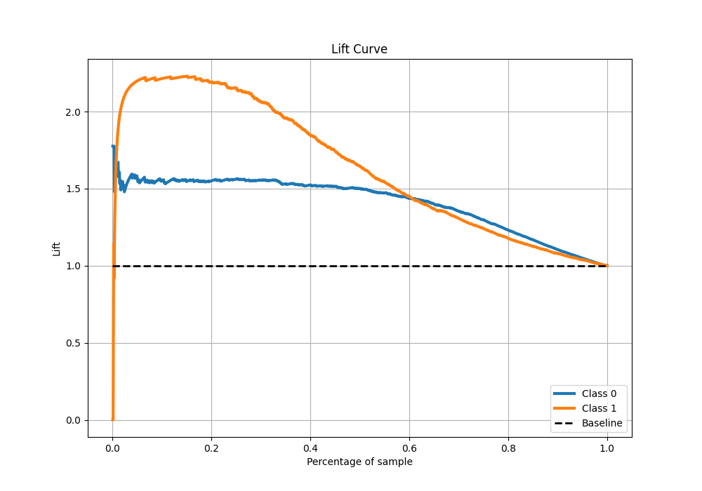

# Summary of 3_Linear

[<< Go back](../README.md)

## Logistic Regression (Linear)

- **n_jobs**: -1
- **explain_level**: 2

## Validation

- **validation_type**: split
- **train_ratio**: 0.75
- **shuffle**: True
- **stratify**: True

## Optimized metric

auc

## Training time

14.2 seconds

## Metric details

|           |    score |     threshold |
|:----------|---------:|--------------:|
| logloss   | 0.493363 | nan           |
| auc       | 0.86439  | nan           |
| f1        | 0.775849 |   0.450781    |
| accuracy  | 0.816667 |   0.645845    |
| precision | 0.969512 |   0.981788    |
| recall    | 1        |   9.51433e-05 |
| mcc       | 0.627684 |   0.645845    |

## Metric details with threshold from accuracy metric

|           |    score |   threshold |
|:----------|---------:|------------:|
| logloss   | 0.493363 |  nan        |
| auc       | 0.86439  |  nan        |
| f1        | 0.770259 |    0.645845 |
| accuracy  | 0.816667 |    0.645845 |
| precision | 0.850554 |    0.645845 |
| recall    | 0.703817 |    0.645845 |
| mcc       | 0.627684 |    0.645845 |

## Confusion matrix (at threshold=0.645845)

|              |   Predicted as 0 |   Predicted as 1 |
|:-------------|-----------------:|-----------------:|
| Labeled as 0 |              764 |               81 |
| Labeled as 1 |              194 |              461 |

## Learning curves

## Permutation-based Importance

## Confusion Matrix

## Normalized Confusion Matrix

## ROC Curve

## Kolmogorov-Smirnov Statistic

## Precision-Recall Curve

## Calibration Curve

## Cumulative Gains Curve

## Lift Curve

[<< Go back](../README.md)
