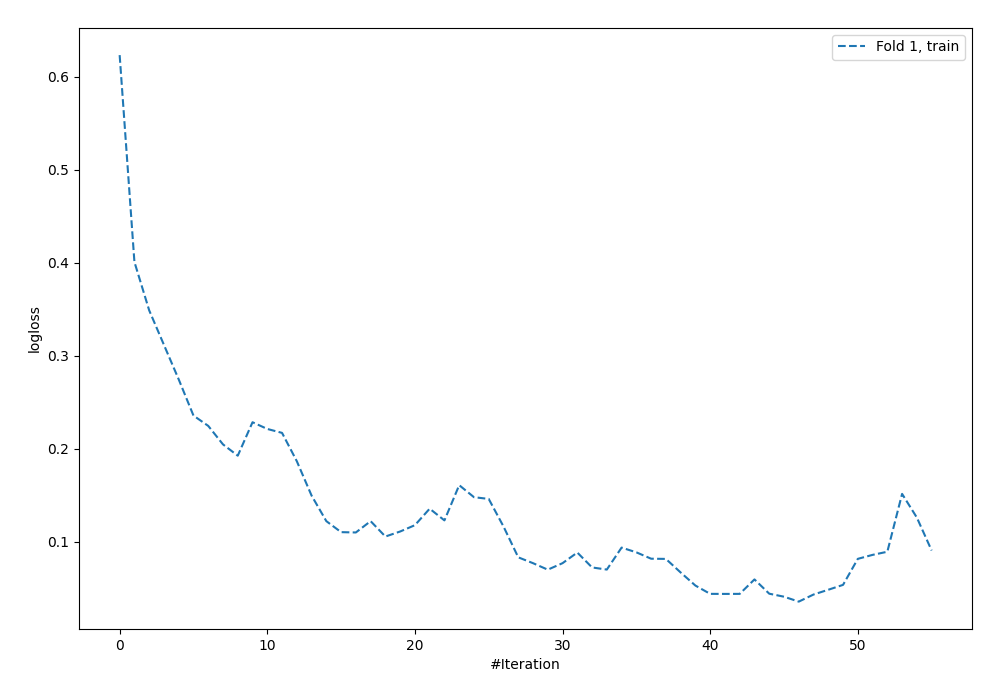
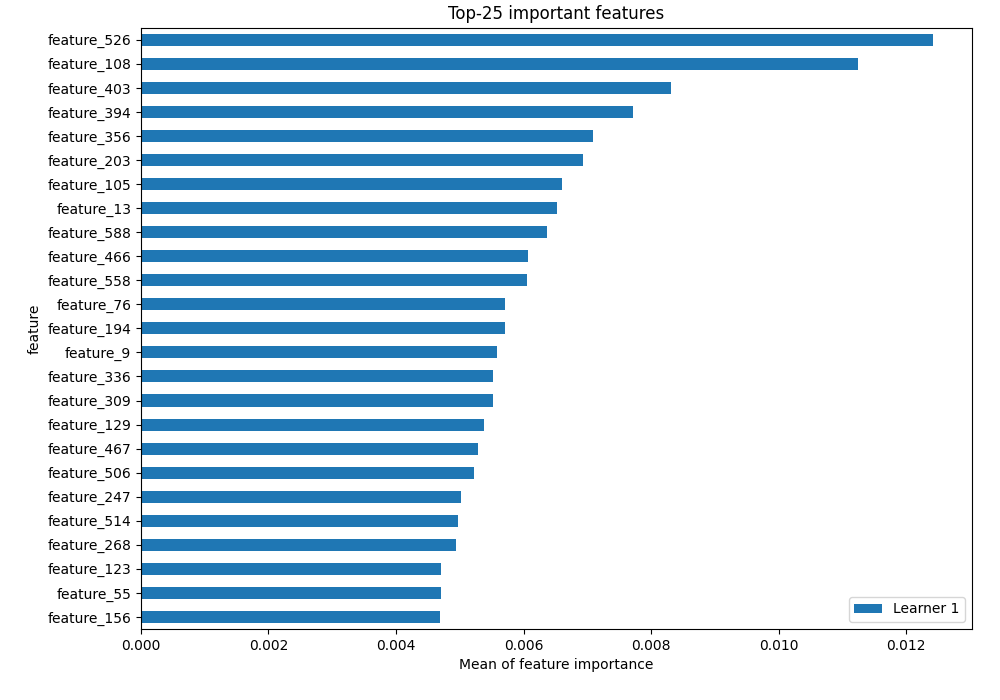
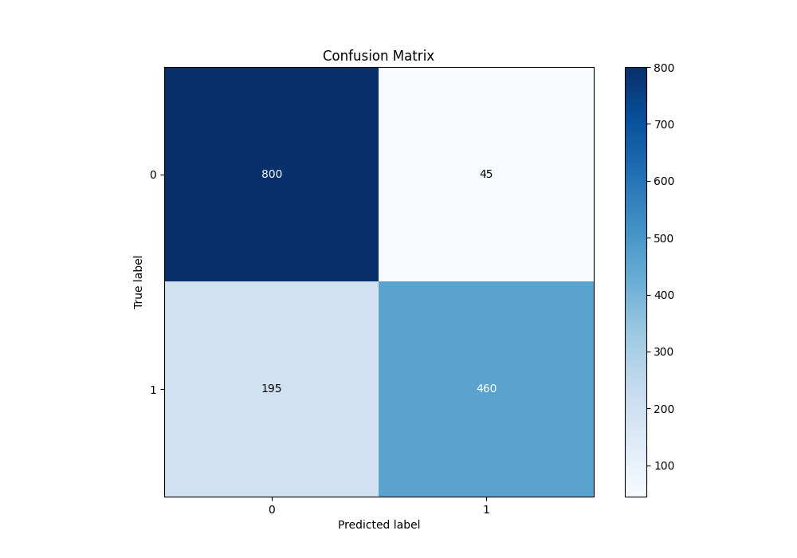
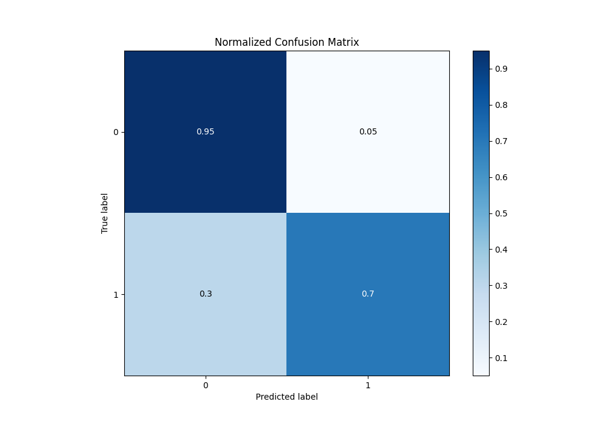
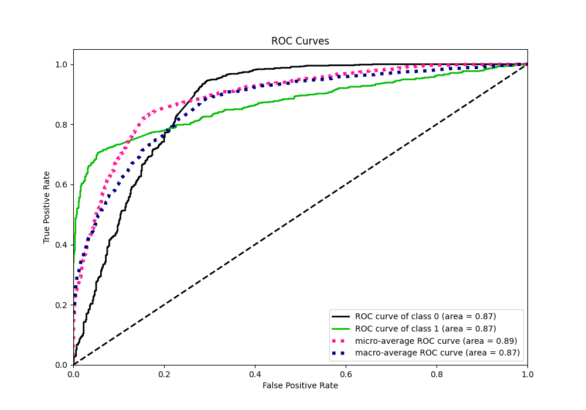
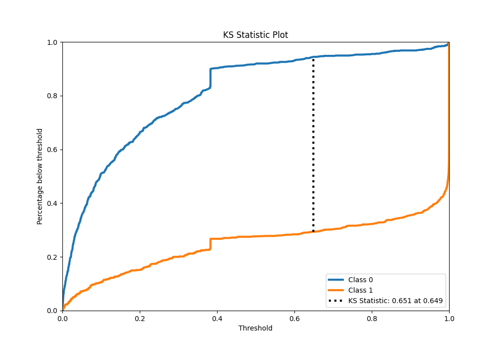
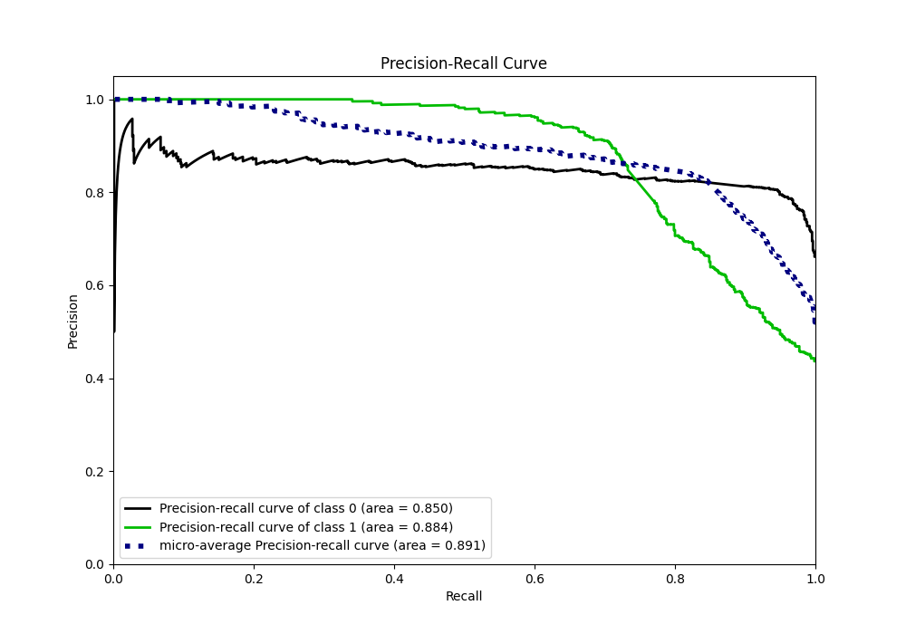
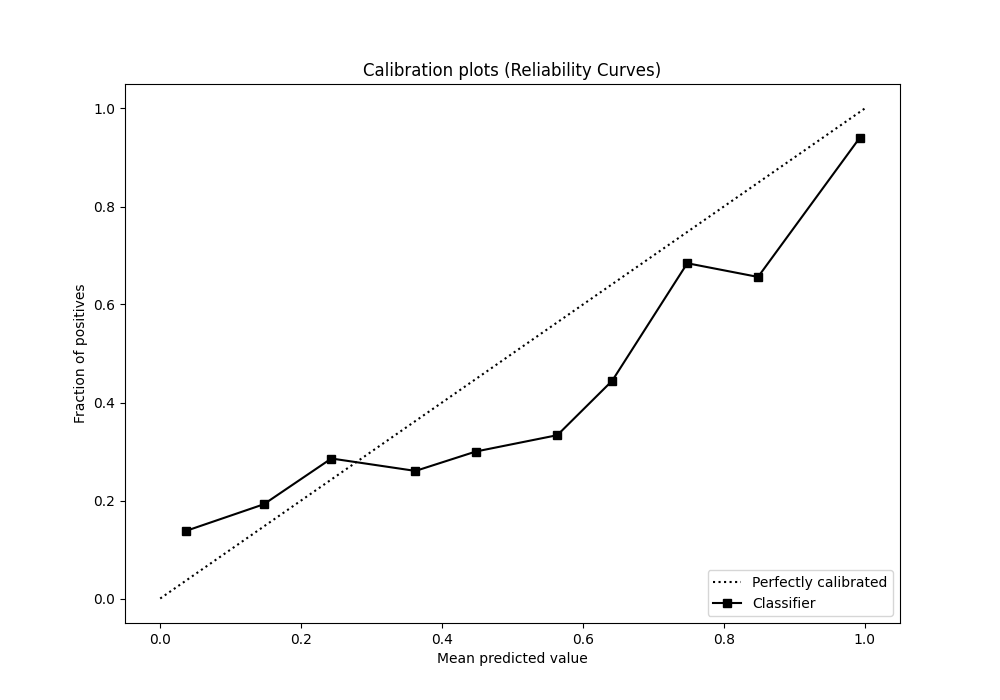
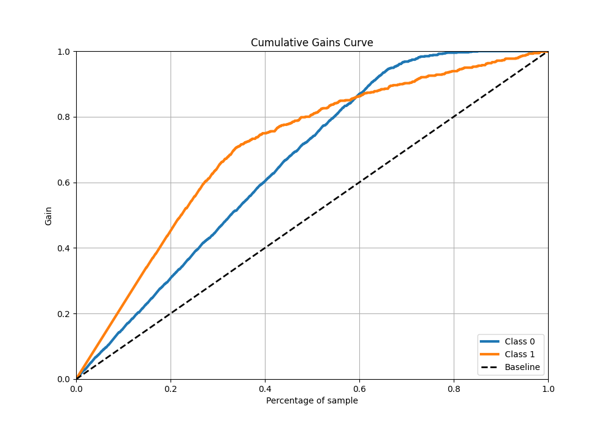
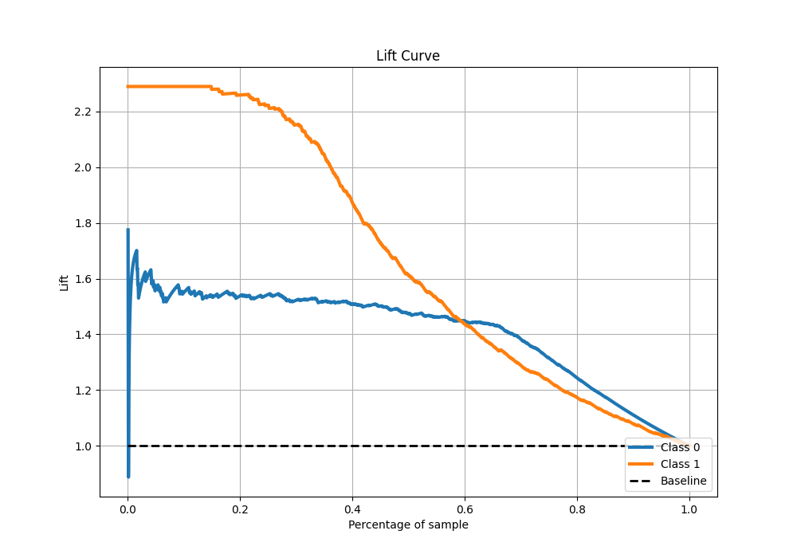

# Summary of 5_Default_NeuralNetwork

[<< Go back](../README.md)

## Neural Network

- **n_jobs**: -1
- **dense_1_size**: 32
- **dense_2_size**: 16
- **learning_rate**: 0.05
- **explain_level**: 2

## Validation

- **validation_type**: split
- **train_ratio**: 0.75
- **shuffle**: True
- **stratify**: True

## Optimized metric

auc

## Training time

9.1 seconds

## Metric details

|           |    score |     threshold |
|:----------|---------:|--------------:|
| logloss   | 0.498088 | nan           |
| auc       | 0.869571 | nan           |
| f1        | 0.794915 |   0.61198     |
| accuracy  | 0.84     |   0.6751      |
| precision | 1        |   1           |
| recall    | 1        |   4.70116e-09 |
| mcc       | 0.681178 |   0.6751      |

## Metric details with threshold from accuracy metric

|           |    score |   threshold |
|:----------|---------:|------------:|
| logloss   | 0.498088 |    nan      |
| auc       | 0.869571 |    nan      |
| f1        | 0.793103 |      0.6751 |
| accuracy  | 0.84     |      0.6751 |
| precision | 0.910891 |      0.6751 |
| recall    | 0.70229  |      0.6751 |
| mcc       | 0.681178 |      0.6751 |

## Confusion matrix (at threshold=0.6751)

|              |   Predicted as 0 |   Predicted as 1 |
|:-------------|-----------------:|-----------------:|
| Labeled as 0 |              800 |               45 |
| Labeled as 1 |              195 |              460 |

## Learning curves

## Permutation-based Importance

## Confusion Matrix

## Normalized Confusion Matrix

## ROC Curve

## Kolmogorov-Smirnov Statistic

## Precision-Recall Curve

## Calibration Curve

## Cumulative Gains Curve

## Lift Curve

[<< Go back](../README.md)
