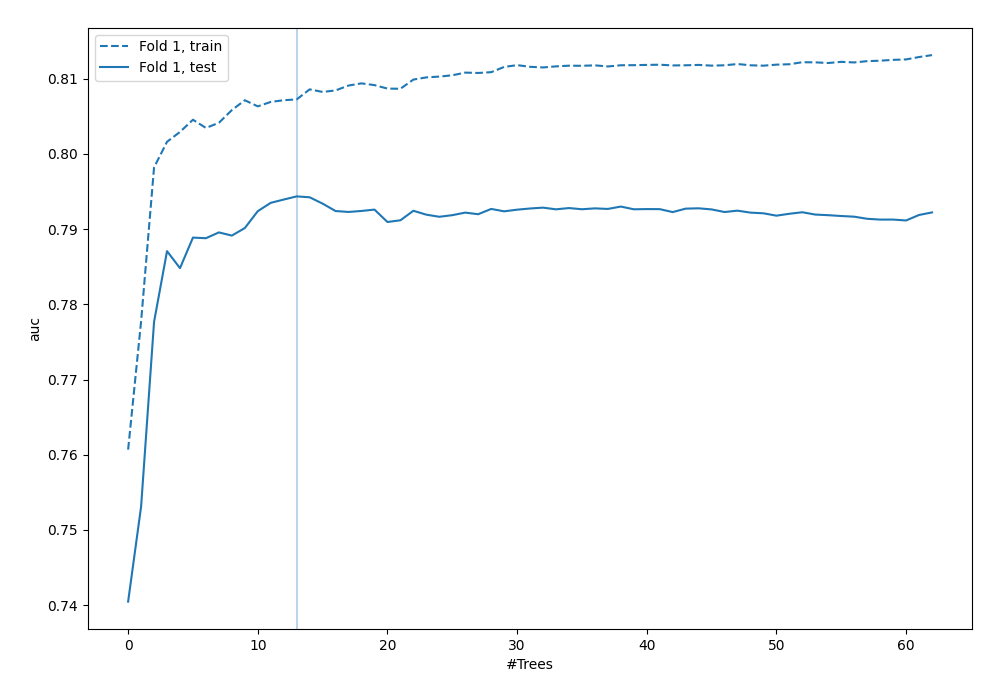
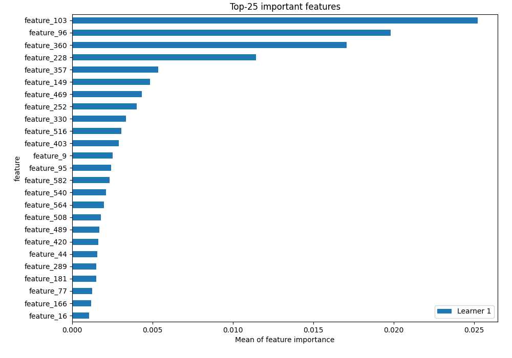
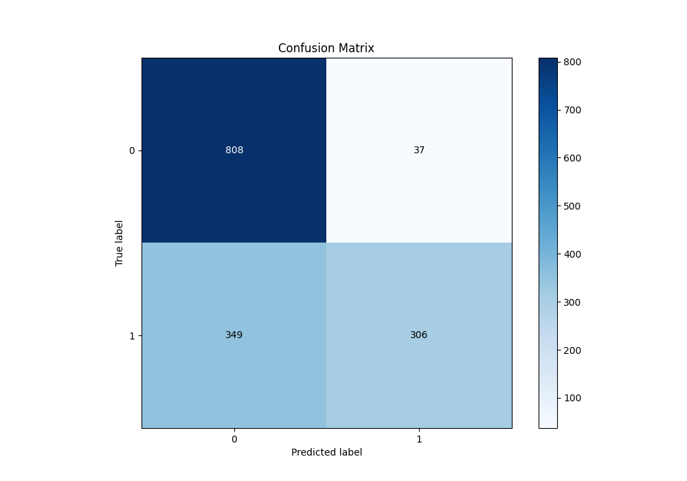
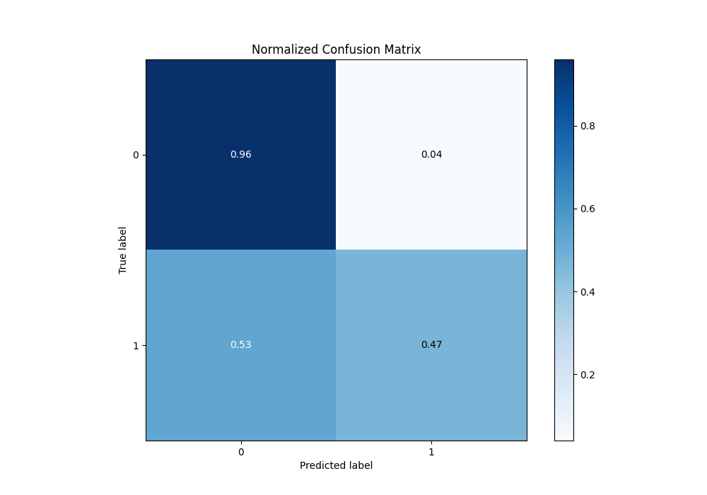
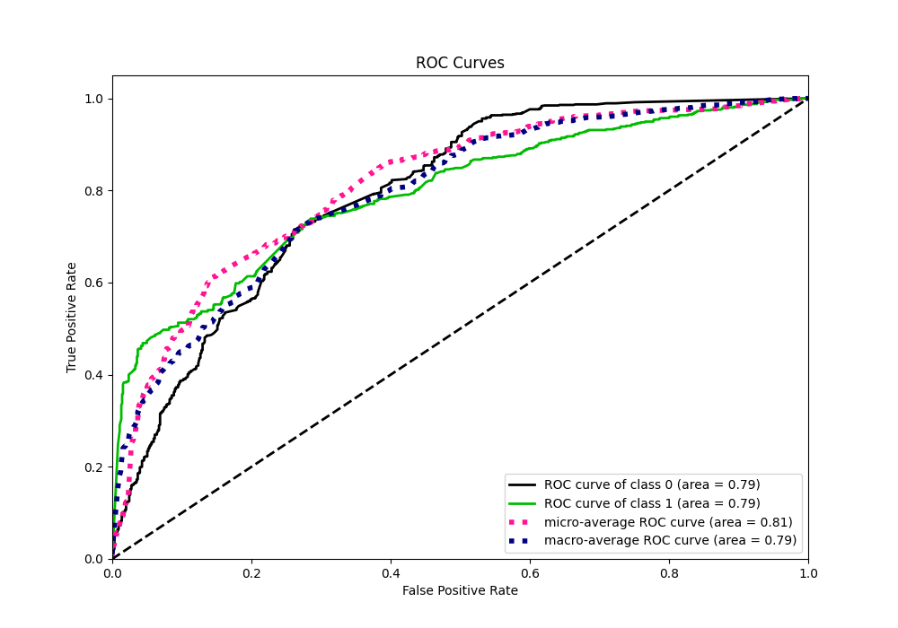
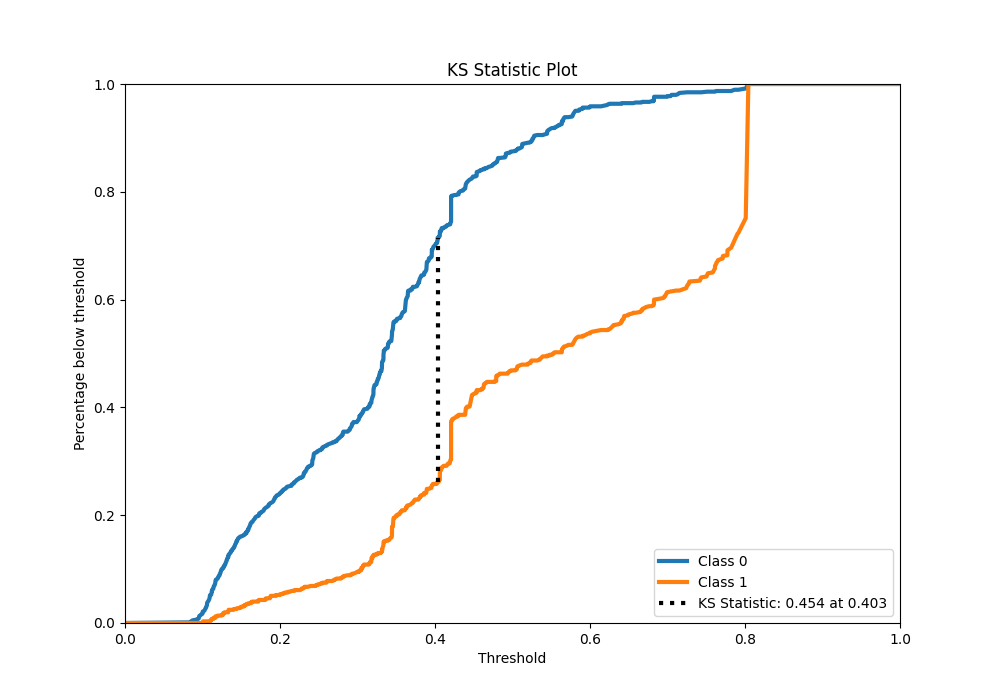
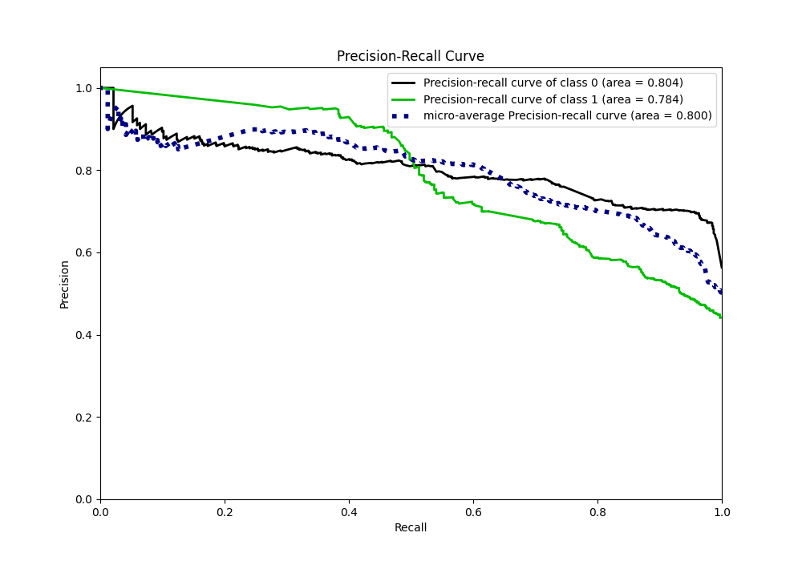
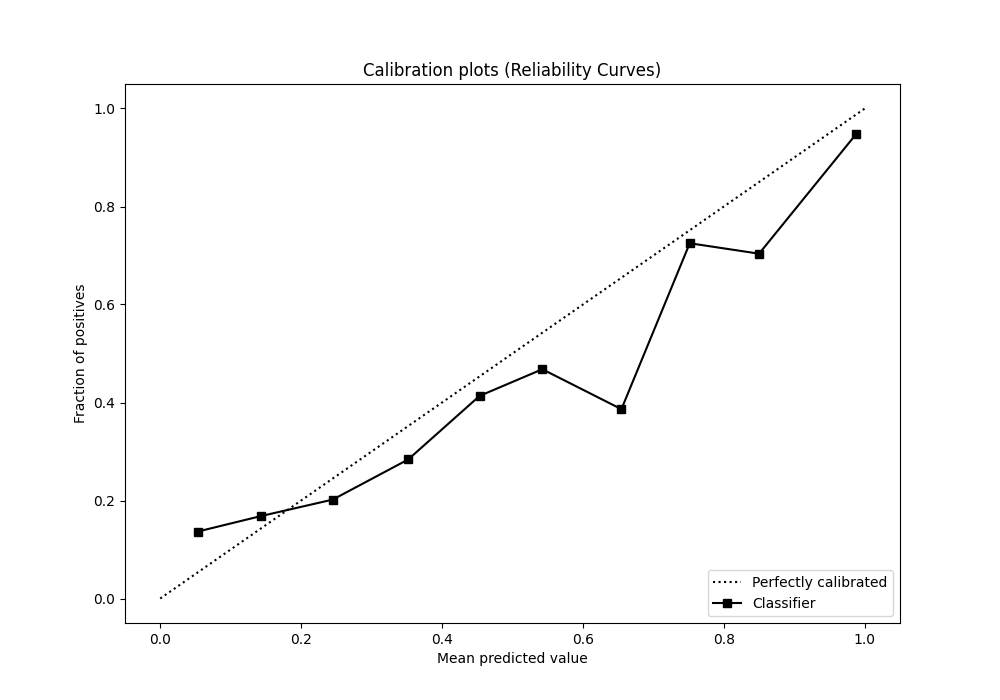
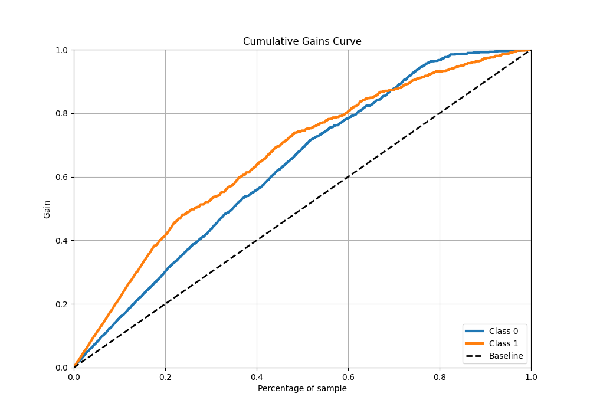
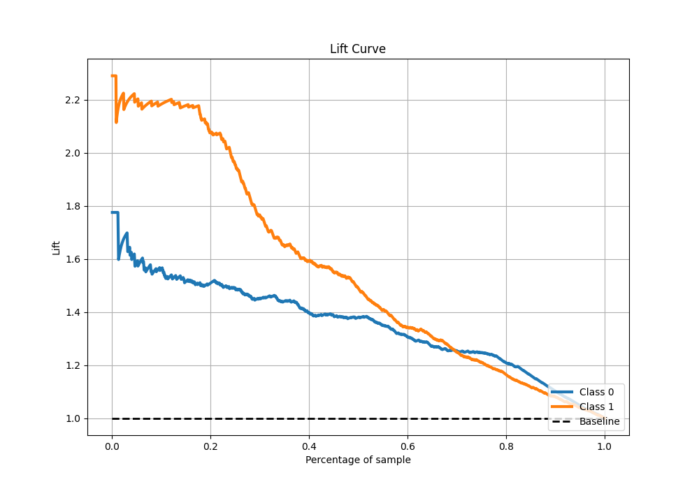

# Summary of 6_Default_RandomForest

[<< Go back](../README.md)

## Random Forest

- **n_jobs**: -1
- **criterion**: gini
- **max_features**: 0.9
- **min_samples_split**: 30
- **max_depth**: 4
- **eval_metric_name**: auc
- **explain_level**: 2

## Validation

- **validation_type**: split
- **train_ratio**: 0.75
- **shuffle**: True
- **stratify**: True

## Optimized metric

auc

## Training time

24.0 seconds

## Metric details

|           |    score |   threshold |
|:----------|---------:|------------:|
| logloss   | 0.53895  | nan         |
| auc       | 0.794363 | nan         |
| f1        | 0.695218 |   0.396989  |
| accuracy  | 0.742667 |   0.59434   |
| precision | 0.958824 |   0.800951  |
| recall    | 1        |   0.0745929 |
| mcc       | 0.501343 |   0.626023  |

## Metric details with threshold from accuracy metric

|           |    score |   threshold |
|:----------|---------:|------------:|
| logloss   | 0.53895  |   nan       |
| auc       | 0.794363 |   nan       |
| f1        | 0.613226 |     0.59434 |
| accuracy  | 0.742667 |     0.59434 |
| precision | 0.892128 |     0.59434 |
| recall    | 0.467176 |     0.59434 |
| mcc       | 0.500005 |     0.59434 |

## Confusion matrix (at threshold=0.59434)

|              |   Predicted as 0 |   Predicted as 1 |
|:-------------|-----------------:|-----------------:|
| Labeled as 0 |              808 |               37 |
| Labeled as 1 |              349 |              306 |

## Learning curves

## Permutation-based Importance

## Confusion Matrix

## Normalized Confusion Matrix

## ROC Curve

## Kolmogorov-Smirnov Statistic

## Precision-Recall Curve

## Calibration Curve

## Cumulative Gains Curve

## Lift Curve

[<< Go back](../README.md)
