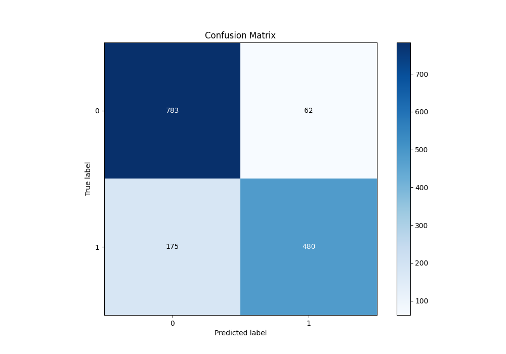
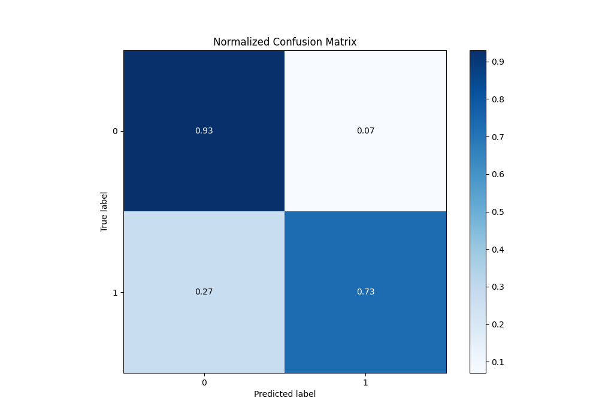
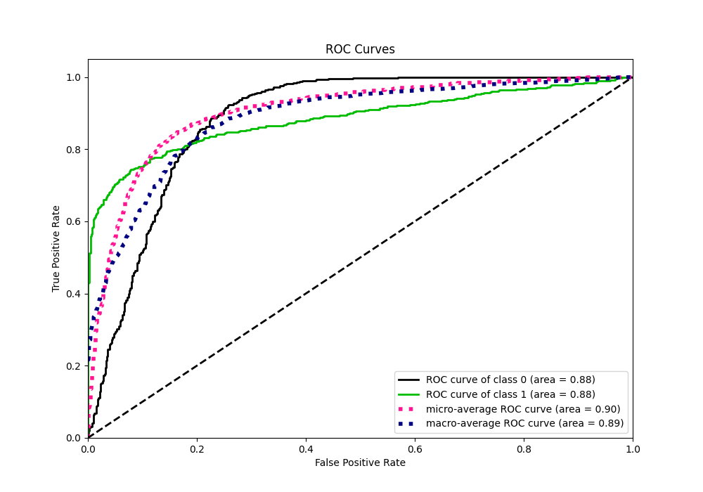
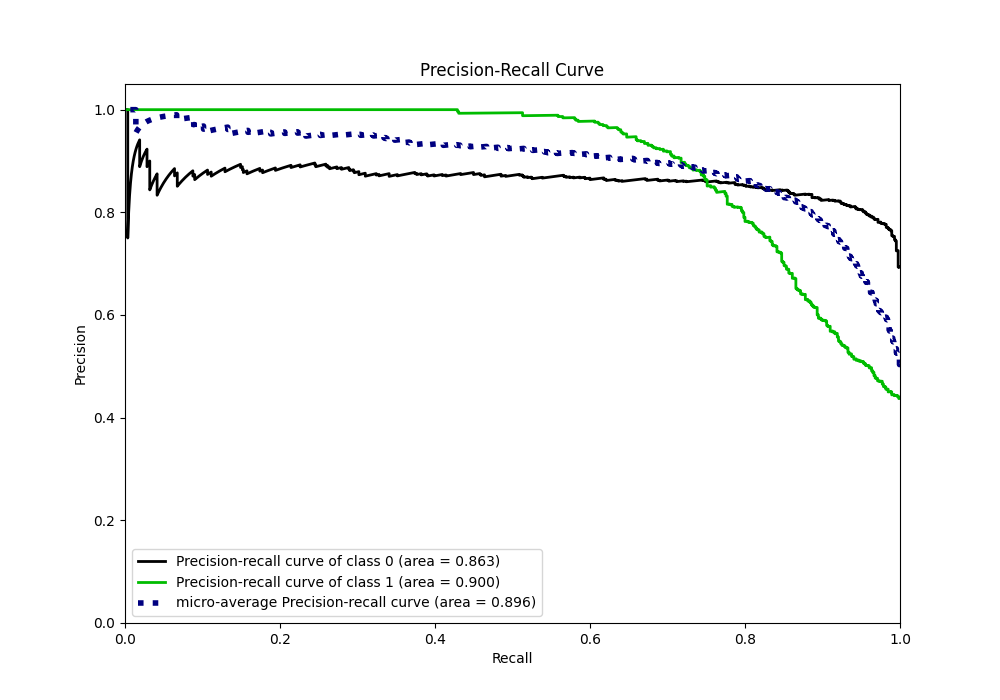
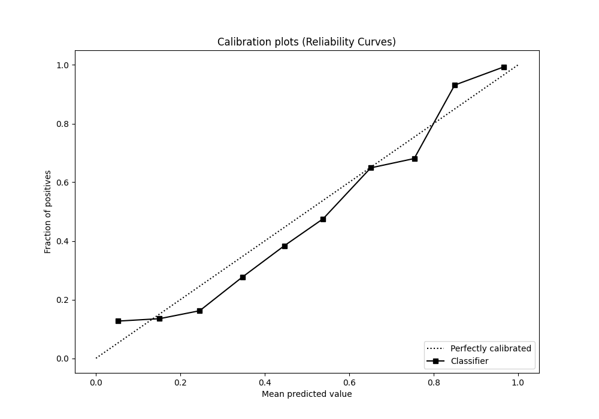
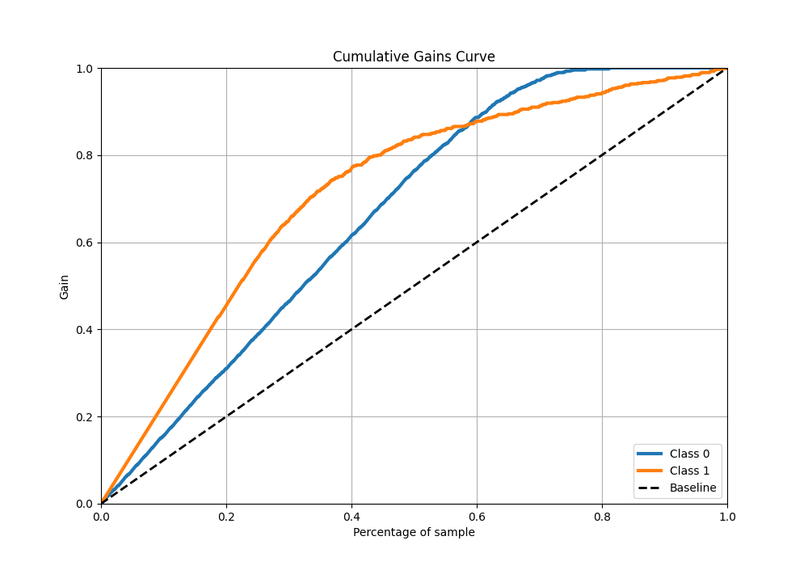
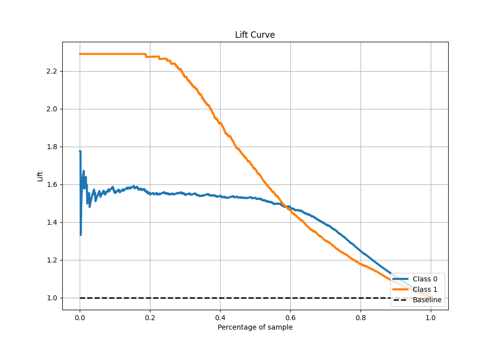

# Summary of Ensemble

[<< Go back](../README.md)

## Ensemble structure

| Model                   |   Weight |
|:------------------------|---------:|
| 3_Linear                |        1 |
| 4_Default_Xgboost       |        1 |
| 5_Default_NeuralNetwork |        1 |

## Metric details

|           |    score |    threshold |
|:----------|---------:|-------------:|
| logloss   | 0.395402 | nan          |
| auc       | 0.88475  | nan          |
| f1        | 0.805071 |   0.439696   |
| accuracy  | 0.842    |   0.519909   |
| precision | 1        |   0.973635   |
| recall    | 1        |   0.00300079 |
| mcc       | 0.685303 |   0.610451   |

## Metric details with threshold from accuracy metric

|           |    score |   threshold |
|:----------|---------:|------------:|
| logloss   | 0.395402 |  nan        |
| auc       | 0.88475  |  nan        |
| f1        | 0.802005 |    0.519909 |
| accuracy  | 0.842    |    0.519909 |
| precision | 0.885609 |    0.519909 |
| recall    | 0.732824 |    0.519909 |
| mcc       | 0.680847 |    0.519909 |

## Confusion matrix (at threshold=0.519909)

|              |   Predicted as 0 |   Predicted as 1 |
|:-------------|-----------------:|-----------------:|
| Labeled as 0 |              783 |               62 |
| Labeled as 1 |              175 |              480 |

## Learning curves

## Confusion Matrix

## Normalized Confusion Matrix

## ROC Curve

## Kolmogorov-Smirnov Statistic

## Precision-Recall Curve

## Calibration Curve

## Cumulative Gains Curve

## Lift Curve

[<< Go back](../README.md)
