# Summary of 2_DecisionTree

[<< Go back](../README.md)

## Decision Tree

- **n_jobs**: -1
- **criterion**: gini
- **max_depth**: 3
- **explain_level**: 2

## Validation

- **validation_type**: split
- **train_ratio**: 0.75
- **shuffle**: True
- **stratify**: True

## Optimized metric

auc

## Training time

6.1 seconds

## Metric details

|           |     score |   threshold |
|:----------|----------:|------------:|
| logloss   | 0.717369  |  nan        |
| auc       | 0.503766  |  nan        |
| f1        | 0.648649  |    0.072    |
| accuracy  | 0.522     |    0.465873 |
| precision | 0.506849  |    0.465873 |
| recall    | 1         |    0.072    |
| mcc       | 0.0222207 |    0.465873 |

## Metric details with threshold from accuracy metric

|           |     score |   threshold |
|:----------|----------:|------------:|
| logloss   | 0.717369  |  nan        |
| auc       | 0.503766  |  nan        |
| f1        | 0.236422  |    0.465873 |
| accuracy  | 0.522     |    0.465873 |
| precision | 0.506849  |    0.465873 |
| recall    | 0.154167  |    0.465873 |
| mcc       | 0.0222207 |    0.465873 |

## Confusion matrix (at threshold=0.465873)

|              |   Predicted as 0 |   Predicted as 1 |
|:-------------|-----------------:|-----------------:|
| Labeled as 0 |              224 |               36 |
| Labeled as 1 |              203 |               37 |

## Learning curves

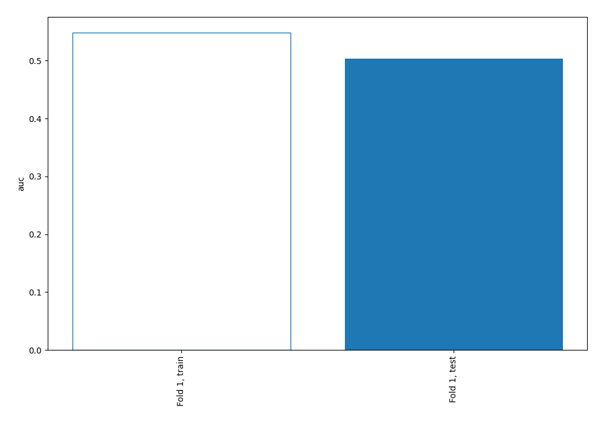

## Permutation-based Importance

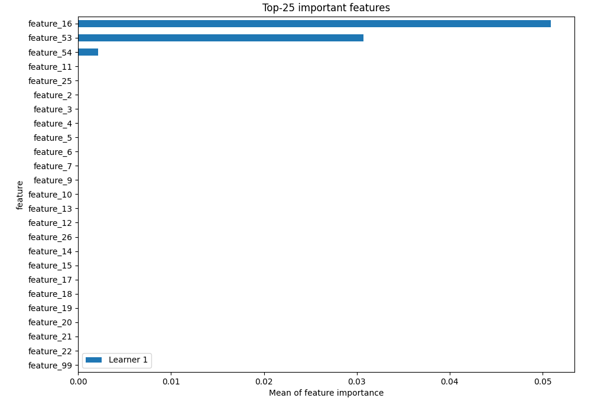

## Confusion Matrix

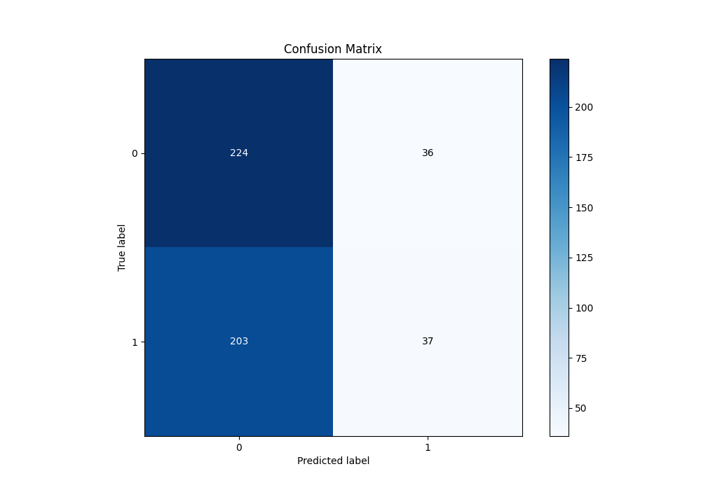

## Normalized Confusion Matrix

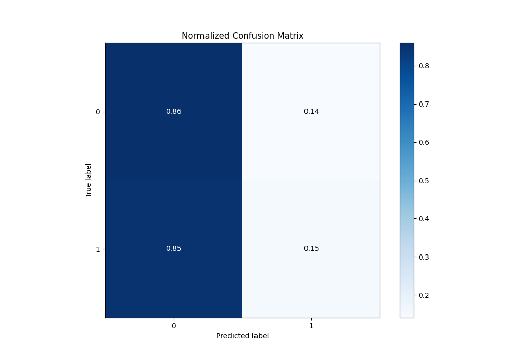

## ROC Curve

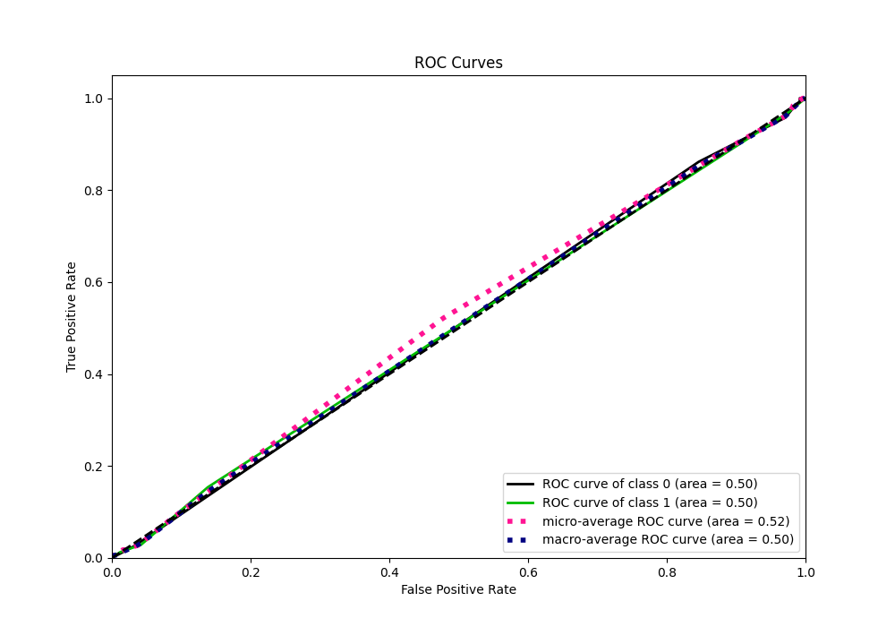

## Kolmogorov-Smirnov Statistic

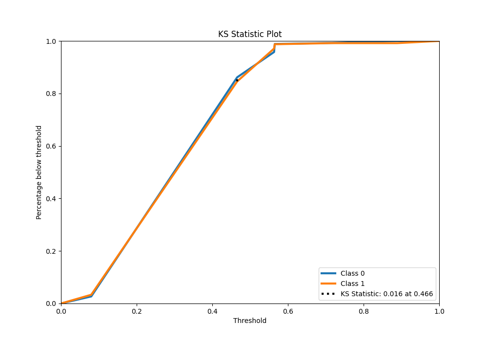

## Precision-Recall Curve

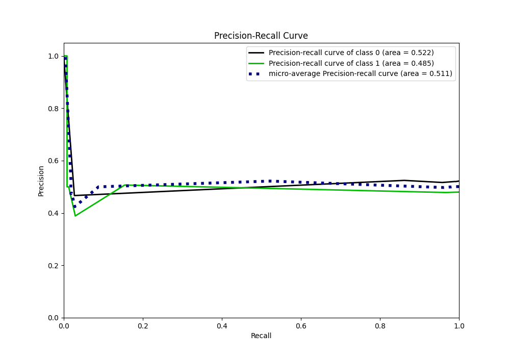

## Calibration Curve

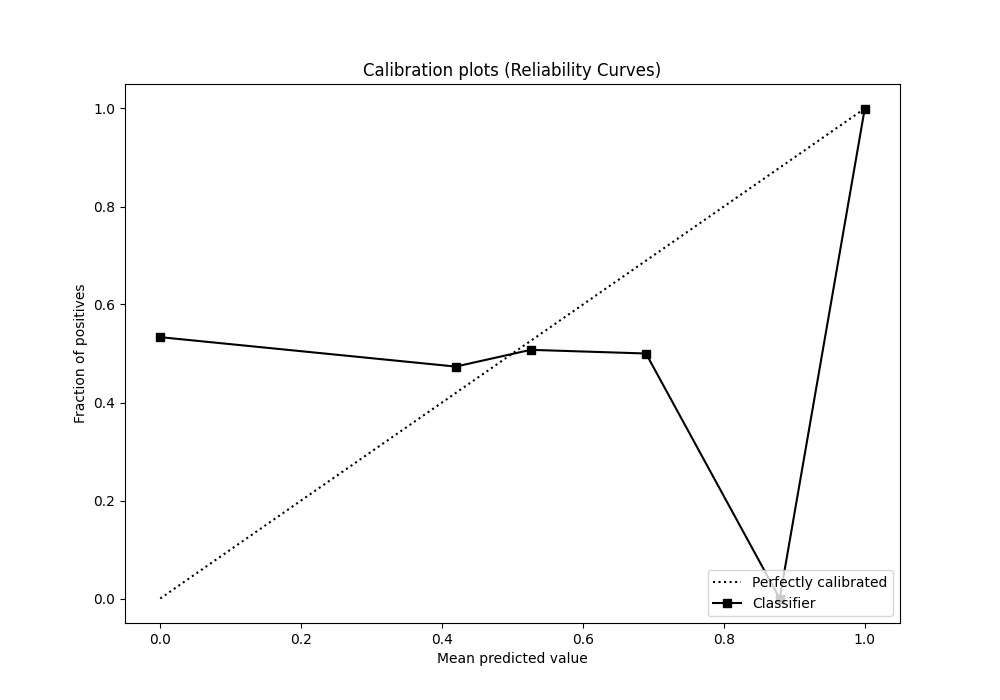

## Cumulative Gains Curve

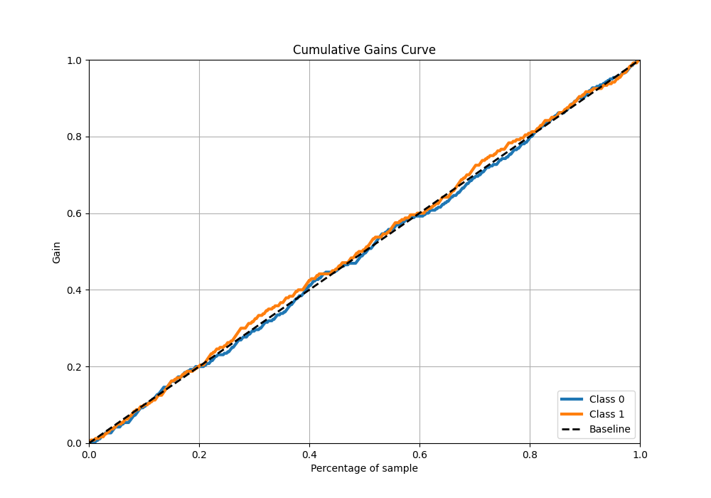

## Lift Curve

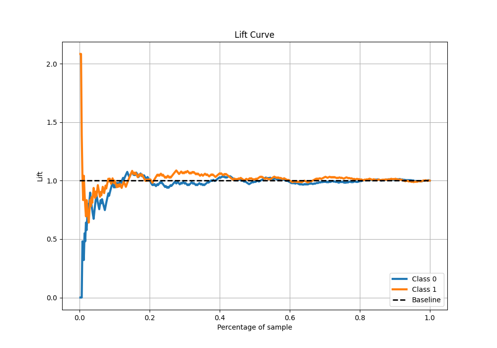

## SHAP Importance

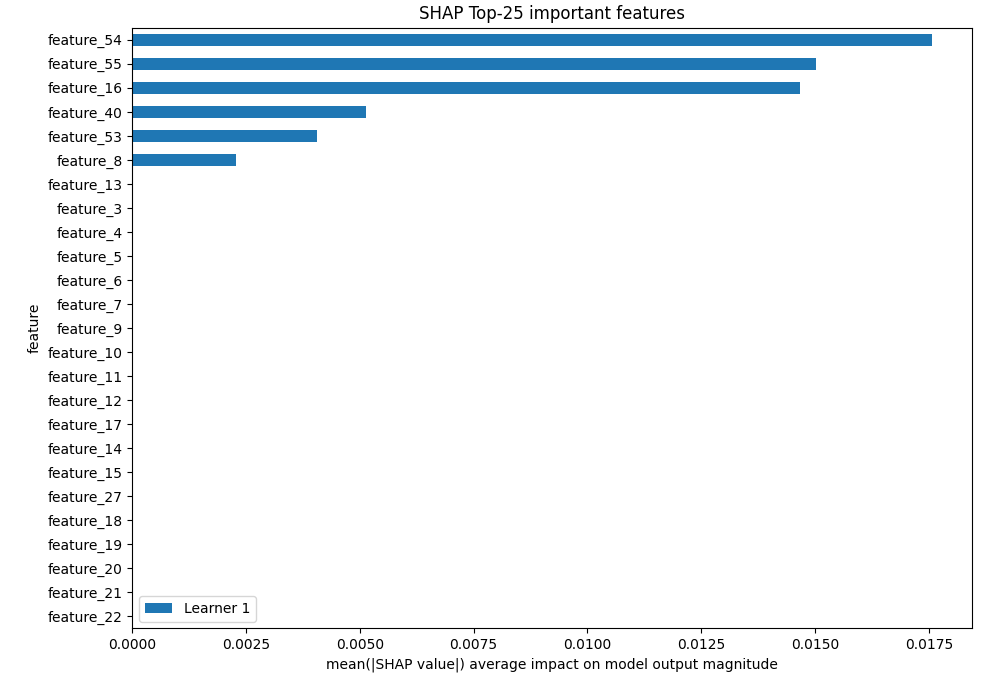

[<< Go back](../README.md)
