# Summary of 3_Linear

[<< Go back](../README.md)

## Logistic Regression (Linear)

- **n_jobs**: -1
- **explain_level**: 2

## Validation

- **validation_type**: split
- **train_ratio**: 0.75
- **shuffle**: True
- **stratify**: True

## Optimized metric

auc

## Training time

1.6 seconds

## Metric details

|           |     score |   threshold |
|:----------|----------:|------------:|
| logloss   | 0.712674  |  nan        |
| auc       | 0.523886  |  nan        |
| f1        | 0.648649  |    0.132938 |
| accuracy  | 0.55      |    0.532795 |
| precision | 0.557252  |    0.532795 |
| recall    | 1         |    0.132938 |
| mcc       | 0.0921318 |    0.532795 |

## Metric details with threshold from accuracy metric

|           |     score |   threshold |
|:----------|----------:|------------:|
| logloss   | 0.712674  |  nan        |
| auc       | 0.523886  |  nan        |
| f1        | 0.393531  |    0.532795 |
| accuracy  | 0.55      |    0.532795 |
| precision | 0.557252  |    0.532795 |
| recall    | 0.304167  |    0.532795 |
| mcc       | 0.0921318 |    0.532795 |

## Confusion matrix (at threshold=0.532795)

|              |   Predicted as 0 |   Predicted as 1 |
|:-------------|-----------------:|-----------------:|
| Labeled as 0 |              202 |               58 |
| Labeled as 1 |              167 |               73 |

## Learning curves

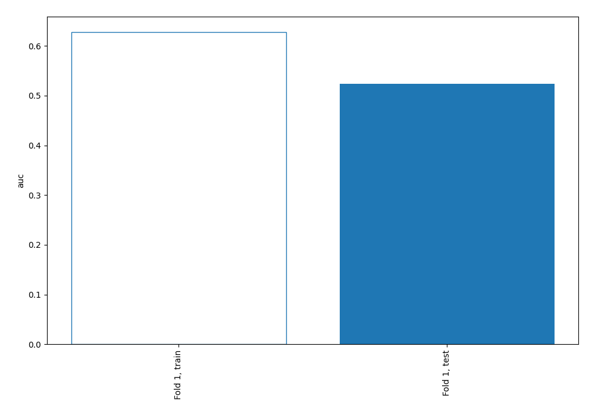

## Permutation-based Importance

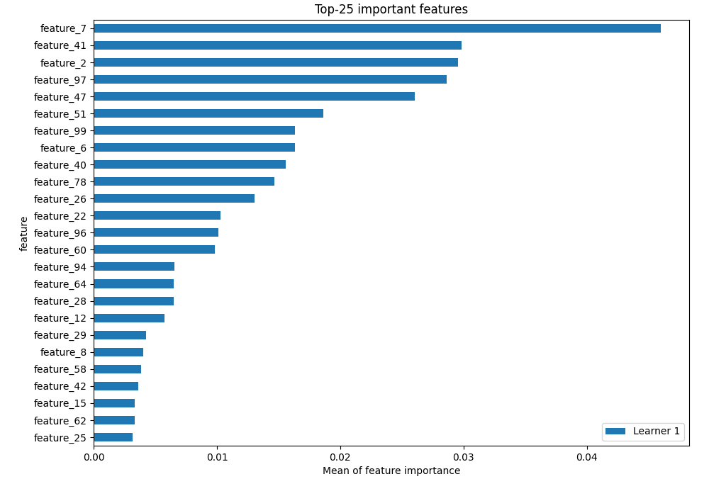

## Confusion Matrix

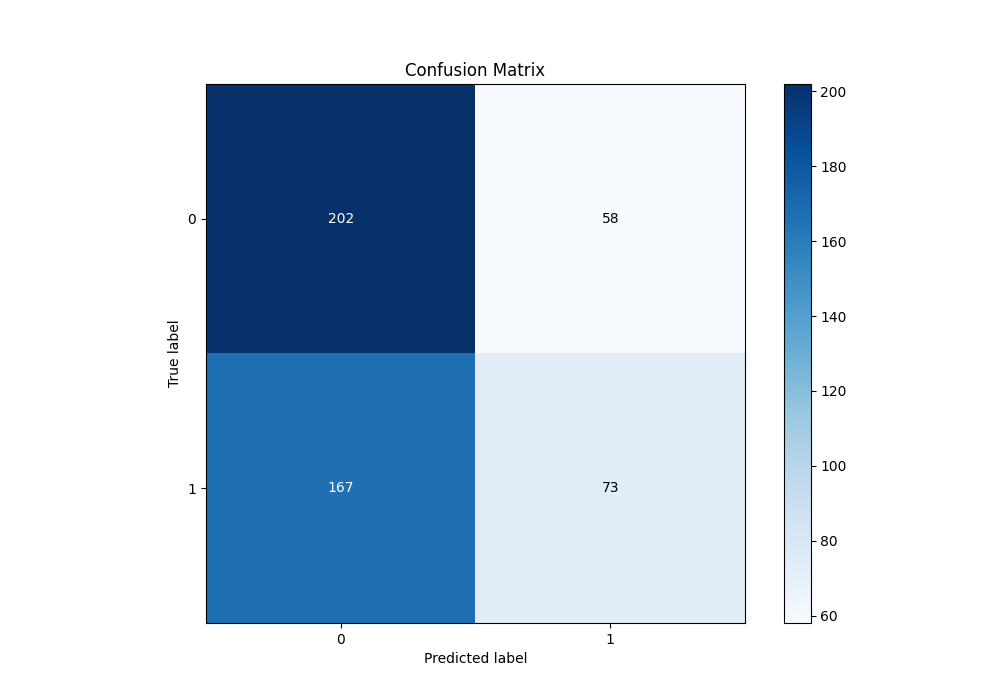

## Normalized Confusion Matrix

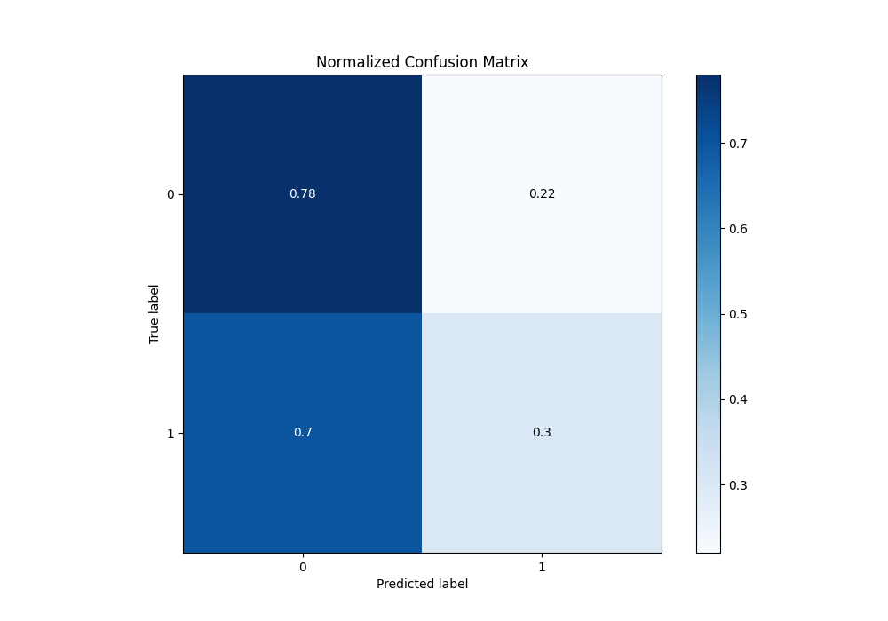

## ROC Curve

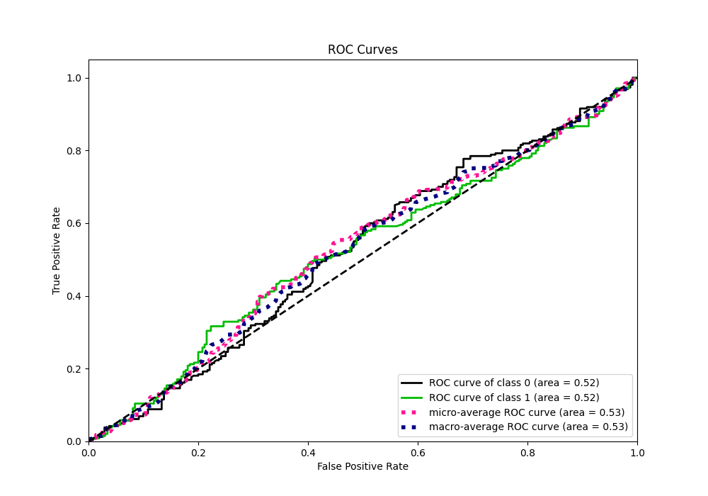

## Kolmogorov-Smirnov Statistic

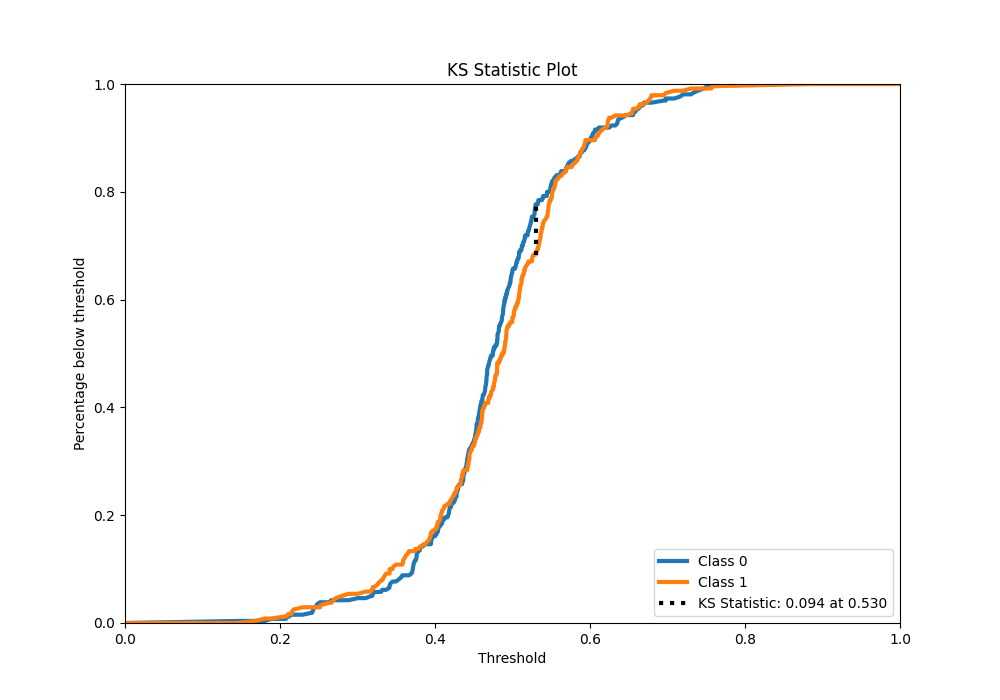

## Precision-Recall Curve

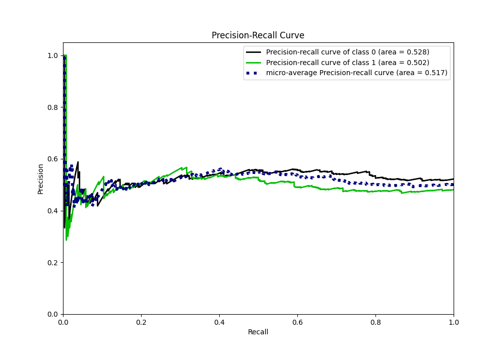

## Calibration Curve

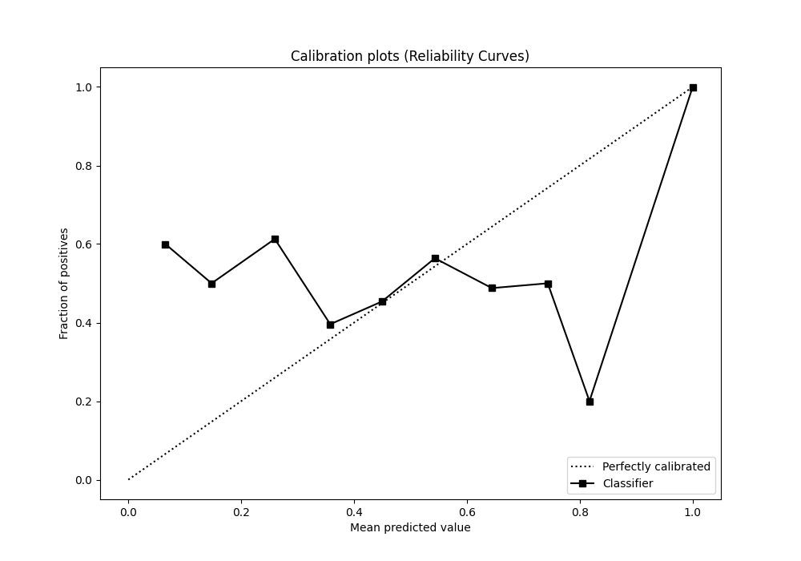

## Cumulative Gains Curve

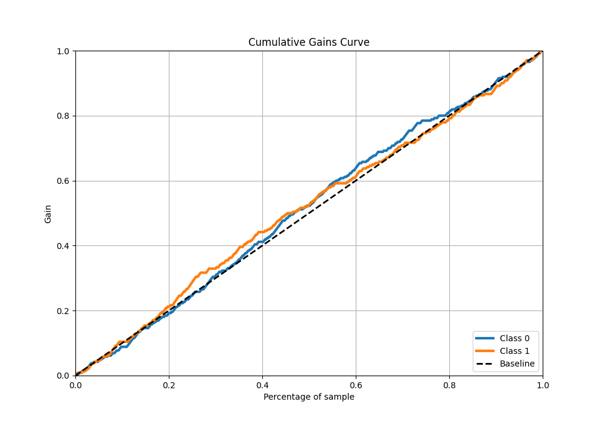

## Lift Curve

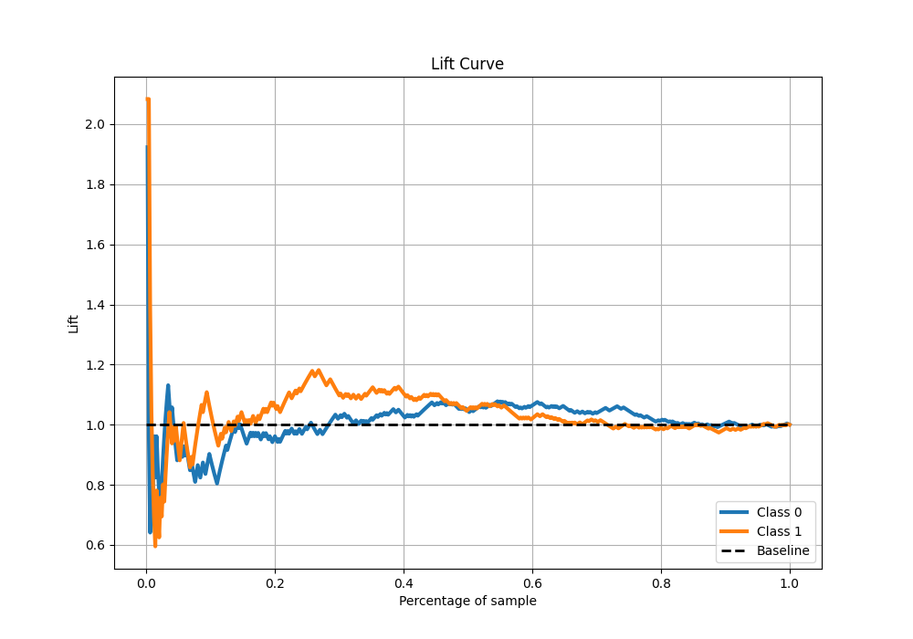

## SHAP Importance

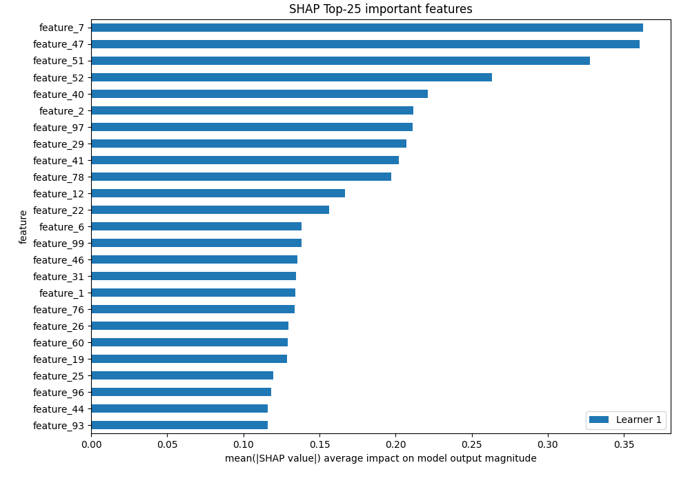

[<< Go back](../README.md)
