# Summary of 4_Default_Xgboost

[<< Go back](../README.md)

## Extreme Gradient Boosting (Xgboost)

- **n_jobs**: -1
- **objective**: binary:logistic
- **eta**: 0.075
- **max_depth**: 6
- **min_child_weight**: 1
- **subsample**: 1.0
- **colsample_bytree**: 1.0
- **eval_metric**: auc
- **explain_level**: 2

## Validation

- **validation_type**: split
- **train_ratio**: 0.75
- **shuffle**: True
- **stratify**: True

## Optimized metric

auc

## Training time

56.4 seconds

## Metric details

|           |     score |   threshold |
|:----------|----------:|------------:|
| logloss   | 0.693393  |  nan        |
| auc       | 0.504215  |  nan        |
| f1        | 0.648649  |    0.424219 |
| accuracy  | 0.522     |    0.496033 |
| precision | 0.502203  |    0.496033 |
| recall    | 1         |    0.424219 |
| mcc       | 0.0405242 |    0.496033 |

## Metric details with threshold from accuracy metric

|           |     score |   threshold |
|:----------|----------:|------------:|
| logloss   | 0.693393  |  nan        |
| auc       | 0.504215  |  nan        |
| f1        | 0.488223  |    0.496033 |
| accuracy  | 0.522     |    0.496033 |
| precision | 0.502203  |    0.496033 |
| recall    | 0.475     |    0.496033 |
| mcc       | 0.0405242 |    0.496033 |

## Confusion matrix (at threshold=0.496033)

|              |   Predicted as 0 |   Predicted as 1 |
|:-------------|-----------------:|-----------------:|
| Labeled as 0 |              147 |              113 |
| Labeled as 1 |              126 |              114 |

## Learning curves

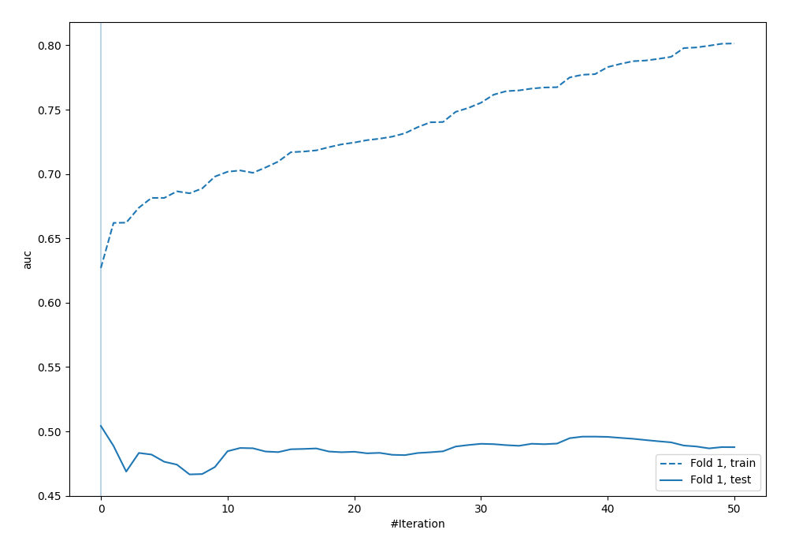

## Permutation-based Importance

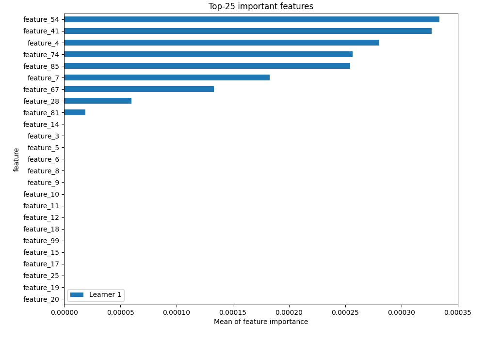

## Confusion Matrix

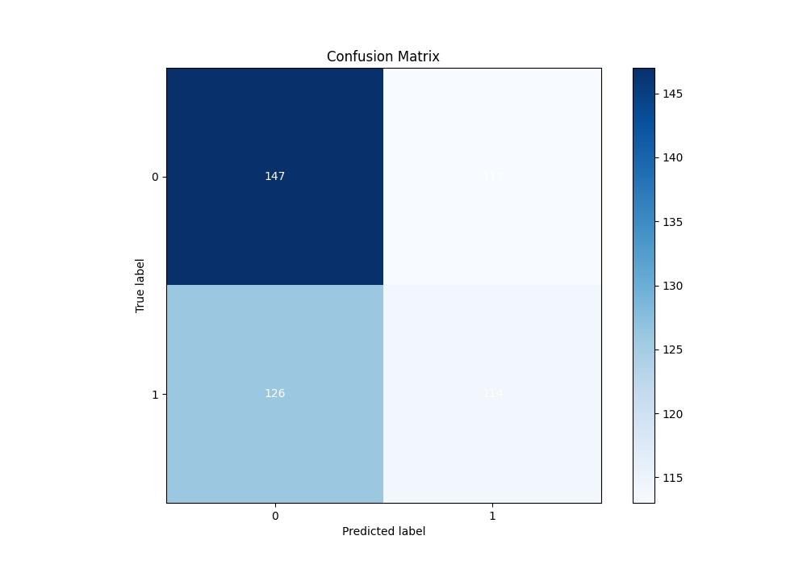

## Normalized Confusion Matrix

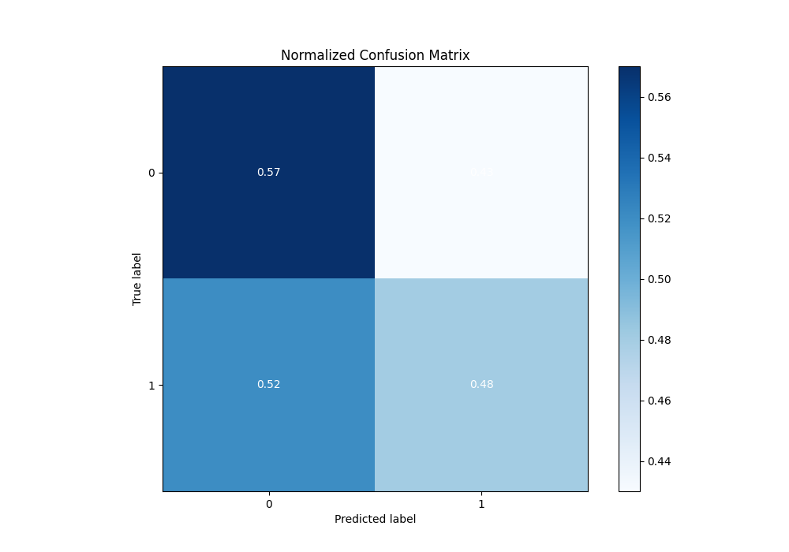

## ROC Curve

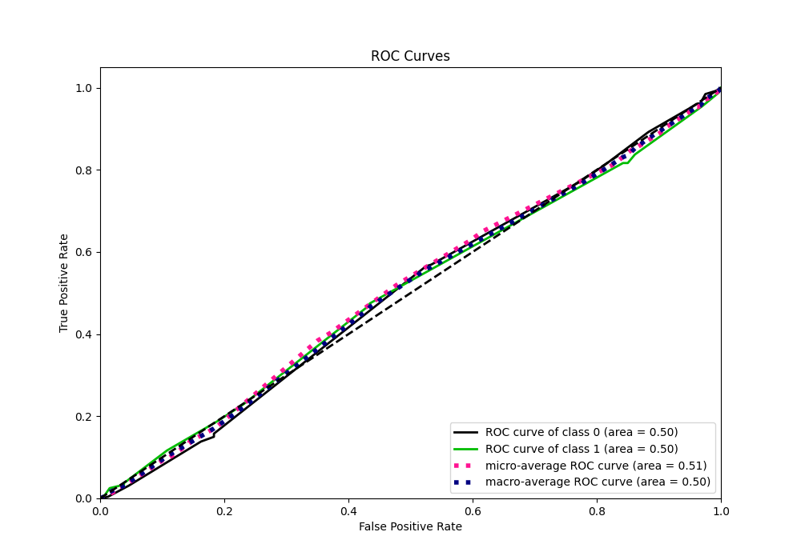

## Kolmogorov-Smirnov Statistic

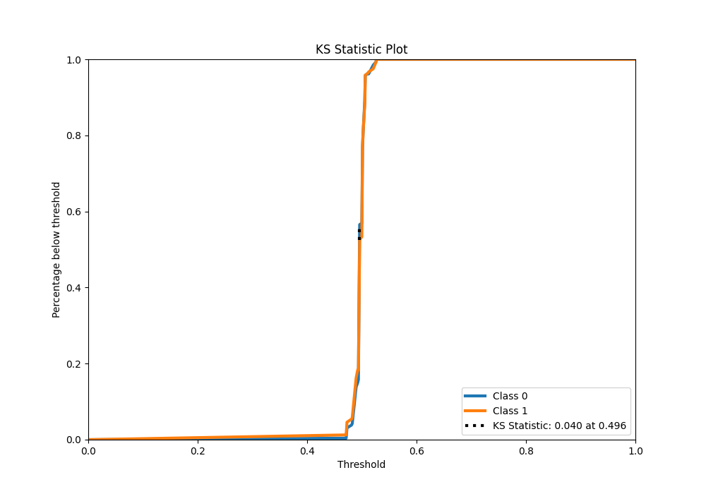

## Precision-Recall Curve

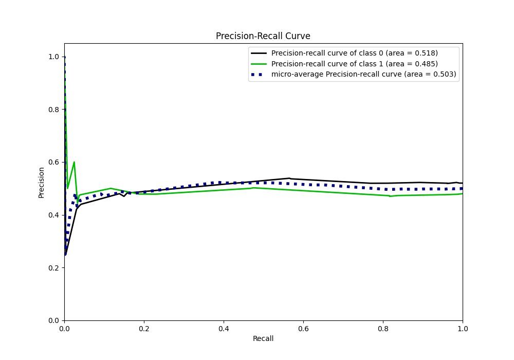

## Calibration Curve

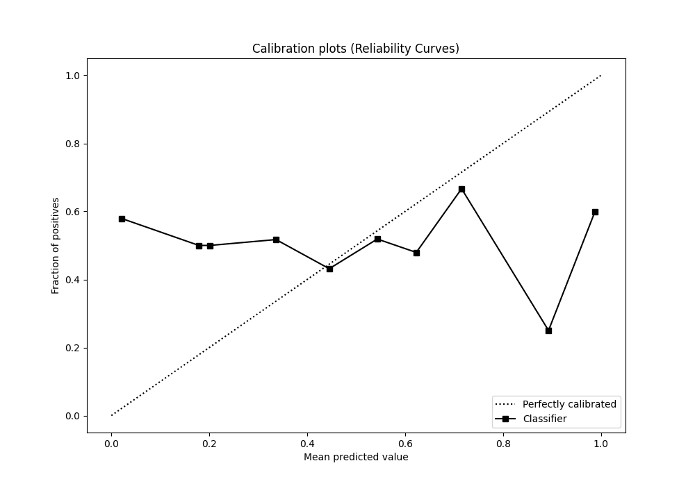

## Cumulative Gains Curve

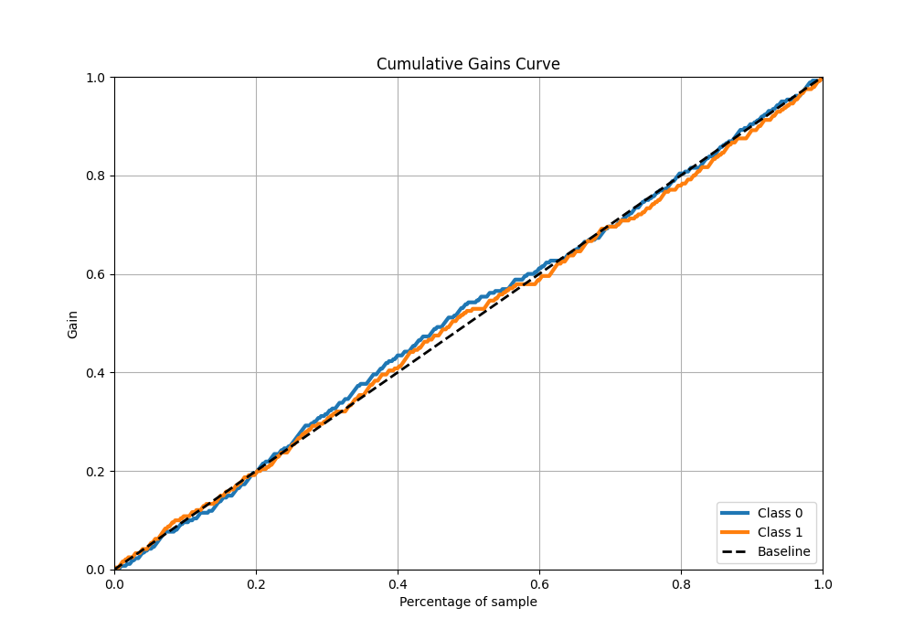

## Lift Curve

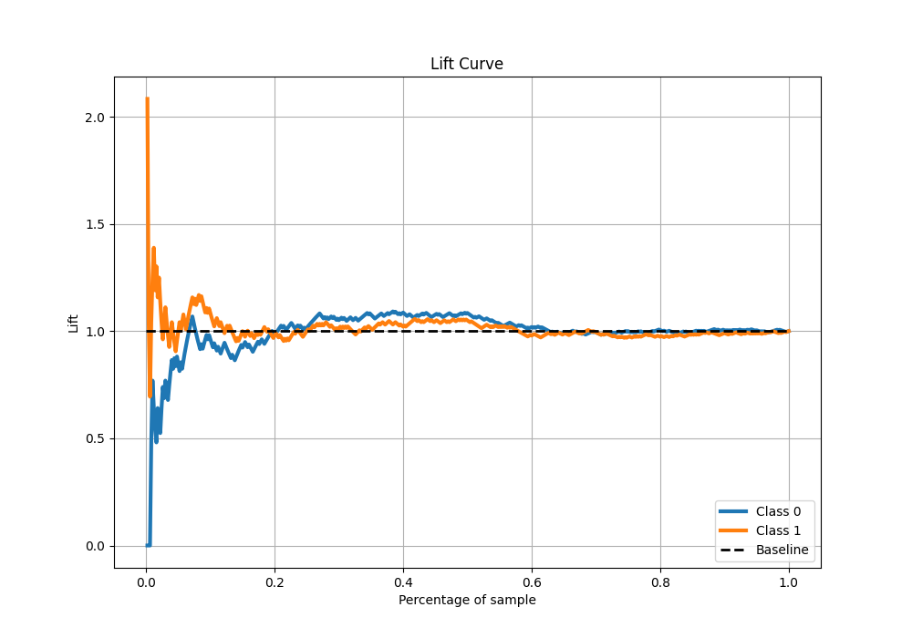

## SHAP Importance

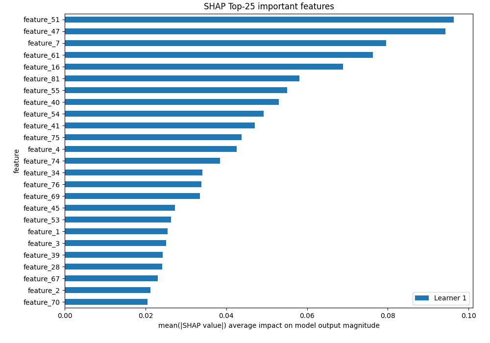

[<< Go back](../README.md)
