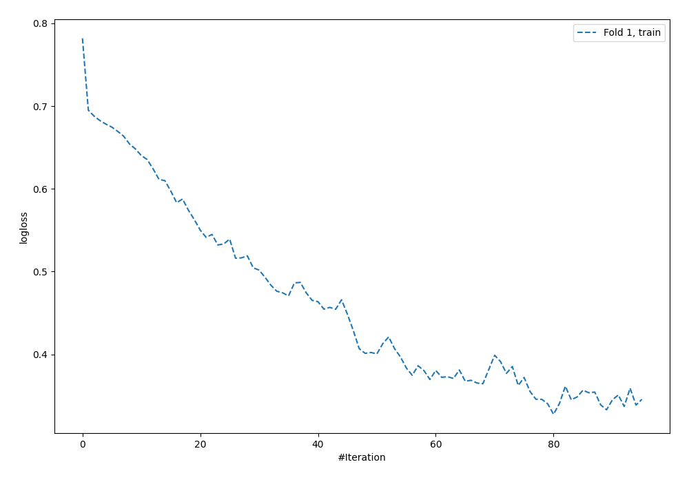
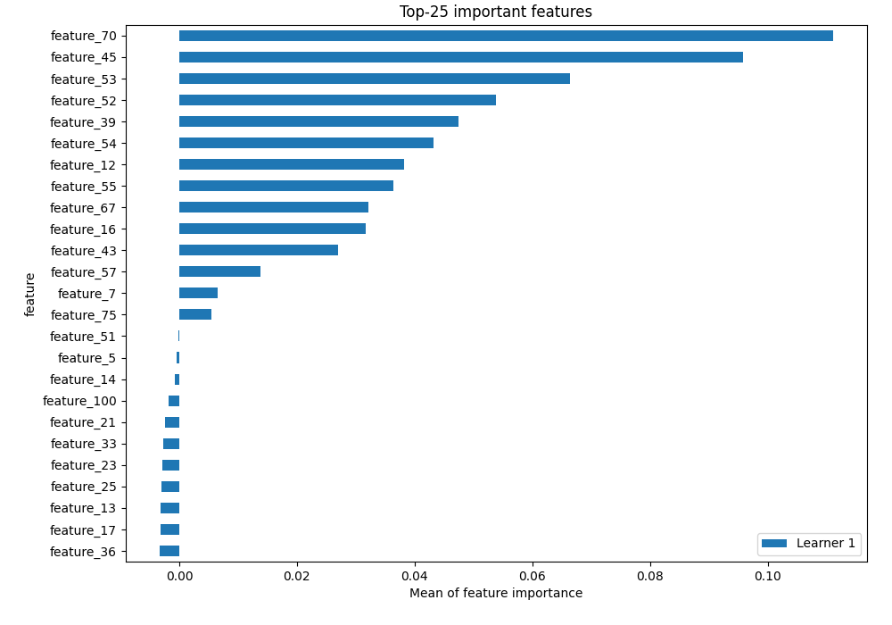
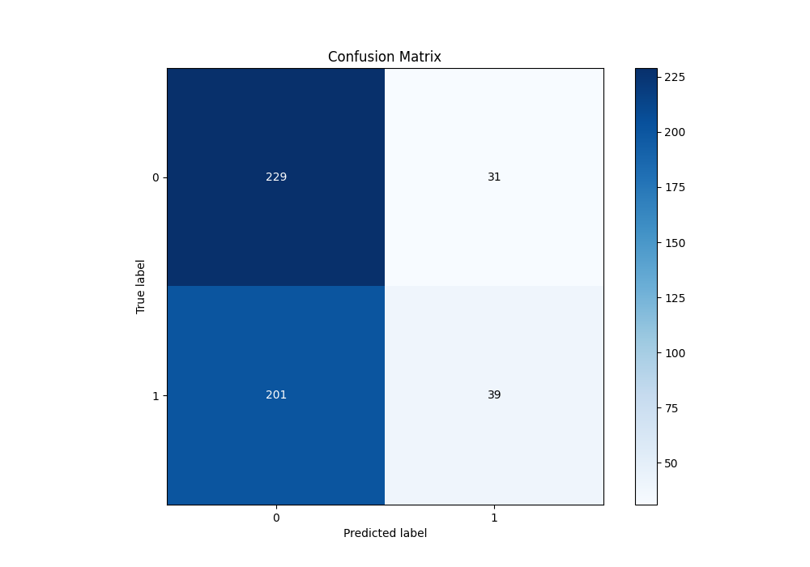
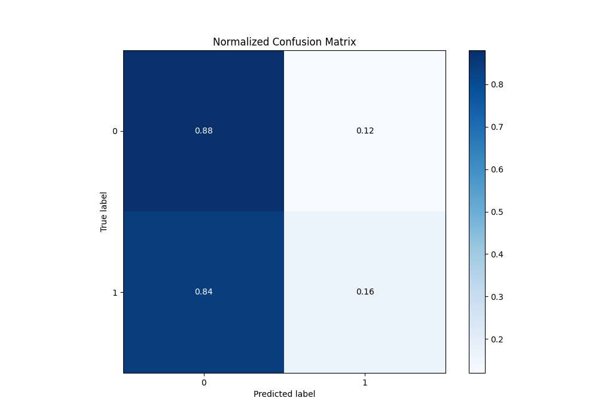
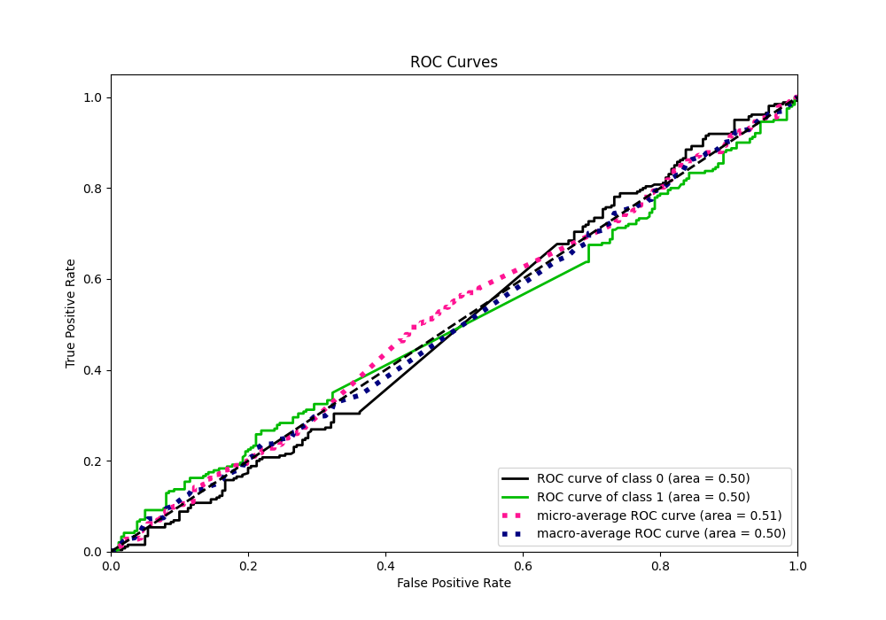
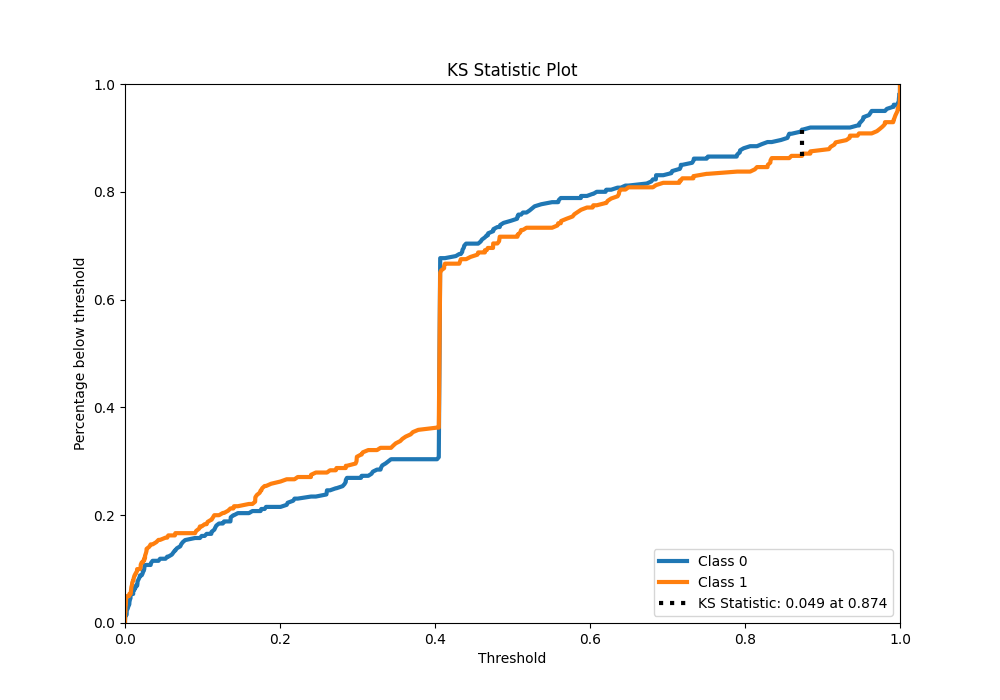
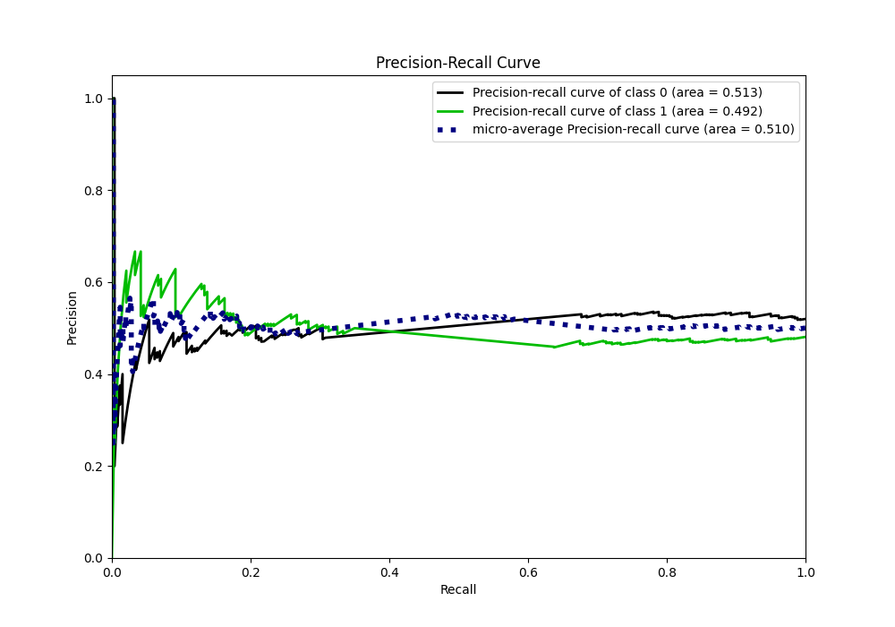
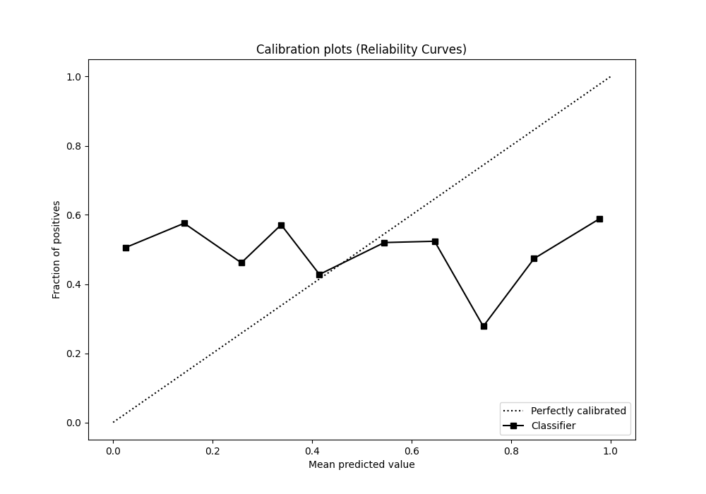
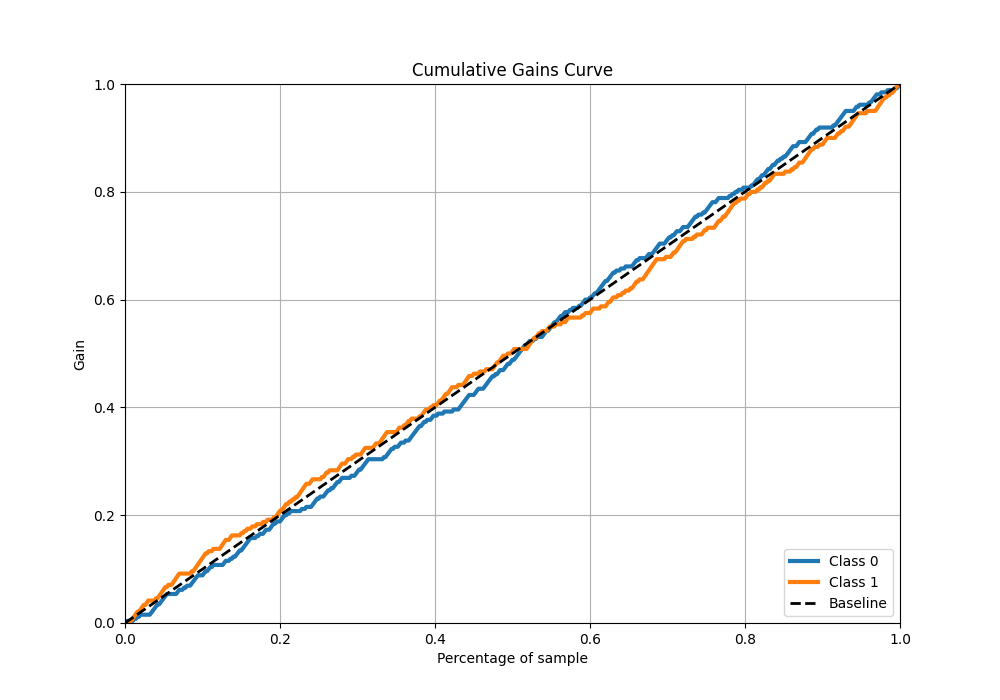
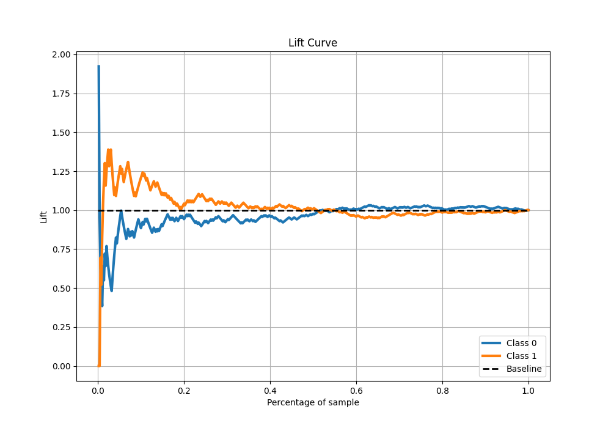

# Summary of 5_Default_NeuralNetwork

[<< Go back](../README.md)

## Neural Network

- **n_jobs**: -1
- **dense_1_size**: 32
- **dense_2_size**: 16
- **learning_rate**: 0.05
- **explain_level**: 2

## Validation

- **validation_type**: split
- **train_ratio**: 0.75
- **shuffle**: True
- **stratify**: True

## Optimized metric

auc

## Training time

1.6 seconds

## Metric details

|           |    score |     threshold |
|:----------|---------:|--------------:|
| logloss   | 1.28771  | nan           |
| auc       | 0.495056 | nan           |
| f1        | 0.648649 |   1.02425e-22 |
| accuracy  | 0.536    |   0.798809    |
| precision | 0.557143 |   0.798809    |
| recall    | 1        |   1.02425e-22 |
| mcc       | 0.0623   |   0.798809    |

## Metric details with threshold from accuracy metric

|           |    score |   threshold |
|:----------|---------:|------------:|
| logloss   | 1.28771  |  nan        |
| auc       | 0.495056 |  nan        |
| f1        | 0.251613 |    0.798809 |
| accuracy  | 0.536    |    0.798809 |
| precision | 0.557143 |    0.798809 |
| recall    | 0.1625   |    0.798809 |
| mcc       | 0.0623   |    0.798809 |

## Confusion matrix (at threshold=0.798809)

|              |   Predicted as 0 |   Predicted as 1 |
|:-------------|-----------------:|-----------------:|
| Labeled as 0 |              229 |               31 |
| Labeled as 1 |              201 |               39 |

## Learning curves

## Permutation-based Importance

## Confusion Matrix

## Normalized Confusion Matrix

## ROC Curve

## Kolmogorov-Smirnov Statistic

## Precision-Recall Curve

## Calibration Curve

## Cumulative Gains Curve

## Lift Curve

[<< Go back](../README.md)
