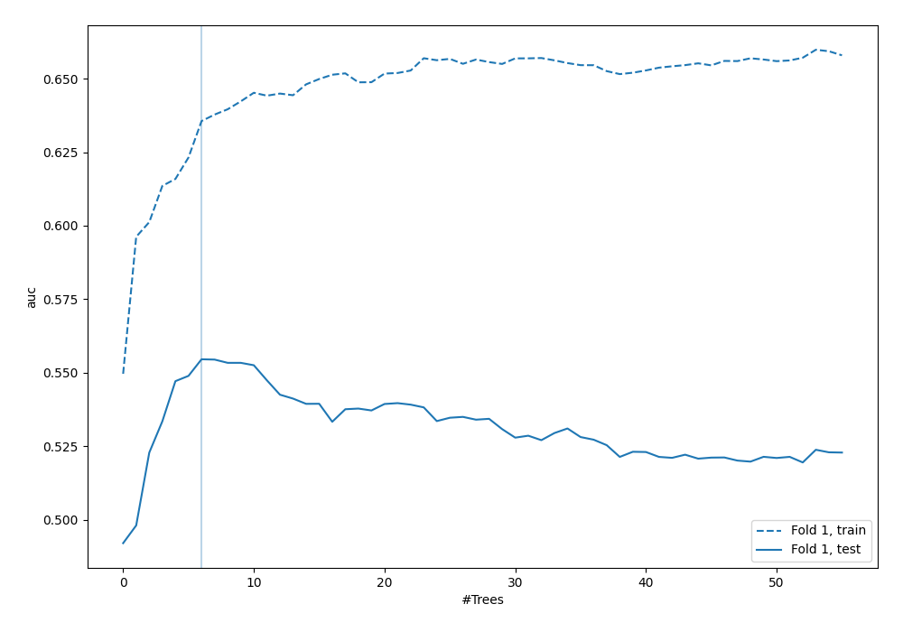
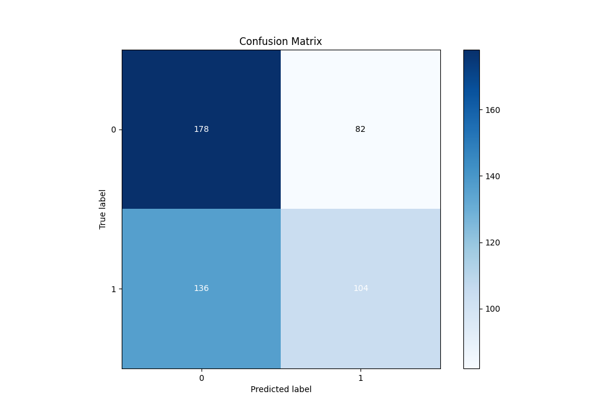
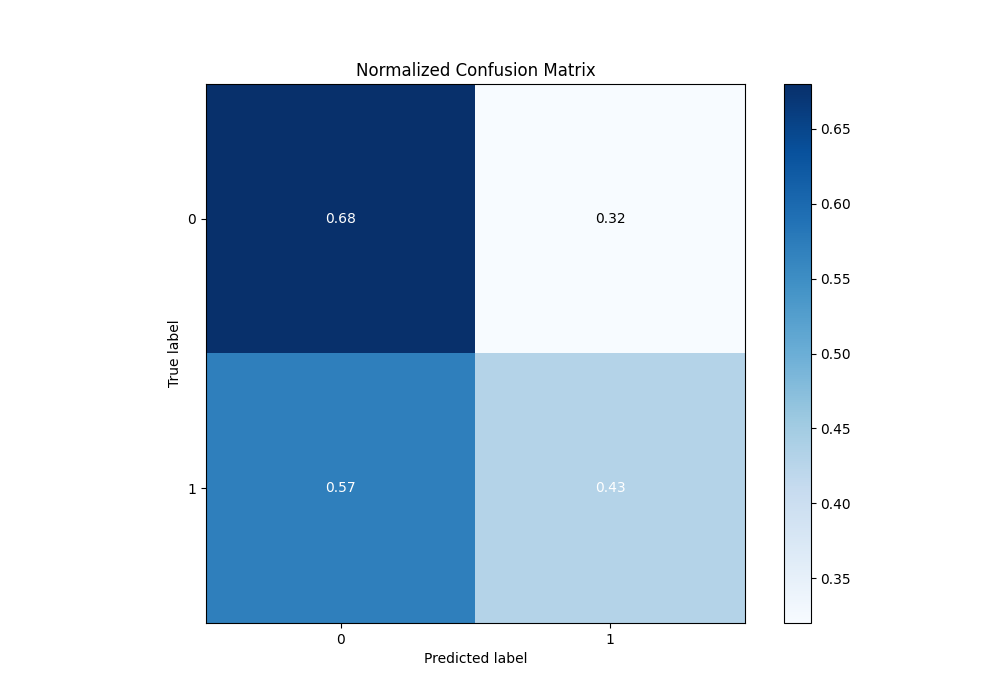
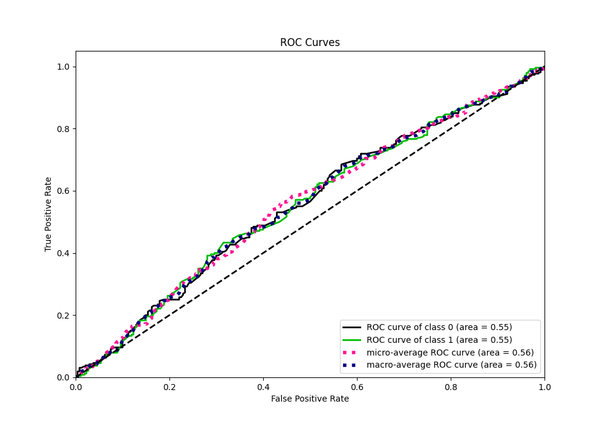
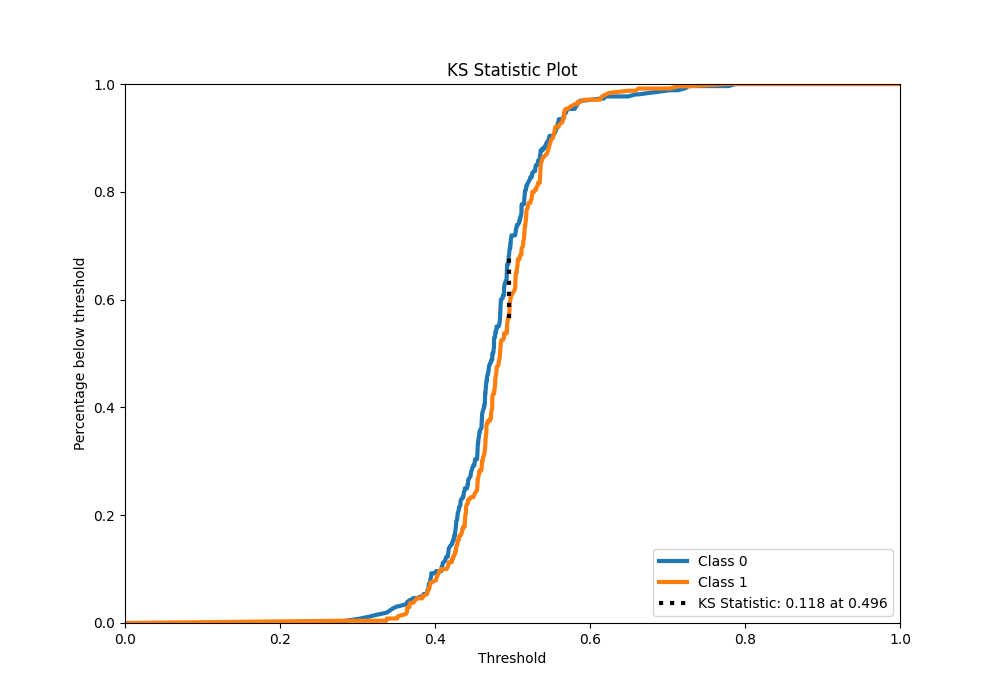
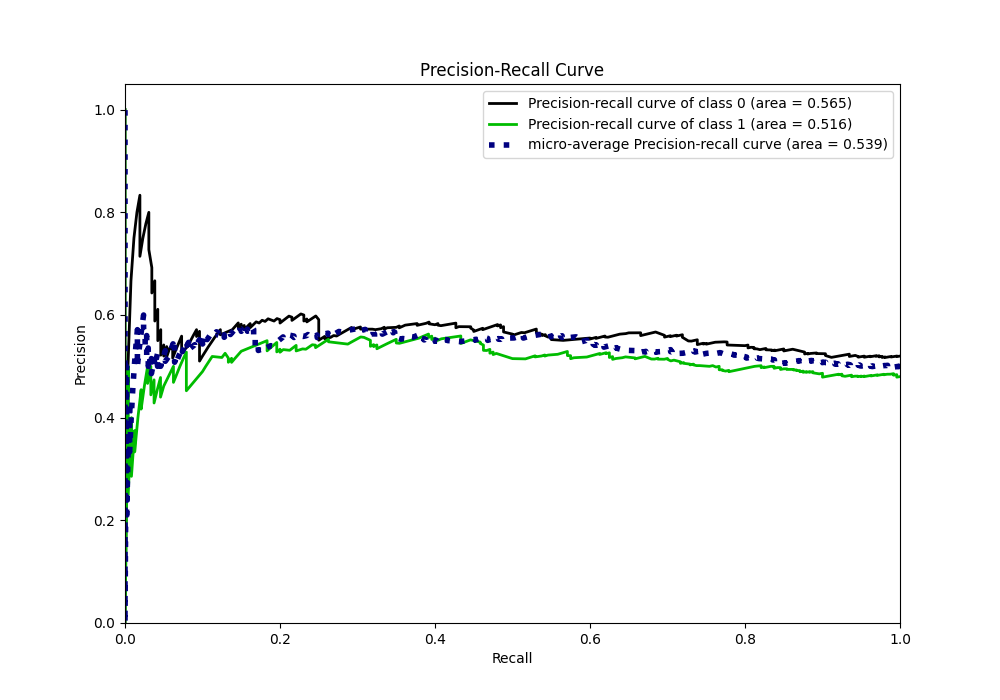
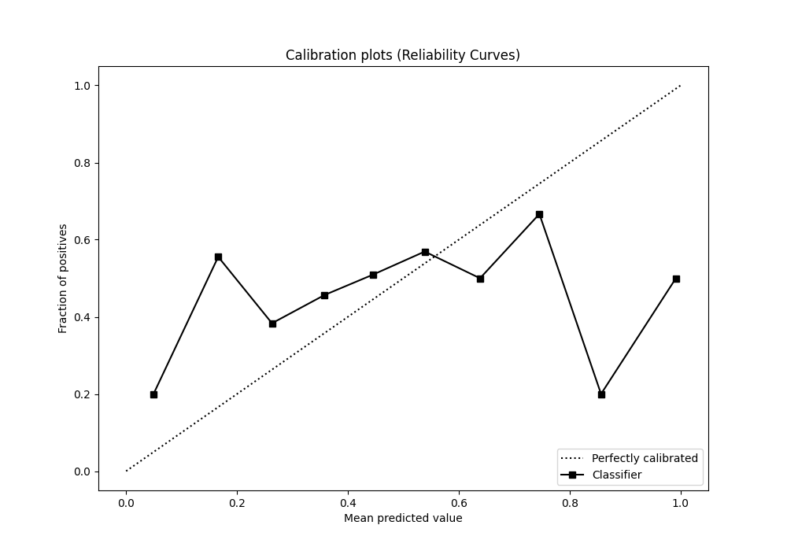
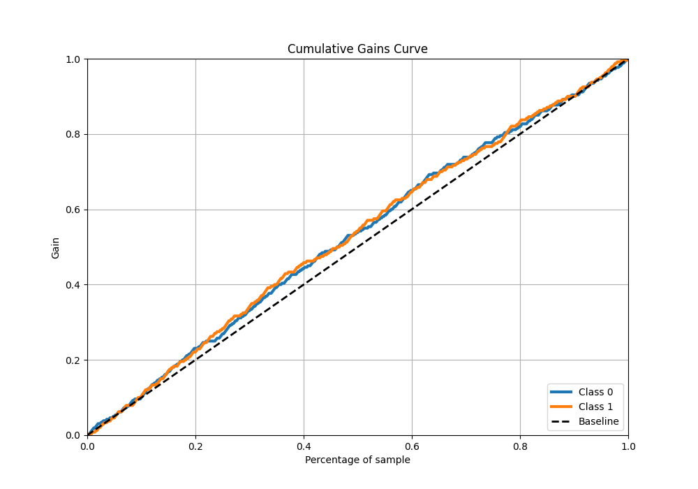
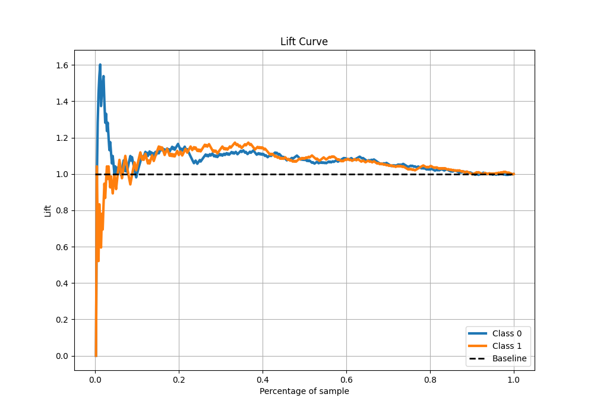
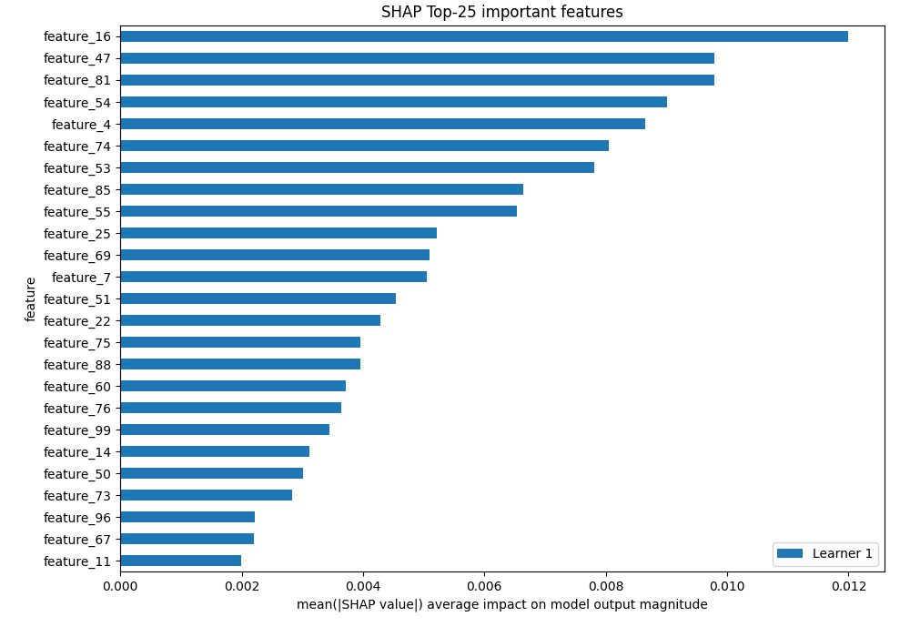

# Summary of 6_Default_RandomForest

[<< Go back](../README.md)

## Random Forest

- **n_jobs**: -1
- **criterion**: gini
- **max_features**: 0.9
- **min_samples_split**: 30
- **max_depth**: 4
- **eval_metric_name**: auc
- **explain_level**: 2

## Validation

- **validation_type**: split
- **train_ratio**: 0.75
- **shuffle**: True
- **stratify**: True

## Optimized metric

auc

## Training time

5.3 seconds

## Metric details

|           |    score |   threshold |
|:----------|---------:|------------:|
| logloss   | 0.692599 |  nan        |
| auc       | 0.554559 |  nan        |
| f1        | 0.648649 |    0.246802 |
| accuracy  | 0.564    |    0.49588  |
| precision | 0.562874 |    0.499565 |
| recall    | 1        |    0.246802 |
| mcc       | 0.121917 |    0.49588  |

## Metric details with threshold from accuracy metric

|           |    score |   threshold |
|:----------|---------:|------------:|
| logloss   | 0.692599 |   nan       |
| auc       | 0.554559 |   nan       |
| f1        | 0.488263 |     0.49588 |
| accuracy  | 0.564    |     0.49588 |
| precision | 0.55914  |     0.49588 |
| recall    | 0.433333 |     0.49588 |
| mcc       | 0.121917 |     0.49588 |

## Confusion matrix (at threshold=0.49588)

|              |   Predicted as 0 |   Predicted as 1 |
|:-------------|-----------------:|-----------------:|
| Labeled as 0 |              178 |               82 |
| Labeled as 1 |              136 |              104 |

## Learning curves

## Permutation-based Importance

## Confusion Matrix

## Normalized Confusion Matrix

## ROC Curve

## Kolmogorov-Smirnov Statistic

## Precision-Recall Curve

## Calibration Curve

## Cumulative Gains Curve

## Lift Curve

## SHAP Importance

[<< Go back](../README.md)
