# Summary of 2_DecisionTree

[<< Go back](../README.md)

## Decision Tree
- **n_jobs**: -1
- **criterion**: gini
- **max_depth**: 3
- **explain_level**: 2

## Validation
 - **validation_type**: split
 - **train_ratio**: 0.75
 - **shuffle**: True
 - **stratify**: True

## Optimized metric
accuracy

## Training time

6.3 seconds

## Metric details
|           |     score |   threshold |
|:----------|----------:|------------:|
| logloss   | 0.6494    |  nan        |
| auc       | 0.504455  |  nan        |
| f1        | 0.518072  |    0.266667 |
| accuracy  | 0.649051  |    0.40717  |
| precision | 0.4       |    0.40717  |
| recall    | 1         |    0.266667 |
| mcc       | 0.0236913 |    0.327127 |

## Metric details with threshold from accuracy metric
|           |      score |   threshold |
|:----------|-----------:|------------:|
| logloss   | 0.6494     |   nan       |
| auc       | 0.504455   |   nan       |
| f1        | 0.0152091  |     0.40717 |
| accuracy  | 0.649051   |     0.40717 |
| precision | 0.4        |     0.40717 |
| recall    | 0.00775194 |     0.40717 |
| mcc       | 0.00873063 |     0.40717 |

## Confusion matrix (at threshold=0.40717)
|              |   Predicted as 0 |   Predicted as 1 |
|:-------------|-----------------:|-----------------:|
| Labeled as 0 |             2385 |               15 |
| Labeled as 1 |             1280 |               10 |

## Learning curves
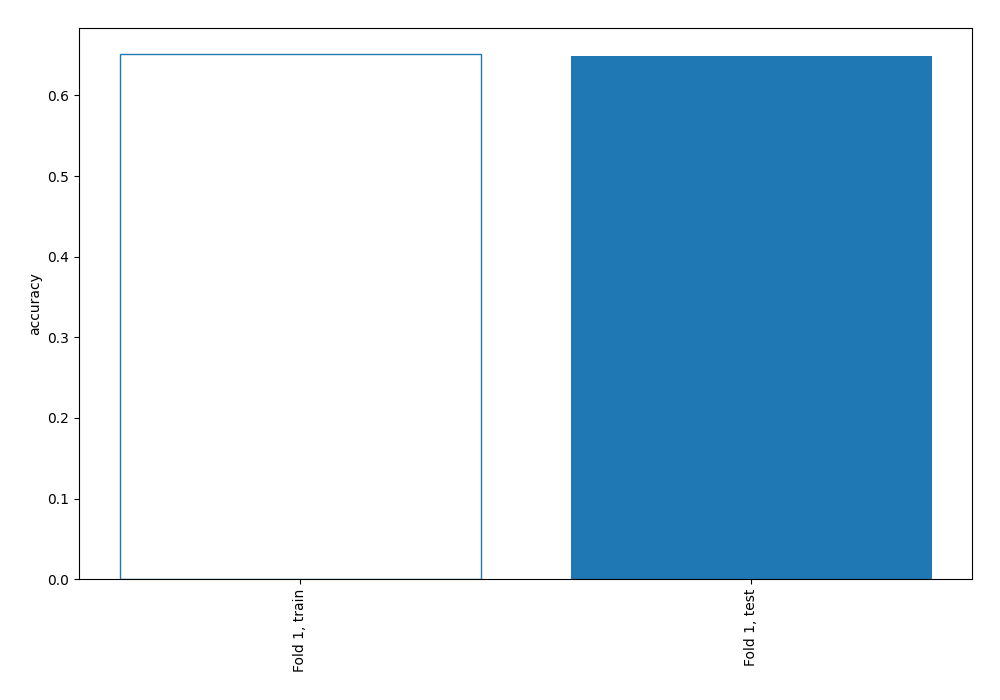

## Permutation-based Importance
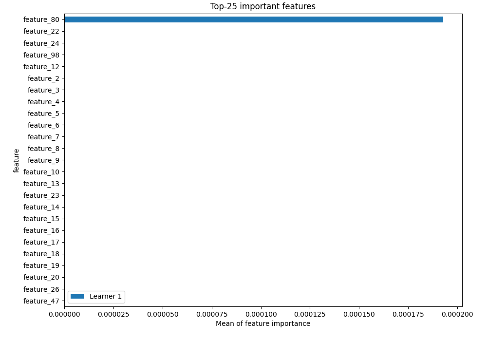
## Confusion Matrix

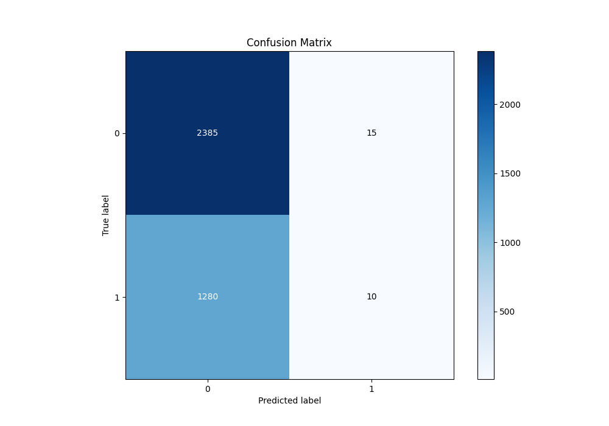

## Normalized Confusion Matrix

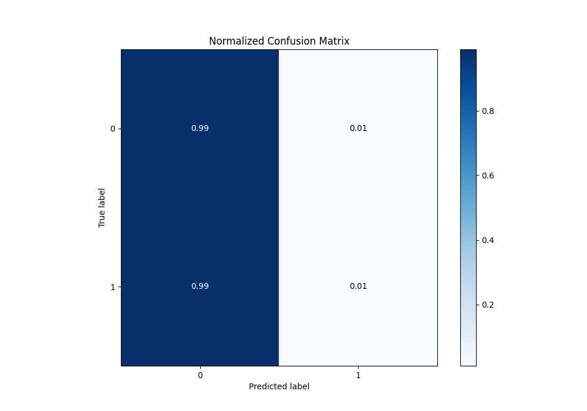

## ROC Curve

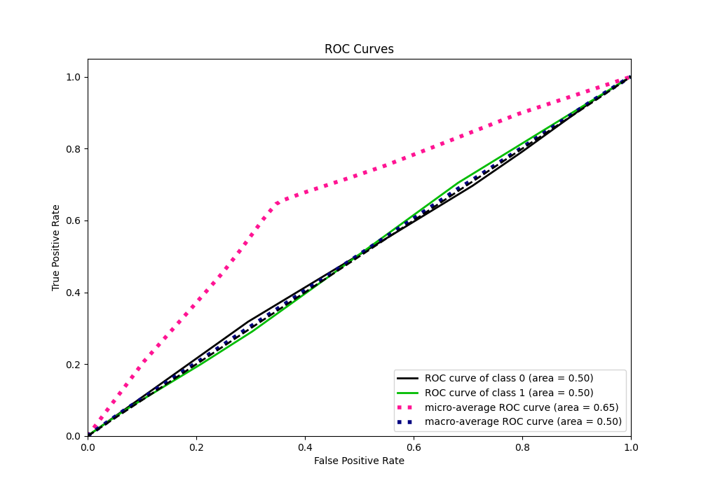

## Kolmogorov-Smirnov Statistic

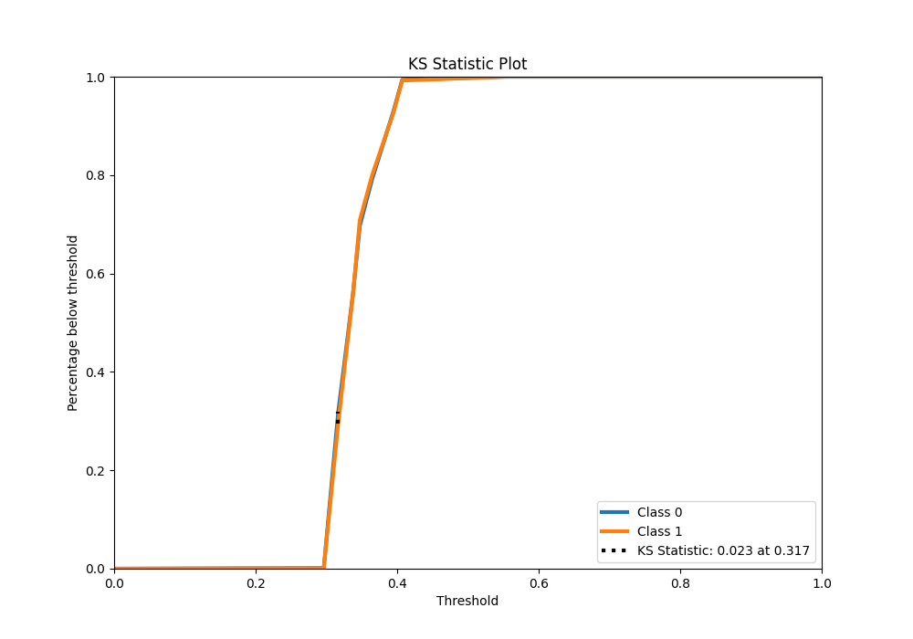

## Precision-Recall Curve

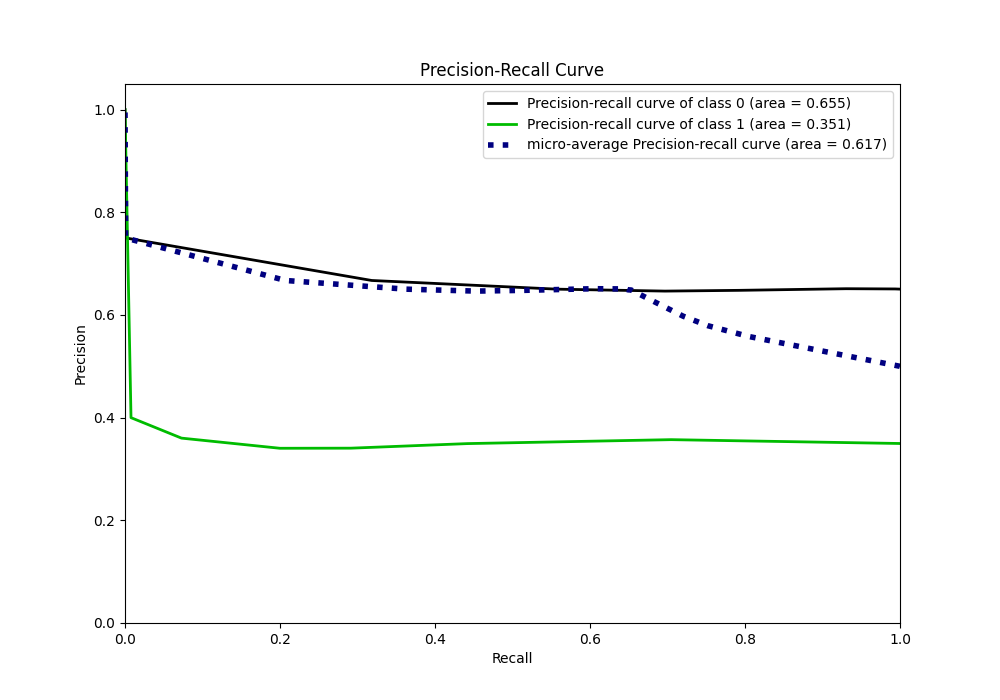

## Calibration Curve

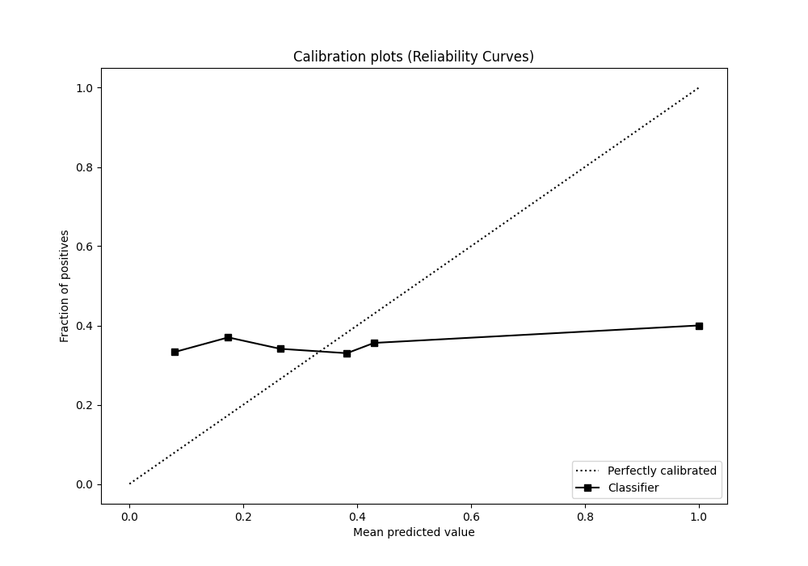

## Cumulative Gains Curve

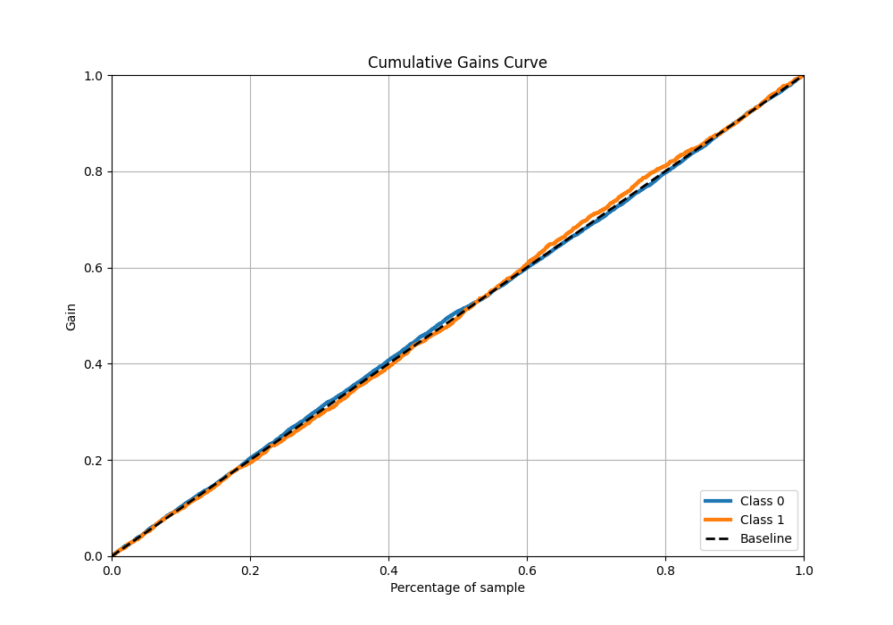

## Lift Curve

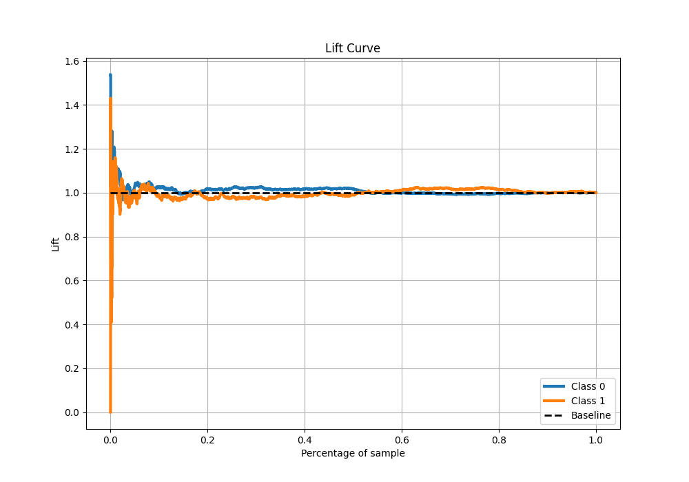

## SHAP Importance
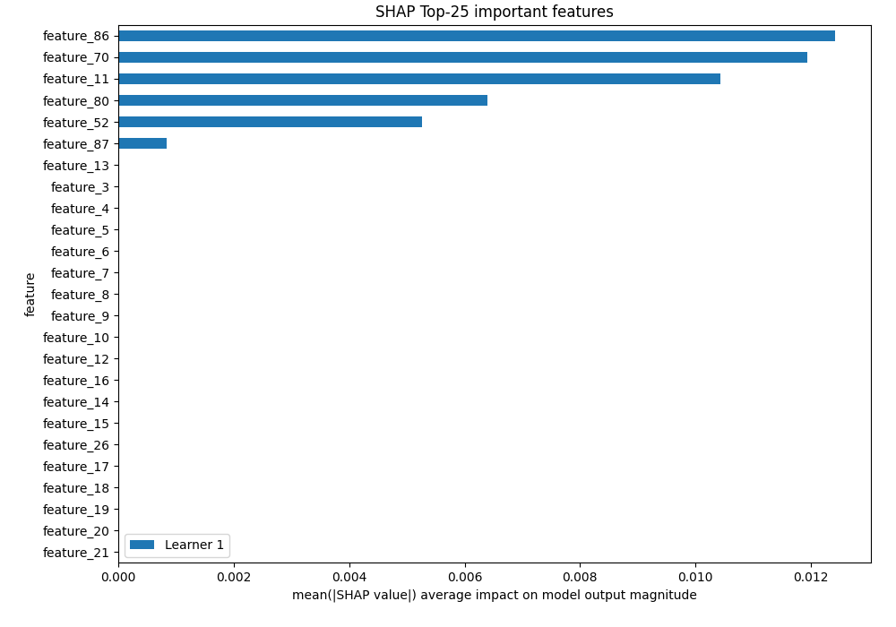

[<< Go back](../README.md)
