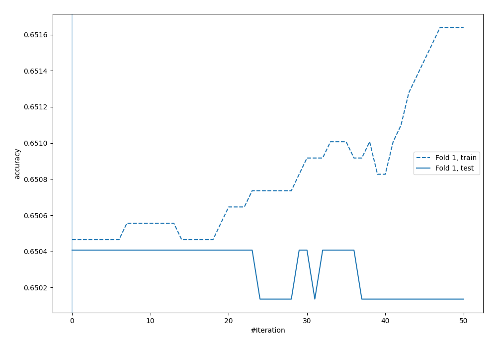
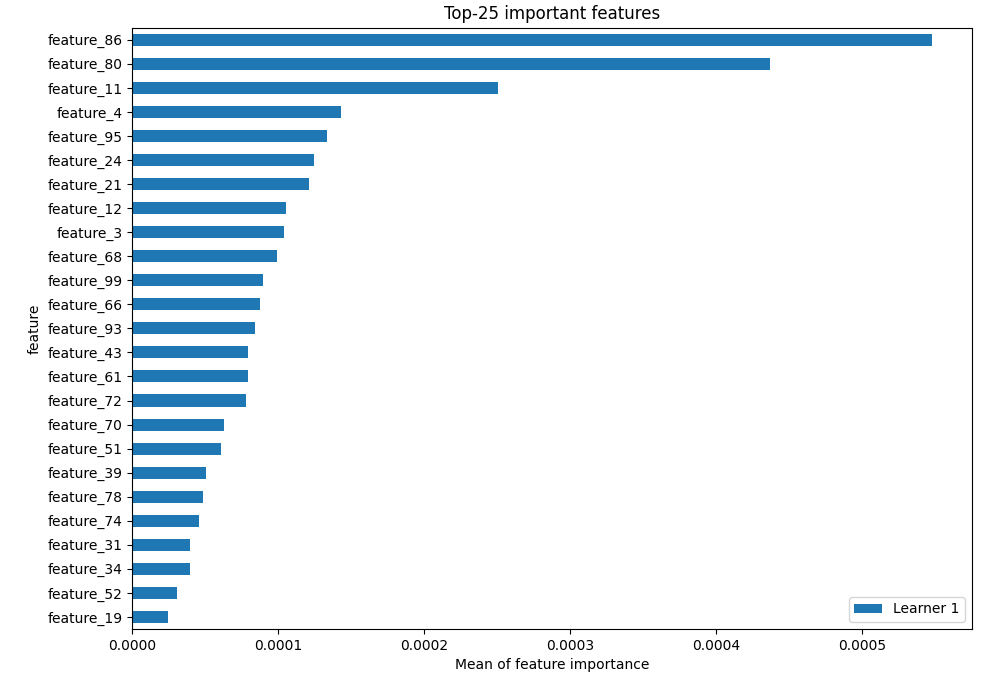
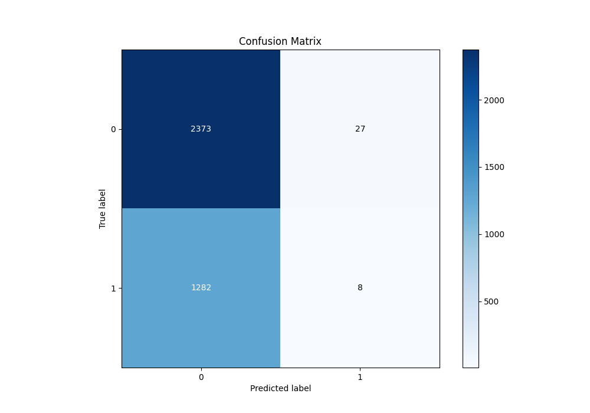
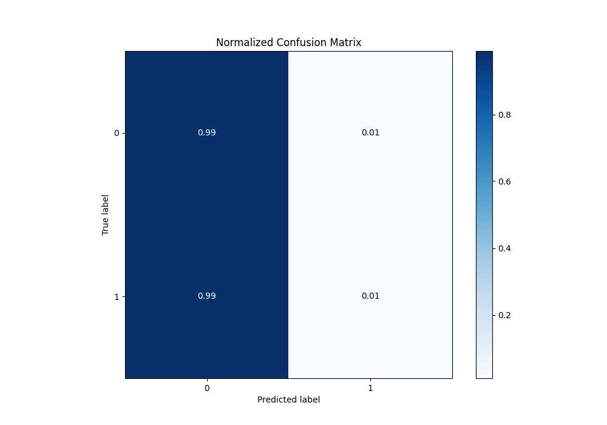
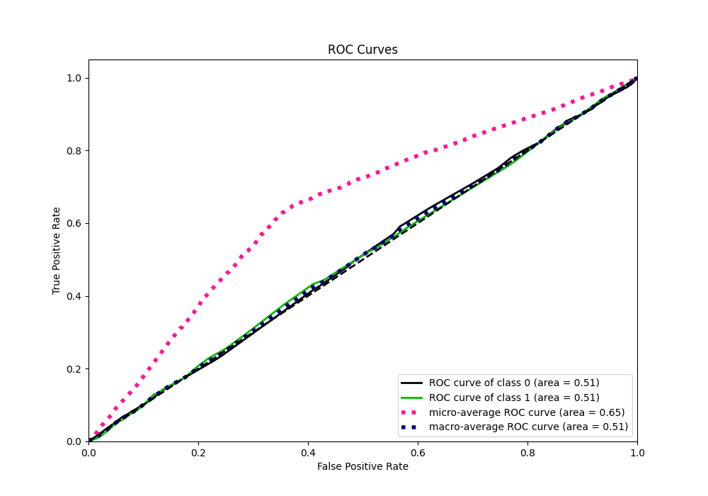
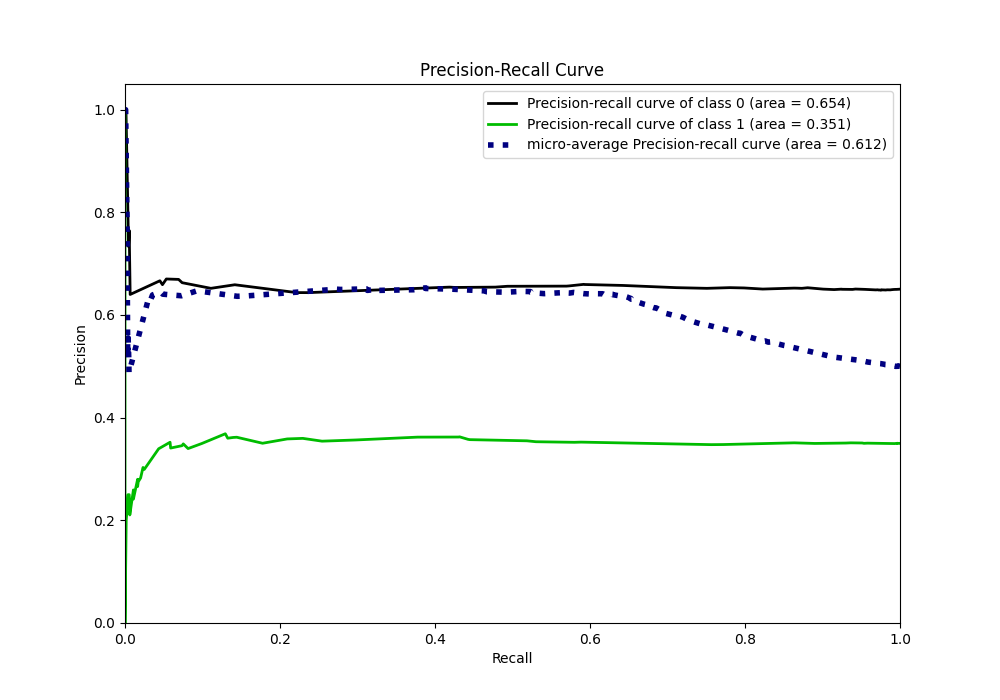
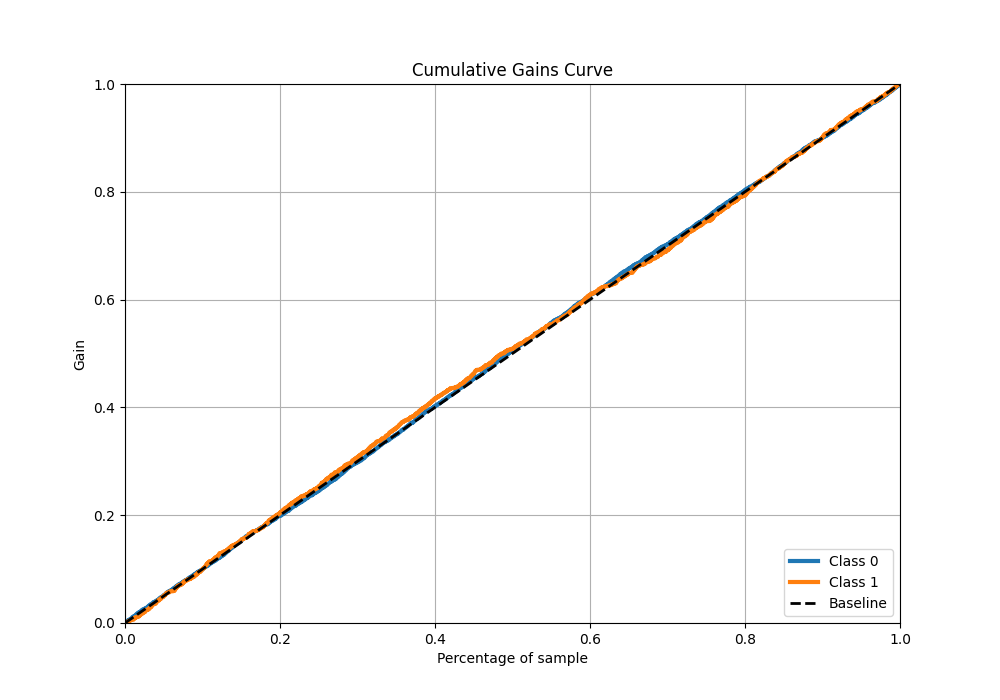
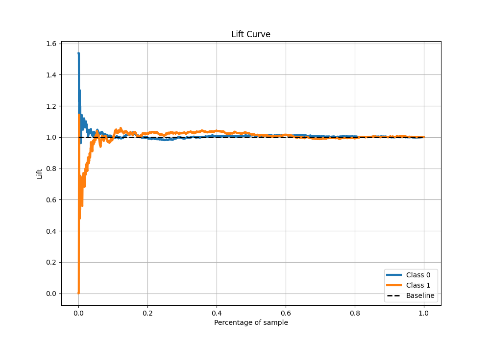
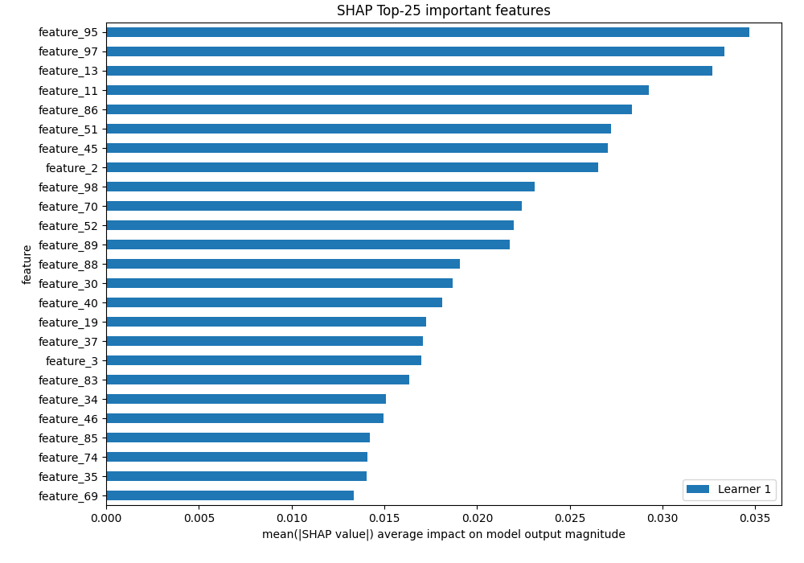

# Summary of 3_Default_Xgboost

[<< Go back](../README.md)

## Extreme Gradient Boosting (Xgboost)
- **n_jobs**: -1
- **objective**: binary:logistic
- **eta**: 0.075
- **max_depth**: 6
- **min_child_weight**: 1
- **subsample**: 1.0
- **colsample_bytree**: 1.0
- **eval_metric**: accuracy
- **explain_level**: 2

## Validation
 - **validation_type**: split
 - **train_ratio**: 0.75
 - **shuffle**: True
 - **stratify**: True

## Optimized metric
accuracy

## Training time

23.4 seconds

## Metric details
|           |    score |   threshold |
|:----------|---------:|------------:|
| logloss   | 0.686533 |  nan        |
| auc       | 0.505159 |  nan        |
| f1        | 0.518072 |    0.423032 |
| accuracy  | 0.645257 |    0.510895 |
| precision | 0.36263  |    0.488707 |
| recall    | 1        |    0.423032 |
| mcc       | 0.023087 |    0.488707 |

## Metric details with threshold from accuracy metric
|           |       score |   threshold |
|:----------|------------:|------------:|
| logloss   |  0.686533   |  nan        |
| auc       |  0.505159   |  nan        |
| f1        |  0.0120755  |    0.510895 |
| accuracy  |  0.645257   |    0.510895 |
| precision |  0.228571   |    0.510895 |
| recall    |  0.00620155 |    0.510895 |
| mcc       | -0.024836   |    0.510895 |

## Confusion matrix (at threshold=0.510895)
|              |   Predicted as 0 |   Predicted as 1 |
|:-------------|-----------------:|-----------------:|
| Labeled as 0 |             2373 |               27 |
| Labeled as 1 |             1282 |                8 |

## Learning curves

## Permutation-based Importance

## Confusion Matrix

## Normalized Confusion Matrix

## ROC Curve

## Kolmogorov-Smirnov Statistic

## Precision-Recall Curve

## Calibration Curve

## Cumulative Gains Curve

## Lift Curve

## SHAP Importance

[<< Go back](../README.md)
