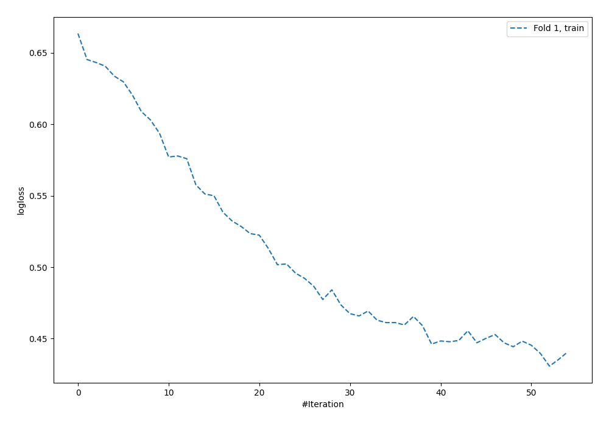
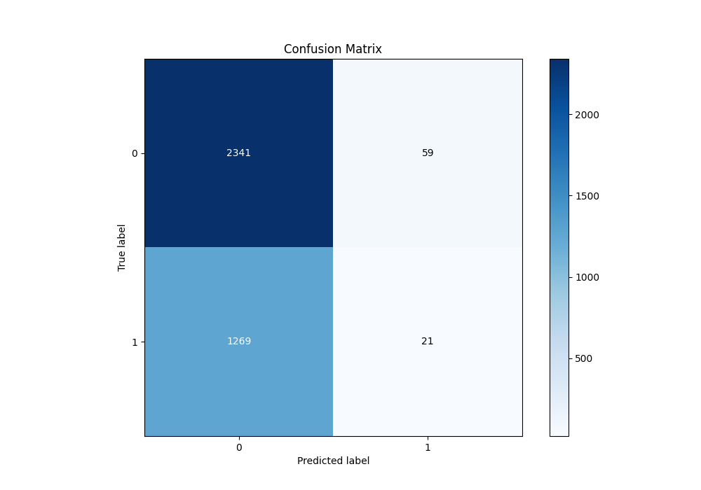
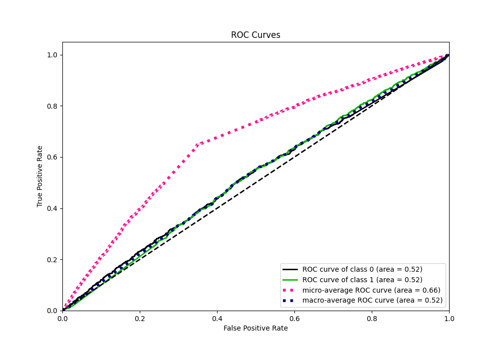
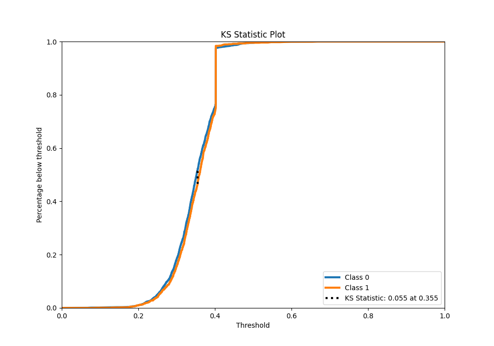
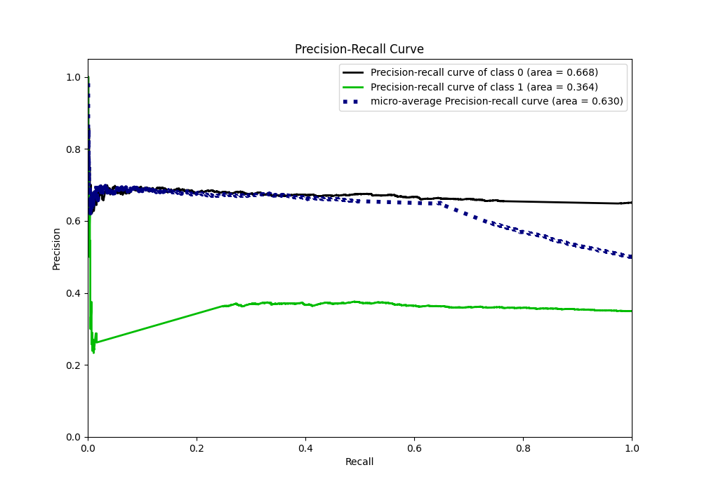
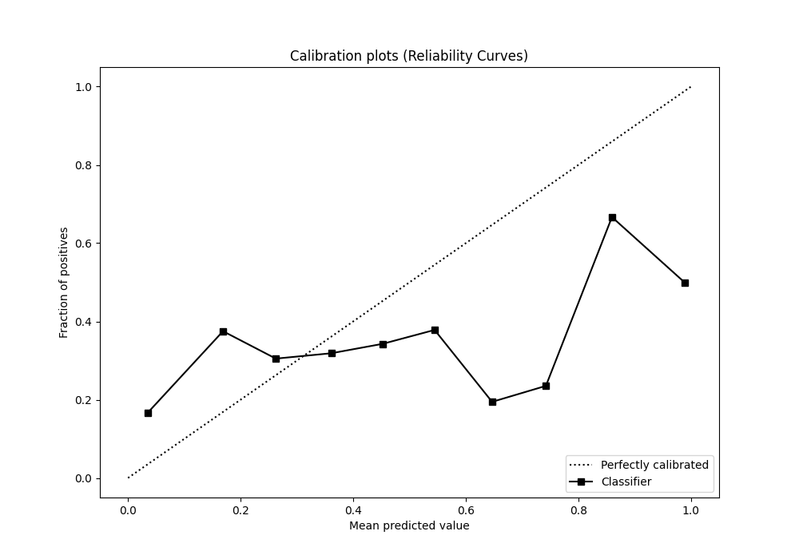
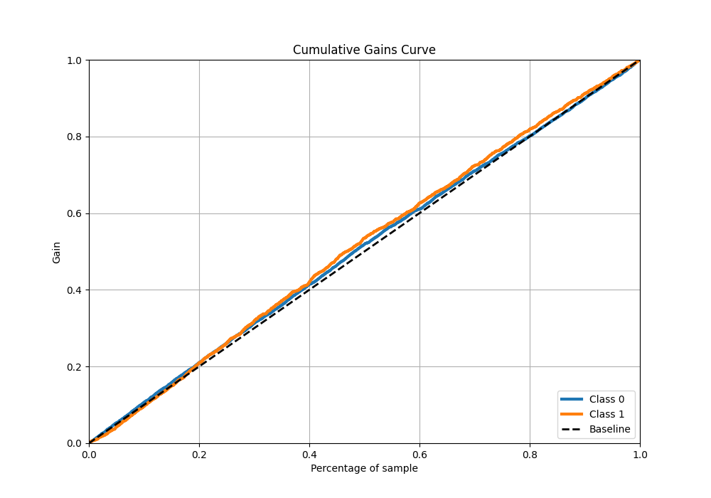
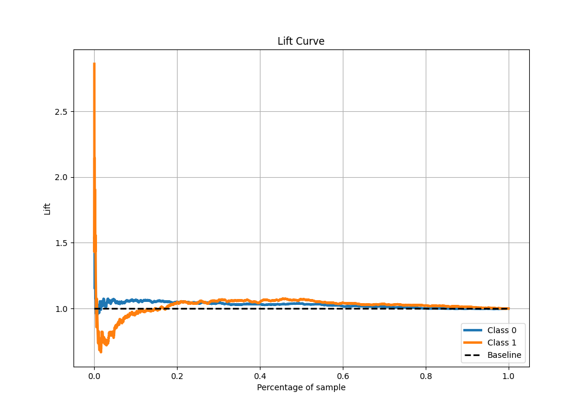

# Summary of 4_Default_NeuralNetwork

[<< Go back](../README.md)

## Neural Network
- **n_jobs**: -1
- **dense_1_size**: 32
- **dense_2_size**: 16
- **learning_rate**: 0.05
- **explain_level**: 2

## Validation
 - **validation_type**: split
 - **train_ratio**: 0.75
 - **shuffle**: True
 - **stratify**: True

## Optimized metric
accuracy

## Training time

3.3 seconds

## Metric details
|           |     score |   threshold |
|:----------|----------:|------------:|
| logloss   | 0.649619  | nan         |
| auc       | 0.523393  | nan         |
| f1        | 0.518072  |   0.0611479 |
| accuracy  | 0.640108  |   0.402378  |
| precision | 0.374925  |   0.361371  |
| recall    | 1         |   0.0611479 |
| mcc       | 0.0519443 |   0.354896  |

## Metric details with threshold from accuracy metric
|           |      score |   threshold |
|:----------|-----------:|------------:|
| logloss   |  0.649619  |  nan        |
| auc       |  0.523393  |  nan        |
| f1        |  0.0306569 |    0.402378 |
| accuracy  |  0.640108  |    0.402378 |
| precision |  0.2625    |    0.402378 |
| recall    |  0.0162791 |    0.402378 |
| mcc       | -0.0271896 |    0.402378 |

## Confusion matrix (at threshold=0.402378)
|              |   Predicted as 0 |   Predicted as 1 |
|:-------------|-----------------:|-----------------:|
| Labeled as 0 |             2341 |               59 |
| Labeled as 1 |             1269 |               21 |

## Learning curves

## Permutation-based Importance

## Confusion Matrix

## Normalized Confusion Matrix

## ROC Curve

## Kolmogorov-Smirnov Statistic

## Precision-Recall Curve

## Calibration Curve

## Cumulative Gains Curve

## Lift Curve

[<< Go back](../README.md)
