# Summary of 5_Default_RandomForest

[<< Go back](../README.md)

## Random Forest
- **n_jobs**: -1
- **criterion**: gini
- **max_features**: 0.9
- **min_samples_split**: 30
- **max_depth**: 4
- **eval_metric_name**: accuracy
- **explain_level**: 2

## Validation
 - **validation_type**: split
 - **train_ratio**: 0.75
 - **shuffle**: True
 - **stratify**: True

## Optimized metric
accuracy

## Training time

6.0 seconds

## Metric details
|           |     score |   threshold |
|:----------|----------:|------------:|
| logloss   | 0.649177  |  nan        |
| auc       | 0.501443  |  nan        |
| f1        | 0.518072  |    0.19359  |
| accuracy  | 0.640108  |    0.415021 |
| precision | 0.364078  |    0.389597 |
| recall    | 1         |    0.19359  |
| mcc       | 0.0424007 |    0.310298 |

## Metric details with threshold from accuracy metric
|           |      score |   threshold |
|:----------|-----------:|------------:|
| logloss   | 0.649177   |  nan        |
| auc       | 0.501443   |  nan        |
| f1        | 0.0674157  |    0.415021 |
| accuracy  | 0.640108   |    0.415021 |
| precision | 0.358209   |    0.415021 |
| recall    | 0.0372093  |    0.415021 |
| mcc       | 0.00350732 |    0.415021 |

## Confusion matrix (at threshold=0.415021)
|              |   Predicted as 0 |   Predicted as 1 |
|:-------------|-----------------:|-----------------:|
| Labeled as 0 |             2314 |               86 |
| Labeled as 1 |             1242 |               48 |

## Learning curves
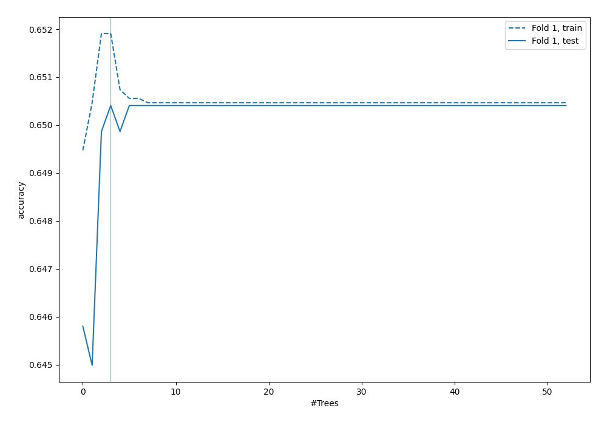

## Permutation-based Importance
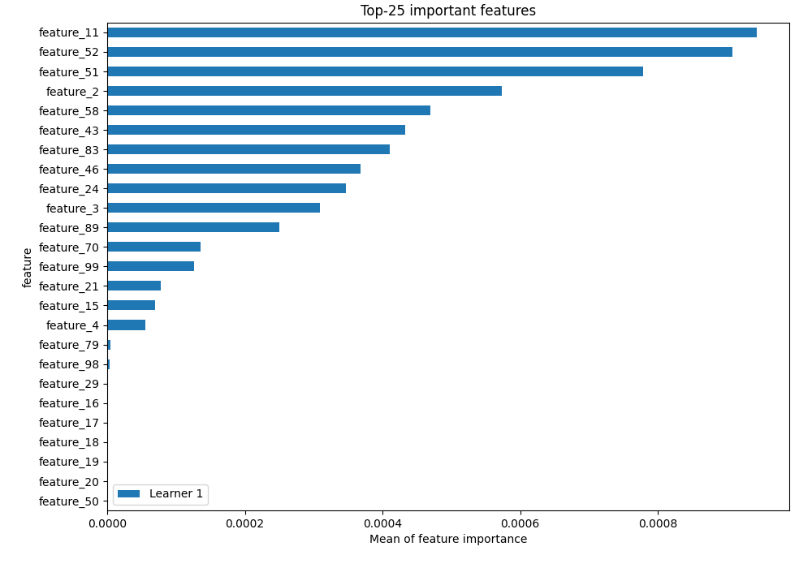
## Confusion Matrix

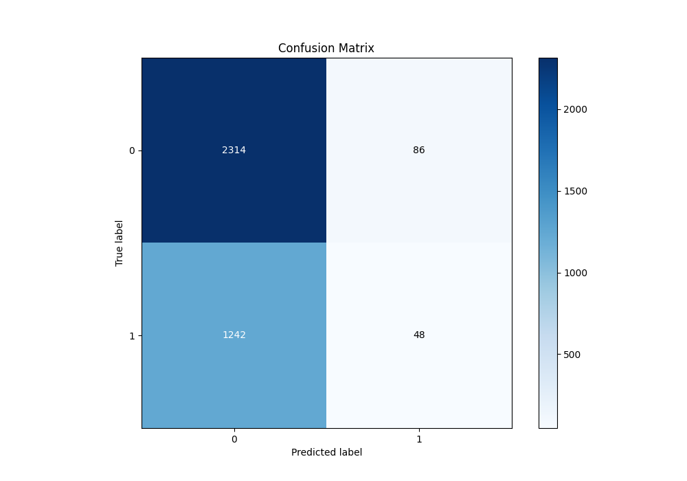

## Normalized Confusion Matrix

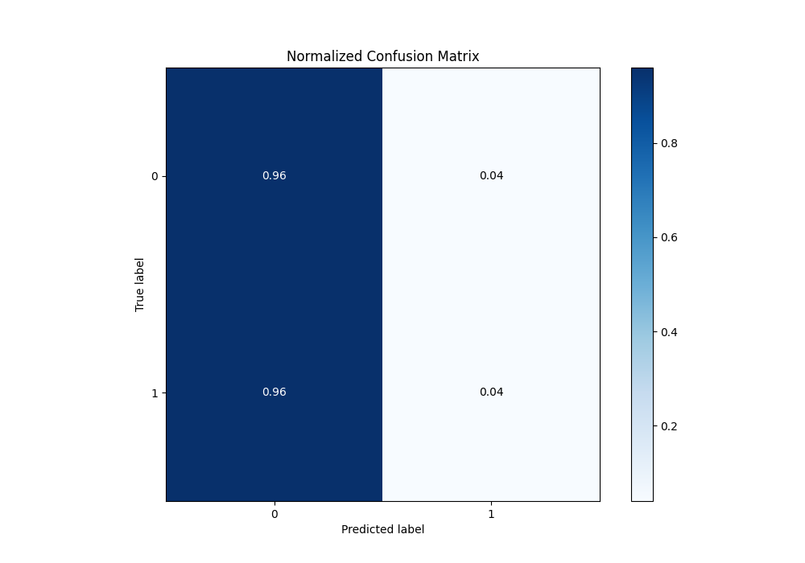

## ROC Curve

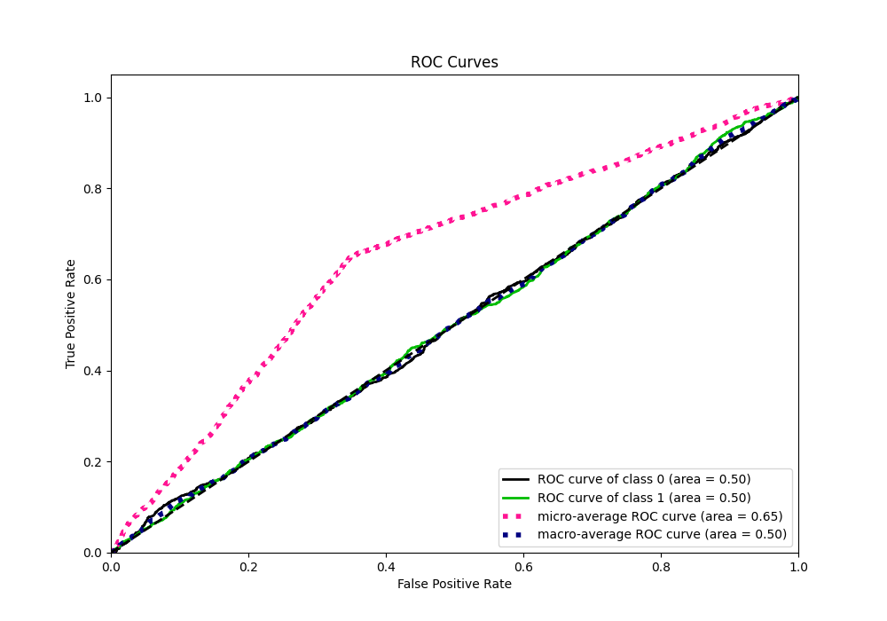

## Kolmogorov-Smirnov Statistic

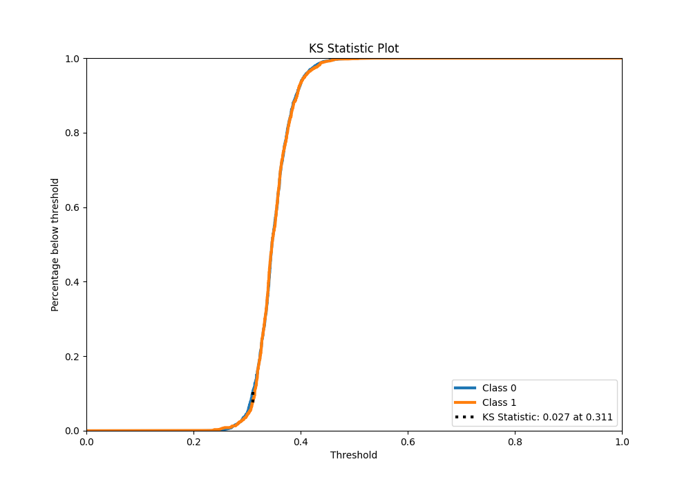

## Precision-Recall Curve

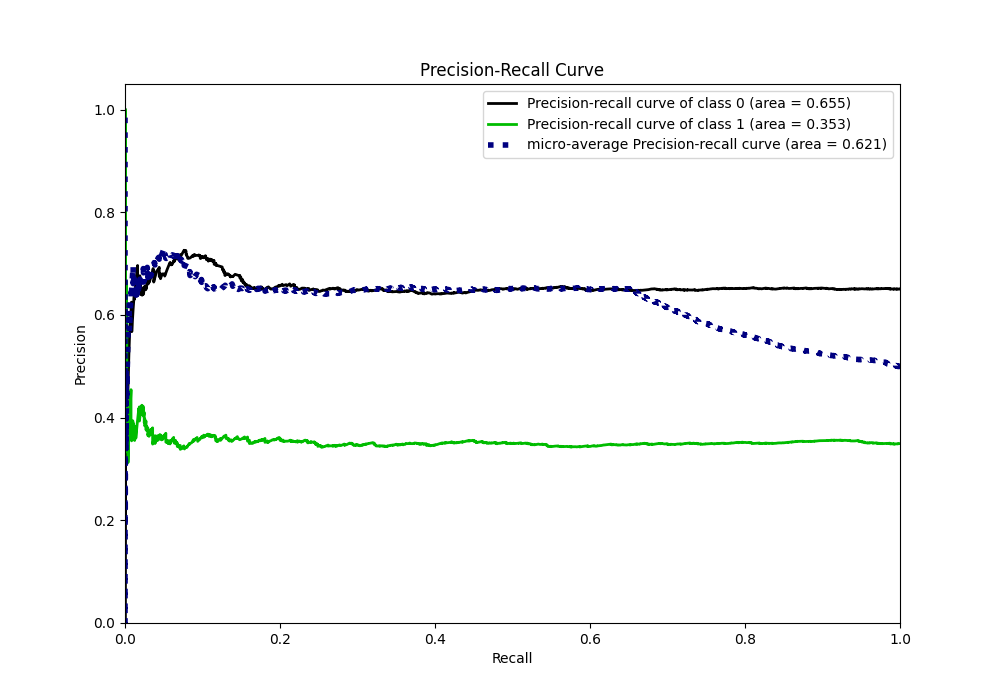

## Calibration Curve

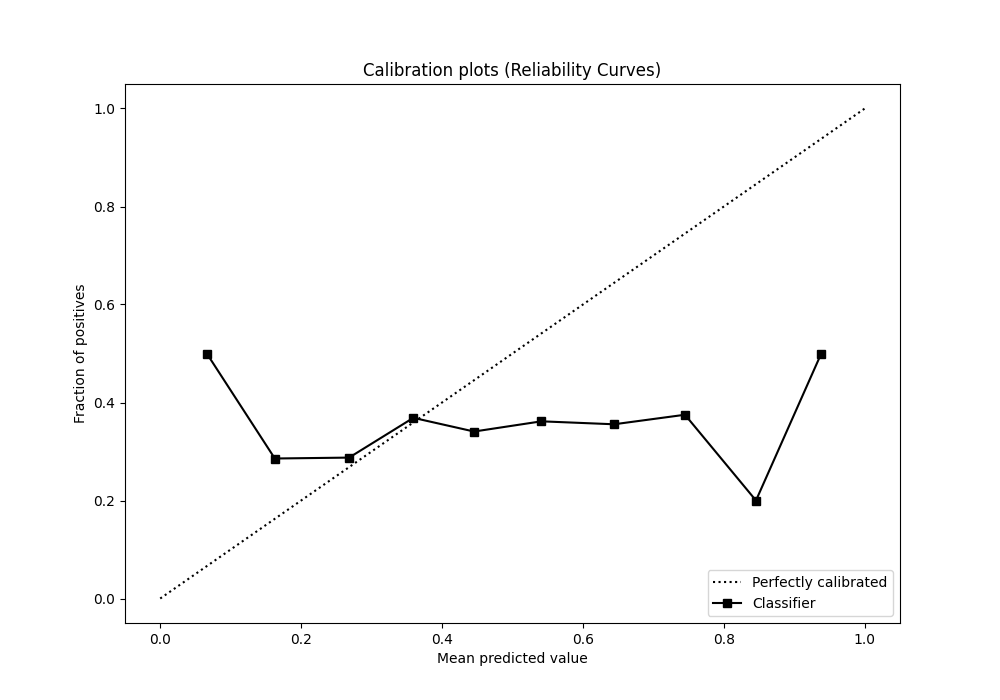

## Cumulative Gains Curve

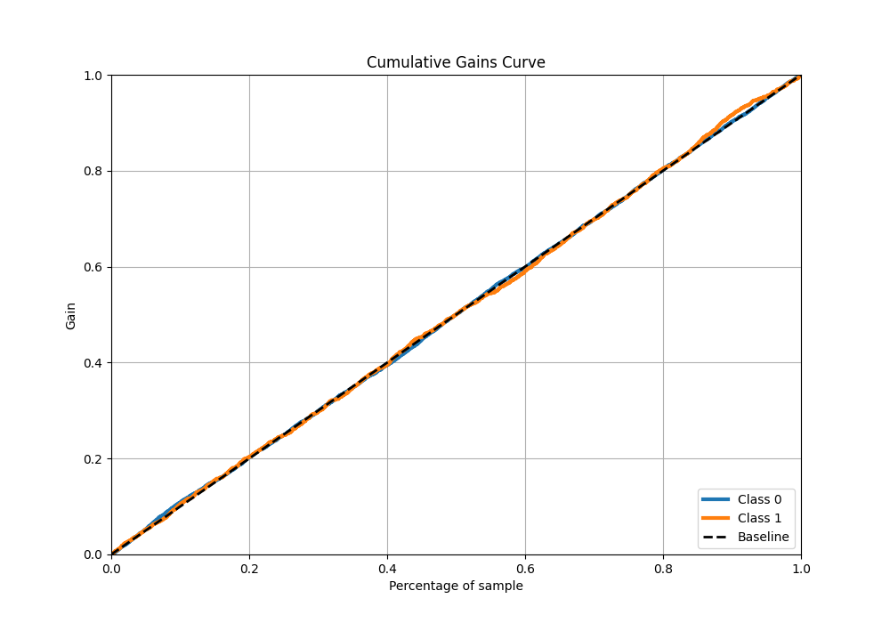

## Lift Curve

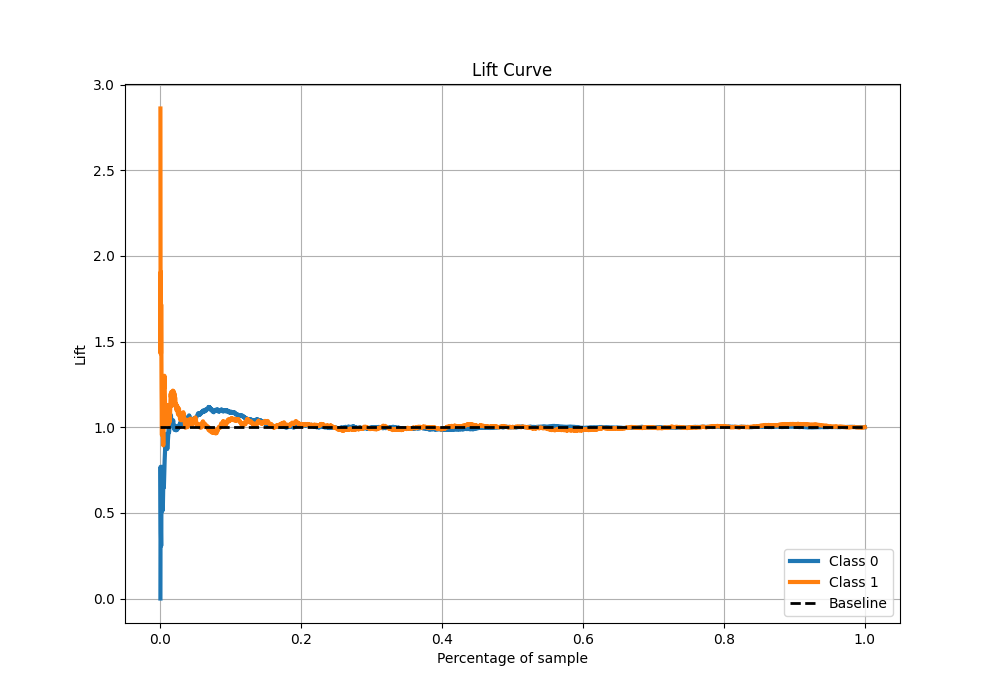

## SHAP Importance
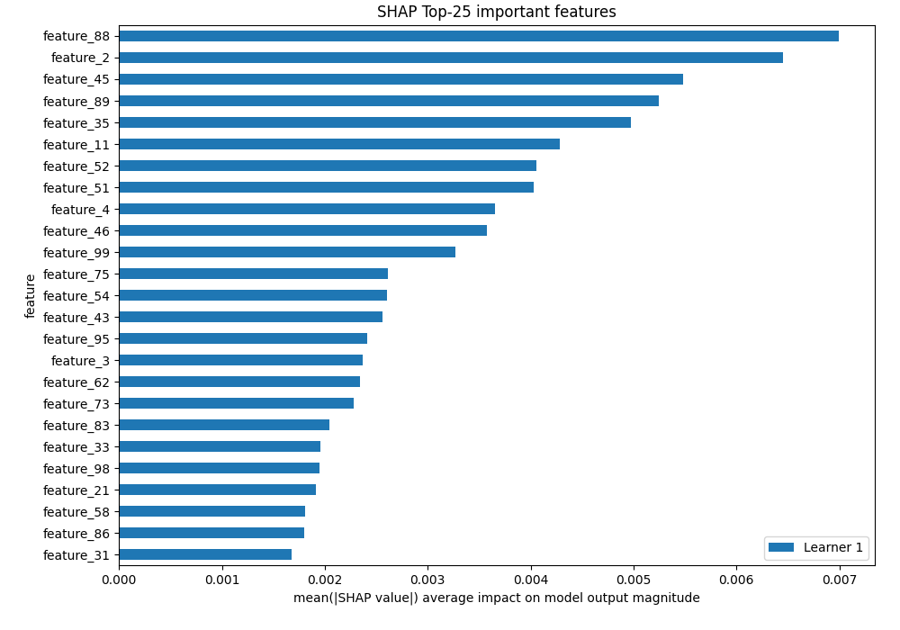

[<< Go back](../README.md)
