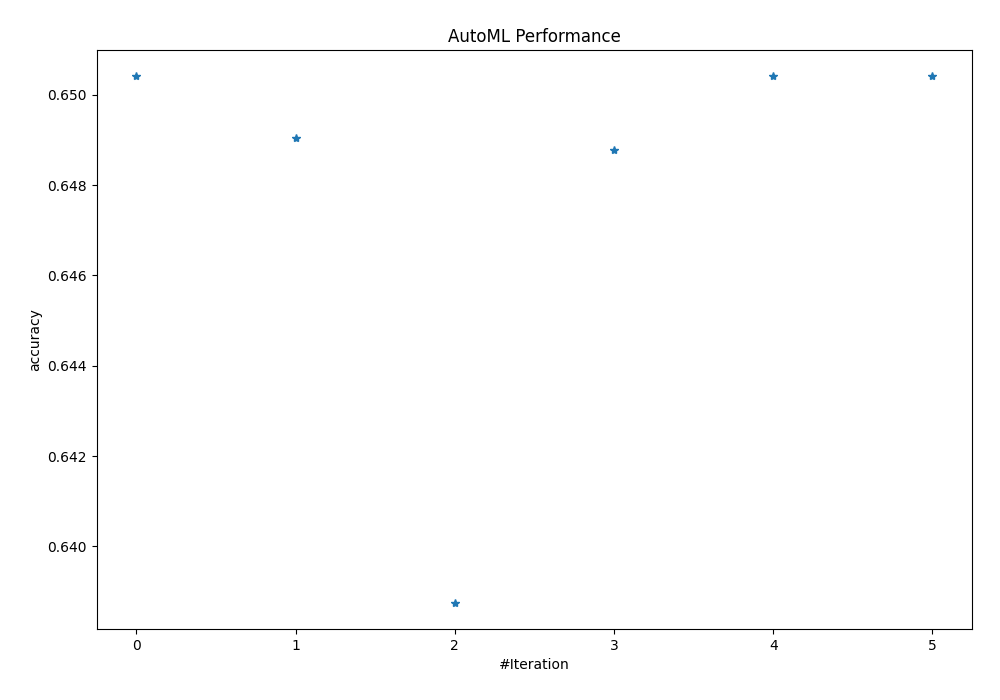
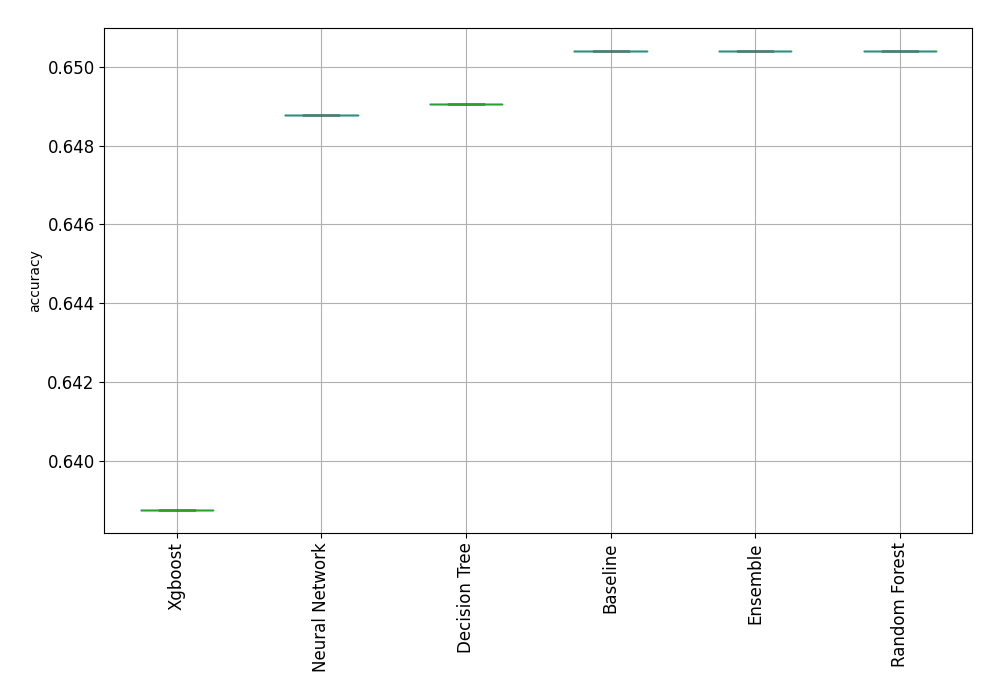
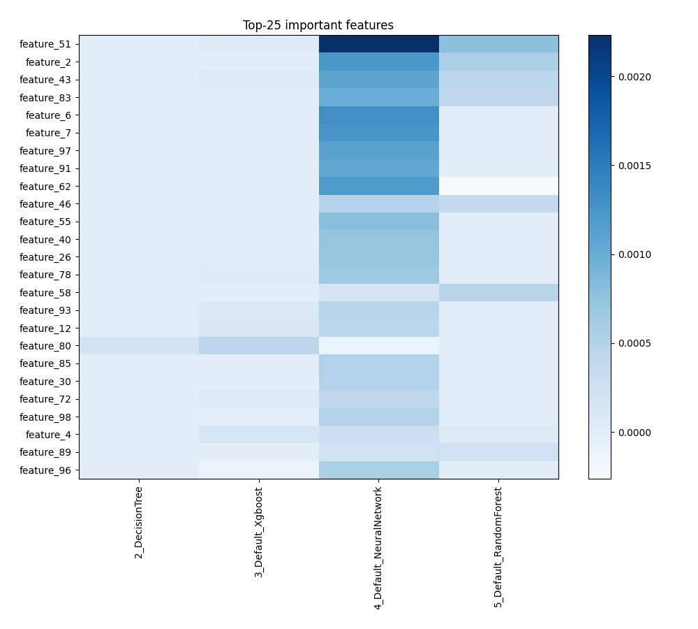
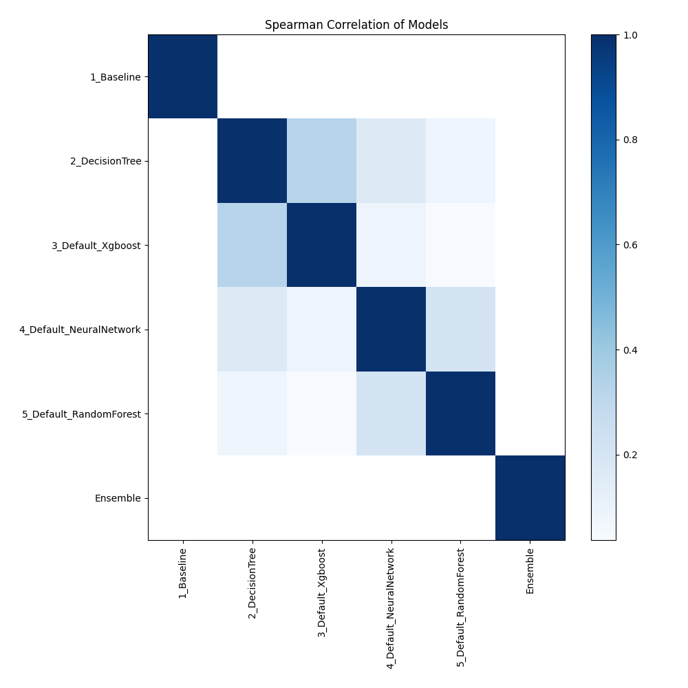

# AutoML Leaderboard

| Best model   | name                                                         | model_type     | metric_type   |   metric_value |   train_time |
|:-------------|:-------------------------------------------------------------|:---------------|:--------------|---------------:|-------------:|
| **the best** | [1_Baseline](1_Baseline/README.md)                           | Baseline       | accuracy      |       0.650407 |         0.98 |
|              | [2_DecisionTree](2_DecisionTree/README.md)                   | Decision Tree  | accuracy      |       0.649051 |         7.3  |
|              | [3_Default_Xgboost](3_Default_Xgboost/README.md)             | Xgboost        | accuracy      |       0.638753 |        24.53 |
|              | [4_Default_NeuralNetwork](4_Default_NeuralNetwork/README.md) | Neural Network | accuracy      |       0.64878  |         4.18 |
|              | [5_Default_RandomForest](5_Default_RandomForest/README.md)   | Random Forest  | accuracy      |       0.650407 |         7.03 |
|              | [Ensemble](Ensemble/README.md)                               | Ensemble       | accuracy      |       0.650407 |         0.15 |

### AutoML Performance

### AutoML Performance Boxplot

### Features Importance

### Spearman Correlation of Models

