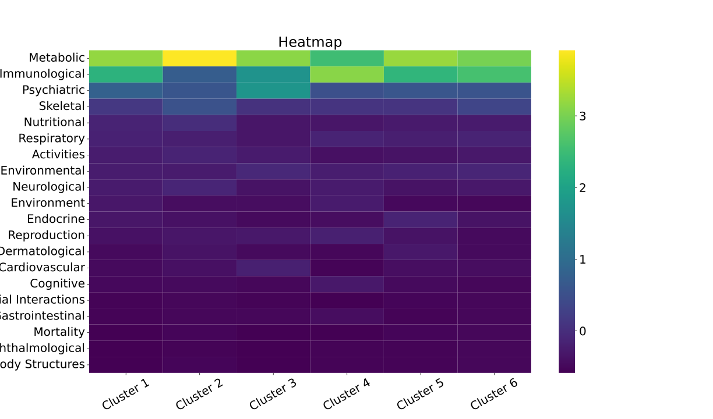
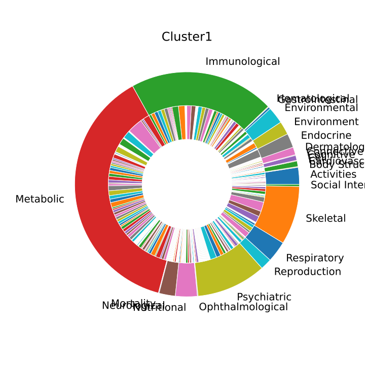
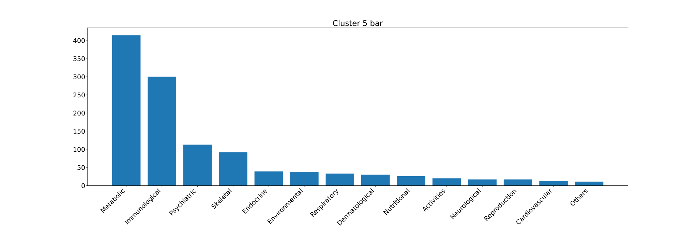

## 结果分析

### 训练结果

其中

+ 深红色为簇6
+ 浅蓝色为簇2
+ 棕色为簇1
+ 深蓝色为簇5
+ 黄色为簇4
+ 绿色为簇3

对于给定不同簇数，EM迭代算法给出ELBO迭代图：越高越好，可看出ELBO整体上呈现上升趋势

但是如果考虑簇内关系的话，簇数为6时vem算法给出最小值

簇与簇之间的关联如下

### 结合表型分析

对于每个簇，我们分析簇内SNP相关的表型性状；给出如下热图

该图通过表型标准化展现了簇与簇之间在不同性状之间的差异，可发现簇1，5具有较强的信号，值得继续分析

该图通过簇标准化展现了簇内不同性状之间的差异，对各簇来说代谢、免疫相关的信号都较强

#### 簇1

观察热图，发现簇1在环境形状方面较其他簇有较强信号，其数据如下

| Field       | Traits                                               | Count |
| ----------- | ---------------------------------------------------- | ----- |
| Environment | Educational attainment                               | 10    |
| Environment | Education - Qualifications                           | 3     |
| Environment | Attendance/disability/mobility allowance: Blue badge | 1     |
| Environment | Illnesses of mother: Diabetes                        | 1     |
| Environment | Illnesses of siblings: Diabetes                      | 1     |
| Environment | Illnesses of siblings: High blood pressure           | 1     |
| Environment | Job involves heavy manual or physical work           | 1     |
| Environment | Maternal smoking around birth                        | 1     |

发现其中竟然与教育程度有关，推测是因为教育程度较低的个体后期从事体力劳动的可能性较大，对关节有损伤，我们试图将该簇定义为外因组

#### 簇5

簇5相对于其他簇各个性状域均有较强信号，其中以内分泌与免疫尤甚，分析其

| Field     | Traits                                                       | Count |
| --------- | ------------------------------------------------------------ | ----- |
| Endocrine | Type 2 Diabetes                                              | 25    |
| Endocrine | Diabetes (diagnosed by doctor)                               | 2     |
| Endocrine | Diagnoses - secondary ICD10: E11 Type 2 diabetes mellitus    | 2     |
| Endocrine | Non-cancer illness code, self-reported: diabetes             | 2     |
| Endocrine | Diagnoses - secondary ICD10: E03 Other hypothyroidism        | 1     |
| Endocrine | Free thyroxine (FT4)                                         | 1     |
| Endocrine | Non-cancer illness code, self-reported: hypothyroidism/myxoedema | 1     |
| Endocrine | Thyroid-stimulating hormone                                  | 1     |
| Endocrine | Thyroid-stimulating hormone (female)                         | 1     |
| Endocrine | Thyroid-stimulating hormone (male)                           | 1     |
| Endocrine | Type 1 Diabetes                                              | 1     |
| Endocrine | Type 2 Diabetes (adjusted for BMI)                           | 1     |

| Field         | Traits                                           | Count |
| ------------- | ------------------------------------------------ | ----- |
| Immunological | Myeloid white cell count (three-way meta)        | 14    |
| Immunological | White blood cell count (three-way meta)          | 14    |
| Immunological | Granulocyte count (three-way meta)               | 13    |
| Immunological | Platelet distribution width (two-way meta)       | 13    |
| Immunological | Sum neutrophil eosinophil count (three-way meta) | 13    |
| Immunological | Neutrophil count (three-way meta)                | 12    |
| Immunological | Platelet distribution width (three-way meta)     | 12    |
| Immunological | Sum basophil neutrophil count (three-way meta)   | 12    |
| Immunological | Myeloid white cell count (two-way meta)          | 11    |
| Immunological | Red cell distribution width (three-way meta)     | 11    |
| Immunological | Red cell distribution width (two-way meta)       | 11    |
| Immunological | White blood cell count (two-way meta)            | 11    |
| Immunological | Granulocyte count (two-way meta)                 | 10    |

我们发现骨关节炎与二型糖尿病以及与巨噬细胞数量的强烈关联，推测此组主要通过自体免疫的方式影响骨关节炎进程；我们将其定义为内因组
