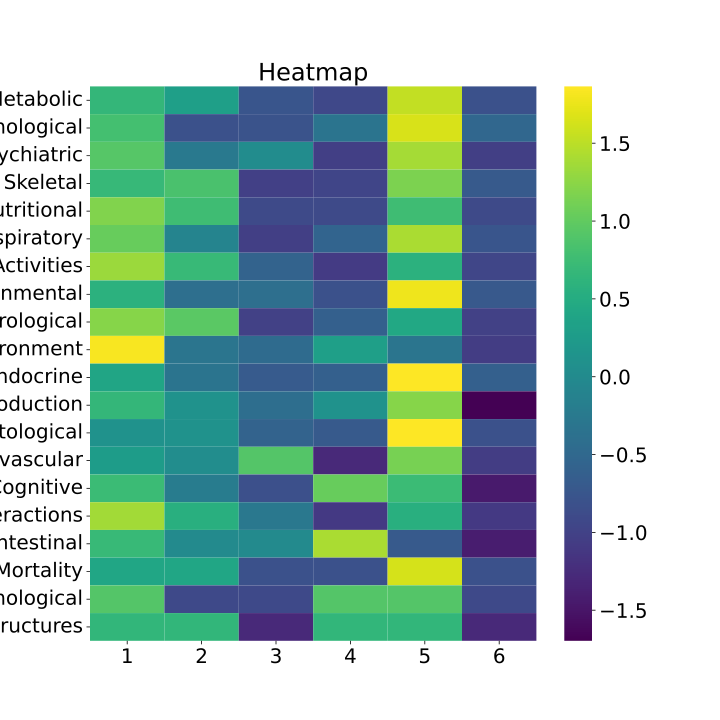
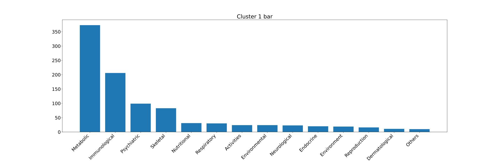
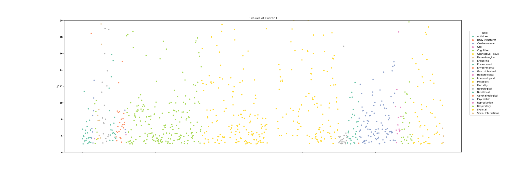
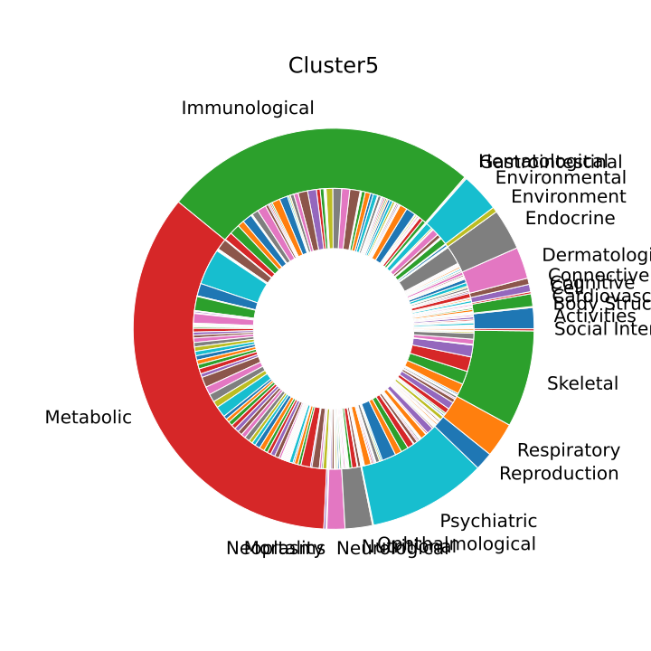
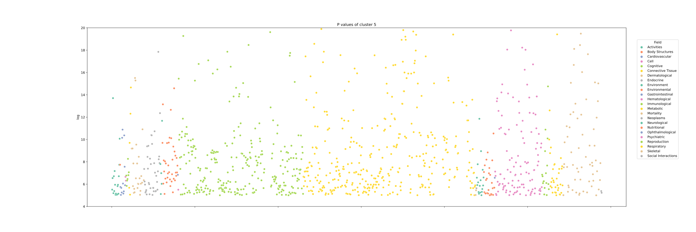

# 进度汇报

过去的一个月里我对模型准确率，邻接矩阵的更新算法与模型解释算法进行分析

+ 推导构建变分期望最大化算法，消除之前EM算法假设中不严谨之处，加快运算速度

+ 利用该算法在估计邻接矩阵的同时进行聚类，发现SNP所形成的簇同表型有着相关，可用于疾病分型？

+ 但是最终准确率还是无明显改善

以下对工作做以汇报

# 中期答辩后思考

### 之前EM算法不足

在我之前所采取的EM算法中，图 $G$ 作为模型隐变量参与优化，而我们假设该隐变量由若干参数通过一定模型产生，该过程称为图结构建模；受当时参考文献影响，我采用SBM模型，该模型认为

+ 一个图中的节点属于一个簇
+ 同簇节点相互关联概率一定且相等
+ 不同簇节点之间概率只与双方节点所在的簇有关

通过数学语言描述为： $$ xG ->P(G|\Omega)=\prod_{i<j}\Omega_{c_ic_j}^{G_{ij}}(1-\Omega_{c_ic_j})^{(1-G_{ij})} $$
**文献中认为$c_i$已知**， 因此给定参数$\Omega$，$G$的后验分布$P(G|\Omega)$也已知；

这之后我们构建图参数对观测值的后验概率分布 $$ P(G,\Omega,\alpha,\beta|O)=\frac{P(O|G,\alpha,\beta)P(G|\Omega)P(\Omega)P(\alpha)P(\beta)}{P(O)
} $$ 认为参数的先验均为几何分布，且$P(G|\Omega)$已知，我们只需要通过EM算法计算$P(O|G,\alpha,\beta)$便可得出该后验分布。

**但是，在本项目中，节点所在簇的信息未知**，EM算法原理上讲行不通，但是之前版本算法通过假设**每个节点都属于一个簇**来规避该问题，使得在给定参数$\Omega$ 的情况下也能计算隐变量$G$；但是该算法的复杂度也直线上升为$O(
n^2)$，相当笨重。这也使我产生了使用HMM解决较高计算复杂度问题的意图，但是中期后我继续查资料的时候没有找到使用该方法计估计邻接矩阵的方法，因此我也就将重点放在了SBM模型上

### 解决办法

目前关于图神经网络的研究中尚无对该问题的继续改进，因此我将文献检索范围扩大至离散数学与图论，终于发现如下论文

> Mariadassou, Mahendra, Stéphane Robin, and Corinne Vacher. 2010. “Uncovering Latent Structure in Valued Graphs: A Variational Approach.” *The Annals of Applied Statistics* 4 (2): 715–42.

该文献介绍了目前在SBM模型领域常见的解决算法；EM算法的不足是$P(G|\Omega )$无法计算。但是我们可以通过其他方式对该函数进行采样与模拟，也因此派生出两种解决办法

+ 基于变分推理的算法
+ 基于马尔可夫蒙特卡洛的算法

之前生信课上我已经用过MCMC算法计算系统发生树，因此这次我想试试变分推理法

## 变分期望最大化Variational Expectation Maximization

### 问题描述

对于对称无权重图$G=(V, X)$ ，其中$V={v_1,...v_n}$描述图中节点，$ X=\{ x_{ij}\}$描述节点$i$与节点$j$
之间关联；根据图的SBM模型，我们认为图中共含有$C$个簇，每个节点$i$从属于簇$m$的概率用 $z_{im}\in \bold{Z}^{N\times C},i\in \{1, ... ,n\},m\in\{1,...,C\}$
来描述，且$z_i$相互独立并满足多项分布 $$ z_i ~^{iid} M(1,\alpha)
$$ 基于此，我们使用$z_i$ 来描述节点之间关联。我们认为任意两节点之间的关联相互独立并满足二项分布 $$ x_{ij}|z_{im},z_jn = 1 ~ B(1,\pi_{z_iz_j})
$$ 可以看出，只要解出参数$\pi$与$\alpha$, 我们就可以构建出一个SBM模型，继而对图结构加以推断；因此我们给出以下目标：

> 基于观察到的节点关联信息$X$以及隐变量$Z$，估计参数$\theta=\{\alpha,\pi\}$
> $$
> \hat{\theta}=argmax l_\theta(X)
> $$
>

### 推导与整理

在节点关联与节点簇信息均已知的情况下，我们首先计算似然函数$l_{\theta}$，根据边缘概率公式，有 $$ l_\theta(X)=\sum_{Z}\log p_\theta(X,Z)=\sum_Z(\log p_{\pi}(X|Z)
+\log p_\alpha(Z))
$$ 其中 $$ \sum_Z(\log p_{\pi}(X|Z)+\log p_\alpha(Z))=\sum_Z(\sum_{i,j}^{n}\sum_{m,n}^C\log p_\pi(x_{ij}|z_{im}z_{jn})
+\sum_{i}^N\sum_m^C\log p_\alpha(z_{im}))
$$ 给定参数时，有 $$ p_\pi(x_{ij}|z_{im}z_{jn};\pi)=\binom{1}{X_{ij}}[\pi_{mn}(1-\pi_{mn})^{1-X_{ij}}]^{ z_{im}z_{jn}} $$

$$ p_\alpha(z_{im})=\alpha_m^{z_{im}} $$

可得 $$ l_\theta(X) = \sum_Z(\sum_{i,j}^{n}\sum_{m,n}^C\log p_\pi(x_{ij}|z_{im}z_{jn})+\sum_{i}^N\sum_m^C\log p_\alpha(z_
{im}))\\ =\sum_Z(\sum_{i,j}^{n}\sum_{m,n}^C\log \binom{1}{X_{ij}}[\pi_{mn}(1-\pi_{mn})^{1-X_{ij}}]^{ z_{im}z_{jn}}+\sum_
{i}^N\sum_m^C\log\alpha_m^{z_{im}})
$$ 当Z的数量足够大时，我们无法通过通过最大似然法直接求解参数；如果使用期望最大化算法，构造的辅助函数将会含有$P(Z|X)$，同样无法求解，因此我们需要通过变分法模拟该后验分布$P(Z|X)$；

### vEM

#### 基于Jensen不等式的EM

对于似然函数$l(x;\theta)$，有 $$ l(x;\theta)=\log p(x;\theta)\\ =\log \int_Z p(x,z;\theta)dz\\ =\log \int_Zq(z)\frac{p(
x,z;\theta)}{q(z)}dz\\ =\log E[\frac{p(x,z;\theta)}{q(z)}]
$$ 由Jensen不等式，对于任何凸函数，有 $$ E[f(x)]\geq f(E[x])
$$ 当且仅当$x=E(x)$时取等，因$\log(x)$ 为凹函数，有 $$ l(x;\theta)=\log p(x;\theta)=\log E[\frac{p(x,z;\theta)}{q(z)}]\\ \geq
E[\log(\frac{p(x,z;\theta)}{q(z)})]
$$ 取等条件为 $$ \frac{p(x,z;\theta)}{q(z)}=c\\ q(z;\theta)=c\cdot p(x,z;\theta)
$$ 因$\sum q(z;\theta)=1$，有 $$ q(z;\theta)=\frac{p(x,z;\theta)}{\sum_z p(x,z;\theta)}=\frac{p(x,z;\theta)}{p(x;\theta)
}\\=p(z|x;\theta)
$$ 代入原方程，有 $$ l(x;\theta)==\log E[\frac{p(x,z;\theta)}{q(z)}]\\ \geq E[\log(\frac{p(x,z;\theta)}{q(z)})]\\ =\int_z p(
z|x;\theta)\log(\frac{p(x,z;\theta)}{p(z|x;\theta)})=Q(\theta;\theta^{old})
$$ 因此，从某种意义上讲EM算法先确定似然函数下界，然后通过最大似然法不断提高似然函数下界。

#### ELBO

刚才的推导可以看出EM算法通过构建辅助函数$q(z;\theta)=p(z|x;\theta)$来确定函数下界，该下界也被称为Evidence Lower Bond，我们定义其为 $$ ELBO=\int_z q(z)\log(
\frac{p(x,z;\theta)}{q(z)})
$$ 并且定义 $$ \log p(x;\theta)-\int_z q(z)\log(\frac{p(x,z;\theta)}{q(z)})=\int_z q(z)\log p(x;\theta)dz-\int_z q(z)\log(
\frac{p(x,z;\theta)}{q(z)})\\=\int_z q(z)\log(\frac{q(z;\theta)p(x;\theta)}{p(x,z;\theta)})\\=-\int_z q(z)\log(\frac{p(
z|x;\theta)}{q(z;\theta)})\\ =KL(q||p)
$$ 为分布$q$与$p$之间的Kullback-Leibler散度，用来衡量两个分布之间的偏差

#### 变分期望最大化

$p(z|x;\theta)$无法求得，我们可以通过构建一个其他分布用来逐步逼近的方式间接求解；并用KL散度来衡量二者的误差，同时通过ELBO最大化完成参数的估计。

因此我们构建辅助函数 $$ q_\psi(\mathbf{Z}) \approx p_\theta(\mathbf{Z} | \mathbf{Y})
$$ 计算其与目标分布的KL散度来逼近目标分布 $$ KL\left(q(\mathbf{Z}), p(\mathbf{Z} | \mathbf{Y})\right) = \mathbb{E}_
q\left[\log \frac{q(z)}{p(z)}\right] = \int_{\mathcal{Z}} q(z) \log \frac{q(z)}{p(z)} \mathrm{d}z. $$ 并通过最大化ElBO完成参数估计
$$ J(\theta, \psi) = \log p_\theta(\mathbf{Y}) - KL[q_\psi (\mathbf{Z}) || p_\theta(\mathbf{Z} | \mathbf{Y})]  =
\mathbb{E}_{q} [\log p_\theta(\mathbf{Y}, \mathbf{Z})] + \mathcal{H}[q_\psi(\mathbf{Z})]
$$
### vEM迭代

#### M步

**更新参数**$\theta=\{\alpha,\pi \}$ $$ \theta^h = \arg\max J(\theta, \psi^h) = \arg\max_{\theta} \mathbb{E}_{q_
{\psi^h}} [\log p_{\theta}(\mathbf{Y}, \mathbf{Z})]
$$

#### VE步

**更新辅助函数**$q_\psi(\mathbf{Z})$ $$ \psi^h = \arg \max J(\theta^h, \psi) = \arg\min_{\psi}
KL[q_\psi(\mathbf{Z}) \,||\, p_{\theta^h}(\mathbf{Z}\,|\,\mathbf{Y})]
$$

## 结果分析

### 训练结果

其中

+ 深红色为簇6
+ 浅蓝色为簇2
+ 棕色为簇1
+ 深蓝色为簇5
+ 黄色为簇4
+ 绿色为簇3

对于给定不同簇数，EM迭代算法给出ELBO迭代图：越高越好，可看出ELBO整体上呈现上升趋势

但是如果考虑簇内关系的话，簇数为6时vem算法给出最小值

簇与簇之间的关联如下

### 结合表型分析

对于每个簇，我们分析簇内SNP相关的表型性状；给出如下热图

该图通过表型标准化展现了簇与簇之间在不同性状之间的差异，可发现簇1，5具有较强的信号，值得继续分析

该图通过簇标准化展现了簇内不同性状之间的差异，对各簇来说代谢、免疫相关的信号都较强

#### 簇1

观察热图，发现簇1在环境形状方面较其他簇有较强信号，其数据如下

| Field       | Traits                                               | Count |
| ----------- | ---------------------------------------------------- | ----- |
| Environment | Educational attainment                               | 10    |
| Environment | Education - Qualifications                           | 3     |
| Environment | Attendance/disability/mobility allowance: Blue badge | 1     |
| Environment | Illnesses of mother: Diabetes                        | 1     |
| Environment | Illnesses of siblings: Diabetes                      | 1     |
| Environment | Illnesses of siblings: High blood pressure           | 1     |
| Environment | Job involves heavy manual or physical work           | 1     |
| Environment | Maternal smoking around birth                        | 1     |

发现其中竟然与教育程度有关，推测是因为教育程度较低的个体后期从事体力劳动的可能性较大，对关节有损伤，我们试图将该簇定义为外因组

#### 簇5

簇5相对于其他簇各个性状域均有较强信号，其中以内分泌与免疫尤甚，分析其

| Field     | Traits                                                       | Count |
| --------- | ------------------------------------------------------------ | ----- |
| Endocrine | Type 2 Diabetes                                              | 25    |
| Endocrine | Diabetes (diagnosed by doctor)                               | 2     |
| Endocrine | Diagnoses - secondary ICD10: E11 Type 2 diabetes mellitus    | 2     |
| Endocrine | Non-cancer illness code, self-reported: diabetes             | 2     |
| Endocrine | Diagnoses - secondary ICD10: E03 Other hypothyroidism        | 1     |
| Endocrine | Free thyroxine (FT4)                                         | 1     |
| Endocrine | Non-cancer illness code, self-reported: hypothyroidism/myxoedema | 1     |
| Endocrine | Thyroid-stimulating hormone                                  | 1     |
| Endocrine | Thyroid-stimulating hormone (female)                         | 1     |
| Endocrine | Thyroid-stimulating hormone (male)                           | 1     |
| Endocrine | Type 1 Diabetes                                              | 1     |
| Endocrine | Type 2 Diabetes (adjusted for BMI)                           | 1     |

| Field         | Traits                                           | Count |
| ------------- | ------------------------------------------------ | ----- |
| Immunological | Myeloid white cell count (three-way meta)        | 14    |
| Immunological | White blood cell count (three-way meta)          | 14    |
| Immunological | Granulocyte count (three-way meta)               | 13    |
| Immunological | Platelet distribution width (two-way meta)       | 13    |
| Immunological | Sum neutrophil eosinophil count (three-way meta) | 13    |
| Immunological | Neutrophil count (three-way meta)                | 12    |
| Immunological | Platelet distribution width (three-way meta)     | 12    |
| Immunological | Sum basophil neutrophil count (three-way meta)   | 12    |
| Immunological | Myeloid white cell count (two-way meta)          | 11    |
| Immunological | Red cell distribution width (three-way meta)     | 11    |
| Immunological | Red cell distribution width (two-way meta)       | 11    |
| Immunological | White blood cell count (two-way meta)            | 11    |
| Immunological | Granulocyte count (two-way meta)                 | 10    |

我们发现骨关节炎与二型糖尿病以及与巨噬细胞数量的强烈关联，推测此组主要通过自体免疫的方式影响骨关节炎进程；我们将其定义为内因组
