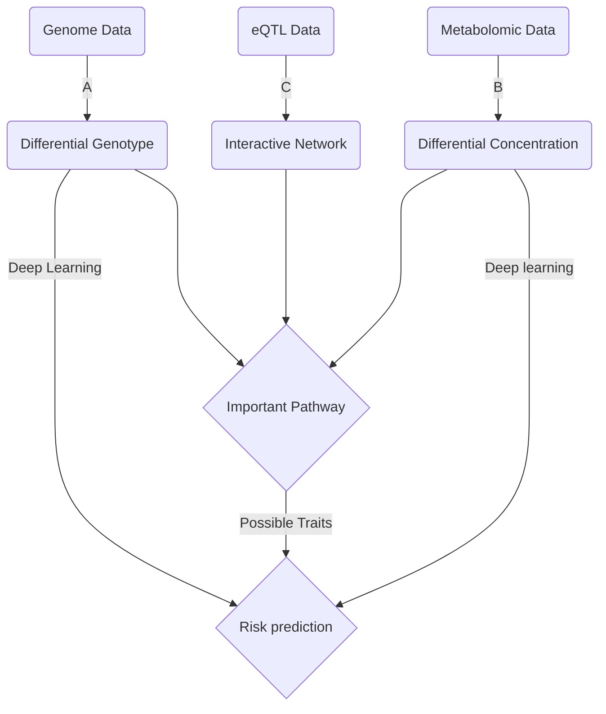

This blog records the progress of my thesis in XJTU
# Ideas
Prof. Guo advises that osteoarthritis might be a good research.

> [Meta analysis of GWAS in Osteoarthritis](https://pubmed.ncbi.nlm.nih.gov/34450027/)

This article conduct a meta-analysis of GWAS. I might not do that meta analysis but just GWAS. So the goal might be **Learning Approach to Osteoarthritis Analysis**

For theoretical basis, I search for definitions of meta-analysis and possible learning approach in GWAS
> [Meta-analysis:]( https://www.ncbi.nlm.nih.gov/pmc/articles/PMC2695132/)
> [Machine learning approach: ](https://www.frontiersin.org/articles/10.3389/fgene.2020.00350/full)

After discussion with Prof.Guo, there might be three main problems i might cast sight on:

+ Given the GEO data, analysis possible gene loci.
+ Given the Metabolism data, find possible pathway that can be regulated by drugs.
+ Given the patient sample, predict the risk. 

Hence I shall first look through the data and determine which should i pick.

# Data collection

## GWAS research

1. Select 177517/826690 individuals for analysis

   > 2 EA groups and 11 European 

2.  Found 11897 SNV 

   > p < 1.3 10e-8

3. Phenotype conditional analysis identify 223 independent associations 

4. 87/96 loci replicated 

5. Phenotype independently conditional analysis shows 100 associations

6. Lead SNV of each of associations mentioned in 5 are selected. 

   > 6 Coding SNV
   > 59 transcription reside SNV
   > 35 intergenic SNV

   + Update risk SNV for different tissue
   + 6 rare SNVs are detected (discovered in Iceland)

7. Risk SNVs also related to EA groups with evidence in several phenotype

8. Polygenic risk scores related to some of phenotypes

9. 3 Female only SNVs discovered.

   > RS116112221 interestingly located 

10.  Meta analysis shows another risk variant

11. 60/100 SNVs related to phenotype

    > 40 weight-bearing only
    >
    > 4 non-weight bearing only
    >
    > 42 both **may contribute to pathology** 

12. Some SNVs have more participation in joint replacement than osteoarthritis pathology; Especially with **pains**

13. Identify 637 genes with possible ability to become effector gene

14. Identify 77 genes with higher potential based on various criteria 

    > 4 supported by missense SNV
    >
    > 48 previously reported 
    >
    > 30 newly discovered

15. 77 genes mentioned above are distributed in 6 groups

    > + Skeletal development (63/77)
    > + Joint degeneration
    > + Neuronal function
    > + Muscle function
    > + Immune response
    > + Adipogenesis

16. 205/637 genes are potential drug target 

    > 71/205 genes cooperate well with drugs licensed 

17. 20/77 genes can be candidates

    > 7 newly discovered

## Metabolomics research

32 research contains metabolomic data

| Tissue | Biospecimen | Phenotypes | Amount |
| ------ | ----------- | ---------- | ------ |
| Joint  | Synovial    | OA, RA     | 13     |
| Serum  | Serum       | OA, RA     | 19     |

| Phenotypes                                                   | Biospecimen      | Methodology            | Sample size                                                  | References                                                   |
| ------------------------------------------------------------ | ---------------- | ---------------------- | ------------------------------------------------------------ | ------------------------------------------------------------ |
| Knee OA, RA, and postmortem controls                         | SF               | UPLC Q-TOF MS          | ==OA 5, RA 3, Controls 5.==                                  | *Carlson A* et al. [[16](https://www.sciencedirect.com/science/article/pii/S2665913121000339#bib16)] |
| Early and later knee OA and controls (all postmortem)        | SF               | UPLC Q-TOF MS          | ==Early OA 55; late OA 17; controls 7.==                     | *Carlson A* et al. [[18](https://www.sciencedirect.com/science/article/pii/S2665913121000339#bib18)] |
| Knee OA and cadaveric controls                               | SF               | 1H NMR and GC-MS       | Knee OA 55; controls 13.                                     | *Mickiewicz B* et al. [[13](https://www.sciencedirect.com/science/article/pii/S2665913121000339#bib13)] |
| Knee OA, RA, postmortem controls                             | SF               | ESI-MS/MS              | ==Early OA 17; late OA 13; RA 18; controls 9.==              | *Kosinska M* et al. [[14](https://www.sciencedirect.com/science/article/pii/S2665913121000339#bib14)] |
| Knee OA vs. controls                                         | SF               | GC-TOF/MS              | ==OA 49; controls 21.==                                      | *Zheng K* et al. [[17](https://www.sciencedirect.com/science/article/pii/S2665913121000339#bib17)] |
| Knee OA, gout, calcium pyrophosphate disease (CPPD), spondylarthritis, septic arthritis, and RA | SF               | 1H NMR                 | OA 15; gout 18; CPPD 11; septic arthritis 4; RA 4; reactive arthritis 3; Crohn's disease 2; ankylosing spondylitis 1; psoriasis arthritis 1. | *Hügle T* et al. [[22](https://www.sciencedirect.com/science/article/pii/S2665913121000339#bib22)] |
| Reactive arthritis and undifferentiated spondyloarthropathy; RA, and OA | SF               | 1H NMR                 | ==OA 21; RA 25; and reactive arthritis 30.==                 | *Muhammed H* et al. [[23](https://www.sciencedirect.com/science/article/pii/S2665913121000339#bib23)] |
| Knee OA severity                                             | SF               | GC/TOF MS              | ==OA 15.==                                                   | *Kim S* et al. [[12](https://www.sciencedirect.com/science/article/pii/S2665913121000339#bib12)] |
| Knee and hip OA                                              | SF               | 1H NMR                 | ==Hip 12; knee 12.==                                         | *Akhbari P* et al. [[19](https://www.sciencedirect.com/science/article/pii/S2665913121000339#bib19)] |
| Classification of OA                                         | SF               |                        | hip and knee OA 80.                                          | *Zhang W.* et al.                                            |
| Knee OA vs. controls and other forms of arthritis            | Serum            | GC-TOF MS/UPLC-QTOF MS | ==OA 27; RA 27; AS 27; gout 33, and controls 60.==           | *Jiang M* et al. [[25](https://www.sciencedirect.com/science/article/pii/S2665913121000339#bib25)] |
| OA, RA, and FM                                               | Bloodspot        | IRMS                   | OA 12; RA 15; FM14.                                          | *Hackshaw KV* et al. [[26](https://www.sciencedirect.com/science/article/pii/S2665913121000339#bib26)] |
| Knee OA vs. controls                                         | Plasma           | GC/Q-TOF-MS            | ==OA 12; controls 29.==                                      | *Huang Z* et al. [[27](https://www.sciencedirect.com/science/article/pii/S2665913121000339#bib27)] |
| OA vs. controls                                              | Serum            | LC/MS                  | ==Knee and hip OA 70; controls 82.==                         | *Tootsi K.* et al. [[28](https://www.sciencedirect.com/science/article/pii/S2665913121000339#bib28)] |
| OA vs. controls                                              | Serum            | 1H NMR                 | ==OA 1556; controls 2125.==                                  | *Meessen, J.* et al. [[29](https://www.sciencedirect.com/science/article/pii/S2665913121000339#bib29)] |
| OA vs. controls                                              | Serum            | UPLC-TQ-MS             | ==OA 32 and controls 35 in discovery cohort; OA 30 and controls 30 in replication cohort.== | *Chen R.* et al. [[30](https://www.sciencedirect.com/science/article/pii/S2665913121000339#bib30)] |
| Obesity and non-obesity knee OA vs. controls                 | Serum            | LC/Q-TOF/MS/MS         | Obesity knee OA 14; non-obesity knee OA 14, and controls 15. | *Senol O* et al. [[31](https://www.sciencedirect.com/science/article/pii/S2665913121000339#bib31)] |
| Knee OA and risk for TKR                                     | Plasma and serum | HPLC-MS/MS             | ==Knee OA 64 and control 45 in the discovery cohort; knee OA 72 and controls 76 in the replication cohort; 158 subjects in the longitudinal study.== | *Zhang W.* et al. [[8](https://www.sciencedirect.com/science/article/pii/S2665913121000339#bib8)] |
| Knee cartilage volume loss over 2 years                      | Serum            | HPLC-MS/MS             | ==Knee OA 139.==                                             | *Zhai G* et al. [[33](https://www.sciencedirect.com/science/article/pii/S2665913121000339#bib33)] |
| Drug response in knee OA                                     | Serum            | HPLC-MS/MS             | Knee OA 158.                                                 | *Zhai G* et al. [[34](https://www.sciencedirect.com/science/article/pii/S2665913121000339#bib34)] |
| Knee OA                                                      | Plasma           | HPLC-MS/MS             | ==Knee OA 64 and controls 45 in the discovery cohort; knee OA 72 and controls 76 in the replication cohort.== | *Zhang W.* et al. [[35](https://www.sciencedirect.com/science/article/pii/S2665913121000339#bib35)] |
| Knee OA                                                      | Serum            | HPLC-MS/MS             | ==Knee OA 123 and controls 299 in the discovery cohort; knee OA 76 and controls 100 in the replication cohort.== | *Zhai G.* et al. [[36](https://www.sciencedirect.com/science/article/pii/S2665913121000339#bib36)] |
| Knee OA progression in 5 years                               | Serum            | HPLC-MS/MS             | ==Knee OA progressor 234; nonprogressor 322.==               | *Zhai G* et al. [[39](https://www.sciencedirect.com/science/article/pii/S2665913121000339#bib39)] |

### Joint tissues

1. OA patient and control groups might own background bias due to the source of the sample

2. 58/1233 metabolites varied in [Carlson A et al.](https://www.sciencedirect.com/science/article/pii/S2665913121000339#bib16) 

   **Involved pathways:**

   + NO production 
   + Chondroitin sulfate degradation 
   + *Arg* and *Pro* metabolism

   Their research also contains RA in SF, however, no dissimilarities found 

3.  188/9903 metabolites varied in  [Carson A et al.](https://www.sciencedirect.com/science/article/pii/S2665913121000339#bib18) in a larger group

   **Involved pathways:**

   + Extracellular matrix components metabolism
   + AA, fatty acid and lipid metabolism
   + Inflammation
   + Energy metabolism
   + Vitamin metabolism

   **Cluster results:**

   + Increased inflammation 
   + Oxidative stress
   + Structural deterioration

4. Energy demand varies in [*Mickiewicz B* et al. ](https://www.sciencedirect.com/science/article/pii/S2665913121000339#bib13)

5. Sphingomyelin(SM) and ceramide most abundant among samples in [*Kosinska M* et al.](https://www.sciencedirect.com/science/article/pii/S2665913121000339#bib14)

6. Three main molecules found different in a replication cohort validated research from [Zheng K et al.](https://www.sciencedirect.com/science/article/pii/S2665913121000339#bib17)  They even differ between OA and RA

   + Glutamine
   + 1,5-anhydroglucitol
   + Gluconic lactone

7. While another two research report consistency among OA and RA, but they own limitations on group size.

8. Samples from different joint in one patient would help eliminate possible differences between  individuals in [Xu Z et al.](https://www.sciencedirect.com/science/article/pii/S2665913121000339#bib15) 

   **Involved pathways:**

   + Phenylalanine metabolism, 
   + Taurine and hypotaurine metabolism
   + *Arg* and *Pro* metabolism 

9. 68/469 metabolites found different in [Yang G. et al.](https://www.sciencedirect.com/science/article/pii/S2665913121000339#bib20)

10. 28/114 metabolites differ between early and late radiographic OA in [Kim S et al.](https://www.sciencedirect.com/science/article/pii/S2665913121000339#bib12)

11. Knee OA and hip OA could own difference according to [*Akhbari P* et al.](https://www.sciencedirect.com/science/article/pii/S2665913121000339#bib19)

12. Metabolic syndrome might be used to cluster the patients by [Guangju Z et al.](https://www.sciencedirect.com/science/article/pii/S2665913121000339#bib21) 

### Serum

1. [Jiang M et al. ](https://www.sciencedirect.com/science/article/pii/S2665913121000339#bib25) introduce sexual control in their analysis. 6/30 metabolites are considered as difference, which has AUC of 0.91. They also found differences between OA and RA
2. [*Huang Z* et al.](https://www.sciencedirect.com/science/article/pii/S2665913121000339#bib27) studied 12 knee OA patients and 20 healthy controls and identified three metabolites – succinic acid, xanthurenic acid, and tryptophan.
3. [*Tootsi K* et al. ](https://www.sciencedirect.com/science/article/pii/S2665913121000339#bib28) studied 70 knee and hip OA patients and 82 controls and found that glycine and arginine were independently associated with OA radiographic severity.
4. [*Meessen, J* et al.](https://www.sciencedirect.com/science/article/pii/S2665913121000339#bib29) studied a total 227 metabolites assessed by NMR platform in a total 2125 controls and 1556 OA cases **Optimal group size?**
5. [Chen R et al. ](https://www.sciencedirect.com/science/article/pii/S2665913121000339#bib30) focus on the amino acid difference among population and found several related to OA
6.  [Senol O et al. ](https://www.sciencedirect.com/science/article/pii/S2665913121000339#bib31) and [Zhang W et al.](https://www.sciencedirect.com/science/article/pii/S2665913121000339#bib7) cast sight on phenotypes such as obsity and diabase

### Analysis

1. [Evolutionary learning](https://www.sciencedirect.com/science/article/pii/S2665913121000339#bib37)
2. [Differential correlation network](https://www.worldscientific.com/doi/abs/10.1142/9789814749411_0012)
3. **Meta Analysis?**

## Workplace 

Using UKB to apply final multimodal model for risk evaluation

Similar research has been performed as [GWAS for osteo](https://www.nature.com/articles/s41588-018-0079-y)

# Motivation

**A.** Selection of differential genes

**B.** Selection of differential metabolites

**C.** Combine normal metabolic data (mGWAS) and expression data(eQTL) by **SMR**, constructing normal interactive network. 

**D.** Link the genotype and metabolites by expression data, contributing to some varies on important pathways 

**E.** Consider the important effect due to pathway change, select critical traits to help setting up risk evaluation model.

**F.** Combining genotype and phenotype/metabolites  

1. Conventional machine learning method

   > [Combination of machine learning and multi-omics](https://www.nature.com/articles/s41467-021-22989-1)

2. Multimodal-deep-learning

   > [Recent Advances and Trends in Multimodal Deep Learning: A Review](https://arxiv.org/abs/2105.11087)

### Thesis outline

+ Overview
+ Genetic analysis
  + Find SNP
  + Set up early model for prediction
+ Metabolic analysis
  + Find varied metabolites in **Serum**
  + Integrate with eQTL data
  + Analyze involved pathway
  + Choose important phenotype traits affected by pathway above
+ Set up multimodal deep learning model for risk prediction 

# Trouble Shooting

1. How could eQTL help to connect genetic data and metabolic data

2. How would smr work

   + App smr requires a PLINK format LD-reference file **NOT SOLVED** 

     > 1000G might be optimal but not recommended by the author of smr

   + 

# Prerequisite

## SMR

Summary data-based Mendelian randomization (SMR) is a analytical method for association between GWAS and expression data. This algorithm consists of 

+ $x$ denotes gene expression 

+ $y$ denotes *phenotype*

  >  Could be concentration if mGWAS is introduced

+ $z$ denotes genetic variant 

+ $b_{xy}$ is the effect size $x$ on $y$ ; So calls $b_{zy}$ and $b_{zx}$

+ In an MR, $b_{xy}$ is interpreted as the effect of x on y **without non-genetic confounders**. However, SMR will be able to calculate unbiased $b_{xy}$ due to a genetic factor

### Algorithm

In traditional MR, gene expression's impact upon phenotype is derived from
$$
\hat{b_{xy}}=\hat{b_{zy}}/\hat{b_{zx}}
$$
 where $\hat{b_{zy}}$ and $\hat{b_{zx}}$ are estimates of $y$ and $x$ on $z$. The sampling variance of the estimate is
$$
var(\hat{b_{xy}})=[var(y)(1-R^2_{xy})]/[nvar(x)R^2_{zx}]
$$
 where $n$ is the sample size, $R^2_{xy}$ is the proportion of variance in $y$ explained by $x$ , so called $R^2_{zx}$. Thus we can set up a statistic 
$$
T_{MR}=\hat{b_{xy}}^2/var(\hat{b_{xy}})
$$
to test the significance of $b_{xy}$ by CHI-square examination.  

> Proportion of the variance: Part of variance caused by a reason

However, such estimation requires both gene expression data and genetic data for each individual, which is highly impossible. But if **two-sample MR** is implemented with GWAS data and eQTL data from the same population. We can still have

$$
\hat{b_{xy}}=\hat{b_{zy}}/\hat{\beta_{zx}}
$$
where

+ $\hat{b_{zy}}$ is the estimate of a SNP effect from a GWAS for a trait
+ $\hat{\beta_{zx}}$ is the estimate of a SNP effect on the expression by eQTL study. 

The variance can be calculated as 
$$
var(\hat{b_{xy}})=\frac{b^2_{zy}}{\beta^2_{zx}} [\frac{var(\hat\beta_{zx})}{\beta^2_{zx}}+\frac{var(\hat b_{zy})}{b^2_{zy}}-\frac{2cov(\hat\beta_{zx},\hat b_{zy})}{\beta_{zx} b_{zy}}]
$$

> $cov(\hat\beta_{zx},\hat b_{zy})$ is **0** if $\beta_{zx}$  and  $ b_{zy}$ are from independent samples

Thus we have a statistic for a Chi-square examination
$$
T_{SMR}=\hat b^2_{xy}/var(\hat b_{xy})=\frac{z^2_{zy}z^2_{zx}}{z^2_{zy}+z^2_{zx}}
$$
 where $z$ are statistics from GWAS and eQTL

### Implement

