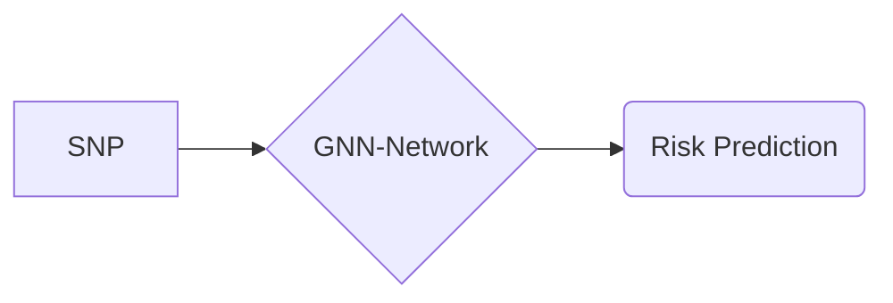
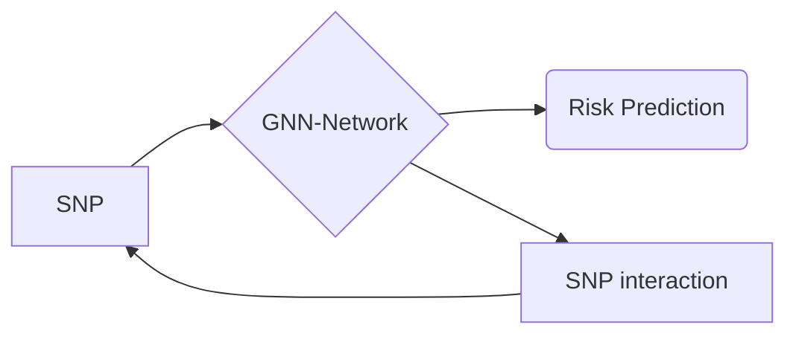
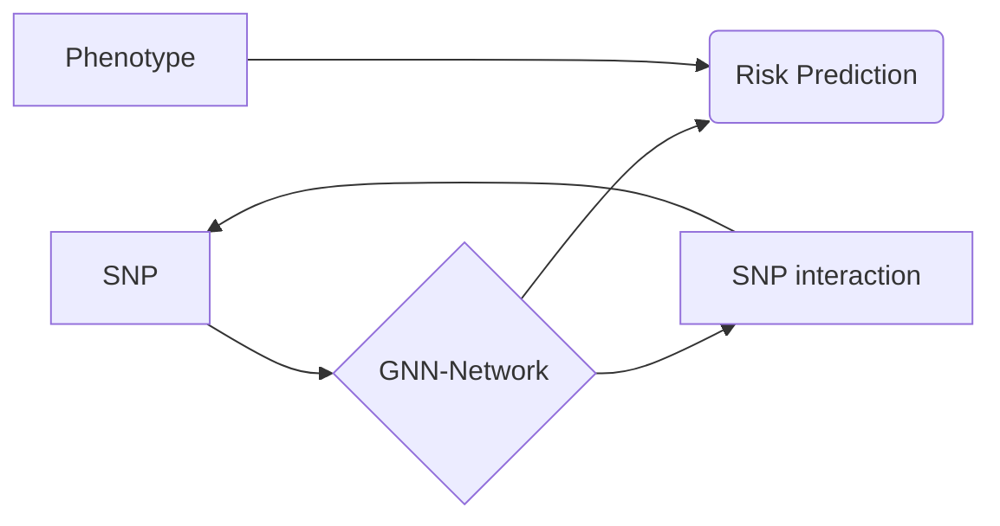
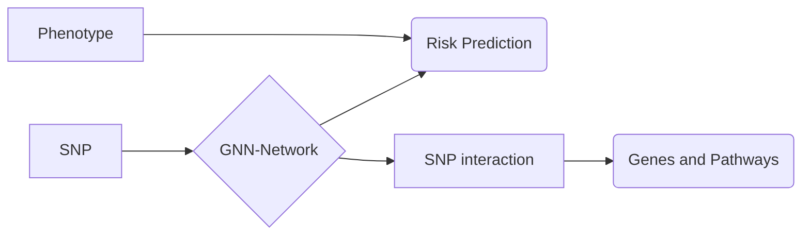
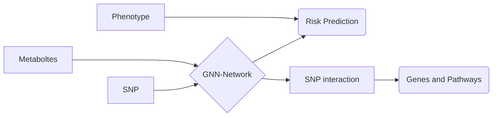
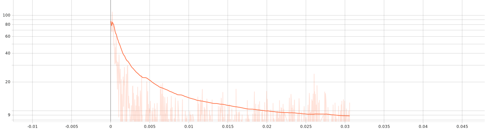
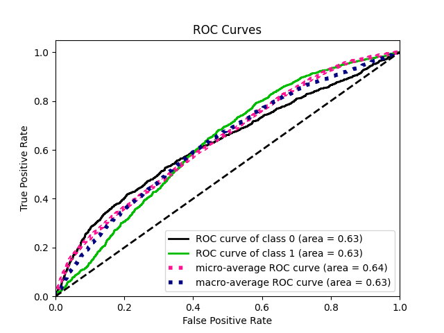
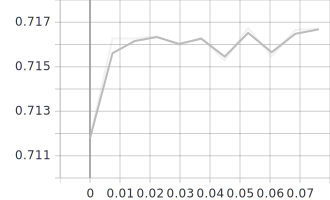
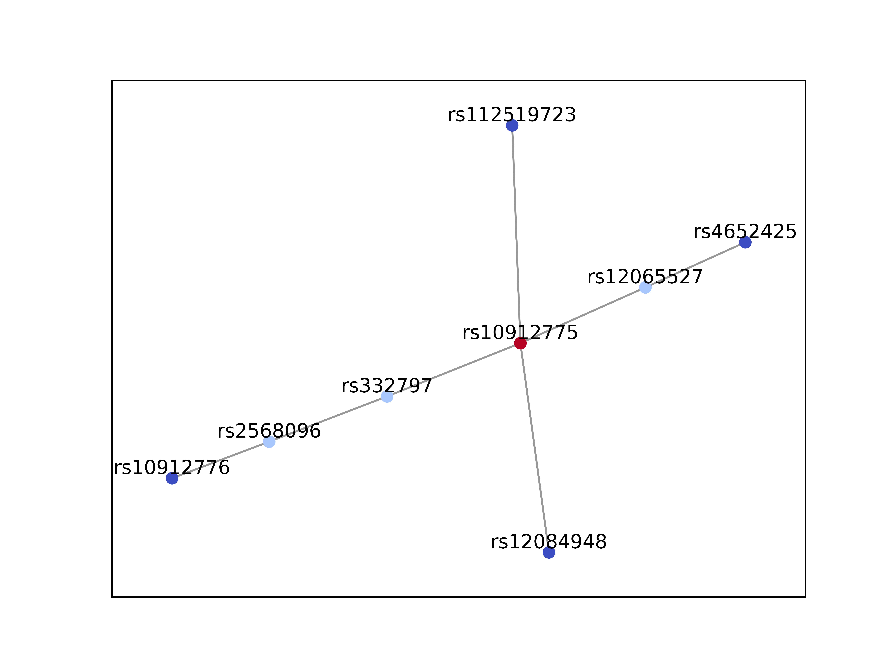
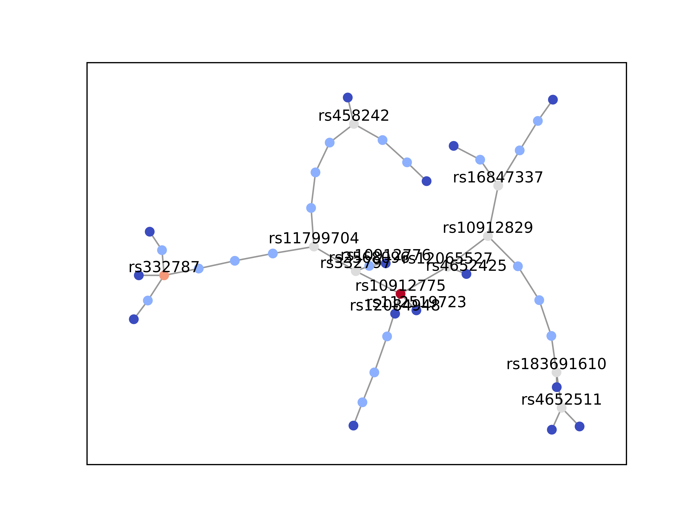

# Uthesis
This blog records the progress of my thesis in XJTU
# Ideas
Prof. Guo advises that osteoarthritis might be a good research.

> [Meta analysis of GWAS in Osteoarthritis](https://pubmed.ncbi.nlm.nih.gov/34450027/)

This article conduct a meta-analysis of GWAS. I might not do that meta analysis but just GWAS. So the goal might be **Learning Approach to Osteoarthritis Analysis**

For theoretical basis, I search for definitions of meta-analysis and possible learning approach in GWAS
> [Meta-analysis:]( https://www.ncbi.nlm.nih.gov/pmc/articles/PMC2695132/)
> [Machine learning approach: ](https://www.frontiersin.org/articles/10.3389/fgene.2020.00350/full)

After discussion with Prof.Guo, there might be three main problems i might cast sight on:

+ Given the GEO data, analysis possible gene loci.
+ Given the Metabolism data, find possible pathway that can be regulated by drugs.
+ Given the patient sample, predict the risk. 

Hence I shall first look through the data and determine which should i pick.

# Data collection

## GWAS research

1. Select 177517/826690 individuals for analysis

   > 2 EA groups and 11 European 

2.  Found 11897 SNV 

   > p < 1.3 10e-8

3. Phenotype conditional analysis identify 223 independent associations 

4. 87/96 loci replicated 

5. Phenotype independently conditional analysis shows 100 associations

6. Lead SNV of each of associations mentioned in 5 are selected. 

   > 6 Coding SNV
   > 59 transcription reside SNV
   > 35 intergenic SNV

   + Update risk SNV for different tissue
   + 6 rare SNVs are detected (discovered in Iceland)

7. Risk SNVs also related to EA groups with evidence in several phenotype

8. Polygenic risk scores related to some of phenotypes

9. 3 Female only SNVs discovered.

   > RS116112221 interestingly located 

10.  Meta analysis shows another risk variant

11. 60/100 SNVs related to phenotype

    > 40 weight-bearing only
    >
    > 4 non-weight bearing only
    >
    > 42 both **may contribute to pathology** 

12. Some SNVs have more participation in joint replacement than osteoarthritis pathology; Especially with **pains**

13. Identify 637 genes with possible ability to become effector gene

14. Identify 77 genes with higher potential based on various criteria 

    > 4 supported by missense SNV
    >
    > 48 previously reported 
    >
    > 30 newly discovered

15. 77 genes mentioned above are distributed in 6 groups

    > + Skeletal development (63/77)
    > + Joint degeneration
    > + Neuronal function
    > + Muscle function
    > + Immune response
    > + Adipogenesis

16. 205/637 genes are potential drug target 

    > 71/205 genes cooperate well with drugs licensed 

17. 20/77 genes can be candidates

    > 7 newly discovered

## Metabolomics research

32 research contains metabolomic data

| Tissue | Biospecimen | Phenotypes | Amount |
| ------ | ----------- | ---------- | ------ |
| Joint  | Synovial    | OA, RA     | 13     |
| Serum  | Serum       | OA, RA     | 19     |

| Phenotypes                                                   | Biospecimen      | Methodology            | Sample size                                                  | References                                                   |
| ------------------------------------------------------------ | ---------------- | ---------------------- | ------------------------------------------------------------ | ------------------------------------------------------------ |
| Knee OA, RA, and postmortem controls                         | SF               | UPLC Q-TOF MS          | ==OA 5, RA 3, Controls 5.==                                  | *Carlson A* et al. [[16](https://www.sciencedirect.com/science/article/pii/S2665913121000339#bib16)] |
| Early and later knee OA and controls (all postmortem)        | SF               | UPLC Q-TOF MS          | ==Early OA 55; late OA 17; controls 7.==                     | *Carlson A* et al. [[18](https://www.sciencedirect.com/science/article/pii/S2665913121000339#bib18)] |
| Knee OA and cadaveric controls                               | SF               | 1H NMR and GC-MS       | Knee OA 55; controls 13.                                     | *Mickiewicz B* et al. [[13](https://www.sciencedirect.com/science/article/pii/S2665913121000339#bib13)] |
| Knee OA, RA, postmortem controls                             | SF               | ESI-MS/MS              | ==Early OA 17; late OA 13; RA 18; controls 9.==              | *Kosinska M* et al. [[14](https://www.sciencedirect.com/science/article/pii/S2665913121000339#bib14)] |
| Knee OA vs. controls                                         | SF               | GC-TOF/MS              | ==OA 49; controls 21.==                                      | *Zheng K* et al. [[17](https://www.sciencedirect.com/science/article/pii/S2665913121000339#bib17)] |
| Knee OA, gout, calcium pyrophosphate disease (CPPD), spondylarthritis, septic arthritis, and RA | SF               | 1H NMR                 | OA 15; gout 18; CPPD 11; septic arthritis 4; RA 4; reactive arthritis 3; Crohn's disease 2; ankylosing spondylitis 1; psoriasis arthritis 1. | *Hügle T* et al. [[22](https://www.sciencedirect.com/science/article/pii/S2665913121000339#bib22)] |
| Reactive arthritis and undifferentiated spondyloarthropathy; RA, and OA | SF               | 1H NMR                 | ==OA 21; RA 25; and reactive arthritis 30.==                 | *Muhammed H* et al. [[23](https://www.sciencedirect.com/science/article/pii/S2665913121000339#bib23)] |
| Knee OA severity                                             | SF               | GC/TOF MS              | ==OA 15.==                                                   | *Kim S* et al. [[12](https://www.sciencedirect.com/science/article/pii/S2665913121000339#bib12)] |
| Knee and hip OA                                              | SF               | 1H NMR                 | ==Hip 12; knee 12.==                                         | *Akhbari P* et al. [[19](https://www.sciencedirect.com/science/article/pii/S2665913121000339#bib19)] |
| Classification of OA                                         | SF               |                        | hip and knee OA 80.                                          | *Zhang W.* et al.                                            |
| Knee OA vs. controls and other forms of arthritis            | Serum            | GC-TOF MS/UPLC-QTOF MS | ==OA 27; RA 27; AS 27; gout 33, and controls 60.==           | *Jiang M* et al. [[25](https://www.sciencedirect.com/science/article/pii/S2665913121000339#bib25)] |
| OA, RA, and FM                                               | Bloodspot        | IRMS                   | OA 12; RA 15; FM14.                                          | *Hackshaw KV* et al. [[26](https://www.sciencedirect.com/science/article/pii/S2665913121000339#bib26)] |
| Knee OA vs. controls                                         | Plasma           | GC/Q-TOF-MS            | ==OA 12; controls 29.==                                      | *Huang Z* et al. [[27](https://www.sciencedirect.com/science/article/pii/S2665913121000339#bib27)] |
| OA vs. controls                                              | Serum            | LC/MS                  | ==Knee and hip OA 70; controls 82.==                         | *Tootsi K.* et al. [[28](https://www.sciencedirect.com/science/article/pii/S2665913121000339#bib28)] |
| OA vs. controls                                              | Serum            | 1H NMR                 | ==OA 1556; controls 2125.==                                  | *Meessen, J.* et al. [[29](https://www.sciencedirect.com/science/article/pii/S2665913121000339#bib29)] |
| OA vs. controls                                              | Serum            | UPLC-TQ-MS             | ==OA 32 and controls 35 in discovery cohort; OA 30 and controls 30 in replication cohort.== | *Chen R.* et al. [[30](https://www.sciencedirect.com/science/article/pii/S2665913121000339#bib30)] |
| Obesity and non-obesity knee OA vs. controls                 | Serum            | LC/Q-TOF/MS/MS         | Obesity knee OA 14; non-obesity knee OA 14, and controls 15. | *Senol O* et al. [[31](https://www.sciencedirect.com/science/article/pii/S2665913121000339#bib31)] |
| Knee OA and risk for TKR                                     | Plasma and serum | HPLC-MS/MS             | ==Knee OA 64 and control 45 in the discovery cohort; knee OA 72 and controls 76 in the replication cohort; 158 subjects in the longitudinal study.== | *Zhang W.* et al. [[8](https://www.sciencedirect.com/science/article/pii/S2665913121000339#bib8)] |
| Knee cartilage volume loss over 2 years                      | Serum            | HPLC-MS/MS             | ==Knee OA 139.==                                             | *Zhai G* et al. [[33](https://www.sciencedirect.com/science/article/pii/S2665913121000339#bib33)] |
| Drug response in knee OA                                     | Serum            | HPLC-MS/MS             | Knee OA 158.                                                 | *Zhai G* et al. [[34](https://www.sciencedirect.com/science/article/pii/S2665913121000339#bib34)] |
| Knee OA                                                      | Plasma           | HPLC-MS/MS             | ==Knee OA 64 and controls 45 in the discovery cohort; knee OA 72 and controls 76 in the replication cohort.== | *Zhang W.* et al. [[35](https://www.sciencedirect.com/science/article/pii/S2665913121000339#bib35)] |
| Knee OA                                                      | Serum            | HPLC-MS/MS             | ==Knee OA 123 and controls 299 in the discovery cohort; knee OA 76 and controls 100 in the replication cohort.== | *Zhai G.* et al. [[36](https://www.sciencedirect.com/science/article/pii/S2665913121000339#bib36)] |
| Knee OA progression in 5 years                               | Serum            | HPLC-MS/MS             | ==Knee OA progressor 234; nonprogressor 322.==               | *Zhai G* et al. [[39](https://www.sciencedirect.com/science/article/pii/S2665913121000339#bib39)] |

### Joint tissues

1. OA patient and control groups might own background bias due to the source of the sample

2. 58/1233 metabolites varied in [Carlson A et al.](https://www.sciencedirect.com/science/article/pii/S2665913121000339#bib16) 

   **Involved pathways:**

   + NO production 
   + Chondroitin sulfate degradation 
   + *Arg* and *Pro* metabolism

   Their research also contains RA in SF, however, no dissimilarities found 

3.  188/9903 metabolites varied in  [Carson A et al.](https://www.sciencedirect.com/science/article/pii/S2665913121000339#bib18) in a larger group

   **Involved pathways:**

   + Extracellular matrix components metabolism
   + AA, fatty acid and lipid metabolism
   + Inflammation
   + Energy metabolism
   + Vitamin metabolism

   **Cluster results:**

   + Increased inflammation 
   + Oxidative stress
   + Structural deterioration

4. Energy demand varies in [*Mickiewicz B* et al. ](https://www.sciencedirect.com/science/article/pii/S2665913121000339#bib13)

5. Sphingomyelin(SM) and ceramide most abundant among samples in [*Kosinska M* et al.](https://www.sciencedirect.com/science/article/pii/S2665913121000339#bib14)

6. Three main molecules found different in a replication cohort validated research from [Zheng K et al.](https://www.sciencedirect.com/science/article/pii/S2665913121000339#bib17)  They even differ between OA and RA

   + Glutamine
   + 1,5-anhydroglucitol
   + Gluconic lactone

7. While another two research report consistency among OA and RA, but they own limitations on group size.

8. Samples from different joint in one patient would help eliminate possible differences between  individuals in [Xu Z et al.](https://www.sciencedirect.com/science/article/pii/S2665913121000339#bib15) 

   **Involved pathways:**

   + Phenylalanine metabolism, 
   + Taurine and hypotaurine metabolism
   + *Arg* and *Pro* metabolism 

9. 68/469 metabolites found different in [Yang G. et al.](https://www.sciencedirect.com/science/article/pii/S2665913121000339#bib20)

10. 28/114 metabolites differ between early and late radiographic OA in [Kim S et al.](https://www.sciencedirect.com/science/article/pii/S2665913121000339#bib12)

11. Knee OA and hip OA could own difference according to [*Akhbari P* et al.](https://www.sciencedirect.com/science/article/pii/S2665913121000339#bib19)

12. Metabolic syndrome might be used to cluster the patients by [Guangju Z et al.](https://www.sciencedirect.com/science/article/pii/S2665913121000339#bib21) 

### Serum

1. [Jiang M et al. ](https://www.sciencedirect.com/science/article/pii/S2665913121000339#bib25) introduce sexual control in their analysis. 6/30 metabolites are considered as difference, which has AUC of 0.91. They also found differences between OA and RA
2. [*Huang Z* et al.](https://www.sciencedirect.com/science/article/pii/S2665913121000339#bib27) studied 12 knee OA patients and 20 healthy controls and identified three metabolites – succinic acid, xanthurenic acid, and tryptophan.
3. [*Tootsi K* et al. ](https://www.sciencedirect.com/science/article/pii/S2665913121000339#bib28) studied 70 knee and hip OA patients and 82 controls and found that glycine and arginine were independently associated with OA radiographic severity.
4. [*Meessen, J* et al.](https://www.sciencedirect.com/science/article/pii/S2665913121000339#bib29) studied a total 227 metabolites assessed by NMR platform in a total 2125 controls and 1556 OA cases **Optimal group size?**
5. [Chen R et al. ](https://www.sciencedirect.com/science/article/pii/S2665913121000339#bib30) focus on the amino acid difference among population and found several related to OA
6.  [Senol O et al. ](https://www.sciencedirect.com/science/article/pii/S2665913121000339#bib31) and [Zhang W et al.](https://www.sciencedirect.com/science/article/pii/S2665913121000339#bib7) cast sight on phenotypes such as obsity and diabase

### Analysis

1. [Evolutionary learning](https://www.sciencedirect.com/science/article/pii/S2665913121000339#bib37)
2. [Differential correlation network](https://www.worldscientific.com/doi/abs/10.1142/9789814749411_0012)
3. **Meta Analysis?**

## Workplace

Using UKB to apply final multimodal model for risk evaluation

Similar research has been performed as [GWAS for osteo](https://www.nature.com/articles/s41588-018-0079-y)

# ~~Motivation~~

# Shift

However, after discussion with Prof. Guo. My intention of setting that three source network was denied, I hence need to
come up with a new strategy.

After screening the following articles and integrating Guo's advice. A new setup is to be made:

> [What is Few-Shot Learning? Methods & Applications in 2022](https://research.aimultiple.com/few-shot-learning/)
>
> [Multimodal deep learning for biomedical data fusion: a review | Briefings in Bioinformatics | Oxford Academic](https://academic.oup.com/bib/advance-article/doi/10.1093/bib/bbab569/6516346)
>
> [Multimodal deep learning models for early detection of Alzheimer’s disease stage | Scientific Reports](https://www.nature.com/articles/s41598-020-74399-w)
>
> [A survey on deep multimodal learning for computer vision: advances, trends, applications, and datasets | SpringerLink](https://link.springer.com/article/10.1007/s00371-021-02166-7)
>
> [Low Data Drug Discovery with One-Shot Learning | ACS Central Science](https://pubs.acs.org/doi/10.1021/acscentsci.6b00367)
>
> [A Comprehensive Survey on Graph Neural Networks | IEEE Journals & Magazine | IEEE Xplore](https://ieeexplore.ieee.org/abstract/document/9046288)
>
> https://www.nature.com/articles/s41588-018-0327-1
>
> https://www.nature.com/articles/s41588-018-0079-y
>
> https://www.nature.com/articles/s41598-019-46649-z

## Stage 1 plan: Simple GNN Network

## Stage 2 plan: Analyze SNP interaction generated by GNN network

## Stage 3 plan: Fusion of phenotypes in to prediction

## Stage 4 plan: Annotate the SNPs to genes, find possible pathways involved

## Stage 5 plan: Introduce metabolites to GNN, increase ? accuracy[**](https://www.biorxiv.org/content/10.1101/2021.05.28.446066v1.full)

# GNN Development

## Naive GNN

Start from TIID data i retreived last year, i start the development of a simple GNN based on the research
from [Design Space for Graph Neural Networks](https://arxiv.org/abs/2011.08843). Main guidlines are

$$ x_i' = \mathrm{Agg} \left( \left\{ \mathrm{Act} \left( \mathrm{Dropout} \left( \mathrm{BN} \left( x_j W + b \right)
\right) \right), j \in \mathcal{N}(i) \right\} \right)
$$

To test the network, I apply 3 conGNN layers to deal with the graph and a pool layer to readout or just eliminate the
unrelated nodes. Detailed structures is

+ GNN Layer with 128 channels 0.1 dropout
+ GNN Layer with 64 channels 0.1 dropout
+ GNN Layer with 32 channels 0.1 dropout
+ Pooling layer by summing
+ Dense Layer to make prediction

Current trained model showed well convergence of train loss, but limited by the data quality, accuracy is still
reletively low. Thus I might take the data from UKB's osteoarthritis genotype to make further progress.

## Awkward

However, when i first selected the 100 SNP loci derived from Nature article, forming a dataset with 17000 samples and
100 features, i failed to construct a reasonable classification model. I tried it on kNN, randomForest and Xgboost, the
AUC was unacceptable (0.52).

According to the supplementary data of that article, these snps does not exhibit well classification potential (AUC0.5
by PRS). So i change another snp sources based on research upon UKB data. (UKB data branch in GITHUB)

Shit always happens, new data set (SNP=77) has little increase on AUC(0.52-0.54). So I still need to refer to article
for solutions. One research reveals that increasing the input features will improve the performance. So i make another
dataset with p<1e-5 and MAF >0.01 (SNP=8800).

BUT BUT BUT, the result is still schlecht (AUC0.6 by XGboost). HOW could it happen?! Article tells me that the coding
pattern might matter. So i change from ATCG one-hot encoding to **Effect Allele** numbers observed in SNP loci. AUC
improved a little. Then i realize that i cannot just provide that too much features to its samples(8000:6000). So i
conduct a feature selection procedure based on both Chi-square and linear SVC fs methods. Finally, AUC of simple model (
Decision Tree) goes better.

## Basic model

| model_type     | metric_type   |   metric_value |
|:---------------|:--------------|---------------:|
| Baseline       | auc           |       0.5      |
| Decision Tree  | auc           |       0.644074 |
| Xgboost        | auc           |       0.714733 |
| Neural Network | auc           |       0.649612 |
| Random Forest  | auc           |       0.681943 |
| **PRS** | auc           |  0.63 |

The baseline of the total research is the **PRS** result, getting AUC of 0.63

## GNN Model

For the convenience of the project i select spectral as the GNN package, building the model as

+ Input
+ 64 - Channels GNN
+ 64 - Channels GNN
+ Readout Layer
+ Dense
+ Dense

The training result goes as

The optimal model goes as follows

# GNN explainer

According to the [GNN explainer](https://arxiv.org/abs/1903.03894), i can retrieve the essential data contributing to
the prediction task. Taking different threshold on the sub graph, i can find some thing interesting.

For instance, for Case 4496347 in UKB, i got subgraph as

The SNP has the feature as

| RSID        | FREQ   | Effect  | P         |
| ----------- | ------ | ------- | --------- |
| rs10912775  | 0.2448 | -0.0325 | 4.041E-07 |
| rs332797    | 0.2496 | -0.0313 | 8.768E-07 |
| rs12065527  | 0.2475 | -0.0328 | 5.929E-07 |
| rs4652425   | 0.2452 | -0.0327 | 3.37E-07  |
| rs112519723 | 0.2474 | -0.031  | 1.217E-06 |
| rs2568096   | 0.2498 | -0.0309 | 1.228E-06 |
| rs10912776  | 0.2448 | -0.0325 | 4.051E-07 |
| rs12084948  | 0.2464 | -0.0327 | 3.115E-07 |

Relaxing the threshold, we can get

There will be more SNPs found contributing to the prediction. Nevertheless, the detailed meaning of this graph remains
unknown and awaits later interception.
