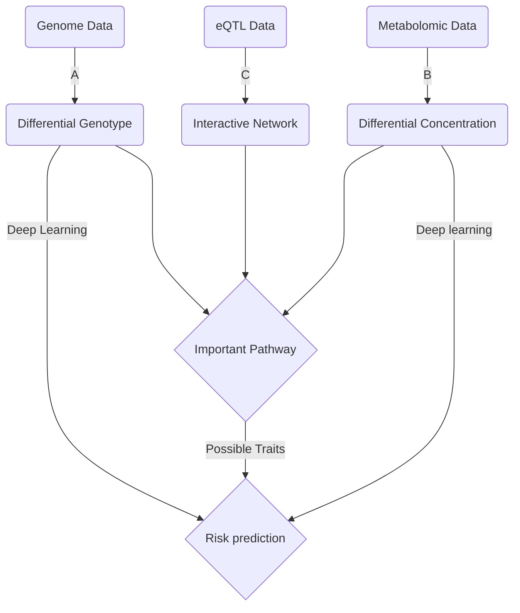

**A.** Selection of differential genes

**B.** Selection of differential metabolites

**C.** Combine normal metabolic data (mGWAS) and expression data(eQTL) by **SMR**, constructing normal interactive
network.

**D.** Link the genotype and metabolites by expression data, contributing to some varies on important pathways

**E.** Consider the important effect due to pathway change, select critical traits to help setting up risk evaluation
model.

**F.** Combining genotype and phenotype/metabolites

1. Conventional machine learning method

   > [Combination of machine learning and multi-omics](https://www.nature.com/articles/s41467-021-22989-1)

2. Multimodal-deep-learning

   > [Recent Advances and Trends in Multimodal Deep Learning: A Review](https://arxiv.org/abs/2105.11087)

### Thesis outline

+ Overview
+ Genetic analysis
    + Find SNP
    + Set up early model for prediction
+ Metabolic analysis
    + Find varied metabolites in **Serum**
    + Integrate with eQTL data
    + Analyze involved pathway
    + Choose important phenotype traits affected by pathway above
+ Set up multimodal deep learning model for risk prediction

# Trouble Shooting

1. How could eQTL help to connect genetic data and metabolic data

2. How would smr work

    + App smr requires a PLINK format LD-reference file **NOT SOLVED**

      > 1000G might be optimal but not recommended by the author of smr

    +

# Prerequisite

## SMR

Summary data-based Mendelian randomization (SMR) is a analytical method for association between GWAS and expression
data. This algorithm consists of

+ $x$ denotes gene expression

+ $y$ denotes *phenotype*

  > Could be concentration if mGWAS is introduced

+ $z$ denotes genetic variant

+ $b_{xy}$ is the effect size $x$ on $y$ ; So calls $b_{zy}$ and $b_{zx}$

+ In an MR, $b_{xy}$ is interpreted as the effect of x on y **without non-genetic confounders**. However, SMR will be
  able to calculate unbiased $b_{xy}$ due to a genetic factor

### Algorithm

In traditional MR, gene expression's impact upon phenotype is derived from $$ \hat{b_{xy}}=\hat{b_{zy}}/\hat{b_{zx}} $$
where $\hat{b_{zy}}$ and $\hat{b_{zx}}$ are estimates of $y$ and $x$ on $z$. The sampling variance of the estimate is $$
var(\hat{b_{xy}})=[var(y)(1-R^2_{xy})]/[nvar(x)R^2_{zx}]
$$ where $n$ is the sample size, $R^2_{xy}$ is the proportion of variance in $y$ explained by $x$ , so called $R^2_
{zx}$. Thus we can set up a statistic $$ T_{MR}=\hat{b_{xy}}^2/var(\hat{b_{xy}})
$$ to test the significance of $b_{xy}$ by CHI-square examination.

> Proportion of the variance: Part of variance caused by a reason

However, such estimation requires both gene expression data and genetic data for each individual, which is highly
impossible. But if **two-sample MR** is implemented with GWAS data and eQTL data from the same population. We can still
have

$$ \hat{b_{xy}}=\hat{b_{zy}}/\hat{\beta_{zx}} $$ where

+ $\hat{b_{zy}}$ is the estimate of a SNP effect from a GWAS for a trait
+ $\hat{\beta_{zx}}$ is the estimate of a SNP effect on the expression by eQTL study.

The variance can be calculated as $$ var(\hat{b_{xy}})=\frac{b^2_{zy}}{\beta^2_
{zx}} [\frac{var(\hat\beta_{zx})}{\beta^2_{zx}}+\frac{var(\hat b_{zy})}{b^2_{zy}}-\frac{2cov(\hat\beta_{zx},\hat b_{zy})}{\beta_{zx} b_{zy}}]
$$

> $cov(\hat\beta_{zx},\hat b_{zy})$ is **0** if $\beta_{zx}$ and $ b_{zy}$ are from independent samples

Thus we have a statistic for a Chi-square examination $$ T_{SMR}=\hat b^2_{xy}/var(\hat b_{xy})=\frac{z^2_{zy}z^2_
{zx}}{z^2_{zy}+z^2_{zx}} $$ where $z$ are statistics from GWAS and eQTL

### Implement

--!>